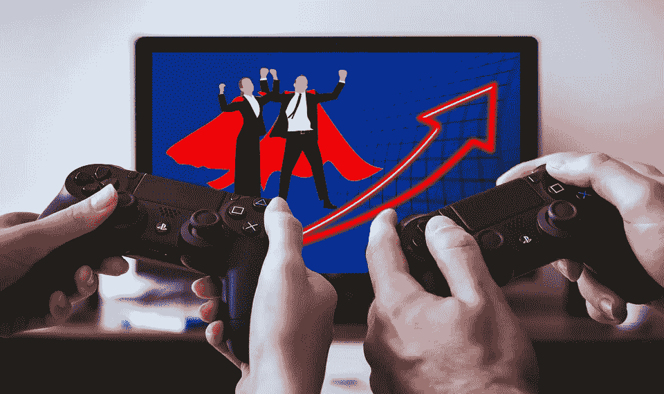
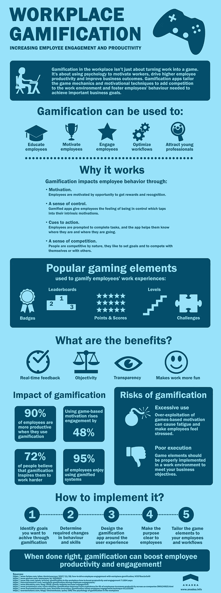

# 工作场所的游戏化如何影响员工的工作效率

> 原文：<https://medium.com/swlh/how-gamification-in-the-workplace-impacts-employee-productivity-a4e8add048e6>

> 快乐的员工工作效率更高。喜欢自己工作的员工表现更好，工作更努力，在公司呆的时间也更长。

游戏化是单向的，雇主让员工的工作变得更愉快。利用我们对即时奖励、满足和反馈的需求，游戏化工具是吸引员工、提高生产力和减少员工流动的有效方式。

考虑一下《精灵宝可梦 Go》在现实世界中的影响。一款全球流行的基于位置的增强现实应用，自 2016 年 7 月以来下载量超过 7.5 亿次。Pokémon Go 目前每年产生超过 12 亿美元的经常性收入(有史以来最快达到这一数字的手机游戏)，拥有数亿活跃用户。现在，各行各业的人都出来四处活动，捕捉神奇宝贝。虽然这只是一款游戏，但《精灵宝可梦 Go》的现实世界影响是让人们锻炼身体，探索他们在哪里，以及对品牌来说(他们可以花钱将自己的场所变成健身房)，增加店内收入和参与度。

在工作场所，同样的理论可以付诸实践，以提高员工的参与度和生产力。以下信息图表概述了工作场所游戏化的主要方面:

# 企业游戏化努力失败的原因

每个雇主都想要快乐、敬业的员工。当员工喜欢自己的工作时，顾客会得到更好的对待，生产率也会更高。然而，并不是每个基于游戏的应用程序都像 Pokémon Go 一样具有令人印象深刻的影响。游戏化统计并不总是乐观的。Gartner 估计，80%的工作场所游戏化应用程序可能无法满足业务目标，因为设计不佳，即缺乏创意和意义。

当员工不参与，当他们不关心他们所做的事情时，生产力就会受到影响。这可能有许多原因。职场游戏不会是治疗士气低落或生产力低下的灵丹妙药。这个问题可能是文化上的。公司可能有消极的文化和做法，阻止员工以最佳状态工作。其他时候，表现不佳的经理会对生产力产生负面影响。有时候，一个员工并不适合这个工作、文化或团队。一款员工敬业度应用无法解决所有这些问题。尽管如此，当游戏化心理学被成功设计和实施时，它确实能够对日常工作场所的挑战产生积极的影响。

> 当游戏化项目失败时，往往是糟糕的计划或执行的结果。

对于他们所做的工作缺乏动力的员工会把任何将体验游戏化的尝试看作是另一组与工作相关的任务。大多数人不会理会，或者只是口头上支持这个新项目。或者他们会认为这是浪费时间的好方法，会产生与预期相反的效果。然而，更敬业的员工——尤其是那些有竞争倾向的员工——可能会试图破坏同事或寻找作弊的方法。

游戏化失败的另一个原因是游戏化工作的欲望被过度使用。简单地向你的员工扔一个现成的解决方案，并期待最好的结果并不是答案。2013 年，现由 CVS Health 所有的美国制药和医疗保健公司 Omnicare 发现了这一点，并为此付出了代价。为了减少客户服务等待时间，创建了一个排行榜，为那些能够最快完成客户呼叫的人提供现金奖励。这一倡议适得其反。员工觉得他们被监控得太多，导致响应时间增加，一些员工离开。

如果执行得好，员工的游戏化可以在整个组织中产生有影响力的结果。

# 如何确保你的游戏化努力成功

游戏化成功的例子很多。企业技术巨头 SAP 需要找到一种方法来激励和确保销售专业人员为与潜在客户的复杂咨询销售会议做好准备。他们没有使用传统的指导阅读 CRM 笔记的组合，而是创建了一个游戏应用程序， [Roadwarrior](http://enterprise-gamification.com/index.php?option=com_content&view=article&id=71:roadwarrior-how-sap-trains-its-sales-people-on-mobility&catid=13&Itemid=17&lang=en) 。

使用真实的例子和数据，SAP 的销售代表参加与客户和销售前景的模拟会议。成功回答问题的代表可以赢得徽章，在虚拟排行榜上与他人竞争，并在游戏中解锁更高的级别。除了训练，它还服务于现实世界。它为有关客户需求的数据提供了一个暂存区(或备忘单),从而使他们在现场回答问题和达成交易变得更加容易。在企业培训和激励中使用游戏化难道不是一个很好的例子吗？

与 Omnicare 不同，SAP 花时间和精力去了解他们的销售团队需要什么。然后创建一个符合这些需求的解决方案，确保他们从中受益。工作游戏化的定制方法总是更有效。当然，技术使这成为可能。然而，除非你投资开发适合员工真实工作体验的软件，否则它不会产生你所需要的效果。

LiveOps 是一家基于云的联络中心解决方案公司，拥有 20，000 名全国性品牌的远程客户服务代理，他们希望找到一种提高员工积极性的方法。在世界各地，呼叫中心因士气低落、人员流动率高和生产率低而臭名昭著。这个行业的员工流动率通常在 43%到 70%之间。Bunchball 的创始人、受人尊敬的游戏化行业教父 Rajat Paharia 有一个解决方案。创建一个应用程序，让员工在完成额外培训、达到通话时间和质量 KPI 以及与同事分享知识时获得奖励。

对于 LiveOps 来说，这是一个巨大的成功，正如《快速公司》报道的那样:

> ***“在启动该计划的一周内，80%的 LiveOps 代理商选择加入，其中四分之三的代理商每两周回来一次。参与的代理在平均电话处理时间方面比同行高出 23%，客户满意度提高了 9%。”***

# 设计员工游戏化应用时的关键考虑因素:

*   明确你的目标。知道你想要实现什么以及为什么，然后反过来确定实现这些目标所需的步骤。
*   **了解用户结果。使用该应用程序时，您希望您的员工实现什么目标？他们需要采取什么行动才能获得奖励？这些是否以一种明智的方式与业务目标相联系？**
*   **围绕用户体验进行设计。**这款应用将如何融入您团队的工作流程？能否与其他应用和工具集成？您如何确保一旦实现就能使用它？
*   确保它是有趣的。不要忘记这一点——否则，它就不是一个将任何东西“游戏化”的应用程序。让员工自始至终参与到这个过程中来——组建一个小组来提出想法，进行测试，并在应用推出后成为其拥护者。
*   **选择适合你的团队和工作流程的游戏元素。**在任何员工竞争激烈的环境中，排行榜和奖励都是必不可少的，还有许多其他选择。选择直接吸引你的团队的游戏化策略和元素，并在工作时激励他们。

如果你想在实践中实现你的游戏化想法，一个技术娴熟、经验丰富的开发团队，比如 [Anadea](https://anadea.info/) ，可以给你一个[定制报价](https://anadea.info/free-project-estimate)，并指导你完成这个过程。[游戏化应用](https://anadea.info/blog/gamification-in-business)，当根据你团队的需求设计和定制时，将会给你的业务带来实实在在的推动，同时也让你的员工工作起来更有趣。大家都赢了！

*最初发布于*[*anadea . info*](https://anadea.info/blog/how-gamification-in-the-workplace-impacts-employee-productivity)

## 这个故事发表在 [The Startup](https://medium.com/swlh) 上，这是 Medium 最大的企业家出版物，拥有 291，182+人。

## 在此订阅接收[我们的头条新闻](http://growthsupply.com/the-startup-newsletter/)。

