# Gary Vee、Forbes & HubSpot 如何利用其他品牌建立自己的品牌

> 原文：<https://medium.com/swlh/how-gary-vee-forbes-hubspot-are-leveraging-other-brands-to-build-their-own-16ba8dbfd57e>

## 以及如何在 2018/2019 赛季用同样的策略击败它

2018 年的竞争……内容……***噪音*** 不可逾越。

大多数人和公司都很难脱颖而出，建立自己的品牌，甚至很难继续发展。

作为新名字怎么做？

你如何建立一个品牌，并在 2018 年保持相关性？

这正是我们将从加里·维、福布斯和 HubSpot 那里学到的，

加里·维，他成功地在最喧闹的领域确立了自己的领袖地位；商业/生活建议。

尽管许多传统杂志在数字革命面前倒下了，但《福布斯》仍然保持着强劲的势头。

HubSpot 在竞争异常激烈的 CRM 领域开拓了一个市场，其竞争对手包括价值数十亿美元的 SalesForce。

游戏中的 3 名玩家正在竭尽全力扩张，并保持他们的品牌在当前环境中的相关性。

今天，我将向大家详细介绍他们如何利用其他人和公司的品牌和知识产权来建立自己的品牌和平台。

# 加里·维是怎么做到的？

加里·维纳查克是利用他人品牌和平台建立自己品牌和平台的大师。

获得巨大成功的人。

他不仅经常客串，做主题演讲，甚至和其他名人一起参加电视节目(受益于他们的知识产权，以及电视台，恰好是苹果电视，没错)，如果你看看他在自己的节目中带来的人，以及他在社交媒体上发布的帖子，他通常会介绍艺术家和他认为自然观众有重叠的人。

(前说唱歌手，说唱他磨，使它，很像他的 YT 的内容。)

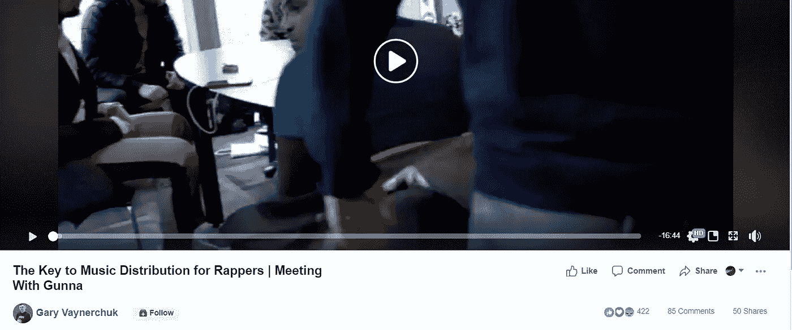

或者把他的名字和一个大城市的运动队联系在一起。

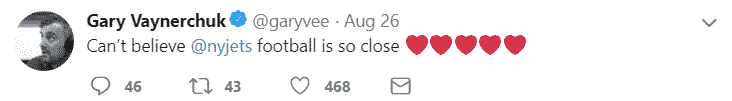

A die-hard jets fan, and definitely not shy about it, he uses his open support to connect further with jets fans.

或者通过出现在其他著名内容创作者的节目中榨取他们的知识产权，然后重新利用这些内容。

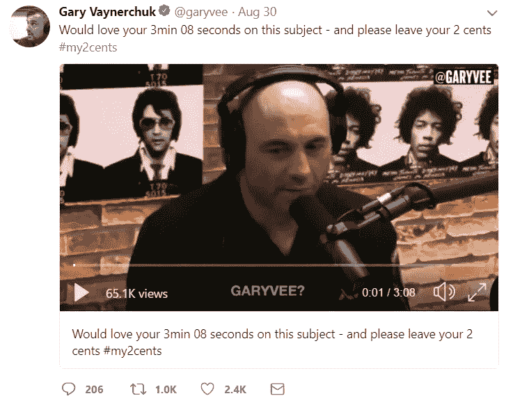

Here he is leveraging an appearance on the JRE podcast from years ago, using Joe Rogan to build further rapport with people who are fans of both.

当他每周在每一个平台上发布堆积如山的自己独特的内容时，他也偷偷加入协作。

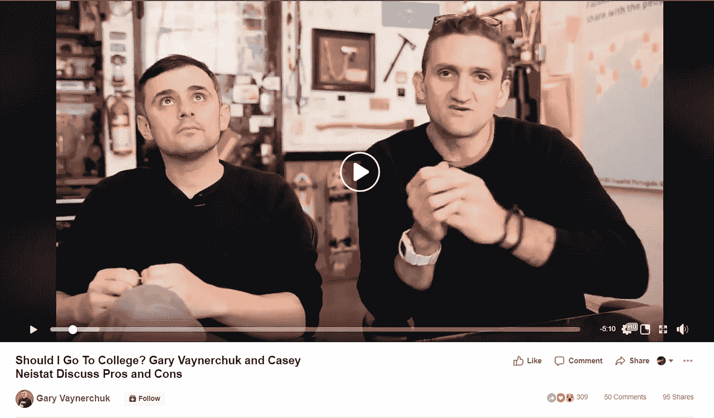

在上面的例子中，他不仅与拥有大量观众的凯西·奈斯塔特合作，还利用了“大学不再值得”这一观点的知识产权。

Gary 自称为“注意力交易者”,他为自己利用知识产权的能力感到自豪，他利用品牌的方式就是一个例子。

另一件有趣的事情是，他也以另一种方式使用它。

他几乎在做每一件事时都利用自己的个人品牌。(提示: *Vaynermedia、Garyvee 葡萄酒项目*等。)

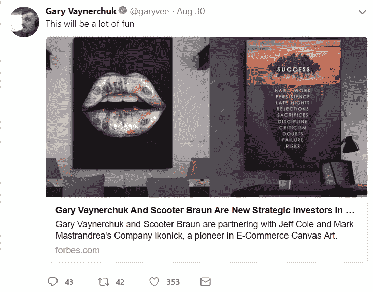

Even for his investments. (Always fairly public/vocal as an investor.)

但这是另一篇文章的主题…

接下来:

# 听说过福布斯 30 个 30 岁以下排行榜吗？

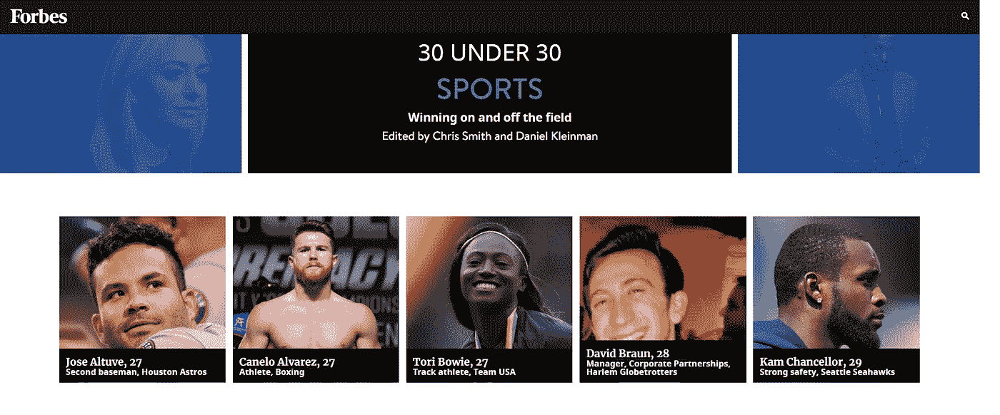

上面有熟悉的面孔吗？

也许是卡内洛，也许是目前拳击界最活跃的比赛，这个家伙暗示要追随梅威瑟的人气？

《福布斯 30 岁以下》是利用他人品牌的完美组合，甚至可以免费进行影响者营销！

如果你需要任何证据来证明这对他们有用，看看他们今年在 30 岁以下的人群中投入了多少资源。

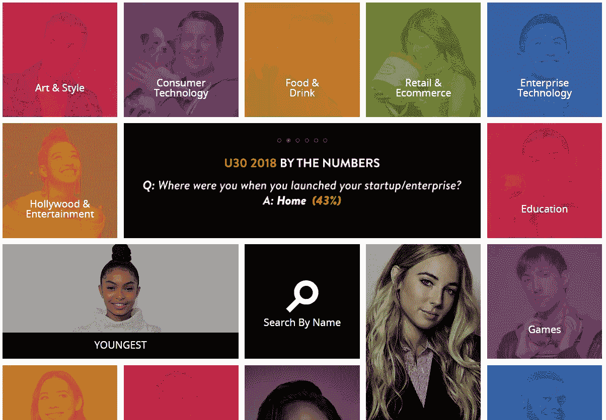

有 23 个不同的类别，它比“30 岁以下 30 岁”更少..“30 下 690”(大概，我不是数学家。)

每个类别都有自己的编辑，导致大量的工作…这意味着它显然是值得的。

(因为我们已经不再处于这样一个时代，在这个时代，出版物有很多钱可以浪费在那些不起作用的东西上。)

看看 BuzzSumo 上去年的一些结果:

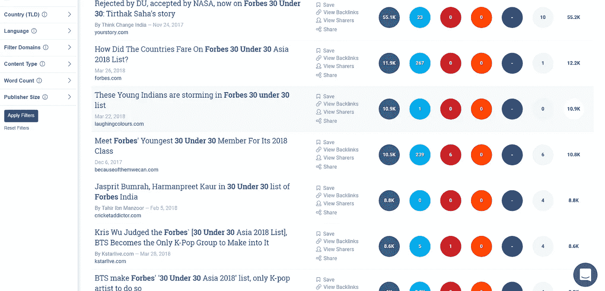

标题中带有福布斯品牌的文章超过 100，000 条，这不是他们发布的，只是从查看前 10 名的结果来看。

我只是继续猜测，他们可能不会对此感到太沮丧。

有趣的是，30 岁以下的人完全建立在他人的品牌和身份之上。

如果没有人关心名单上的人，那就永远不会成为一件事。

现在它已经成为一种现象，一种遍及全球的流行文化理念/比喻。

除了给该给的道具，我什么也做不了。

# HubSpot 是怎么做到的？

2018 年竞争的规模…内容… ***噪音*** 对于大多数人和公司来说，是不可逾越的开始，甚至是保持增长。

HubSpot 是一个在完全拥挤的市场中成功成长的品牌，这个市场的噪音可能和其他市场一样多。

听说过吗..Salesforce？

这些都是 HubSpot 决定长期反对的公司类型。

2018 年，随着人们在 Medium 上阅读营销，我怀疑你们中有太多人没有至少顺便听说过 HubSpot，(甚至没有读过他们的博客，使用过他们的软件)，所以可以肯定地说，他们已经设法做了一些正确的事情。

因此，就一家在网上建立品牌的公司而言，他们是一家值得密切关注的好公司。

这正是我一直在做的，我特别注意到一件事，那就是每个人都可以在他们的营销策略中立即实施。

你看，最近在我的 feed 中弹出的所有 Hubspot 广告/赞助帖子都遵循一个趋势。

它们的左边、右边和中间是一家公司、一个名人、一部电影……***一个现有品牌*** 。

Here they are using Neil Degrasse Tyson, presumably targeting an audience that has interests in both science and marketing.

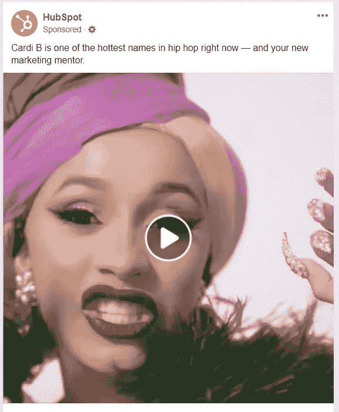

Here they’re leveraging Cardi B’s brand, probably targeting fans/people who like hip hop among their followers.

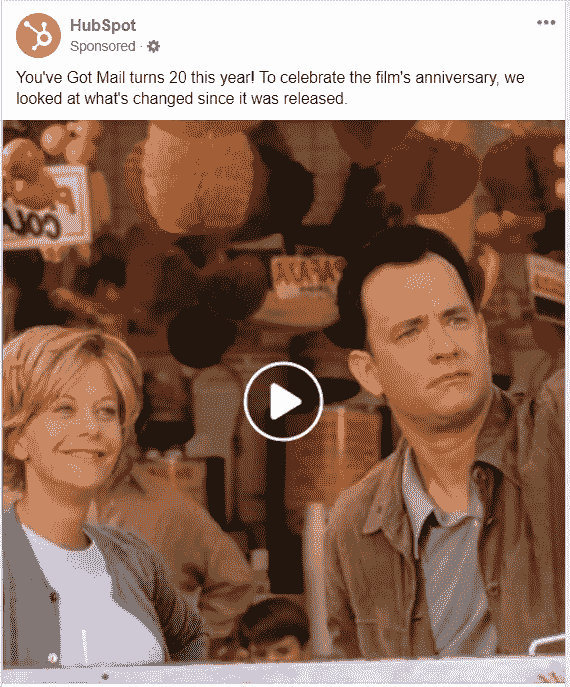

Here they’re even borrowing the IP of the movie “you’ve got mail” to do a breakdown of what’s changed on the internet since.

甚至电影《你有邮件》本身也依赖于电子邮件和互联网的品牌/模因。

HubSpot 以一种创造性的方式锁定这些品牌，从流行偶像、科学家到电影中辨别营销经验。

# 你怎么能做同样的事呢？

与品牌/营销中的许多事情不同，这个想法非常直接，并且很容易实施。

更好的是，这个想法是如此强大，事实上，很多杂志/网站已经能够采用福布斯 30 岁以下的想法，并将其融入自己的业务，取得了良好的效果。

比如 24/7 sports，他被多个大学橄榄球队的官方推特账号提及。

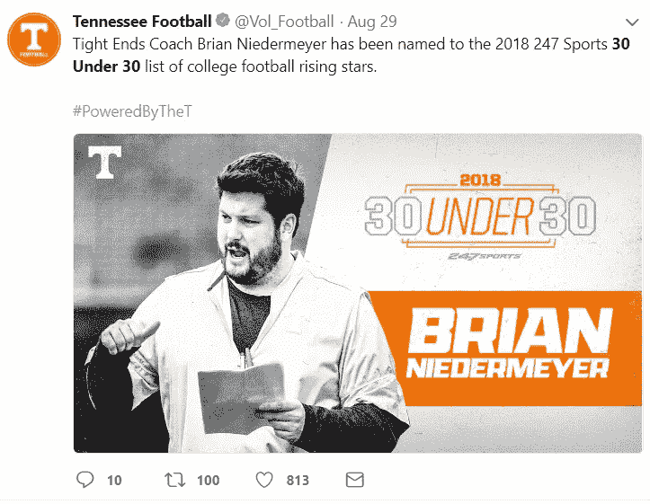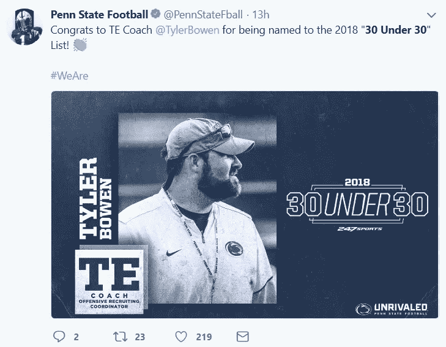

吸引他们想要的那类观众的注意力。

但是你可能会想:

> “当你已经有了一个既定的品牌时，这种事情可能真的会很好，但现在我**能在**、**没有了之后做些什么来开始建立我自己的品牌/平台呢？小家伙怎么会用这种战术？**

**好问题。**

**互联网上有很多很好的例子可以回答你的问题，甚至就在媒体上。**

**下面的帖子就是一个很好的例子。**

**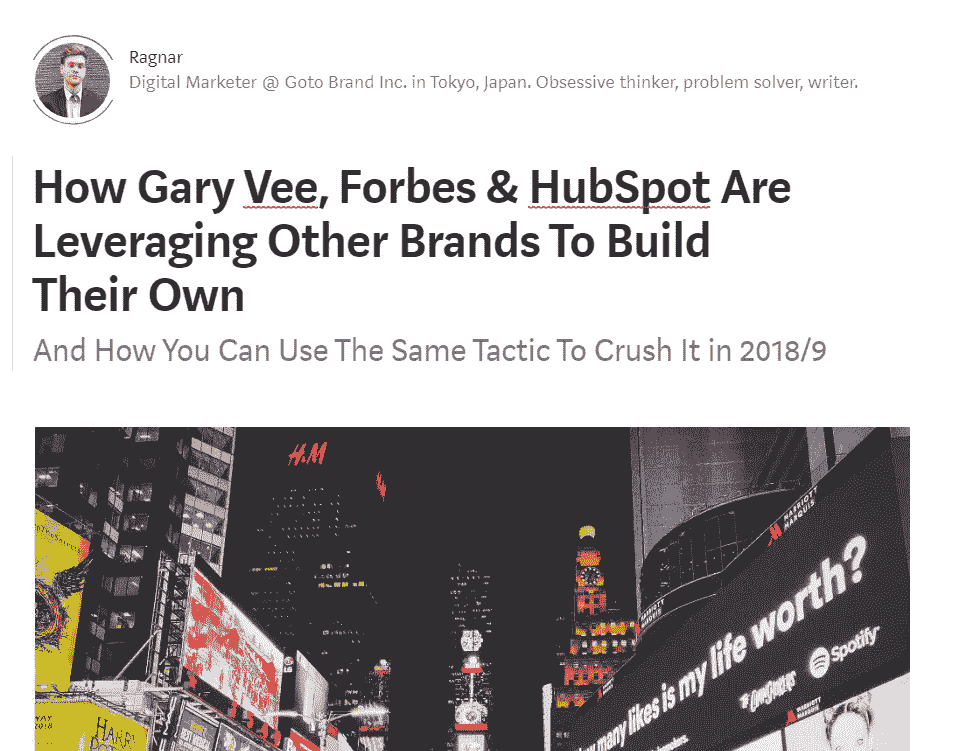**

**这家伙没有退缩。**

**提到了 Gary Vee，2 家拥有成熟品牌的公司，其中一家在他的行业中，甚至提到了 Gary Vee 创作的一本书/meme。**

**抛开所有的笑话(和似曾相识的时刻),在媒体、WordPress、Instagram、脸书、Twitter 等的时代，并不缺少免费平台让你一展身手。**

**基本上，这是最简单的策略。**

> **你从一个名人/公司学到了什么吗？**
> 
> **分享一下。**

**如果你还没有，学习/接触他们，然后分享。**

**很简单。**

**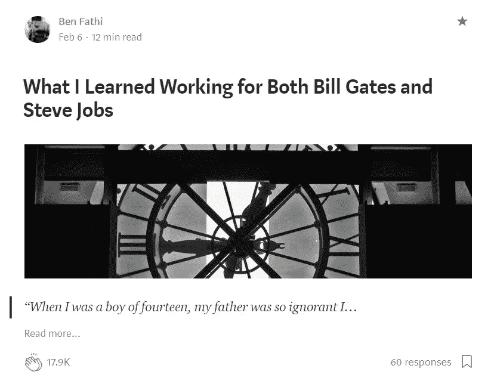**

**A slightly more successful example than my own article, to give you an idea of what kind of results you can get.**

**另一种选择是走福布斯路线，简单地列出拥有成功品牌的人的名单(最好是你诚实的选择或基于合理的衡量标准)。**

**像这样:**

****

**[https://medium.com/futuresin/top-crypto-writers-on-medium-in-2018-af9db5cefa6](/futuresin/top-crypto-writers-on-medium-in-2018-af9db5cefa6)**

**你也可以从中获得更多的创造力。**

**事情就是从简单开始，当你已经开始做实验的时候。**

**这玩意管用。**

**没必要把事情搞得太复杂。**

**创造一些东西，然后分享。**

## **行动呼吁**

**👏&如果你喜欢这篇文章，请跟我来，除此之外，走出去，采取一些行动！**

**亲自尝试一下，上线，并在回复中与我分享最终结果！**

****

## **这篇文章发表在 [The Startup](https://medium.com/swlh) 上，这是 Medium 最大的创业刊物，拥有+365，103 名读者。**

## **在这里订阅接收[我们的头条新闻](http://growthsupply.com/the-startup-newsletter/)。**

****