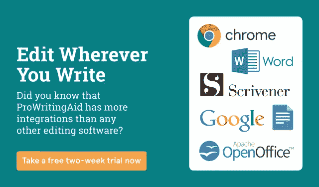

# 谷歌如何“不小心”让自己的生态系统对其他软件厂商贬值

> 原文：<https://medium.com/swlh/how-google-accidentally-devalues-its-own-ecosystem-for-other-software-vendors-25399263a227>

你会买一辆 500 美元的老爷车，安装一套 1000 美元的音响吗？大概不会，大多数人不会。这说不通。但是，如果你刚刚花了 60，000 美元买了一辆新的保时捷，那么多几块钱算什么呢？我没有把谷歌软件的质量比作一辆老爷车，但这个比喻的定价方面是有用的。我将解释谷歌如何创造一个对价格高度敏感的客户生态系统，这对于第三方供应商来说很难操作。

谷歌的主要野心可以总结为:“让更多的人更频繁地使用互联网。”使用互联网的人越多，他们通过广告赚的钱就越多。尽管如此，这仍然是他们的主要收入来源。根据 Asymco 的数据，谷歌每年从每个使用互联网的人身上赚取 6.3 美元。谷歌所做的一切，无论是谷歌翻译(用你自己的语言上网)，还是 Project Loon(使用基于气球的 wifi 在偏僻的地方上网)，都是为了让更多的人使用互联网。谷歌可以以如此低廉的价格提供他们的软件“G 套件”(文档、网站、Gmail、Drive、Hangouts 等)，因为它是这一主要野心的亏损领导者。

对于一个提供免费增值产品的软件供应商来说，每个用户 6.30 美元将是一个惊人的回报。大多数免费增值产品的转换率约为 1-10%，大多数公司的转换率在 1-3%之间。因此，使用粗略的、有缺陷的、不精确的、纯粹演示性的数学方法:如果谷歌是另一家软件供应商，其产品的转换率为 1%，每名用户的收入为 6.30 美元，这相当于每年向每位高级用户收取 630 美元——是 Salesforce 收费的两倍多。这就是为什么谷歌可以对他们的软件收取这么少的费用。

那么谷歌为什么不直接赠送 G 套件呢？因为，通过免费提供服务，你向你的客户发出信号，它没有价值。买到便宜的东西会让人觉得他们买到了便宜货。免费得到它会让他们认为它没有价值或者质量很差。对某些东西收取一点费用总比什么都不收要好。

不幸的是，虽然谷歌仍然可以通过出售廉价软件赚钱，但其他软件供应商却不能。我已经数不清有多少谷歌客户会发这样的邮件:“看到一个拼写检查器以与整个谷歌企业个人账户相同的每席位成本出现，看起来有点奇怪。”如果我们暂且不谈这样一个事实，即我们显然没有向这位客户传达我们的[写作指导软件](https://prowritingaid.com)(不仅仅是拼写检查)的价值，他们说得有道理。我们与其他平台的客户没有同样的问题。我们的用户研究表明，用户希望支付他们正在使用的附加平台的 20-30%的成本。如果你的平台是 Salesforce(每个用户每月收费高达 300 美元)，这是一个好消息，但对 G Suite(每个用户每月 3 美元)来说就不那么好了。这种预期意味着 T2 很难以合理的价格向大多数人出售软件。我不确定谷歌是否真的意识到了这一点，但也许他们应该注意到这一点。如果人们没有第三方供应商生产的集成产品的生态系统，他们肯定很难转向 G Suite 看看 Windows Phone 就知道了。此外，第三方供应商很难在一个对价格高度敏感的客户生态系统中蓬勃发展，就像 G Suite 的定价所创造的那样。

然而，谷歌生态系统并不孤单。如果你要为 CMS 开发一个插件，你会选哪个？大多数人可能会从最大的 WordPress 开始(超过 60%的市场份额)。更多的用户就等于更多的潜在客户，对吗？从表面上看，这是有道理的，但事实上，这是一个似是而非的论点。你忽略了等式中的一个关键因素，那就是价格敏感度。WordPress 是免费的，这意味着虽然它可能有更多的用户，但在你的潜在客户群中会有更多对价格敏感的用户。其他付费的 CMS 可能用户群比较小，但是那个用户群习惯于付费买东西。首先探索这些平台可能很有价值。WordPress 通过提供“JetPack”赚钱，JetPack 是 WordPress 的一套增强和高级功能。它提供了 40 多种功能(设计、营销、安全工具、支持等)。他们必须提供如此多的功能，因为基础平台是免费的。他们可能会搬起石头砸自己的脚。

定价是经营一家企业最棘手的事情之一，当你面对不同的客户群体时，这就更难了。定价的一个不变法则是:“总会有顾客抱怨。”正如 Eric Sink 在[这篇关于定价的优秀文章](http://ericsink.com/bos/Product_Pricing.html)中所说:“如果我把产品送人，有人会抱怨我让他们购买更多的磁盘空间来安装它。”即使你给每个用户一个去加勒比海的免费假期来安装你的产品，一些人也会抱怨他们不喜欢海滩。

在定价中，最容易处理的人口统计变化是地理人口统计，你会看到公司(如微软)在不同的地区对其产品进行不同的定价(例如，在发展中国家比在欧洲和北美更便宜)。在这种情况下，对购买者的透明度很低，因为你必须在不同的大陆(使用不同的计算机)才能看到差异。上次在泰国海边谁查了 Office 365 的价格(又是泰铢换算的)？但是当你在同一个地理位置处理不同的人口统计数据时，透明度是很高的。很明显，如果你向用户收取的微软 Word 插件费用是谷歌文档插件费用的 10 倍。他们可以在你的网站上看到。你或许可以在 Mac(尤其是 iPhone)上向人们收取更多的费用:很多公司都这么做。

有趣的是，同一个客户也可能根据他们使用的平台而有不同的价格敏感度。例如，很难让移动用户为一个应用程序花费超过 1.99 美元，即使这个应用程序让他们再次年轻。同一个用户会很乐意花 50 美元在他们的电脑上购买一个帮助他们管理预算的软件。这种二分法是因为用户在每个设备上从事的行为而产生的。手机主要是消费行为:看新闻、看视频、玩游戏。花在手机上的时间只有一小部分是用来生产东西的。人们习惯于免费消费(或者至少只通过看广告来付费)，所以当你使用手机时，你通常处于消费模式。当你在电脑上时，你可以制作视频、编写文档等。你在生产，人们不介意花钱买能帮助他们更高效生产的东西。所以当你评估一个机会时，也要考虑人们将在什么环境中使用你的软件。让那些告诉你你真的需要开发一个手机版应用的声音安静下来——这可能不值得投资。

所以请记住:并非所有的用户生来平等，即使是生来平等的用户也可能是不平等的。当您评估潜在客户群的规模时，不要忘记考虑这些用户和更广泛的生态系统的价格敏感度。最大的机会可能并不总是看起来那样。

尽管如此，一切还没有结束。有一些技巧可以逃脱这个定价陷阱，并阻止你的价格被你所处的生态系统所决定。我将在以后的文章中讨论这些，所以请跟随我一起阅读。

## 你试过暂停写作吗？你还在等什么？

## 这篇文章发表在[《创业](https://medium.com/swlh)》上，这是 Medium 最大的创业刊物，有+368，052 人关注。

## 订阅接收[我们的头条新闻](http://growthsupply.com/the-startup-newsletter/)。

