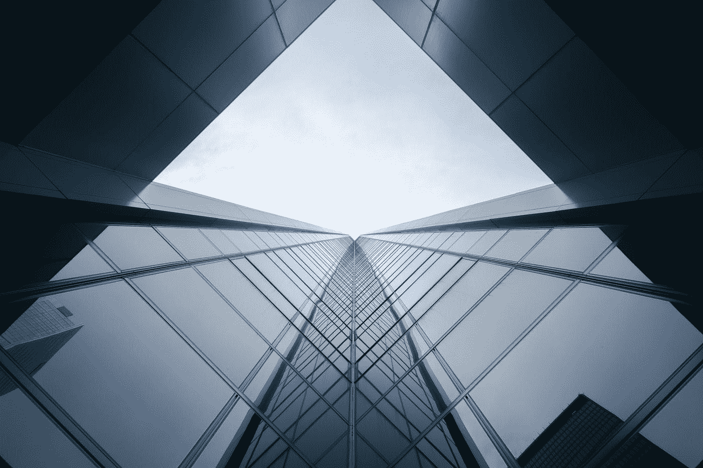

# 贪婪如何阻止好公司变得伟大

> 原文：<https://medium.com/swlh/how-greed-keeps-good-companies-from-becoming-great-3478646fadb7>

Photo by [Verne Ho](https://unsplash.com/@verneho?utm_source=medium&utm_medium=referral) on [Unsplash](https://unsplash.com?utm_source=medium&utm_medium=referral)

> 公司应该解决问题，对吗？

不是所有情况下都是这样。一些公司保护问题或者制造问题来利用他们的客户。

具有讽刺意味的是，这些公司的贪婪实际上掩盖了他们提供的一些伟大的产品和服务。