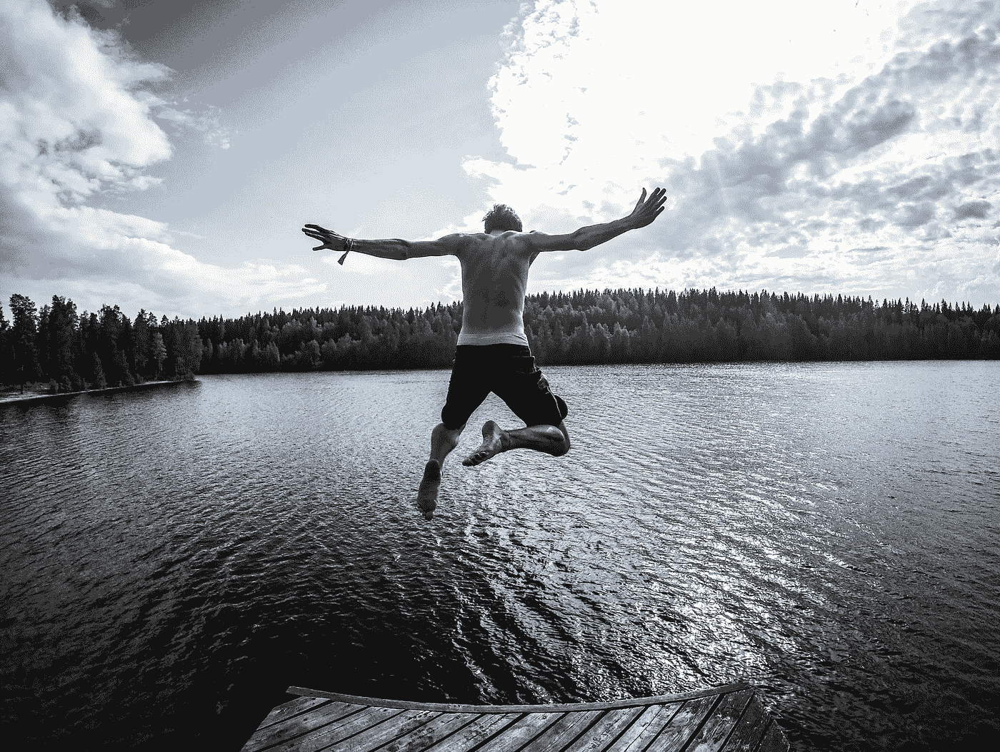
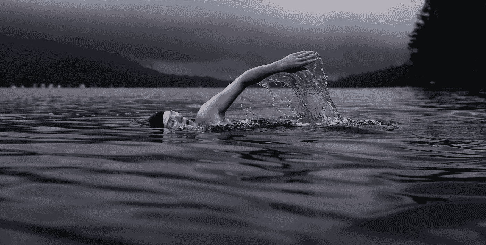

# 使用 W.I.N .公式保持前进有多成功，即使它很糟糕

> 原文：<https://medium.com/swlh/how-high-achievers-deploy-w-i-n-formula-to-get-going-despite-feeling-bad-dd2bc78473d9>

Photo by [Tommaso Fornoni](https://unsplash.com/photos/XrzLWellnd0?utm_source=unsplash&utm_medium=referral&utm_content=creditCopyText) on [Unsplash](https://unsplash.com/search/photos/move?utm_source=unsplash&utm_medium=referral&utm_content=creditCopyText)

> 我今天不想做它。
> 
> 现在我不想再做了。
> 
> 我不能今天跳过这个，明天当我精神状态好的时候再开始吗？
> 
> 真的很烂。
> 
> 现在做不到。

当情况变得艰难时，我们大多数人经常在脑海中听到这些内心对话。

**为什么会这样？**

每个人都想(1)寻求快乐(2)避免痛苦，这是人类的基本心理。我们所有的行动都只受这个原则的支配。

但是也有例外的人似乎体现了下面的原则:

> ***“艰难的时候，艰难的人继续前进”~谚语***

那些有限的少数人，尽管困难重重，但仍继续前进。即使他们看不到隧道尽头的光明，他们也会继续前进。尽管寒风凛冽，他们仍继续向峰顶进发。

他们不会把注意力从他们的目标上移开，因为他们知道这个原则，正如亨利·福特曾经正确地说过的:

> "障碍是当你把目光从目标上移开时看到的可怕的东西."—亨利·福特

但最常见的障碍不是来自外部；相反，它们是盘踞在我们头脑中的恶魔——也让我们远离对我们来说重要的东西。

所以问题来了:

# 即使感觉很糟糕，坚韧的人如何继续前进？

## 答案是:**w . I . n .公式**

它代表:什么是重要的

Photo by [Todd Quackenbush](https://unsplash.com/@toddquackenbush?utm_source=medium&utm_medium=referral) on [Unsplash](https://unsplash.com?utm_source=medium&utm_medium=referral)

这个首字母缩写词是鲍勃·鲍曼使用的，他是传奇人物迈克尔·菲尔普斯的教练，美国游泳运动员，历史上最有价值的奥运会运动员之一。

在迈克尔·菲尔普斯和艾伦·亚伯拉罕森合著的《没有极限——成功的意志》一书中，蔻驰·鲍勃·鲍曼解释了迈克尔与其他游泳运动员的不同之处。

鲍曼说，如果其他游泳者感觉不好，他们就游不好。但菲尔普斯的情况并非如此。他在任何时候都不顾自己的感受去表演。

菲尔普斯的上述特征表明，高水平的表演者不会让他们的感觉控制他们的行为。

如果某件事是优先要做的，那么不管他们对这件事有什么感觉，他们都会表现得最好。他们的感觉在任何时候都不重要；相反，实现目标的行动是他们最优先考虑的事情。

同样，作家埃里克·格雷滕斯在他的书《韧性》中指出，他对你的感受最不感兴趣，更感兴趣的是你想成为什么样的人。

他的成功原则是，驱动你行动的应该是你的身份，而不是你的感觉。

# 他的公式是: ***身份>动作>感情***

他建议，下次当你处于两难境地时，问问自己，“我想成为谁？”

***这个问题的答案会引导你采取正确的行动*** 。对你来说重要的行动——决定你成功的行动。但是好的一面是，一旦你采取行动并向前迈进，你会开始感觉更好。

因此，不要根据你的感觉来决定你的下一步行动——它们只会让你陷入困境。有一天你心情很好，你拼命工作；但是第二天，如果你感觉不好，你就毁了你的一天。

因此，基于感觉采取行动不是一种可持续的生活方式。更确切地说，基于**现在最重要的**是保持成功的方法。

所以问问你自己，当你的情绪拖你后腿的时候…

***现在有什么重要的！***

并不断采取行动..

希望你喜欢这篇文章。

你介意为此鼓掌吗？

如果你喜欢上面的文章，你也可以看看我下面的文章:

[**2 种知识类型&获取真正知识的 4 个步骤**](/swlh/2-types-of-knowledge-learn-the-best-way-to-gain-real-knowledge-49c644e1ca4a)

[**用这个 4 步公式在 24 小时内学会任何事情**](/@sombathla/4-step-formula-to-learn-anything-in-under-24-hours-c1b23c86227f)

# 想提高你的表现(和结果)吗？

# [点击此处下载免费报告，了解 5 种心态转变，在短短 30 天内提升你的表现](https://sombathla.com/mentalshifts/)

Photo by [Quino Al](https://unsplash.com/@quinoal?utm_source=medium&utm_medium=referral) on [Unsplash](https://unsplash.com/?utm_source=medium&utm_medium=referral)

# [Master 5 心态转变，在短短 30 天内提升你的表现——下载你的免费报告](https://sombathla.com/mentalshifts/)

6.3K

## 这篇文章发表在 [The Startup](https://medium.com/swlh) 上，这是 Medium 最大的创业刊物，拥有 289，682+人关注。

## 在这里订阅接收[我们的头条新闻](http://growthsupply.com/the-startup-newsletter/)。

