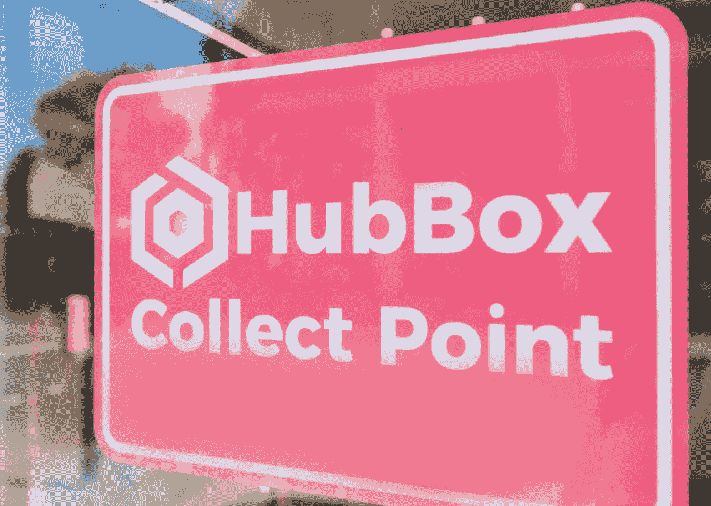
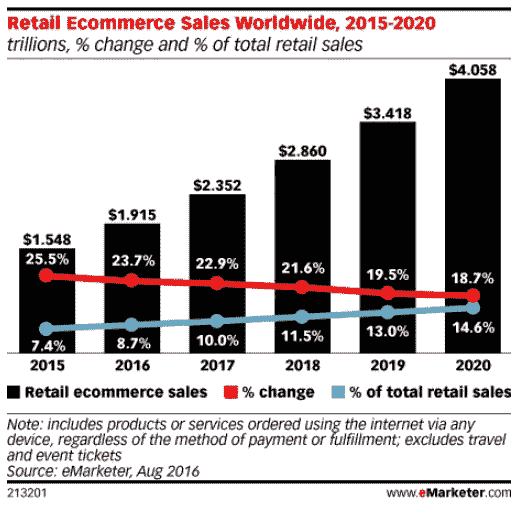
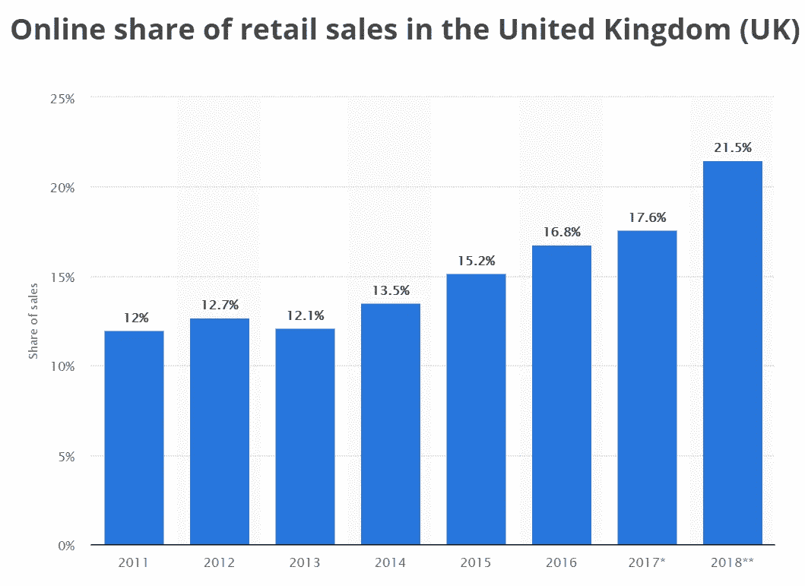
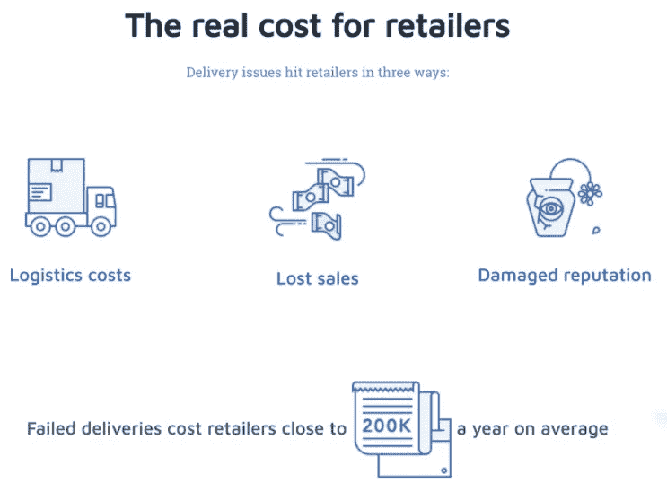

# HubBox 如何向零售商和消费者传递“最后一英里革命”

> 原文：<https://medium.com/swlh/how-hubbox-is-delivering-the-last-mile-revolution-to-retailers-and-consumers-6e4f76b17fa8>

## 我们采访了 HubBox 的首席执行官 Sam Jarvis，讨论了电子商务交付行业的挑战和机遇，以及他的公司如何开发技术来改善零售商和消费者的交付流程。

零售市场的电子商务份额继续快速增长，2017 年占英国总销售额的 17%,占美国总销售额的 [9%](https://www.statista.com/statistics/379112/e-commerce-share-of-retail-sales-in-us/) ,这些数字将在未来一段时间内继续上升。

尽管该行业在网上已经迅速成熟，但一个令人惊讶的被忽视的领域是交付过程。这似乎是一个疏忽，因为这是品牌与消费者的关系从数字走向实体的转折点。在这些时刻，可以留下持久的印象——积极的和消极的。

随着亚马逊[在明年推出自己的送货服务](https://www.v3.co.uk/v3-uk/news/3026418/amazon-to-release-its-own-full-delivery-service-this-year-report)，这终于是一个备受关注的领域。这家电子商务巨头将此称为“最后一英里革命”，因为它计划控制购买旅程的最后阶段。这一策略的消息足以让 UPS、联邦快递和皇家邮政的股价下跌。

然而，亚马逊并不是第一个注意到这种交互有很大改进空间的人。

其他公司已经采取措施，利用技术来改善零售商和消费者的送货体验。

粗略地看一下下表中的电子商务增长预测统计数据，就足以证明，对于那些能够提升在线购物体验的人来说，这份奖励有多大:

过去十年中一个值得注意的发展是点击提货服务的出现，这种服务允许消费者在线购物，并从他们家或办公室附近的便利商店提取包裹。

亚马逊也进入了这个市场，越来越多的亚马逊储物柜在美国和欧洲涌现。

点击领取通常是免费的，它消除了错过递送的可能性，并且它经常打开当天递送的可能性。

所有这些优势都符合现代消费者的偏好，但该行业还有很大的发展空间——无论是在采用率还是复杂性方面。虽然超过 50%的英国消费者表示他们在过去 12 个月内使用过这一选项，但只有 27% 的美国消费者最近选择了点击取货。然而，该市场预计到 2020 年将增长 78%，因此它为零售商提供了一个重要的机会。

我们采访了 [HubBox](https://www.hub-box.com/) 的首席执行官 Sam Jarvis，讨论电子商务配送行业的挑战和机遇，以及他的公司如何开发技术来改善零售商和消费者的配送流程。

# **你能告诉我们一些关于 HubBox 的事情，以及你为什么创办这家公司吗？**

虽然 HubBox 最初是一个消费品牌，但它之所以存在，是因为我们相信，对于顾客和零售商来说，有比现有选择更好的交付方式。

HubBox 存在的部分原因是，自电子商务兴起以来，物流和配送行业未能以有意义的方式进行创新，给客户的配送体验留下了巨大差距。在英国，2017 年电子商务占所有零售销售额的 17%以上，今年这一数字将达到 20%或更高。我们预计到 2025 年这一比例将高达 50%——如果不是更早的话。

这种增长给现有的交付基础设施带来了巨大的压力，这反过来又给客户和零售商带来了挫折。

前者最初在网上有积极和无缝的体验，但后来当谈到他们的交付体验时就失望了。

与此同时，后者发现实施一个需要大量资源分配但对他们的转换率和客户忠诚度都有显著好处的解决方案既昂贵又困难。

# HubBox 的与众不同之处是什么？

从市场角度来看，HubBox 是不同的，因为它只专注于点击和收集，而不是像许多快递公司那样，成为其核心产品的“附加”服务。目前大多数完成点击收取的玩家是快递员，而不是技术提供商。这类供应商的问题在于，如果你想要他们的点击提货服务，你必须换成他们的快递员。这使得实施过程中断、繁琐且昂贵。

HubBox 专注于开发最好的点击和收集技术。除了简单地开发一个 API(大多数现代企业都声称这是一项成就)，我们还提供跨多个电子商务平台兼容的前端软件。这使得零售商可以向客户展示这种交付方式，从而推动消费者接受并获得更好的交付体验。我们不断迭代，该产品兼容任何电子商务平台或任何结账方式。

所有这些因素意味着 HubBox 集成可以用小时和天来衡量，而不是几周。

HubBox 整合的方式也让零售商能够控制向客户提供哪些代收点网络。零售商自己的商店(如果有)可以出现在网络中，零售商也可以设置配置文件来定义显示哪些 HubBox 收集点。例如，零售商可以关闭某个半径范围内的所有收款点，以吸引更多人进入商店。

# **HubBox 帮助客户解决哪些问题？**

对于零售商来说，这很简单——HubBox 提供了一个安全的本地代收点，他们可以在那里发送订单。

对于消费者来说，订购点击取货服务不仅仅是在他们知道自己不在家时提供一个替代的送货地址。经历追踪失败的递送或等待再次尝试递送的麻烦意味着客户想要控制和了解他们可以以他们想要的速度访问他们的包裹。

> 这变得越来越重要，因为越来越多的工作场所正在[对个人订单实行包裹禁令](https://www.theguardian.com/money/shortcuts/2015/aug/12/got-mail-why-employers-cracking-down-personal-deliveries)。

另一个明显的区别是 HubBox 用户不依赖于提供点击和收集服务的商店或电子商务网站来使用该服务——通过使用带有服务员 ID 的个人 HubBox 帐户，他们可以在任何在线零售商的收银台使用 HubBox，只需支付少量包裹费。

# **它为品牌解决了什么问题？**

对于品牌，HubBox 做两件事。

它使他们能够提供顾客到达结账页面时所期望的交付选择。这听起来可能不是一件大事，但很难夸大亚马逊和大型电子商务对消费者预期的影响。标准的 3-6 个工作日的送货时间似乎很长，一次失败或糟糕的送货经历足以让消费者决定不再购买某个品牌的产品。

它还允许他们这样做，而不需要漫长而昂贵的集成过程。随着销售周期变得越来越短，环境压力越来越大，零售商没有时间等待 3 个月来实施某些东西，并看到它可能为他们的业务带来的价值。

[*PCA 预测*](https://www.pcapredict.com/improving-data-quality-report)

# **这项技术是如何工作的？**

HubBox 的核心技术由一个 API 驱动，该 API 与兼容所有电子商务平台的不同软件插件接口，包括 sales force Commerce Cloud(Demandware)、Magento、SAP Hybris 和 Shopify 等。

它允许零售商在他们的结账页面上显示一个点击取货选项，对网站其余部分的影响最小，让他们的客户可以立即访问英国超过 3000 个取货点的网络。HubBox 的后端技术跟踪流经网络的包裹，并过滤到多个代收点和面向客户的应用程序中。该技术与任何电子商务平台和结账方式兼容，但最重要的区别是我们提供了端到端的解决方案，而不仅仅是一个 API。

# 你如何展望零售业的未来？

这似乎是一个老生常谈的评论，但电子商务的持续崛起将无情地塑造零售业的未来。以目前的增长率来看，电子商务销售额在过去两年中增长了 27%，我们可以看到人们购物的方式已经发生了根本性的变化。

在这场游戏中“获胜”的企业明白，只有当他们的商品从 A 地到 B 地的方式像最初的数字购物体验一样无缝时，这种转变才会奏效。时间比以往任何时候都更加珍贵；人们不想浪费时间等待送货，就像他们不想在大街上搜寻那些他们知道只需点击一下按钮就能得到的东西一样。

> 在这种新环境下，我认为在线零售商需要关注三个关键领域才能取得成功:
> 
> 第一个被发现。当人们在搜索他们想要的产品时，他们需要排在最前面。
> 
> 当客户访问您的网站时，为他们提供引人入胜、简单而精彩的用户体验。
> 
> 提供尽可能多的交付选项。方便对不同的人来说意味着不同的东西，所以你需要了解你的受众，并提供他们期望的所有选择。

虽然做到所有这些肯定不容易，但在这三个领域领先的公司将赢得市场份额。

## 这篇文章发表在 [The Startup](https://medium.com/swlh) 上，这是 Medium 最大的创业刊物，拥有 299，352+人关注。

## 在此订阅接收[我们的头条新闻](http://growthsupply.com/the-startup-newsletter/)。

