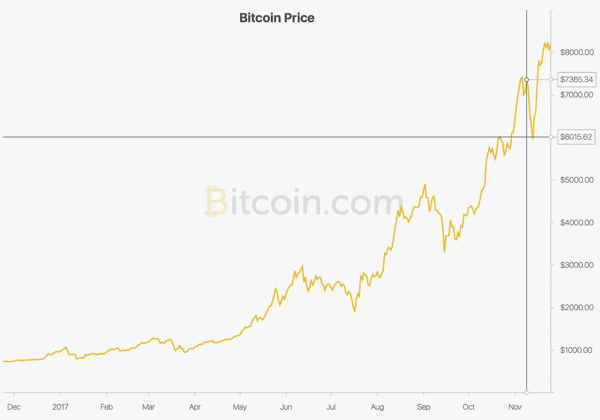
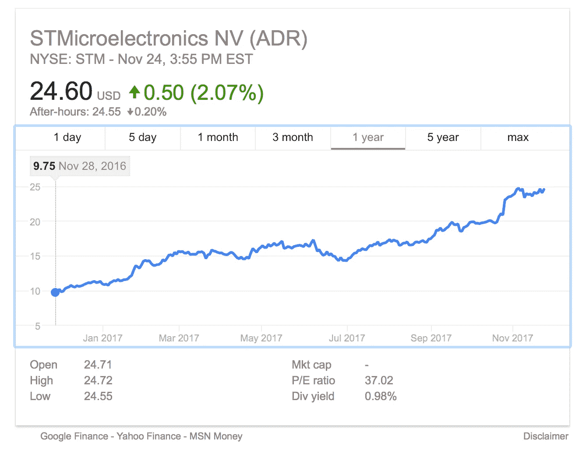
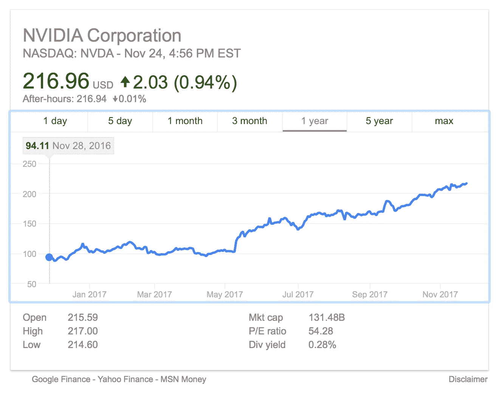

# 我如何避免比特币 FOMO——低风险加密投资指南

> 原文：<https://medium.com/swlh/how-i-avoid-bitcoin-fomo-a-guide-to-low-risk-crypto-investing-6efdac7eb42f>

Credit: Bitcoin.org

免责声明
在你读这篇文章之前，我必须声明，在那些想成为百万富翁的人来找我之前，因为他们并不是因为我的策略而成为百万富翁的。让我们把它说清楚。就回报而言，这些策略对我很有效。其背后的逻辑是基于我自己的知识和经验，这是有限的。我已经测试了我的策略，结果是持续 40-60%的回报。对你有用吗？也许吧。这并不意味着它明天就会起作用，但是它在昨天和过去的两年里确实起作用了。我为初学者免费提供这个指南，作为开始加密货币投资策略的一种方式。这是一个对加密货币和数字资产有着新手理解和浓厚兴趣的人的一个视角。使用风险自担！如果你不能理解这一段，请回到 Youtube，看一些有趣的恶作剧视频！

**我为什么会在这里？** 你看了免责声明吗？好好干喵！

好吧，你坐在家里读这篇文章，是因为你一直从一个企业家朋友那里听说比特币。你可能对比特币或加密货币没有太多的了解，但你不能在没有听说比特币“上涨”或它是“货币的未来”的情况下参加社交活动……坦白地说，只要你能从这种趋势中获利，你并不在乎它是如何运作的。你想在它涨到 1 万美元之前参与进来，但你却不知道如何投资。换句话说，你在这里是因为 FOMO。欢迎，你并不孤单。

一次又一次，我的朋友和陌生人要么问我如何投资，比特币是什么，要么他们含糊地描述他们已经是投资者了。当我问他们一个关于数字钱包的基本问题时，他们犹豫了。不要相信所有告诉你他们是投资人的人。

那个不停谈论比特币或股票的家伙，可能也不知道那么多。他们只是像其他人一样阅读新闻，并传递信息，看起来像一个知情人。如果你是那个家伙，那么你也应该继续读下去！

**什么是加密货币？** 现在，在我们进入我的个人策略之前，你必须对加密货币有一个大致的了解。不要担心，我们不会深入，但你应该知道基本知识，我强烈建议在进行任何投资之前进一步研究。或者只是 YOLO 进入下一节。

如果你跳过一切，只需知道比特币和加密货币不只是你用来支付的东西，而是一个全新的货币系统和基础设施。这既是你用什么支付，也是你如何支付。(祝你好运！)

从我们的朋友维基百科中抓取一段话:
*加密货币(或加密货币)是一种数字资产，旨在使用加密技术作为交换媒介来保护交易，控制额外单位的创建，并验证资产的转移。加密货币被归类为数字货币的子集，也被归类为替代货币和虚拟货币的子集。*

*比特币创建于 2009 年，是第一种去中心化的加密货币。从那以后，无数的加密货币被创造出来。这些硬币通常被称为替代硬币，是比特币替代品的混合体。比特币及其衍生品使用分散控制，而不是集中的电子货币/集中的银行系统。分散控制与比特币区块链交易数据库在分布式账本中的使用有关。*

请在这里继续阅读:[https://en.wikipedia.org/wiki/Cryptocurrency](https://en.wikipedia.org/wiki/Cryptocurrency)

在货币出现之前，我们用商品和服务进行交易。直到现在，钱是我们在交易中用来交换商品/服务的媒介。一般来说，货币持有价值，它是可识别的，被广泛接受并作为法定货币管理。我们使用美元，你可以用它买任何东西。我们有中央银行、费用、税收等等。都是被管制的高度操控的。

另一方面，Cyrptocurrency 通常不受监管。没有政府或央行系统控制它，这意味着大量的假设，显而易见的是没有税收或银行费用。想象一下，从世界另一端的人那里买东西，或者把 Satoshis 送到你的牙医那里支付新的补牙费用。无需处理费用或汇率。

你有没有被银行收取过让你如此愤怒的费用？比特币及其广泛使用绝对是一件值得期待的事情。

**另一件你必须知道的事！波动！** 好吧，不赘述，比特币*存在*是因为需求。如果没有对替代货币或新支付方式的需求，我们真的不会给货币/系统注入太多“价值”。我们身处一个数字世界，在这里，Venmo、Paypal、Apple pay、Chase Quickpay 是最简单的汇款和收款方式。像 Cash 这样的应用程序与你的银行账户绑定在一起，你可以在分享令人惊叹的韩国烧烤晚餐(AYCE 生活)后迅速提取资金寄给朋友！).

与美元不同，比特币仍处于初级阶段，有极其不稳定的趋势。在其他因素中，波动可能是新技术、政府监管、法律以及最终需求的结果。

比特币与股票类似，可以双向流动。11 月早些时候，比特币的价值在一个下午下跌了 1000 多美元。4 天后开始反弹。如果一个下午失去一大堆东西的想法让你胃里翻腾……那么现在你明白为什么比特币并不适合所有人了。比特币和加密货币仍然属于早期采用者，即高风险/高回报的追逐者。

2017 年 1 月 1 日，比特币每枚价值 1000 美元。在撰写本文时，它目前徘徊在 8000 美元。是的，一年就是 800%！

波动性不仅仅是它能下跌多少；它还考虑了在给定时间内它能上涨多少。如果你今年早些时候投资 5000 美元，你现在就有 40000 美元给我买一份牛排晚餐(请给我五分熟)。最起码一杯咖啡，现在就来吧！

你能忍受这种波动吗？当我们进入我的两种方法/策略时，你必须问自己能承受多少。如果你今天下午投资 8000 美元买一只 BTC，如果明天早上价格下跌 600 美元，你会晕倒吗？如果你像大多数人一样，答案是响亮的“是！”…..事实上，这可能是一个胃咯咯地笑，一个“你是认真的吗？”脸然后一个响亮的“是！”

你可能会喜欢我的低风险策略。如果你还和我们在一起，那就进入下一部分，让我们一起赚钱吧！

**两种策略的故事**
在我继续讲下去之前，我必须再次声明——基本上，使用它的风险由你自己承担。

**方式一**:直接投资 BTC 或任何其他加密货币*。
好吧，第一个策略不算什么策略，因为它是一个等待游戏。基本上，你需要一个与银行账户绑定的数字钱包。一般来说，这是通过像 coinbase.com 这样的网站完成的，在那里我有一个数字钱包。*

这里有一个关于数字钱包的快速指南:[www.buybitcoinworldwide.com/wallets/](https://www.buybitcoinworldwide.com/wallets/)

你可以用你的银行账户或信用卡购买整个 BTC 或分数。买了东西后，拿着它直到你成为百万富翁，当你想请我吃饭的时候告诉我一声。=)

**方法二**:间接投资 BTC 或任何其他加密货币*。
最后，你到达了本指南的真正的面包&黄油。作为比特币、以太币和莱特币的投资者，我可以告诉你，波动性不适合胆小的人。你对赚钱感到兴奋，但现实是，你可能会损失相当大的一部分，而且它没有得到联邦存款保险公司的保险或任何支持。如果你是 BTC 和加密的新手，这是适合你的方法，也是我最感兴趣的方法，因为它与加密货币投资有关。*

方法 2 是如何在没有高风险的情况下投资加密货币热潮。对于这种方法，你需要有购买股票的方法。我个人喜欢 Robinhood 应用程序，我用它来进行大部分股票投资。使用我的推荐链接，你会得到一个免费的注册股票。我也有一个，所以这是一个双赢的局面。[http://share.robinhood.com/johnnyl25](http://share.robinhood.com/johnnyl25)

那么 Johnny，我如何以更低的风险间接投资加密货币呢？很高兴你问了。让我们开始吧。

我的总体投资方法实际上是寻找对一个行业或公众至关重要的产品或服务。举例来说:这些天有相当多的技术/计算机被制造到汽车中，甚至是基本模型中。因此，当汽车公司与股价斗争时，有一个隐藏得很好的捐助者。

所有的汽车制造商都在从别人那里购买这项技术。换句话说，如果没有另一家公司负责生产，你车上的所有 GPS 设备都不可能实现。

如果我是 GPS 软件或仪表板技术的制造商，福特或日产给我打电话订购 100 万台，我公司的股票很可能会上涨。因此，我不会直接投资福特或日产，而是投资那些引领汽车零部件行业的公司。

举个例子，看看为苹果和整个汽车行业制造零部件的意法半导体公司(STMicroelectronics N.V .)。他们是一家半导体公司，如你所知，半导体主宰着世界。STM 今年的涨幅刚刚超过 150%。

我对加密货币应用了完全相同的策略。让我们列一个清单。加密货币基础设施的存在需要哪些基本条件？
1。电脑/手机——用于交易、购买、销售和研究
2。数字钱包——保护你的加密货币
3。显卡——挖矿比特币和其他 alt 币
4。电源和其他硬件——用于采矿钻机

投资这些基础设施是从加密货币的任何趋势中获利的好方法，因为它们基本上都需要这些项目才能存在。不管你是挖矿比特币，还是只买/卖。无论比特币上涨还是下跌，你仍然需要这些基本元素来做任何与加密相关的事情。

好吧，约翰！是的，最好的策略有时是最简单的。
现在，这些基本要素并不仅仅依靠加密货币存在，否则你将面临与直接投资比特币非常相似的风险。

让我们来看一个具体的例子，也是我最喜欢的一个例子。英伟达！Nvidia 为不断增长的视频游戏行业生产显卡。我再说一次:没有英伟达的产品，加密货币就不会存在，因为你需要英伟达(和其他制造商)制造图形处理器来开采比特币。就这么简单。

让我们看看事实。2017 年 5 月，英伟达的股票定价为每股 103 美元。仅仅 6 个月后，现在已经达到了 217 美元。超过了 100%。因此，如果你在 5 月份投入 5000 美元，那么当你只是在 Instagram 上闲逛喜欢随机照片时，你现在就有了漂亮的 10000 多美元。

Nvidia 深入参与游戏、专业系统/虚拟化和人工智能也有所帮助。因此，如果对采矿或加密的需求下降，你仍然可以依靠英伟达服务的其他行业来抑制你。如果你愿意的话，这是一种微观多样化。

如果你有胆量跳入加密货币并乘风破浪，那就勇往直前吧！然而，如果你和大多数人一样，你想加入行动，但你不喜欢冒险的生意，方法 2 是你的新 BFF。

所以你有它。没错，伙计。它的美妙之处在于它的简单。

-约翰尼
IG:@华尔兹街

P.S .有兴趣了解更多？如有任何问题，请随时给我发信息，我会尽最大努力回复您！

## 这个故事发表在 [The Startup](https://medium.com/swlh) 上，这里有 263，100 多人聚集在一起阅读 Medium 关于创业的主要故事。

## 在这里订阅接收[我们的头条新闻](http://growthsupply.com/the-startup-newsletter/)。

