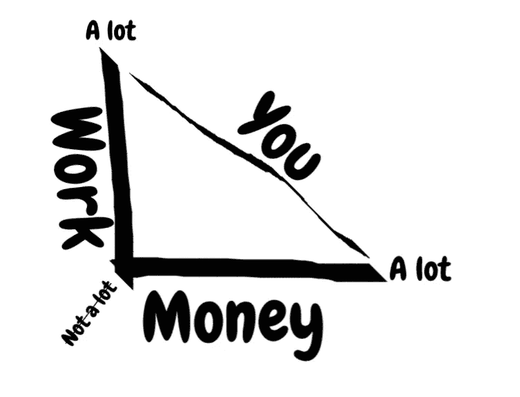
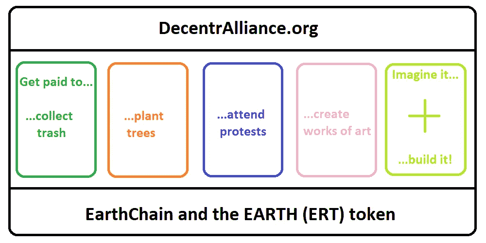
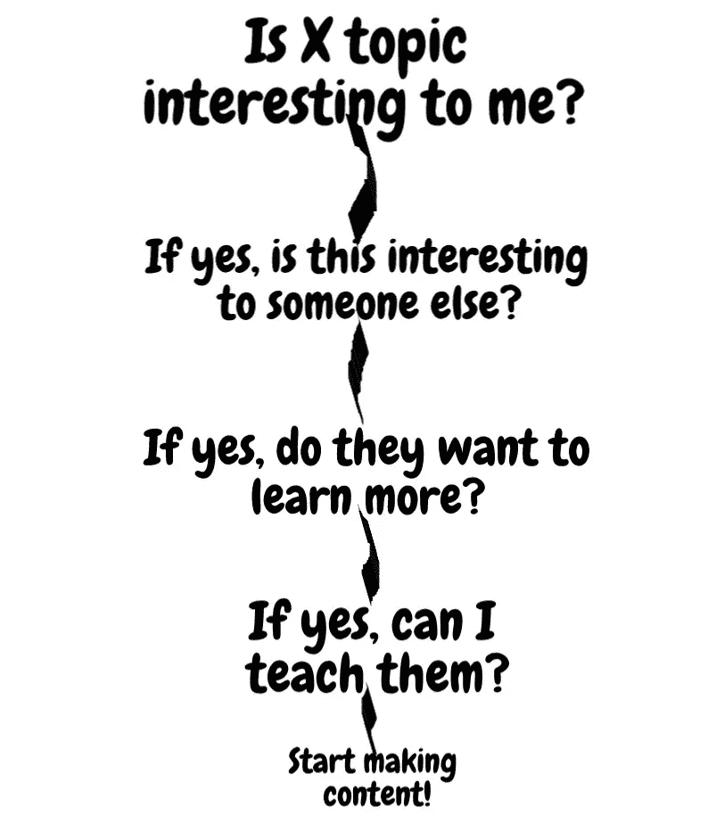

# 我是如何在 19 分钟内击败 140 多名求职者，获得一份没有学位的区块链顶级初创公司工作的

> 原文：<https://medium.com/swlh/how-i-beat-140-job-seekers-and-landed-a-top-tier-blockchain-startup-job-without-a-degree-in-18-9abe70a0f890>

## 长标题需要长介绍！这个故事应该从头到尾读一遍。我希望激发你推动自己去实现你想做的事情，而不仅仅是你认为你能做的事情。根据记录，我已经在一周内被问了 5 次这个问题，因此有了这个详尽的解释。

如果你感到懒惰，这整个故事可以总结为一个公式:
**1)获取知识+ 2)提供价值* 3)受到关注= 4)最终目标。** 1 是 2 所需要的，也是 3 所必需的。
3 的数量决定了你多快能达到 4。

但是有一个警告。如果你打算半心半意地追求你的梦想，那么这篇文章不适合你。然而，如果你想尽你所能努力工作，那么这就是我的故事…

> 今天是我第一次听说区块链的整整一年。一段时间以来，我一直梦想能够在 30 岁退休，而了解区块链让这个梦想变成了计划。所以我对这个计划做了一个粗略的草图，并遵循它——当然有起有落。我 22 岁了，所以还有很多时间要走！

我可能应该提到，在听说区块链之前，我完全没有技术经验或知识。我也在 16 岁时辍学，每年大约有半年时间我都有严重的抑郁症。

所以，为了在 30 岁时实现经济独立这个有点乐观的目标，我意识到我必须*(现在仍然必须*)做与常规相反的事情。为什么？因为社会倾向于推动我们做一些事情，让我们被锁定在一个特定的角色上:在工作层级中向上爬，获得抵押贷款，组建家庭，教你的孩子也这样做，如此循环往复。对我来说，这从来没有那么有吸引力。

我也是一个和平主义的嬉皮士，所以做一个犯罪超能力者不太符合我的个性…尽管尝试一下会很有趣😆

对我来说， ***生活质量上升*** 随着你花在工作上的时间 ***减少*** 而财务结果 ***增加*** 。
换句话说，工作和金钱的比例应该是这样的:

This ☝ ️might not make sense. I don’t know… Maybe I should have finished math class lol.

所以我设置了 6 个困境来追踪我需要做的创业活动:

1.  **实物 vs 数码** 一个物件你只能卖一次，但一个数码物品你可以永远卖。这排除了任何形式的体力劳动，但是仅仅在网上卖东西并没有那么有趣(除非你自己做了)。手工工作也是如此，即“你投入的就是你得到的”，比如在线翻译。
    一页= x 块钱，不好规模化(我这样做了 3 年)。
2.  投资与工作
    虽然我一开始确实尝试过投资这条路，但我根本没有启动资金去做任何有意义的事情。当然，去年我通过**投资**ico 成功地将 2000 美元转换成了近 50000 美元，但是 2018 年来了，剩下的就是历史了。
    那么**为一家加密公司工作**怎么样？那可能是获得好的财务结果的更可靠的方法。
3.  **创立 vs 初创** 创立或加入一家**初创企业**通常对你的长期发展更有利，尤其是如果你能获得股份的话。在老牌公司工作的人通常会被困多年，工资高得足以让他们在那里待上几十年，希望他们最终会得到那个重要的晋升。然而，通常会发生的是(没有雇主会公开承认这一点)，个人在某个角色上变得如此出色，以至于雇主会想尽一切办法把他锁在那里。
4.  **股票 vs 代币 vs 高薪** *“(在加密领域)六个月相当于传统风险市场的五年。”——*[卡维塔·古普塔](https://techcrunch.com/2017/12/04/consensys-ventures-has-made-its-first-four-investments/)，Consensys 的基金经理。我认为这是不言自明的。
    关于**薪水**，我也选择了一份在菲亚特月薪较低的工作，但在**代币**中的报酬要高得多，至少要呆上一年半。不是现有的令牌，而是该公司自己即将推出的令牌。也许我应该写一篇类似的文章，谈谈如何辨别好的和坏的代币(即“狗屎硬币”)——请在评论中告诉我。

所以现在，如果代币的价值没有向任何一个方向移动，在头 18 个月后的 3 年里，我将每月得到我的月薪+大约 7 倍的代币。

5. **App vs 协议** 公司的产品可以充当**应用** ( *像连锁酒店、web bureau、Litecoin* )，或者**协议** ( *像 Airbnb、Wordpress、以太坊)*。如果做得好的话，类似协议的业务将会扩展得更快。如果你是这种思维的新手，请看这个。

6.我必须至少在几年内享受这份工作，所以能够在家或在旅途中工作对我来说极其重要。如果有什么扼杀了我的创造力，那就是例行公事。而创意是我每天用来获得生活中想要的东西。

> 我推荐听🤘[这首歌](https://www.youtube.com/watch?v=n1JiNg3XHxA&list=PLjIuADMrDKIa3Wz9J6AkSkO1-7bcvVHO0&index=3)🤘继续读下去。如果你能在读这篇文章的时候做到这一点，那么你就可以做任何事情🤪

关于第一点，虽然在技术上可以无限扩展我以前的自由翻译业务，但我也必须发现我的工作很有趣，我已经有点厌倦了…
这里有两个非常不同的例子，说明如何扩展一个原本需要手动操作的工作，比如在线翻译:

当你足够优秀的时候，你会得到比你所能服务的更多的客户。只需与几个有能力的同事达成推荐协议，并从他们从你的线索中获得的钱中赚取一定的百分比。坚持这样做，最终，你就不用工作了。你*成为*雇主，有点。

一位同事将他 10 多年的法律翻译文件输入一台艾禾机器，让它自动吐出 99.99%正确的法律翻译。换句话说，以前手动需要 8 个小时才能完成的工作，现在他可以在 5–10 分钟内自动完成。他现在可能正躺在⛱️某处的海滩上

# 但你在这里读到的是加入顶级创业公司，而不是让你的手工业务自动化。

所以，今天我要挑战你采取这四个半步骤:

**第一步:**阅读本文。
**第二步:**尽快看完 [*这部*](https://en.wikipedia.org/wiki/Catch_Me_If_You_Can) 的电影！(它会教你完全靠态度、意志和创造力获得成功💪*)。*
**第三步:**每天学习一些与你梦想工作相关的新东西，***。*** ***第四步:**传授你所学的知识&让你声名大噪！
**步骤 4.5:** 一堆重复步骤 3 后产生优质内容。*

**当感觉没有动力时，重复步骤 1 & 2。**

*关于**第 4.5 步**:我开始写如何投资 ico 的指南，之后不久写投资哪些 ico(*yikes*)，以及总结我在 [clickbaity 文章](/swlh/ico-investors-guide-to-the-galaxy-4bfbd05fdd98)中学到的东西。后者实际上让我在一家金融科技公司获得了一个顾问职位，这证明了我的观点。*

*在写那篇文章的时候，我在 crypto 工作了仅仅 4 个月，大约 4 个月后，公司的 CEO 找到了我。这些东西并不像你想象的那样罕见。*

*然而，如今这类内容不再具有超级吸引力。
但话题像“ ***如何加入一家区块链创业公司*** *”，****如何识破一个 shit coin****或****如何不被*** 🖕 **在熊市中被操****”*****

> **所以我写这篇文章只是作为对一系列看似随机和零星的事件的公开观察，这些事件都导致了一个非常具体的结果。我希望我能激励你开始冒更大的风险，重新思考你实现职业目标的方法。**

**如果我能做到，你也能！小指承诺。🤙**

# **我们走吧！**

> **“失败只是一个重新开始的机会——这一次会更聪明些”
> ——互联网上的某个人**

**当我看到☝️的话时，我决定写这个故事。但是让我先解释一下为什么它适用于我的情况…**

## **从 16 岁到 21 岁，我有:**

*   ****开始了一篇** [**博客**](https://mindofandy.wordpress.com/2012/08/15/do-you-dare-to-live/#more-342) **关于……的感想！这是我在学校处理无聊课程的方式。****
*   ****高中退学去欧洲旅游几个月，没有计划。** ——从塞浦路斯出发，不知怎么搭便车到了希腊。这是我第一次通过受印第安人启发的彩虹家族了解到权力下放的好处。🏳️‍🌈**
*   **开始(和退出)5 种不同的大学预科教育，持续 1 & 60 天。
    ——机构思维时注意力跨度短。我能说什么呢？我认为，如果商学院想保持相关性，它们需要提升自己的水平。**
*   ****当了 30 天洗碗工。** ——厨房传来的[鼓和贝斯](https://www.youtube.com/watch?v=bA4HX9T4K5s)，向所有餐厅客人道歉…💿**
*   ****全职为大赦国际工作了大约 5 天。
    -** 真的很烂。真的真的。那个一天签 10 个人的家伙真了不起👀 👏**
*   **在一家动物权利组织工作了 3 个月，分发传单。
    ——比替陌生人讨钱好不了多少。**
*   ****发起了一个名为“免费食物运动”的非营利组织，通过一个分散的农业集体为世界提供免费食物。**
    ——你觉得怎么样？**
*   **从 18 岁到 21 岁，我开了一家自由翻译公司，这是我的主要收入来源。
    ——从每小时 5 美元爬到每小时 50 美元。有些周工作 100 小时，有些周工作 10 小时。这让我在旅行时可以超级灵活地安排时间和工作。在此期间，我为 30 多家不同的公司翻译了各种材料。这项工作慢慢地把我引入了技术世界，这是一个很好的入门读物。**
*   ****在** [**有机蔬菜农场**](http://holistia.dk/omstedet.html) **找了份工作。可爱！我在那里住了 18 个月，尽管我大部分时间都在翻译而不是务农。****
*   **为一些朋友开了一个艺术博客。**
*   **开始了另一个博客。**
*   ****又一个。****
*   ****等等……****
*   **开了一个纯素食巧克力评论博客。🍪🍪🍪**
*   **搬到捷克的布尔诺，做内部翻译。一家英国公司雇佣我在捷克共和国翻译丹麦语……想想吧。持续了 5 周。太公司化了。💼 🤬**
*   **为纯素食主义者和素食主义者创建了一个聚会平台。
    - 20 个用户。耶。**
*   **21 岁时可能已经创建了 15-20 个网站。我不是一个程序员，但是像 Wordpress 和 Squarespace 这样的网站允许你点击鼠标。🤓**

**在这期间，我还在西班牙、瑞典、德国、塞浦路斯做志愿者，在土耳其过了大约一个月的流浪生活(对不起妈妈)。**

# **2017 年 9 月发现比特币！**

**这是有趣的部分。**

**从现在开始，我将更详细地讲述在接下来的 10 个月里发生的所有事情，为什么它们看起来是随机的，以及你如何从复制我的方法中受益。**

**有必要列出我工作生涯中以前发生的所有事件，让你对自己在这里的真正目的有一些背景了解:如何在没有正规教育的情况下找到工作。**

**从我的经验来看，教育很好，但经验更好…有时？**

**如果你不记得关于失败的第一句话，这里还有一句:**

> **我没有失败。我刚刚发现了一万种行不通的方法。
> —托马斯·爱迪生**

**所以，现在是我采用跟踪之前提到的 6 个困境的时间点，所以在阅读以下内容时请记住这一点:**

*   *****2017 年 9 月|* 不再做翻译，几乎是把自己锁在一个房间里一周，尽可能地阅读关于比特币、替代币、区块链和智能合约的所有内容*(在接下来的 3 个月里，每天继续阅读 4-8 小时*)。** ——大大的强调了一下 ***的全部可能！无论你是否有 40 年的 It 经验，或者是否在日托中心工作，这都无关紧要:当你第一次听说比特币时，一个术语的每一个解释都会在一个似乎永无止境的连续体中引出更多的问题，对吗？
    *“比特币的动力是什么？*——区块链。”
    *“区块链有什么权力？*——每个人，不包括任何特定的人谁发明了比特币，或者，呃，区块链或者其他什么？“那么，区块链是如何工作的呢？”？*——不是*那个*，而是*一个*。”
    *“还有吗？比如什么？* —以太坊、Neo、Eos 等。”
    *等等？* —不，以太坊经典。”
    *“两个以太？？不，好像有六个。人们用叉子叉出屎来。”
    *“好吧，那么还有多少其他的硬币？你是指硬币还是代币？
    *“有区别吗？* —是的，通常在平台上推出的资产被称为代币，而硬币是底层资产，就像以太一样。
    Wha..？这些代币有什么用？嗯，这要看情况。你决定吧。
    *“等等，我可以自己制作加密货币？是的，大概需要 10 分钟。*“但价值从何而来？嗯，你看..那是…是的。“好吧，但是还有其他密码，有价值吗？能提一些吗？********

rippledashmonerostallariotadanoeostontezosomisegovergeliskpivx 0 xontologysteemmetaverseholodobrandcybermileswavesdogecoinnanoqtumiconarkdentacoinaionordortetherqashwaxpowerledgergaszcointenxdragonchainencheneumbictoindarkbitcoincoindbitcoindiamondbitcoinprivatebitcoinatombitcoincorebitcoinnanobitcoinworldbitcoin…"
*停！随便说一个数字……*—大约[5006](https://coinlib.io/coins)并数“
*”😵我们能谈点别的吗？* —当然，选择一个主题:
交易所、稳定币、日交易、TA、HODL、ICOs、市场心态、奖金、空投、FOMO、FUD、节点、神谕、PoW、PoS、PoI、DPoS、PoA、BFT、PoWeight、DAG、纠结、散列图、地址、私钥、钱包(交易所、移动、web、软件、硬件、纸张)、dapps、gas、mooning、51%攻击、区块奖励、区块高度、确认、DAOs、散列率、费用、许可
还是经济影响？或者区块链将如何彻底重塑我们所知的世界？
*🤪*“—买比特币就好，应该安全。别担心🤞

好吧，也许我有点忘乎所以了。我的观点是，如果你想保持领先地位，你不仅要比你的同龄人更了解区块链，还要了解周边地区。如果你比你周围的人，比如区块链和 crypto，更了解某个话题，你将成为他们询问的人，并向其他人推荐，这反过来也可以转化为收入流。

*   ***2017 年 9 月|* 做了一个简单的网站，教 crypto 基础知识。** - 这是在了解比特币仅几周后进行的一次很好的测试:我能向完全陌生的人解释我所学到的东西吗？通过教授加密和区块链基础知识，为比特币基地和 MyEtherWallet 制作“如何做”指南，我通过我的推荐链接赚到了惊人的 60 美元。呜哇！不过，当我了解 ICOs 之后，我就放弃了这个项目。
*   ***2017 年 9 月/10 月|* 于**[**Steemit**](https://steemit.com/@andreashauser)**开始复习 ico。成立了一个有 1500 名成员的 ICO 小组。** ——这个话题在 2017 年中后期被极度炒作。我仍然相信 ico 是低净值个人增加资本的绝佳工具，但你必须深入挖掘才能找到好的！另一方面，我相信它们也可以成为项目的极好工具(*具有真正的令牌实用程序！！*)向普通大众募捐。

我也看到了内容创作市场的利基，因为大多数人写的都是短小、低质量的文章，所以我反其道而行之，至少花了一天时间阅读白皮书 1-2 遍，在决定是否写评论之前找到所有我能找到的信息。

也是在那时，我成立了一个分享和发现优秀 ico 的脸书小组，在不到一个月的时间里，这个小组的成员从 0 人增加到了 1500 人。几篇评论之后，我推荐的一家公司的首席执行官联系了我。他非常喜欢我的文章，以至于第二个周末他为我建立了一个专业的 ICO 评论网站😍。
有人还为网站制作了这个简洁的视频:

*If you’re that guy, please reach out again! I lost your email☹️*

但是，在我发现奖金——基本上是一种获得在线营销代币的方式——的时候，贪婪占据了我的视线，很快我就只会审查那些有真正好的[奖金计划](https://bitcointalk.org/index.php?topic=4885906)的 ico。这给我留下了不好的印象，所以我在启动网站几周后就停止了。😌
10 月下旬我也关了群。垃圾邮件发送者占了我的上风，我讨厌每天花几个小时去调解那些表现得像机器人的人(*)或者他们真的是机器人？*🤖 *)*

然而，这些 ICO 评论文章让我注意到了一家谷歌支持的电子商务领域的初创公司。简而言之，在接下来的 2-3 个月里，他们有 2-3 次邀请我，但我对电子商务不感兴趣，所以我最终拒绝了他们。从我过去的所有经历中，我明白了如果我不完全热爱我所做的事情，我就无法完成工作。

*   ***2017 年 11 月/12 月|* 没事，但不是*真的*没事。** ——所以在这一点上，我已经花了大约两个月的时间尽我所能吸收关于区块链和 ICOs 的一切。在这一点上，我变得有点疲劳，但我一直在当地和国际脸书团体和 ICO 电报频道中出现我的名字。

我敢肯定，每当我回答新成员的问题时，总会有一些区块链的老手超级紧张，因为我刚刚才知道答案。但对我来说，这是你学习最快的方法——如果你不能解释一个概念，那么你可能没有正确理解它，这就把我带回了我的 4.5 步挑战中的第 3 点和第 4 点。☝️

每天，我都会给那些询问如何做这件事或那件事的人提供有用而清晰的答案，因为当你在寻找像*“我如何建立一个新公司”*这样的基本问题的答案时，任何一个给你提供你所需要的确切信息的傻瓜在那一刻对你来说都像是专家。其他人会开始注意到。

*   ***2018 年 12 月/1 月|* 做了一个** [**本地网上密码学校**](https://www.kryptoskolen.info/alle-guides/) **。** ——取决于你什么时候读到这个，那个👆域名可能已过期。
    总之，“Kryptoskolen”字面意思是“密码学校”,这是一个免费推广和传播我所学知识的好方法。

首页是比特币到底是什么的简单入门，然后我写了一些指南:
-如何入门
-如何使用比特币基地
-如何使用 KuCoin
-如何设置我的钱包
-6 种加密货币钱包类型
-什么是区块链？
-加密词汇表/词汇

也有一些客座博文和一个当地加密教练的广告+一个我展示我惊人的 ICO 投资技巧的个人主页。

几个星期后，Kryptoskolen 有了自己的脸书小组，大约有 200 名成员。然而，我克服了冬季抑郁症，所以我在大约一个月后停止了这个项目，实际上也把 crypto 搁置了同样长的时间。

今年 1 月，我做了一个关于如何投资 ico*(因为当时我的投资组合有 30 倍于 T20)的演讲，我还做了 2 次私人辅导，每小时 90 美元。我本可以继续这样做，但正如前面提到的，当时我太沮丧了，不想钱。*

*   ***2018 年 2 月/3 月* |加盟** [**力挺**](http://backed.ai/) **。** ——虽然今年早些时候我对 crypto 并不太感兴趣，但我仍然相当活跃于当地论坛。Backed 的创始人凯文注意到了这一点，并让我在他的初创公司担任顾问。这很快就变成了更多的事情，在我知道之前，我的头衔是“管理合伙人”，我的职责包括凯文太忙而无法做的事情+为此付出的高小时股本率。凯文教了我很多关于传统金融世界、创业生活以及与✌️名人相处的知识😆因为我时不时会在他家过夜，并在他的公寓里工作。这个家伙让一周 80 小时的工作看起来很正常。

然而，这种生活和行业并不吸引我，所以我在那里工作几个月后就辞职了。

*   **2018 年 4 月/5 月|从事了一段时间我自己的加密概念。** ——所以，事情是这样的。塑料正在破坏我们的天性..有两种方法可以解决这个问题: **a)** 制造并实施可生物降解的替代品，以及 **b)** 清理现有的垃圾。两者都需要。我的想法是对“*我们如何尽快清理地球”这个问题的回答*

如果任何人都可以通过收集和处理塑料来赚钱，会怎么样？这个[视觉甲板](http://docdro.id/Ug2OPle)试图构建一个分散的、社区控制的概念来促进这一点。本质上，我们会有一个令牌(*地球*)、一个区块链(*地球链*、*可能是一个钢叉)*、一个平台(*清洁 2 学习*)和一个组织(*去中心化*)。
随着时间的推移，该组织还可以促进其他活动:

然而，大约在这个时候，我已经花光了我所有的积蓄，除此之外，我没有足够的心理能力来领导这样的事业，所以我现在停止了工作。
如果你想在这个概念上有所发展，请随意伸手或窃取它。如果你成功了，请通知我👍

*   ***2018 年 7 月* |在** [**上申请了几个职位**](https://crypto.jobs/) **。** *——在我继续说下去之前，我只想简单介绍一下提到的网站。我在那里找到了我目前的工作，我认为这个行业的许多人都非常感谢 crypto.jobs 的家伙们为求职者和雇主提供了这样一个令人敬畏、易于使用的免费平台。自从开始在 AnyLedger 工作以来，我一直使用 crypto.jobs 来接触大量的营销人员和开发人员，而且完全免费。*

所以，现在是时候利用所有这些过去的经验和项目去做一些比我更大的事情了。但是我不想只选择第一个出现的东西。我必须坚持最初的计划，以指数增长我的知识和资金，而不仅仅是线性增长。虽然经过几天的搜索后，桌面上出现了每月增加 100-200%的报价，但没有一个报价像 AnyLedger 一样具有指数级增长的潜力。

*   整篇文章基本上解释了为什么这是我的观点，但让我简单重申一下…

> - AnyLedger 是一家**区块链**公司，拥有一款数字、**无限可转售**产品——SaaS/BaaS(软件/区块链即服务)。
> -这是一家**初创企业**，相当于更高的**增长潜力**。
> -该产品是一个**协议**，而不仅仅是一个应用程序——该产品允许任何公司构建自己的物联网区块链应用程序，而不必担心底层的复杂性。
> -我可以在薪水之外得到**代币**。
> -如果我愿意，我可以远程操作**。**

**如果你滚动到顶部，再读一遍 6 个困境，你会发现这满足了所有的要点。**

# **求职小贴士**

**如果你还在阅读，那么这里有一个小奖励，帮助你在竞争中领先。**

1.  **知道自己的价值。
    如果你没有参考点，这可能会很难，但试着计算一下你的时间值多少；是值每周 100 块还是 1000？请记住，你每周都必须达到这个数字——你的薪资期望/要求必须与你能提供的价值相符。**
2.  ****立即提供价值。** 展示你的技能立刻向雇主表明你 **a)** 不仅仅是感兴趣， **b)** 对 X 话题有所了解， **c)** 可以采取主动(因此也有责任)。
    不一定是什么复杂的事情。**

**举个现实生活中的例子，这是我们第一次谈话后我写给洛伦佐的话:**

**这是我发给洛伦佐的:**

**“关于网站设计，我觉得 Substratum 和 Divi 也很棒，看看[**https://substratum.net/**](https://substratum.net/)[https://diviproject.org/](https://diviproject.org/)我特别喜欢 Divi 的简洁和路线图设计。我认为改进 anyledger.io 的一个很好的方法是使段落更短，更“鼓舞人心”。"
以智能传感器为例，您可以写下类似这样的内容，而不是当前的文本: *nyLedger 为全球数十亿智能传感器引入了新的安全级别，同时允许它们自动利用传输的数据。*”—带有一篇深入文章的链接，该文章详细介绍了这种方法的工作原理以及为什么需要它。因此，与其描述“*如何工作*”和“*它能做什么*”的细节，不如简单地用一句话解释“*意味着什么/使*”并在图片上用一些鲜艳的颜色，然后好奇的读者可以点击进入文章，阅读 1000-2000 字的关于该过程的内容，并伴随着架构的图形显示。希望有意义。我真的很喜欢“*我们给你的物联网设备分散的超能力*！“这是个不错的口号。但我认为，对于普通的 ICO 投资者来说，它也需要一些文章形式的解释。或者，您可以更改口号下面的数字(*“嵌入式钱包”、“区块链网关”等)。*)因此，嵌入式钱包没有这段文字:“*在物联网设备上运行的轻量级硬件钱包。构建于 ARM TrustZone 之上，具有空中更新和区块链完整性检查功能，*“你可以编写类似这样的内容:“*让你的物联网设备能够自动发送和接收加密货币*”，然后点击一个箭头/按钮，在其下方显示更长、更具技术性的解释。为什么？因为即使你是一个 b2b 项目，当涉及到你的 ICO 时，你仍然需要有一个 b2c 的方法。像“*轻量级钱包*”、“ *AMR TrustZone* ”和“*无线*”这样的词只会对 10-20%的潜在贡献者有意义，而简单易懂的解释将确保 100%的访问者完全理解您的技术能实现什么。我相信，当用户可以选择他们的参与程度时，伟大的设计就实现了——精通技术的投资者总是会阅读解释，而普通投资者只会满足于阅读简单句子中的“*”的含义:)***

***我应该注意的是，自从我被雇佣以来，这些改变几乎没有一个得到实施——一个更广泛的网站重构将很快发生。***

***3.**尊重自己**
记住，他们不只是面试*你*。你也在面试他们，我能想象在这家公司和这些人一起工作吗？”***

***不要做一个工作妓女！你会问，什么是工作妓女？我经常看到他们，因为我几乎每天都收到求职申请。为了得到这份工作，一个工作妓女会告诉你任何事情，直到他们完全失去了他们是谁的本质，以及他们最初在那里的目的。***

***如果这还没让你想起什么，很好！但是如果是这样，那么后退一步，重新考虑你希望坐在桌子另一端的人如何看待你。***

# ***谢了。因为。REA。丁。***

> ***👋[让我们在 LinkedIn 上联系](https://www.linkedin.com/in/andreas-hauser-/)***

***这个故事的重点是告诉你，你可以有意识地加快你学习的速度。是的，我本可以坚持审查 ico 直到现在，并为此恨自己 *#sellout* ，但我更愿意探索，热爱我所做的事情，少赚一点短期收入，换取更高的长期潜力。***

***对于那些对这个实验感兴趣的人，我可能会每年更新一次，直到我 30 岁。让我们看看会发生什么🤗***

***如果有一件事我真的想强调的话，那就是:
*这些具体的行动并不是成功的秘诀，但我所采取的心态可能是。我从去年开始做的所有事情都不是随机的——它们可以归结为一个非常简单的公式:****

******

***并且要有耐心。好事会来的。现在，用你的脑袋去搞:***

> ***“如果你需要鼓舞人心的话，就不要去做。”
> —埃隆·马斯克***

******

## ***这篇文章发表在 [The Startup](https://medium.com/swlh) 上，这是 Medium 最大的创业刊物，拥有+ 372，390 名读者。***

## ***在这里订阅接收[我们的头条新闻](http://growthsupply.com/the-startup-newsletter/)。***

******