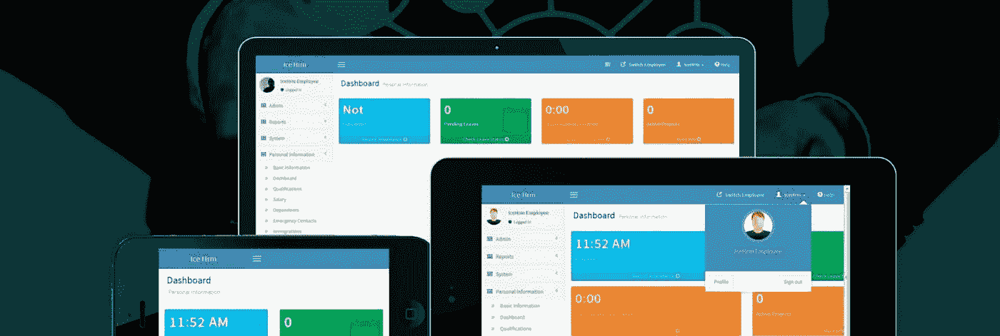

# 作为一名全职软件工程师，我如何在没有前期投资的情况下启动 IceHrm

> 原文：<https://medium.com/swlh/how-i-bootstrapped-icehrm-with-no-upfront-investment-while-being-a-full-time-software-engineer-d4e3e335c76c>

我想到写这篇文章，希望这能激励一些年轻的开发人员进入开源开发，并分享我在开源项目商业化过程中学到的一些经验。

[***IceHrm***](https://icehrm.com)***作为开源项目开始。***

那是 2007 年，我刚接触网络开发。由于我过去更多地使用 java，所以我决定使用 Java 和 GWT(一套将 Java 代码转换成 javascript web 应用程序的工具)。这是早期的*以及 GWT 但是有一些用于在其上构建 UI 组件的库，比如[***GWT-Ext***](http://gwt-ext.com/)。所以这让我的 UI 开发变得简单多了。*

*IceHrm 的最初版本是由 GWT 和 GWT 建造的。*

*与当时大多数其他开源 web 应用程序相比，它的用户界面要好得多。在几次发布之后，当它变得稳定时，我离开了这个项目一段时间。但它每周至少被下载 250 次，我可以看到人们在使用它，并在支持论坛上讨论它。*

*距离上一次发布 4 年后，由于下载量的原因，我想到了再次为项目做贡献。*

*由于很多工业界的人都知道 IceHrm，我想把它建成这样一种方式，任何人都可以像 WordPress 一样开发免费或商业扩展。所以在某种程度上，我可以将这个项目商业化。*

> *用代码行来衡量编程进度就像用重量来衡量飞机制造进度一样。—比尔·盖茨*

*牢记这一点，我开始开发一个名为 Isotope 的最小框架，它支持 IceHrm 所需的基本需求，并允许我用最少的代码量快速为它开发新特性。*

*因此，大约 8 个月后，我设法发布了使用 PHP 和 JavaScript 开发的新 IceHrm web 应用程序的第一个版本。*

*然后它开始将这个项目商业化。有很多方法可以通过开源项目赚钱。高级支持计划、定制代码、构建 SaaS 平台、现成的插件或基于开源软件的高级产品是从你花在开源项目上的时间中获利的几种方式。*

*大多数开源项目通过提供商业支持来赚钱。但是如果你像我一样全职工作，同时为开源做贡献，那就不是你的选择。所以很明显，对我来说最好的解决方案是为 IceHrm 建立一个[***【SaaS】平台。***](https://icehrm.com)*

*当时，我有足够的专业知识来构建一个可扩展的部署解决方案。对我来说，AWS 太贵了。所以我选择了 Linode。与同等价格范围的 AWS EC2 服务器相比，Linode 服务器更高效，AWS 提供的一些服务对于基本的云托管解决方案来说是多余的。*

****云平台成功背后的一个原因是尽可能地避免人工操作。****

*我不能接受手动操作的想法，因为它可以通过一些脚本自动完成。尽管我知道一开始不会有很多人注册，但我完全自动化了安装创建和管理过程，其中[***IceHrm***](https://icehrm.com)仍然在使用，只做了一些小的修改。*

****开源项目是推动云设备流量而非付费广告的项目。****

*截至 2014 年 12 月，云服务的安装量只有几百台。那时，我没有在广告上花一分钱。而且我也没有得到任何东西，因为我免费提供所有云托管的安装。*

*然后，我开始向云安装添加更多开源应用程序中没有的功能，比如休假管理系统。这帮助我找到了更多的用户。此外，我开始向那些想使用开源软件中没有的功能的用户收费，在免费试用后可以选择降级或升级。*

****2014 年 12 月，我拿到了第一笔订金****

*作为一名驻斯里兰卡的开发人员，我很难收到付款。最好的选择是使用 2CO。从那时起，冰原一直生长到今天的样子。*

*此外，我确保开源项目也在增长，并不断增加从云解决方案到开源应用程序的功能。*

*[***IceHrm Cloud***](https://icehrm.com)用户不一定要继续使用平台
我想给用户自由，让他们可以随时离开云平台，将应用托管在他们的服务器上。这引发了创建 [***IceHrmPro 的想法，IceHrm***](https://icehrm.com/icehrmpro) 的功能丰富的自托管解决方案。这样，任何想离开 IceHrm 云平台的人都有机会购买[***IceHrmPro***](https://icehrm.com/icehrmpro)并托管它，而不会失去他们的员工已经习惯的功能。*

> *我认为，从根本上说，开源软件确实更稳定。这是正确的做事方式。——莱纳斯·托瓦尔兹*

*以开源项目为基础，使得 IceHrm 云平台更加稳定和透明。由于您的大部分代码对公众是可见的，因此您一直面临着编写更好、更安全的代码的压力。*

****如今，IceHrm 已被全球数千家公司采用****

*它还管理着数千台云设备。尽管如此，除了我花在上面的几个小时的开发时间之外，这是一个前期资金最少的产品。无论对公司做了什么投资，都只是通过云托管解决方案和[***IceHrmPro***](https://icehrm.com/icehrmpro)获得的利润的一部分。*

*但到目前为止，我还没有接受任何第三方对 Icehrm 的投资。最大的原因是我想从我多年的工作中获益，以我自己的速度，同时让任何愿意使用它的公司都能负担得起这个平台。*

*如果你有兴趣了解更多关于 IceHrm 的知识并为开源项目做贡献，这里有一些链接:
项目:[https://github.com/gamonoid/icehrm](https://github.com/gamonoid/icehrm)
IceHrm 云:[https://icehrm.com/](https://icehrm.com/)
文档:[https://thilinah.gitbooks.io/icehrm-guide/content/](https://thilinah.gitbooks.io/icehrm-guide/content/)
代码质量:[https://www.codacy.com/app/thilinah/icehrm/dashboard?bid=5145190](https://www.codacy.com/app/thilinah/icehrm/dashboard?bid=5145190)*

**

## *这篇文章发表在 [The Startup](https://medium.com/swlh) 上，这是 Medium 最大的创业刊物，有+ 370，437 人关注。*

## *订阅接收[我们的头条](http://growthsupply.com/the-startup-newsletter/)。*

**