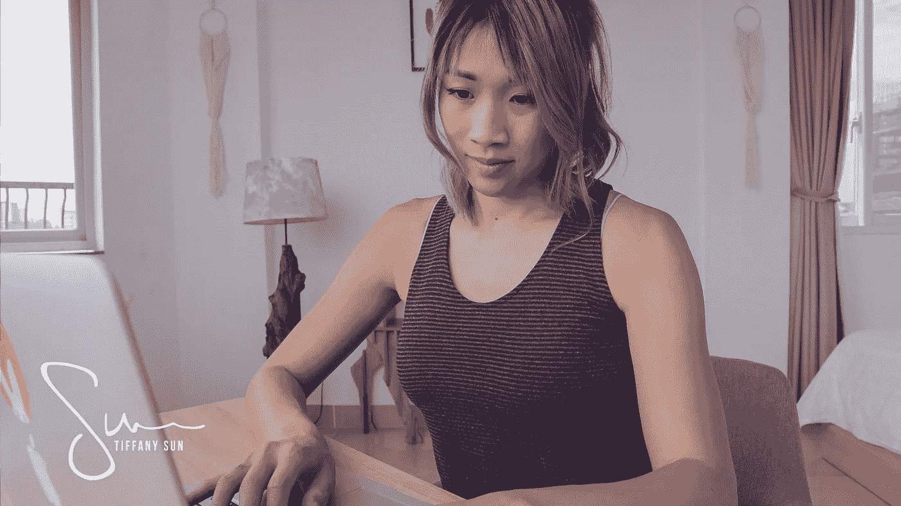

# 我如何控制自己的情绪，让它们不控制我

> 原文：<https://medium.com/swlh/how-i-control-my-emotions-so-they-dont-control-me-829838b2bb37>

每当我和我关心的人之间发生争执时，我往往会引起同样的反应:我会走开，然后“考虑一下”，直到我觉得准备好解决问题。

我知道——这是一个幼稚的举动，当问题发生时，我应该面对它，但我想也许，只是也许……如果我给自己足够的时间和空间，这些热血的情绪在我体内激荡……