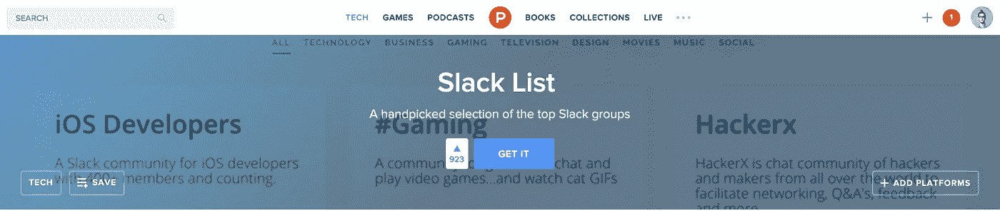
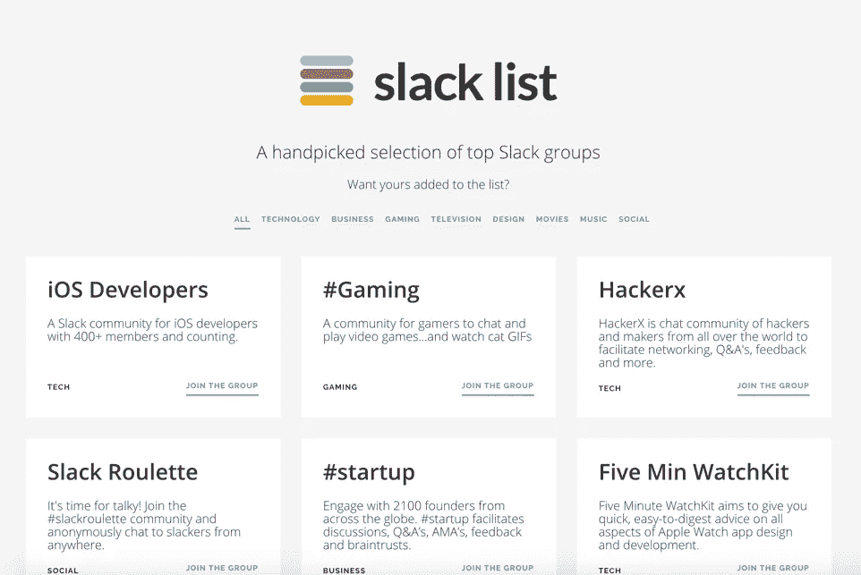
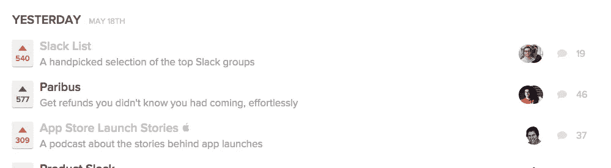
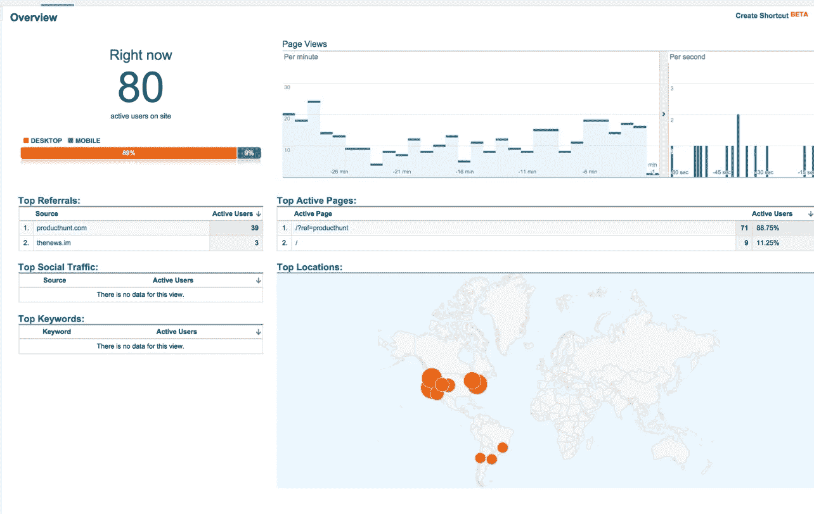
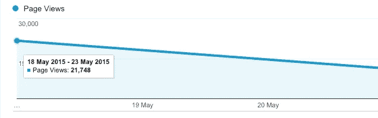
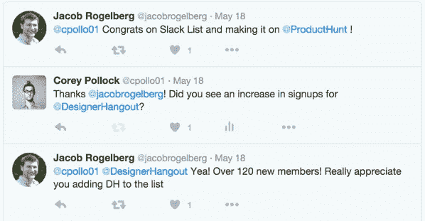
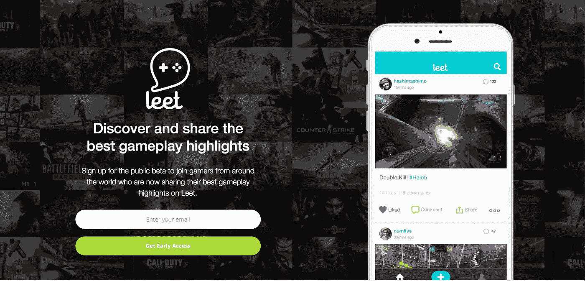
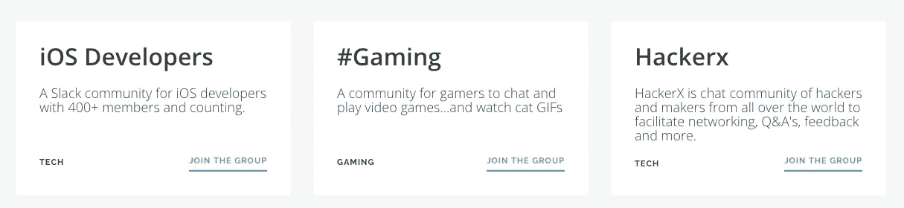
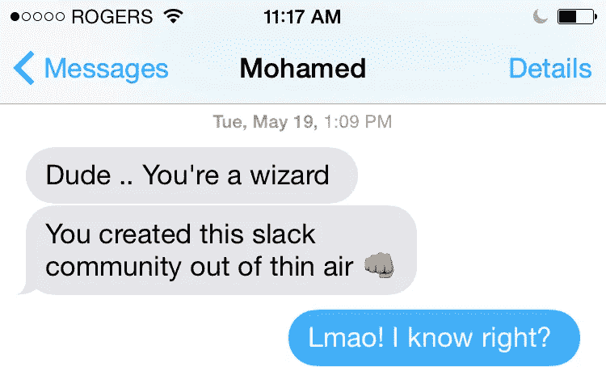
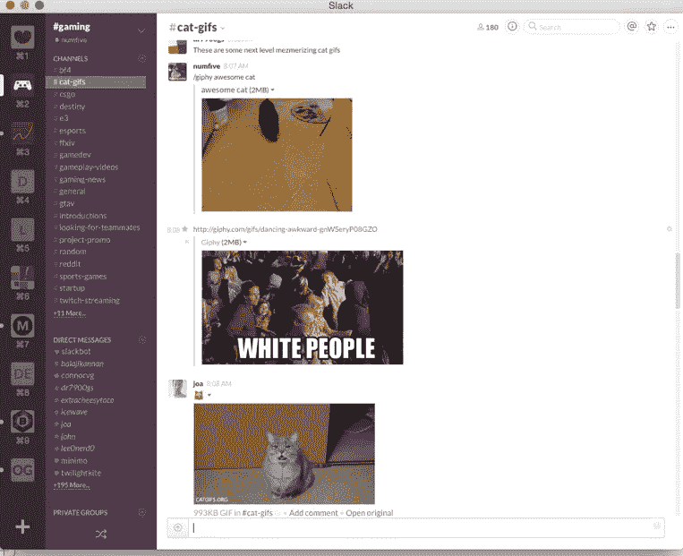

# 我如何在没有营销的情况下在 24 小时内创建了一个社区

> 原文：<https://medium.com/swlh/how-i-created-a-community-in-24hrs-with-no-marketing-14372892bf66>

我在两件事上遇到了问题:

1.  寻找有吸引力的 Slack 社区加入
2.  为我正在开发的应用寻找早期客户

我知道，这是两个完全不同领域的问题，但它们都通过一个解决方案得到了解决，该解决方案仅在 24 小时内就产生了超过 2 万的页面浏览量、280 名活跃的社区成员(没有营销)。

# 第 1 部分:SlackList.info

我不满足于现有的松散的社区资源。所以我决定自己做一个，名字叫做 [Slack List](http://www.slacklist.info) 。

The Slack List homepage

当网站准备发货时，我让一个朋友[在早上 6 点把它发布到产品搜索](https://www.producthunt.com/tech/slack-list)上。它很快占据了第一的位置，并且全天保持这一排名。首先，我们达到 100 俱乐部，然后是 200、300、400，最终在一天结束时达到 500+俱乐部。

SlackList taking the #1 spot on Product Hunt

网站的反响非常好。它通过 twitter 获得了大量支持，在[产品搜索](https://www.producthunt.com/tech/slack-list)上有许多令人敬畏的评论，网站的流量也相当可观。

Website traffic from Product Hunt

Total page views in the first week

该网站在任何时候都有大约 60-80 个用户。第一周的总浏览量就超过了 2 万次，到目前为止，总浏览量还在继续增长。它甚至被其他出版物采用，如 [CodeCondo](http://codecondo.com/slack-apps-products/) 和 [UpStarted](http://www.content-base.co/upstarted/new-tools-for-founders-hackers-hustlers-52315/) 。对于一个周末黑客项目来说还不算太差。

Twitter love!

推出这样的产品最大的好处是它是一个社区驱动的产品。我能够帮助许多这样的社区发展壮大。许多社区版主在推特上告诉我，他们有数百个新注册用户！

于是我的第一个问题就解决了。我不仅解决了自己寻找 Slack 社区的问题，还为很多人解决了这个问题。

现在谈谈我的第二个问题——为我正在开发的应用寻找早期客户……

# 第 2 部分:#游戏松弛社区

这里是真正的奇迹发生的地方。

我正在构建[**Leet**](http://bit.ly/1mDWLye)——一个让游戏玩家发现和分享最佳游戏亮点的应用(/plug)。我想创建一个游戏玩家社区，我可以利用它来为 Leet 获得早期反馈。

所以在提交 [SlackList.info](http://www.slacklist.info) 之前，我创建了一个名为 [#gaming](http://www.hashtaggaming.co) 的 SlackList 社区，整合了一个注册表单，并把它放在 SlackList 的顶部。

#gaming a the top of Slack List

天才？是的。邪恶？不要无礼。成功了吗？当然了。

像 SlackList 上列出的许多其他 Slack 社区一样，#gaming 的流量也很大。我的注册表单在第一天就有 170 多人注册。我只希望我已经设置了[休闲应用](https://github.com/rauchg/slackin)，因为我必须手动添加每个成员…

第二天早上，我批量邀请了所有用户，社区开始蜂拥而至。我的 Leet 联合创始人莫给我发了一条短信，正式介绍我进入互联网魔法名人堂。

没错，我们确实凭空创造了一个松散的社区。该社区持续增长，现在有超过 800+的游戏玩家！

实验是成功的。我们不仅创建了一个与我们的目标受众一致的社区，还创建了一个允许其他人分享和推广他们自己的项目、获得反馈并讨论他们所热衷的内容的社区。

当我们推出我们的私人测试版时，从#gaming group 中加入成员既快又容易，到目前为止我们收到的反馈非常好。

# 我学到了什么

## 寻找早期客户并不容易

寻找早期客户并不像在 Reddit 上发布一些东西并期待最好的结果那样容易(尽管有时也可能如此)。接近你的早期客户需要创造性的思考，甚至有点邪恶的天才。

## 社区管理很辛苦，但很值得

我从来没有意识到经营一个社区要花多少时间和精力。

作为一个版主，重要的是要不断地保持活跃，让人们在早期走出他们的外壳。在最初的几天里，你会找到你的社区传道者，这些人会帮助你的社区持续发展。

所以，在你开始这种旅程之前，确保你有足够的时间来培育你的社区。

## 不要卖

我确定不做的一件事是立刻卖掉我的应用程序。你需要了解你的社区，交朋友，分享猫的 gif，然后开始谈论产品。记住，这些人不仅仅是潜在的顾客，他们是朋友。我还创建了一个#创业频道，供人们推广自己的产品。

Our dedicated cat-gifs channel

有兴趣加入#游戏社区吗？报名[这里](http://hashtaggaming.herokuapp.com)。

如果你喜欢读这篇文章，可以考虑推荐这篇文章并关注我的**。也可以在* [*推特*](http://www.twitter.com/cpollo01) *上找我。**

****

***Leet 是游戏玩家发现和分享最佳游戏亮点的平台。***

*浏览主页中的精彩片段，或通过连接您的 YouTube 或 Xbox 帐户上传您自己的精彩片段，然后整理并分享您的最佳游戏体验。*

*Leet 是由游戏玩家为游戏玩家打造的。注册测试版以获得早期访问！*

**