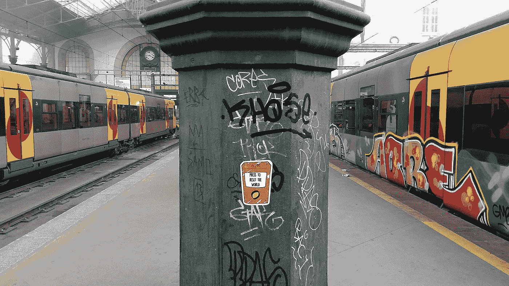
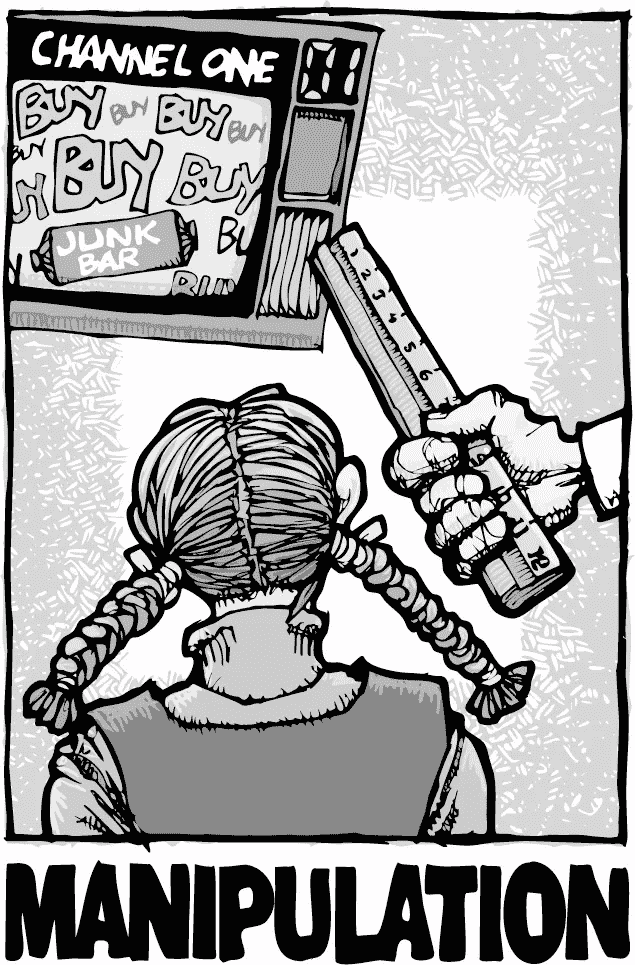
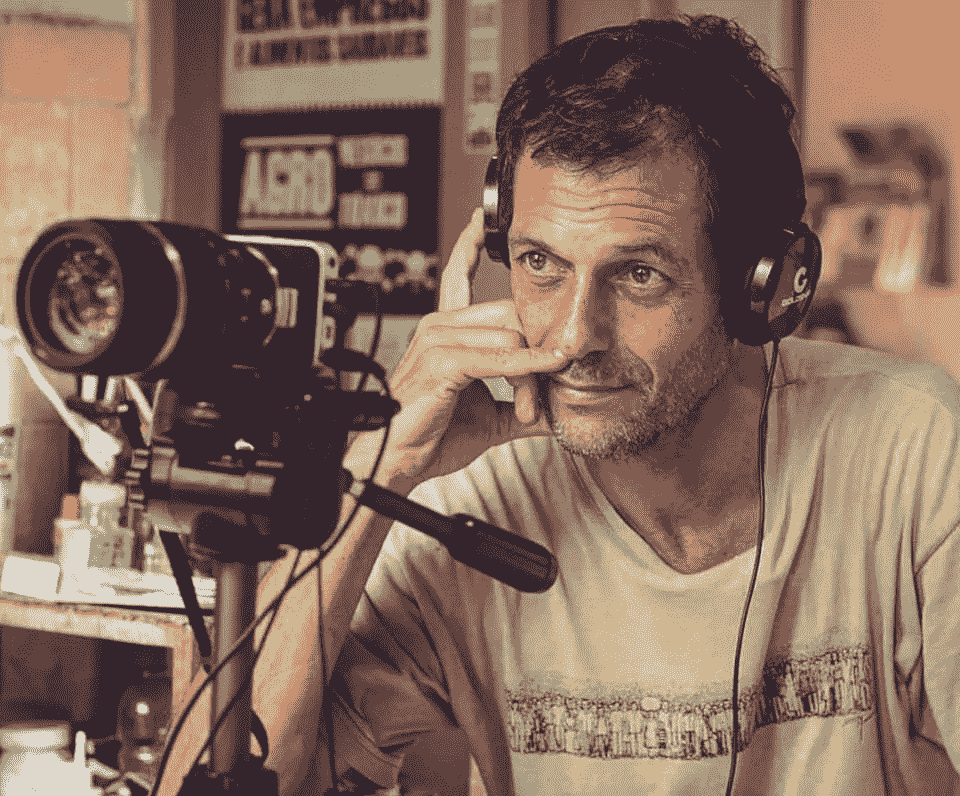
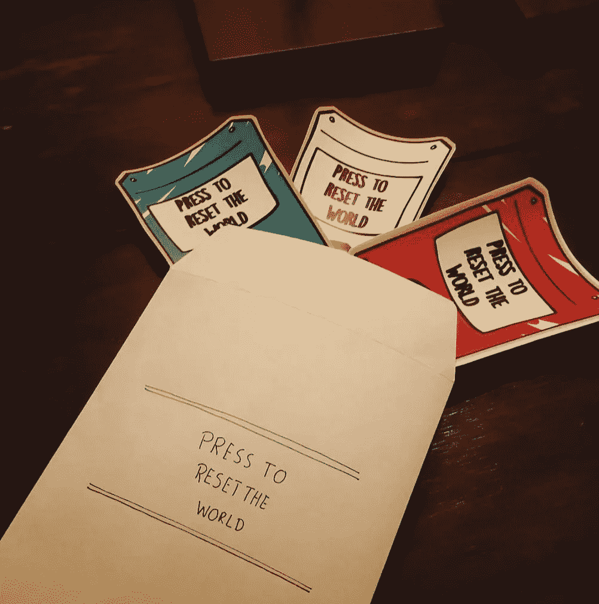
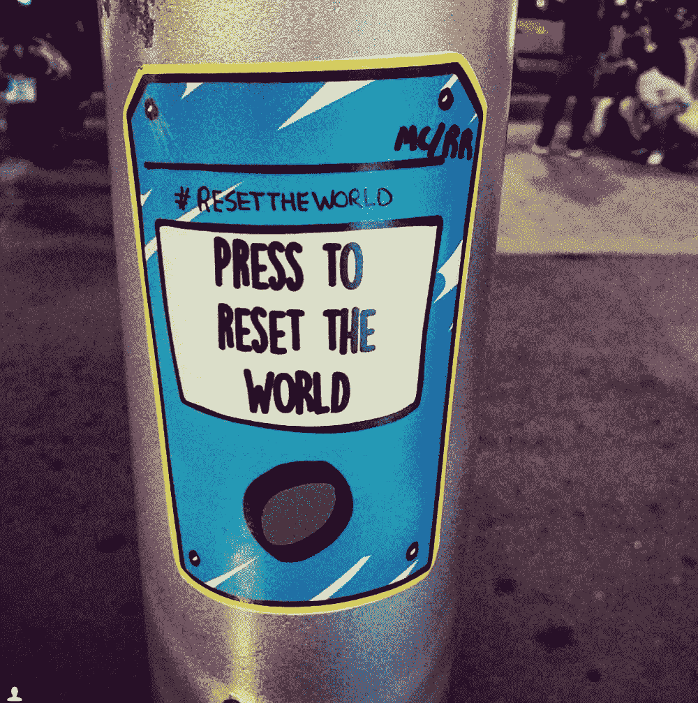

# 我是如何发现“重置世界”按钮的

> 原文：<https://medium.com/swlh/how-i-discovered-the-reset-the-world-button-c3df659fb73e>

One of my stickers sticked in Oporto, São Bento railway station

几年前，我突然意识到这个世界多么需要一个新的开始，这让我做了一件最简单最令人满意的事情(一些贴纸)，这只花了我 15 分钟。

在与一位密友的一次谈话中，我意识到大多数人认为大众媒体是某种信息之神。如果是这样的话，他们只能有两种心态:事事担心或者一件事都不担心。

不幸的是，我们都被误导，相信我们听到的一切。新闻被称为“新闻”是有原因的，对吗？应该编辑事实对吗？是的，但是他们没有，即使他们编辑事实，他们也在传播信息的方式上搞砸了，以引起恐惧和猜测。请用接下来的 30 分钟看[《欺骗的艺术》](https://www.youtube.com/watch?v=NAmGnyj0u7E)。

他们还向我们展示伪装成广告的魔术，以唤醒我们的消费意识。

这使我们陷入…

> **我们用我们没有的钱买我们不需要的东西，来打动我们不喜欢的人。——**搏击俱乐部

# 我们需要非常小心我们从大众媒体中消费的东西

毫无疑问，我们生活在一个所有问题都是真实的、由人类引发的世界里，比如极端贫困、恐怖主义、战争犯罪、教育水平低下、错误的家庭价值观、社交成瘾问题、自然资源滥用、全球变暖、核战争、消费主义理想、猥亵广告等。

我们都被引导去相信这个世界，如果它真的存在的话，这可能是对的。当我们面对这种**“虽然没有出路”**时，我们可以**害怕和沉默**或者我们可以**接受它并采取行动**。

我并不是建议你离开你的工作，创建**some-bulls * * t-on-how-to-save-the-world . com 博客**和成为反对大众媒体、资本主义和整个社会的积极分子。

我说的是接受我们看到的现实:无家可归的人要食物或钱，饥饿的孩子，被用作性奴隶的孩子，因缺乏心理健康支持而自杀的抑郁母亲，极端贫困，新闻和广告中的大众媒体控制，被遗弃和孤独死去的老人，等等。不躲反躲，**接受**和**演戏**我们真的**按下了‘重置世界’按钮**。

# **按下“重置世界”按钮意味着我们没有躲避我们的目光**

在一个被仇恨、金钱、贪婪和自私统治的世界里，我们不可能都成为慈善家，但我们可以成为善良和爱的企业家。

我一直是那种试图找出生活中所有事情的意义的人，我真的相信我们可以通过一天一次重新设定一种行为或观点来一天一次地重新设定世界。

[Eduardo Marinho](http://observareabsorver.blogspot.pt/)

偶尔，我会发现一些像[爱德华多·马里尼奥](http://observareabsorver.blogspot.pt/)或[大卫·斯坦德尔-拉斯特](https://www.ted.com/speakers/br_david_steindl_rast)这样的人物，他们以各自的方式代表着我们希望看到的世界变化。当我发现它们时，我真的被迷住了。

爱德华多出生在舒适的巴西中产阶级。他在银行工作，并加入了军事学校，但社会辜负了他，他放弃了一切，一切！，从他的生活中去寻找一种意义，不去关心社会的教条。

我认为我们不应该跟随他的脚步，但是我们可以从中学习。我们都可以从他的生活经历中吸取经验。

> **“反映，反映，反映。只是反思是学者的工作。你需要走出去尝试你的理论”。爱德华多·马里尼奥**

大多数时候，我试图表达我对我们社会的看法，但我的大多数朋友都不理解，或者说，如果我想成为一个不合群的人，这是一种选择，我只是没有自己的想法。尤其是你的密友。

# 人们不想听到他们不理解的东西或动摇他们现状的东西。

Our stickers, in the right @ B[arcelona captured by some random viewer](https://www.instagram.com/p/-j8xzMsyip/?tagged=presstoresettheworld)

我有一点失望，因为我和我认识的人谈论这件事的机会有限，甚至是亲密的朋友，我的意思是，特别是和朋友。

这就是为什么我加入了我的一个朋友做了一些贴纸并开始到处贴。

观众可以选择**按下按钮**，这是我挑战他们对我们生活的世界的想法的一个小举动。

**好了，就这些了，希望你们喜欢，如果喜欢，请在评论或掌声中留下你们的反馈。**

## 这个故事发表在 [The Startup](https://medium.com/swlh) 上，这是 Medium 最大的企业家出版物，拥有 282，454+人。

## 在这里订阅接收[我们的头条新闻](http://growthsupply.com/the-startup-newsletter/)。

