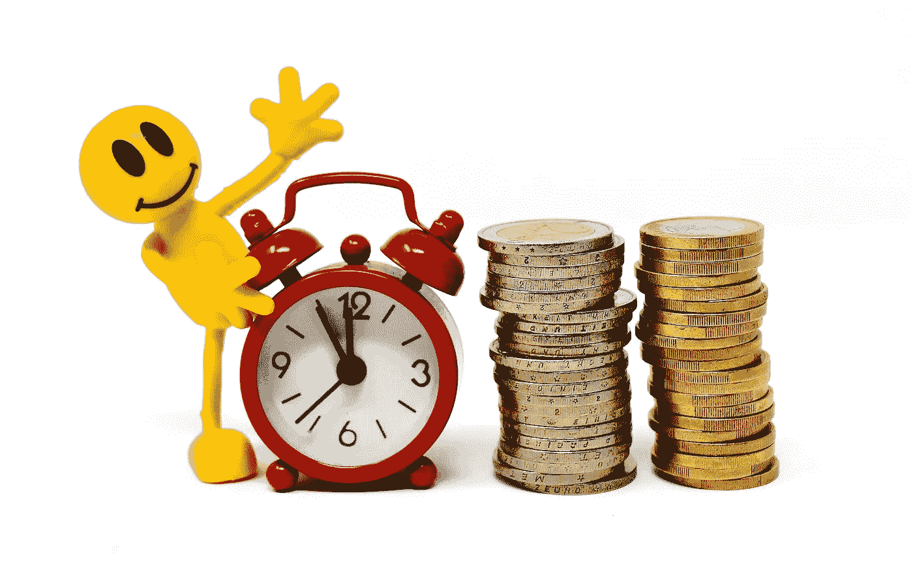
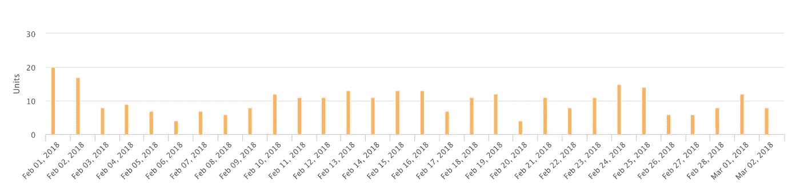
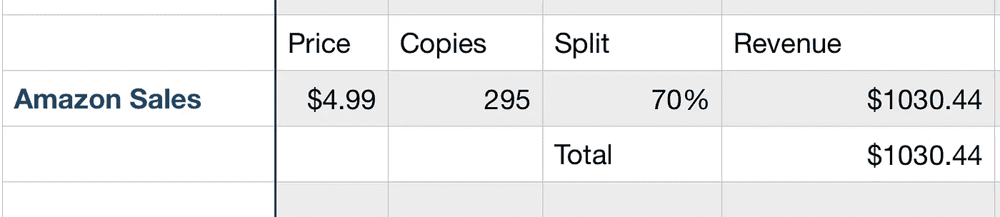
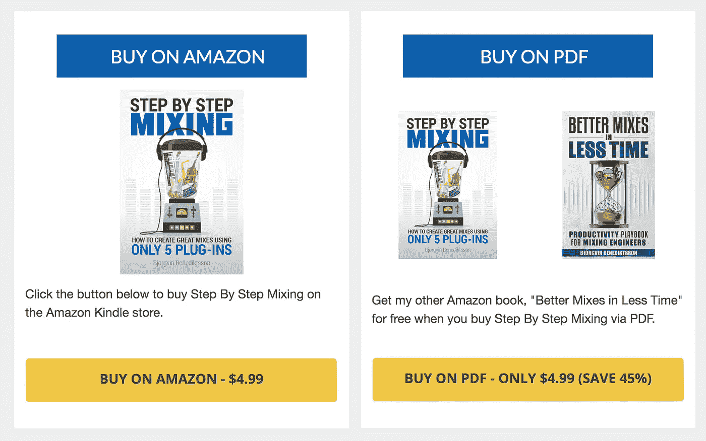
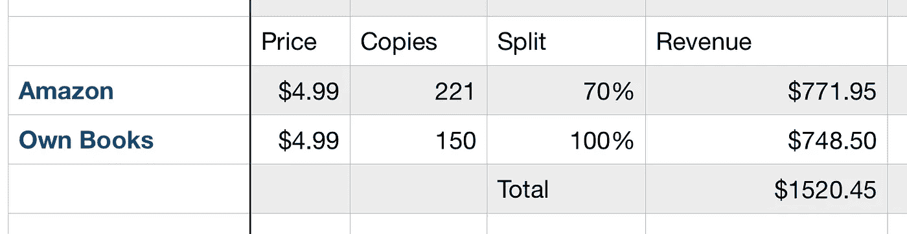
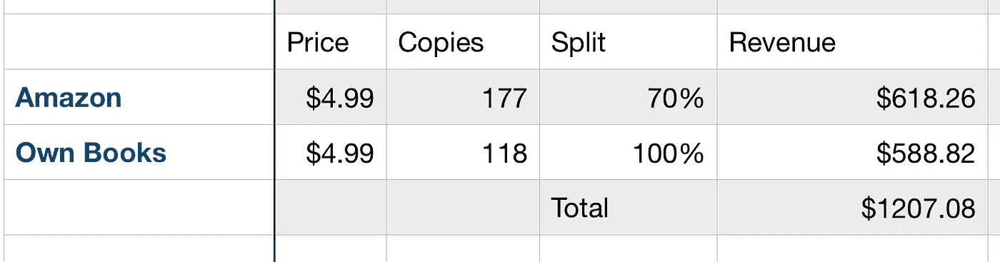
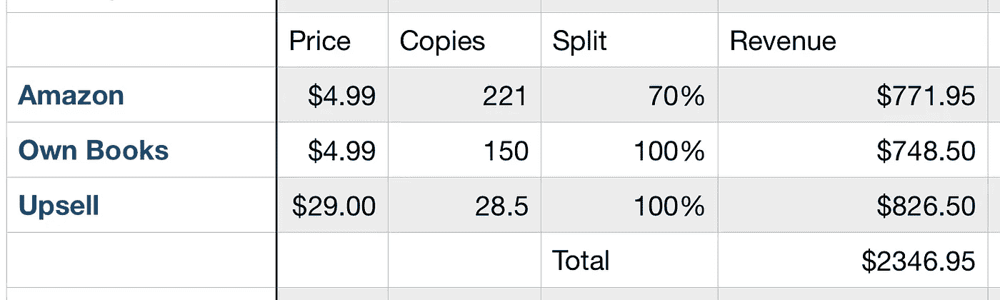

# 我是如何通过与亚马逊分手使收入翻倍的

> 原文：<https://medium.com/swlh/how-i-doubled-my-revenue-by-breaking-up-with-amazon-bd2718b405ae>

## 如何使用追加销售和选项使您的销售额翻倍

每个创意企业家的生活中都有一张无形的桌子。你看不到这一点，但一旦你宣布自己是一名企业家，你就获得了一个席位。

这与其说是荣誉，不如说是诅咒。然而，你会认为这是一种荣誉，你会用你的余生来实现它。

这张桌子最糟糕的地方是上面放着一笔你不知道的数目不明的钱。

你被告知桌上有很多钱，你最好不要把它们留在那里。

上面不只有钱。这些财富吞没了桌子。宝藏散落在上面。百元大钞像常春藤一样缠绕在腿上。在我看来，这张桌子像资本主义版的《杰克和豆茎》一样高耸入云。

你不知道你在桌子上留下了多少钱，但你对创业了解得越多，桌子就变得越大，更多假设的钱就在那里，等着你去想办法把它变戏法一样变成现实世界。

我在过去的几个月里想出了一个从桌子上获得更多钱的方法，我想和你分享一下。**我将分享我是如何从一本电子书每月赚 1000 美元，到同一本电子书每月赚 2300 美元，只做了一些简单的调整。**

# 初始销售额——约 1000 美元

我卖一本电子书叫做[一步一步混合:如何只用 5 个插件创造伟大的混合。很可能你对这个话题不感兴趣，这没关系。这是一个非常小众的主题，而我恰好喜欢成为这个小众领域的影响者和教育者。我喜欢帮助家庭录音室音乐家改善他们的音频工程和音乐制作。我的读者支持我的方式之一就是买我的书。](http://www.audio-issues.com/stepbystepmixingkdp)

我最初通过亚马逊独家销售这本电子书作为 Kindle 电子书。这本书一出版就登上了亚马逊畅销书排行榜的第一名，并且从那以后差不多一直保持在这个位置上。我在一篇不同媒体的文章中写了我推出畅销书的经历，你可以[在你的浏览器上打开另一个标签。](http://I originally sold this eBook exclusively through Amazon as a Kindle eBook.)

但是我跑题了…

从 2 月 1 日到 3 月 2 日，我卖了 295 本，每本 4.99 美元。这大约是 1472 美元的收入，但因为亚马逊收取 30%的提成，我只赚了 1030.44 美元的版税。

人们不断要求 PDF 版本，如果他们把亚马逊的收据用电子邮件发给我，我通常会免费给他们一份 PDF。

然而，这让我怀疑我是不是把钱留在桌子上了。所以我做了一个实验。

如果人们想要 PDF，我想我会让他们选择购买该选项，我甚至还附赠了一本电子书作为额外的奖励。

我没有通过我的营销材料直接链接到亚马逊销售页面，而是在 www.StepByStepMixing.com 创建了一个销售页面。在销售页面的最后，你有两个选择:在 Kindle 上购买图书，或者通过我自己的购物车购买 PDF 格式的图书，并获得免费电子书作为奖励。

我不介意免费赠送第二本电子书，因为对我来说，获得客户信息以创造长期客户比多赚 3.99 美元(第二本电子书的价格)重要得多。

# 实验的初步结果——增加了销售额和收入

在过去的 30 天里，亚马逊销售和 PDF 销售的比例大约是 60/40，销售已经上升到每月 371 份。

30 天的随机样本空间可能在科学上不准确，但足以做出一些假设。

其中之一是，如果你给人们两个购买选择，他们更有可能选择其中之一，而不是什么都不做。

如果要在 a)购买和 b)离开之间做出选择，那么很多人会离开。

但是如果你让他们在 A)购买 A 版，B)购买 B 版，C)离开之间选择，更多的人会选择购买。

因此，通过提供选项 A 和选项 B，我的收入增加了 500 美元。还不错。

我们不要忘记，这是 150 个额外的顾客，他们选择成为我的**顾客，而不是亚马逊的顾客。**从长远来看，这更有价值，因为你可以与他们建立长期的客户关系。如果他们从亚马逊购物，我就无法获得他们的任何客户信息。

假设分成 60/40，如果销量保持在 295 本/月，收入仍然会增加。仅仅从通过我的购物车销售的副本中保留 100%的收入，我仍然可以额外获得 200 美元，更不用说进一步与客户互动的机会了。

# 现在，为了促销

通过我的购物车销售还有一个额外的优势。这让我可以在他们结账时以更高的价格向他们提供第二种产品。不是每个人都会接受我的提议，但在过去的 30 天里，我的老顾客中有 19%接受了。

如果 150 名顾客中有 19%的人同意额外购买 29 美元的视频课程，那么就有大约 29 份额外订单，每份 29 美元。这比我最初在亚马逊上独家销售书籍的收入增加了一倍多。

# 当前销售额为 2，346 美元，收入增长了 220%

看到这样的数字，一个成熟的企业家可能会哭出来。去年我在桌上放了一大笔钱。**我只能想象桌子上的人是如何窃笑我这么晚才意识到这一点的不幸。**

但是，我是那种已经点了下一轮的半杯啤酒的人。不是借酒浇愁，而是庆祝学到的教训。

问题是，你坐在桌边的时间越长，学到的东西就越多。如果你认为你最大的成就还在前面，那么这是达到下一个水平的必要的学习经历。

# 只有一块拼图

当然，这本书只是我众多收入来源之一。我在这里谈论你如何需要[使你的收入来源多样化](/swlh/10-mistakes-to-avoid-when-improving-your-online-business-3036c7ef33c9)，我在这里向你展示 [10 个简单的方法来立即将你的在线业务货币化。](https://entrepreneurs.maqtoob.com/10-easy-ways-to-immediately-profit-from-your-online-business-2973725ae9a0)

如果没有一群人购买我的产品，我就不可能进行这样的实验。追加销售和分层定价只是长期战略中的一种策略。

我的图书销售只是一套系统中的一个环节，这套系统旨在帮助我更有效地经营我的在线业务。如果我没有网络流量，文案技巧和电子邮件营销系统，我就不会有销售。

如果你想缩短学习时间，找个更好的位子，我很乐意帮忙。如果你在写作、创造性创业和在线战略方面遇到困难，请随时联系我。

## 这篇文章发表在 [The Startup](https://medium.com/swlh) 上，这是 Medium 最大的创业刊物，有 319，283+人关注。

## 在这里订阅接收[我们的头条新闻](http://growthsupply.com/the-startup-newsletter/)。

