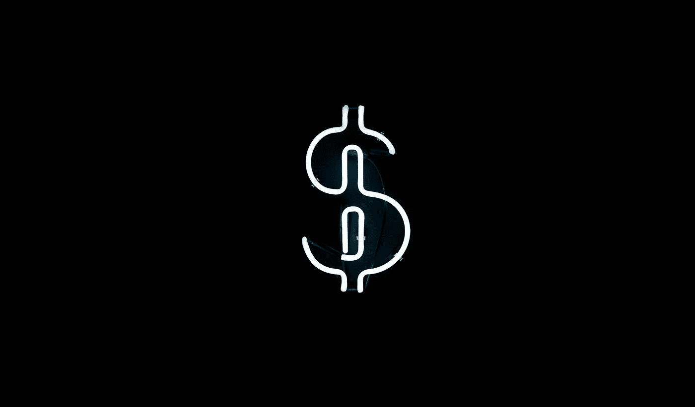
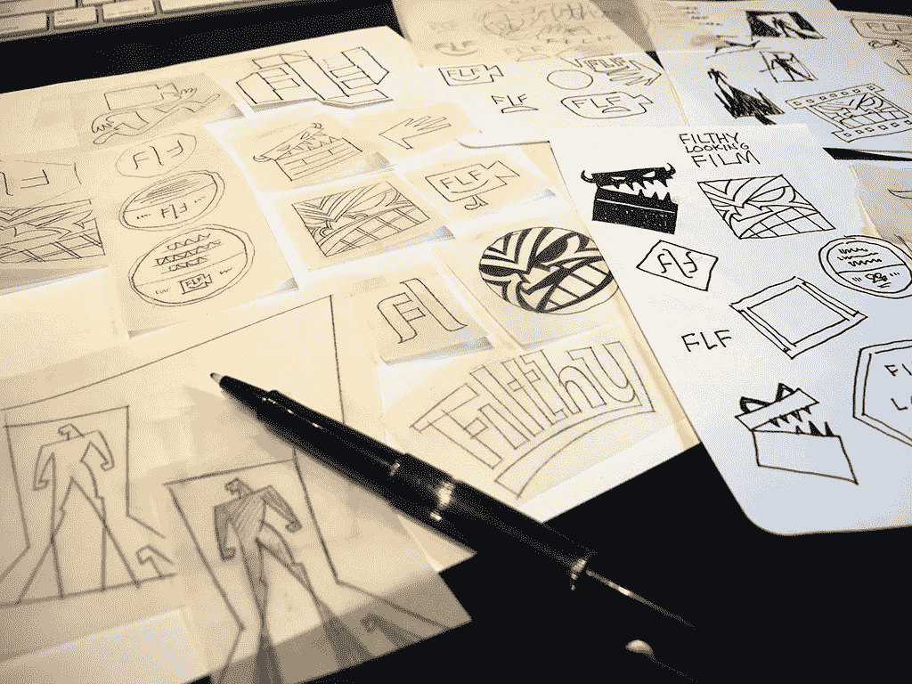
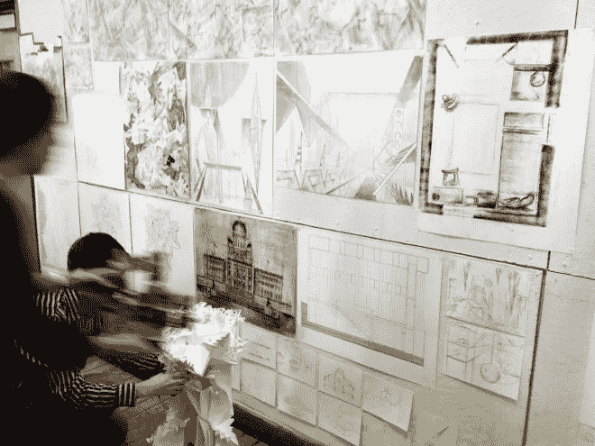

# 作为一名设计师，我是如何获得我的第一个 30€奖的？我从中学到了什么！

> 原文：<https://medium.com/swlh/how-i-earned-my-first-30-as-a-designer-and-what-i-learned-from-that-a67ea412c738>

Source : unsplash.com

就像其他初学者一样，从我的设计中获得报酬并不是一件容易的事情。我的第一笔钱之旅，始于我建筑课程的第三学期。

在帮助我的学长一个学期后，在我校园的几个平面设计项目中，我得以成为学院年度文化节的首席设计师。就在那时，我对平面设计的热情达到了顶峰。我开始追随许多著名的设计师，总是想知道‘他们怎么能为一个标志赚 500 美元？’

所以，我决定试一试。我加入了一个自由职业网站(互联网上到处都是)，就像其他普通设计师一样(注册了一个免费账户)。欢迎我的是一面戏弄的旗帜。

> “恭喜你，你成功注册了。准备好踏上这段激动人心的旅程吧。”

从没想过，会那么刺激！

首先，我每周为不同类型的项目出价 8 次，每周 2-3 次参赛。这么早就不成功了，我早有准备。但这种零转换率持续了两年之久，最终结束了我对在线自由职业的兴趣。但是这两年，在成千上万次不成功的尝试中，我学到了一些重要的东西:

Source : unsplash.com

## 耐心

设计上的成功是长期的衍生，特别是'金钱上的成功'在这个阶段，我有过沮丧、沮丧和自我怀疑的时候。但正是我墙上的这句话激励了我。

> 忍耐是痛苦的，但它的果实是甜蜜的。——**让-雅克·卢梭**

Source : unsplash.com

## 作品集——你思想的窗口

***一个设计师是以其作品集来评判的，正如一个绅士是以其西装来评判的。*** 所以你需要用最好的方式来呈现。后来我意识到，我甚至没有把一个设计放在个人资料上，我当时没有一个好的设计。但两年后，我有了大量不成功的设计，但很少有好的设计。所以，我们甚至从失败中学习。

Source : learnlogodesign.com

## 态度——我是一名优秀的设计师

在整个过程中，我尽最大努力保持镇定，相信‘我是一名优秀的设计师’。我总是寻找更好的灵感，尝试学习更多的知识和提高技能，只为感受一次金钱成功的滋味。

Source : architecture.risd.edu

## 不要在人群中迷路

在线自由职业平台最大的缺点是，很多好的设计在人群中迷失了。许多顾客在这里寻找便宜的赠品，纯粹根据外观(他们喜欢的东西)选择获胜者，而忽略了功能和适应性等重要因素。

然后转折点来了，当我决定放弃网上自由职业时，我的邮箱弹出了这样一封邮件:

> 恭喜你！你的参赛作品被选为竞赛的获胜者。

我的一个汽车包装设计赢得了 30€奖，即使是我也是半心半意地完成的。

毕业后不久，我放弃了网上自由职业，去找了一份全职工作，在那里我可以和更有 ***热情、更有创造力、更专注于好设计*** 的客户打交道。但是现在我有了成千上万次失败的经验，它帮助我学会了如何不去接近成功或金钱。

如果你是一个正在创意领域奋斗的人，在你职业生涯的早期，我希望我的故事能帮助你朝着正确的方向前进。

> 永远不要为金钱而奔跑，让金钱跟随你的奉献和激情。

## 我欢迎你在下面的回复中提出你的想法、故事和评论。点击“小心脏”，让这个故事帮助更多人):