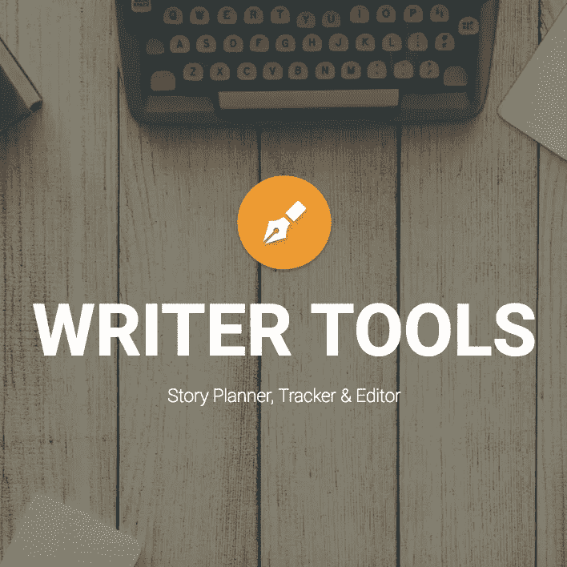
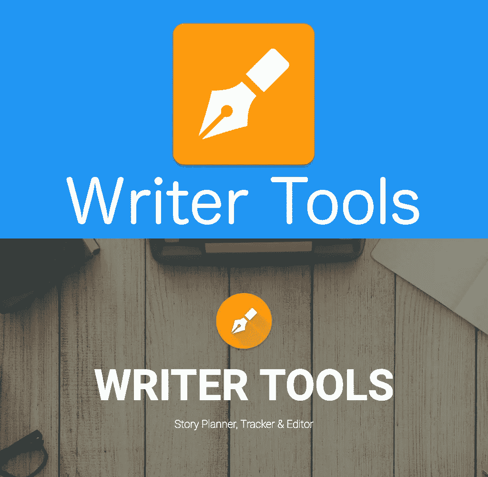

# 我如何在 100 天内以 0 美元的预算获得 15000+的应用下载

> 原文：<https://medium.com/swlh/how-i-got-15-000-app-downloads-with-0-budget-in-100-days-20e3403bc106>

大约半年前，我在谷歌 Play 商店发布了 1.0 版本的' [*作家工具*](https://play.google.com/store/apps/details?id=net.ajp_games.writertools) '。如今，43 个版本之后，我们已经到了版本 2.1.6。Writer Tools 的发布不是我的第一个应用程序发布，但我仍然有点紧张。这将是我的大事！(我希望如此，相对来说，目前对我来说是这样)这是一个项目，不仅仅是某种复制计算器，或者只是一些其他随机的 Android 应用程序，你可以在尝试后安装和删除。我的目标是开发一个稳定、体面的应用程序，让人们开始在日常生活中使用。很明显，我是通过多年的 Android 开发实践和看大量蹩脚的 YouTube 教程来开发这个应用程序的。

在发行的第一天之后，我有一个惊人的下载率！总下载量:1，而且是来自我自己的手机。但这并没有阻止我。我继续开发我可以使用的特性，因为最终我开发这个应用程序是为了个人使用。毕竟，这是开发高标准应用程序的最好动机。

我的应用程序开始产生越来越多的下载。数字开始指数级增长:2 个新用户，4 个新用户，8 个新用户。目前，我每天有将近 600 个新的下载。老实说，我对此很自豪。

好了，介绍够了。让我们看看我是如何做到的，你又是如何做到的。这是我的个人故事，它描述了我认为使我达到 15.000+下载量的因素。

# 1.外观和感觉

Upper: old; Below: new

## -看起来像个专业人士

你的应用图标是人们在寻找像你的应用一样的东西时遇到的第一个，也许是唯一的东西。将他们的目光引向你的图标，使用吸引人的颜色，努力做到独一无二，脱颖而出。在设计你的应用程序图标时，跳出框框思考。

努力使你的谷歌 Play 商店上市尽可能吸引人。([链接](https://developer.android.com/distribute/best-practices/launch/store-listing.html))你要确保你的横幅有一个漂亮的风格，等等。例如:在左侧，您可以看到我在过去半年中拥有的两个横幅。我认为很清楚哪一个更好，为什么。

归根结底是信任。你不会仅仅相信一个看起来像是几个小时制作出来的随机应用程序来存储你的故事信息

## -添加字符

我计划写一篇完整的文章，讲述如何在你的应用程序中添加某种角色来增加用户参与度，但这里简单介绍一下我是如何做到这一点的。

在整个申请过程中，我使用了非正式的语言和一些小笑话。但是要小心，不要把事情闹大了。我的应用程序中的一个例子:如果用户想要删除应用程序中的一个位置，会出现一个确认弹出窗口。

> 您确定要永久删除此位置吗？—不—是的，炸了它。

这同样适用于删除字符。

> 您确定要永久删除此角色吗？—不—是的，杀了它。

人们会注意到这些小细节，我相信他们会喜欢。另一个小复活节彩蛋的例子是当你在冬天摇动我的应用程序时产生的雪花效果。想自己看看雪的效果吗？[下载](https://play.google.com/store/apps/details?id=net.ajp_games.writertools)我的应用，晃动主屏幕。

> 我喜欢这个应用程序！这正是我写故事所需要的！有改进的空间，但总的来说，它提供了。每次我摇手机，雪都会让我咯咯地笑，赶走作家的灵感。成为职业选手值得花钱。不能等待下一次更新的众多好东西！——[T3【沙拉】路易斯·利瓦格 ](https://play.google.com/store/apps/details?id=net.ajp_games.writertools&reviewId=Z3A6QU9xcFRPRnJqSk1sNmFCWmVVWklHcGpLMEctMS1hQ29MUWxFWVRyVFBGVmlwXzRCSFB3dnV3MFhHeHFhaUNwby1ETjRBOEdPRWxvY1pJTXktVUdiNEE)

> 我喜欢！更新:下雪了！这个应用是迄今为止我用过的最好的写作工具应用。我甚至不需要在这里写章节来需要它。我永远不会删除它。我没有进步！— [*塔玛拉·冯·比登菲尔德*](https://play.google.com/store/apps/details?id=net.ajp_games.writertools&reviewId=Z3A6QU9xcFRPRS14ZWtGbjR4Z21KQ29QeldSRDlMSGNkV1RWOWJrS2hSMEx6OVBSb0hPNEZrMkFXV2dVSkoyODJVOUU4WWZ0Q1N6WUpmMGowZ29UTFg0UlE)

## -独一无二、出类拔萃

为了引起注意，你需要从拥挤的应用市场中脱颖而出。这可以通过设计或独特的功能来实现。

我的应用程序在其单独的模块中并不是唯一的。还有很多其他应用程序可以帮助作家规划他们的小说。但是没有一个具备我所需要的所有特征。我浏览了数百篇关于这些应用的评论，并列出它们没有的东西。重新订购、备份等。在开发过程中，这些特性对我来说是最重要的。我非常努力地让其中一些正常工作。但它得到了回报，我的应用程序现在脱颖而出，提供了独特的和已知的功能。

几乎所有有竞争力的应用程序都是在新的“扁平”设计趋势之前发布的，它们都是大胆而丑陋的。这是我的应用程序如此迅速地被如此多的用户注意和使用的另一个原因。全新的外观，直观的设计。

# 2.本地化

我的申请目前有 7 种语言版本:英语、德语、俄语、荷兰语、波兰语、葡萄牙语和法语。我已经从联系我的用户那里众包了我的翻译。这很有效，用户发邮件给我，问他们是否能把我的申请翻译成他们的语言。你的应用程序支持的语言越多，就有越多的用户会把你的应用程序作为一个建议。

但是请注意，“我的”译者这样做只是因为这是一个双赢的局面。当你用你的母语写一本书，而你需要填写的所有表格都是用另一种语言写的，这非常令人困惑，而且工作起来也不舒服。

小提示:你支持的语言越多，你收集所有翻译的时间就越长。它减慢了开发过程。

# 3.服务

## -顾客至上

倾听用户的愿望和建议。我的一些用户要求在我的应用程序中写他们的小说，2 周后我发布了一个新版本的 Google Play，带有所要求的功能。这同样适用于其他功能、一些新设置等。大多数都是在提出要求的当天推出的。试着和你的用户一起思考，但不要满足于此。仔细考虑每一个请求，如果有人请求这种功能，他还需要什么？为什么他首先需要？像他这样的人还需要什么？你只能通过倾听他们并满足他们当前和未来的需求来建立一个社区。

与用户交流时的小技巧:不要脱离你的参考框架，而是成为社区的声音。以社区的名义感谢他们，以你的社区的名义发言。听起来很感激，他们愿意花时间给你反馈。我的一些超级用户花了 2 个多小时把我的应用程序翻译成他们的母语。大概不是为了我，也不是为了他们自己，而是为了社区。

不要让一些有理有据的批评让你失去兴趣和信心。坚持下去，让它激励你。如果他们只是删除了你的应用程序，你将永远无法改善它。当他们只给你一星的评价时，他们可能只是过了一个坏脾气的日子。

## -经常更新

正如我上面已经提到的，当用户请求一个特性时，我会尽量在几天内发布所请求的特性。但我的过程不止于此。我试着和用户一起思考，像他/她这样的人还需要什么？

频繁更新我的应用程序增加了我在 Google Play 搜索页面上的排名(或者至少感觉是这样)。可能是因为正在开发的应用程序比两年内没有更新的应用程序更受欢迎，也更相关。谷歌知道这一点，并据此对它们进行排名。

当用户注意到你的应用程序仍在开发中时，他们倾向于停留更长时间。当用户参与到你的应用中时，他们更有可能分享你关于如何改进你的应用的反馈。

# 4.可发现性

## -你的顾客在哪里

在我发布我的应用程序之前，我已经是一些作家团体的一员，但是在发布之后，我加入了其中的许多团体。作为一个业余爱好者，我立即在所有这些群里发布了同样的信息。它看起来像这样:

> 嗨！下载这个很棒的应用程序！[链接]

几个小时内，我所有的帖子都被删除了，因为它们被归类为垃圾邮件。尽管我的本意是好的，但人们就是不喜欢这些侵扰性的信息。结果:当天有 0 个新下载。

如今，我工作起来更加低调。当我需要了解“专业”作家如何完成作品的更多细节时，我会问一个类似这样的问题:

> 你们是如何处理角色发展的？你如何计划并记录下来？

在大多数这样的小组中，也有一些推广职位，你可以在那里放下你的工作。这是我把一个链接放到我的申请上的机会。人们在所有这些问题之后认出了我的个人资料图片，他们的好奇心被逗乐了:再下载 1 个。

永远留心顾客。这在应用业务中听起来可能很奇怪，但我已经通过社交媒体和几个未来的客户聊过了。这并不像看起来那么难，有些人甚至会购买，因为一旦他们见到了开发者，他们就会对应用程序更感兴趣。

当然，不要强求什么，顺其自然就好。

## -关键词，描述

没有人知道谷歌或苹果的算法是如何在搜索页面上排列应用程序的。但是很明显，你的应用程序的标题和描述起着很大的作用。明智地使用它们。我的应用程序的标题非常具有描述性和具体性:

> 作家工具-故事策划，编辑和跟踪

# 谢谢！

当然会有人抱怨说我只是运气好，但我相信上面提到的几点帮助我的应用从零增长到 15000 用户。

关于“ [*作家工具*](https://play.google.com/store/apps/details?id=net.ajp_games.writertools) ”达到 15.000 次下载的快速统计:

*   15000+次下载，
*   4.3 120 个用户中的评级，
*   150 多名用户升级到了专业版，
*   7 种语言:英语、荷兰语、德语、法语、俄语、波兰语和葡萄牙语。
*   9.500+线上注册项目(有些人更喜欢把自己的项目保持线下)，
*   在 129 个国家下载。

## 这篇文章发表在[《创业](https://medium.com/swlh)》上，这是 Medium 最大的创业刊物，有 275，057+人关注。

## 在这里订阅接收[我们的头条新闻](http://growthsupply.com/the-startup-newsletter/)。

