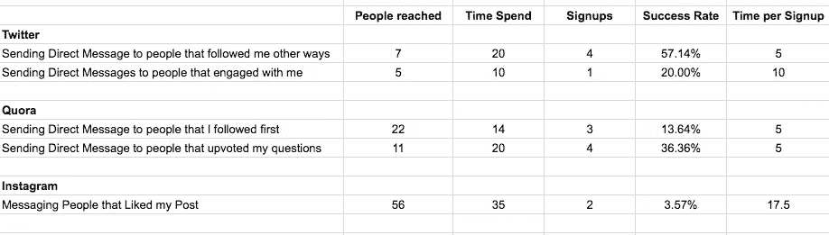

# 作为一名新企业家，我是如何有机地增加我的电子邮件列表的

> 原文：<https://medium.com/swlh/how-i-grew-my-e-mail-list-to-600-subscribers-without-spending-a-cent-e8db71424ee>

Photo by [rawpixel](https://unsplash.com/photos/wcj-zWL_WXM?utm_source=unsplash&utm_medium=referral&utm_content=creditCopyText) on [Unsplash](https://unsplash.com/search/photos/email?utm_source=unsplash&utm_medium=referral&utm_content=creditCopyText)

许多营销人员认为电子邮件营销是在线营销的圣杯。

在偶然看到布莱恩·哈里斯的网站上的标语:“**想在网上随便找个人向你买东西？”**

我很少遇到这样一个准确描述我真实愿望的问题。这正是*我想要的！几周前，我刚刚辞掉工作，开了自己的公司，正在为我在 T4 网站上销售的信息产品制定营销策略。*

根据布莱恩·哈里斯的说法，在网上向随机的人出售你的东西的关键是建立一个电子邮件列表。不出所料，这样做的第一步是注册他的网上研讨会，以换取我的电子邮件地址。 ***非常厚颜*** 。但很明显，他对如何让人们注册你的电子邮件列表略知一二，所以我注册了免费的网上研讨会。

在网上研讨会中，我了解到电子邮件确实是营销的圣杯。

> 这是几乎每个人都有的唯一频道。完全免费。而且，你拥有频道——这意味着:没有任何算法变化会影响人们观看你的内容。而且比社交媒体上的噪音少得多。一句话:人们通过电子邮件购物，而不是通过社交媒体。

**我被卖了。我需要一份名单！**

但我可以委婉地提醒你:我刚开始创业时，钱几乎不够养活自己(实际上，我已经搬回家和父母一起生活了几个月)，所以我负担不起布莱恩昂贵的在线课程，更不用说他建议的付费营销方法了。

我不得不亲自动手！

> 4 个月后，我的名单上有了 600 多名订户。却没有为它们付出一分钱。

每月 150 次注册可能看起来不是一个疯狂的数字，但相信我，对于一个刚刚起步、什么都自己做、什么都不花的人来说，这是一个疯狂的数字。

所以，如果你还在这里，想知道我是怎么做到的，我告诉你:

# 1.我选择了一个特定的利基，并保持一致

当你刚刚起步的时候，创造各种各样的内容和产品是非常诱人的。越多越好，对吗？

不对！非常不对。

通过退订潮，我不得不艰难地认识到，一开始，没有什么比专注和一致性更重要。

> 人们注册你的名单是因为他们对你关于某个特定话题的观点感兴趣——你敢说别的吗！

一旦你建立了自己的品牌和忠实的追随者，你就可以开始涉足其他相关领域。然而，这只有在人们已经信任你的时候才会起作用。但首先，你需要先赢得这种信任，然后才能利用它。

将你的注意力固定下来的最简单的方法是完成这个短语:**我帮助 ______ 做 _______。**以我为例:我帮助企业家管理自己，掌握他们的思维。作为一名企业家，我发出的每一份简讯和在[我的博客](https://www.refinedlife.io/blog)上的每一篇帖子都是关于变得更有效率、组织自己和管理自己的想法和情绪。我有时会在媒体上写一些其他的东西，但是我不会把它推给我的读者，也不会把它添加到我的博客上。

# 2.我免费向最优秀的人学习

在我精心制定名单增长策略之前，我花了一周时间学习电子邮件营销的所有知识。你可以在互联网上找到如此多有价值的内容，而且完全免费，这简直是疯了！

以下是我学到最多的人:

*   [**布莱恩·哈里斯**](https://videofruit.com/) **:** 是布莱恩向我介绍了扩大邮件列表的概念。他的博客、网络研讨会和程序充满了快速、简单、廉价地获得订户的技巧。在他的免费网上研讨会上，他还教我如何通过简单的电子邮件系列进行销售，以及根据你的电子邮件列表的大小和产品价格，你可以期望购买多少。
*   [**艾米波特菲尔德**](https://www.amyporterfield.com/) **:** 艾米帮助在线创业者，尤其是那些有在线课程的创业者，增加他们的受众。她的播客、免费赠品和网络研讨会包含了如何开始和建立电子邮件列表的逐步建议。从她那里，我学会了如何创造完美的线索磁铁，也就是免费赠品，并通过持续的内容创作来扩大我的名单。
*   [**汤姆·库格勒**](/@tomkuegler) **:** [**汤姆·库格勒**](https://medium.com/u/caa51e5ba081?source=post_page-----e8db71424ee--------------------------------) 并没有特别谈到如何扩大电子邮件列表，相反，他为期 5 天的免费电子邮件课程包含了你在媒体上扩大受众所需的一切(这是为你的列表获取订户的好地方)。
*   [**数字 Marketer.com**](https://www.digitalmarketer.com/)**:**这是一切数字营销的终极资源。创始人&首席执行官[瑞安·戴斯](https://medium.com/u/d99550bc3e69?source=post_page-----e8db71424ee--------------------------------)向我介绍了建立销售漏斗的概念，也就是让潜在客户一直参与销售的机器。

如果你想知道:这些不是附属链接。我厚颜无耻地使用了他们所有的免费内容，而没有承诺任何他们的付费产品，所以我还不如给他们一些免费营销！

# 3.我把“电子邮件注册”作为我的首要 KPI

在增加我的名单时，我有非常成功的 30 多个注册周，也有非常缓慢的不到 10 个新注册周。区别？相对于其他营销目标，我是多么关注增加我的清单！众所周知，作为一名独立创业者，我的精力过于分散，同时担任营销主管、产品开发主管、法律和财务主管以及运营主管，因此，要想取得真正的进展，在这些领域拥有清晰的焦点至关重要。

> ***当然，我想销售我的产品和服务，但我知道一个活跃的电子邮件列表是做到这一点的关键，我需要首先专注于获得订户。因此，我把“新邮件注册”作为我最重要的营销 KPI，只关注对这个指标有很大影响的活动。***

这让我很快发现哪些营销渠道是真正有效的，哪些是浪费时间。由于我没有花任何钱来增加我的名单，我发明了指标**“每次注册花费的时间”**(而不是经典的指标“每次注册的成本”)来比较渠道和策略。

**这是我早期 KPI 仪表板的快照:**

KPI Dashboard for List Growth

# 4.我做了很多实验，一丝不苟地追踪成功

在我的谷歌跟踪表中，我不仅比较了 Medium、Quora 和 Instagram 等营销渠道的有效性，还比较了这些渠道中的单一策略。

> 这让我能够运用帕累托法则，专注于带来 80%注册的 20%的策略，抛弃其余的。毕竟，我作为一个创业者的时间是极其宝贵的。

每周，我都会尝试不同渠道的新策略，并衡量它们的有效性。例如，我比较了通过不同渠道和不同方式直接邀请人们加入我的名单的效果:

Comparing the Effectiveness of Direct Messaging Techniques (Timeframe: 1 Week)

这对我来说尤其重要，因为我是这个游戏的新手，经常认为对别人有效的策略对我也有效。

> 但事实证明，名单增长大师传授的许多策略对我来说太早或不合适:网站弹出窗口带来了 0 个新注册用户，因为我刚起步时网站流量是不存在的。要求我的个人网络加入我的名单有其明显的局限性，因为我只关注企业家。使用 Instagram 和脸书这样的社交媒体也不成功，因为我在这些平台上的受众还不够大，如果不支付广告费用，就无法扩大我的名单。对于客座博文来说，如果没有首先把自己定位为我所在领域的权威，那就太早了。

# **但是我还是找到了一些非常有效的方法来快速免费地增加我的邮件列表。以下是我的前 3 名:**

## 1.中型 CTA:

我在 Medium 上撰写了高质量的内容，并在每个免费帖子的末尾以及我的简历中添加了注册 CTA(号召行动)和免费赠品:

Link to Freebies in Profile

Sign-Up CTA at the end of Medium Posts

## 2.Quora 直接消息:

我在 Quora 上写了高质量的答案，并通过 Quora 消息联系了那些投票支持我的内容的人。这种方法出奇的有效，因为 1)没有多少人这么做，2)我已经给了这个人价值，他们通过投票支持我的答案来显示他们的兴趣。以下是我使用的信息:

*嗨，汤姆，*

非常感谢你对我关于作为企业家管理情绪的回答投了赞成票——我非常感谢你的支持！

实际上，我写了很多关于管理自己的文章，重点是提升你的心态，把事情做好。我正在把我的内容发送到我的电子邮件列表中，我想你可能会感兴趣:)如果你感兴趣，就把你的电子邮件地址发给我，我会添加你的！完全披露:出现在我的邮件列表中也意味着偶尔会收到关于我的在线培训、战略会议和其他产品和服务的营销邮件。然而，我只会给你发送我认为你会真正受益的东西，你可以随时退订！

*无论如何，再次感谢大家的支持！我希望你有一个惊人的一周！*

*最佳，*

*莉兹*

## 3.特定内容升级:

正如你可能知道的，免费赠品是增加你的清单的一个非常有效的方法。花些时间创建一两个适合你的大部分内容的主要免费赠品是值得的。因为我主要关注生产力和心态，所以我为每个主题都准备了一份免费赠品:1)备忘单[“7 种心态转变打造你的梦想事业”](http://bit.ly/businessmindshift)和 2)免费电子邮件课程[“6 天结束你的拖延症”](http://bit.ly/procrasticourse)。我定期在我的所有渠道推广这些赠品，并在我的简历中到处贴上它们的链接。

我发现更好的方法是为你的博客文章创建一个非常具体的内容升级。内容升级与免费赠品非常相似，但通常没有那么广泛。它们只是给你的文章增加了一点额外的价值，比如模板、可打印版本、刷卡文件、清单等等。

## 以下是我在文章中增加的一些内容升级:

*   文章:[“为什么我的时间表看起来都一样，每周一次”](/swlh/why-my-schedule-looks-the-same-every-single-week-d1c5fcda5de0) →内容升级:[“我每周时间表的模板”](https://mailchi.mp/af6e6d31268b/eqhq0vp384)
*   文章:[《当 Sh*t 变得艰难时，如何作为一个创业者继续走下去》](/swlh/how-to-keep-going-as-an-entrepreneur-when-sh-t-gets-tough-40a71bdf4ddf) →内容升级:[《可打印的坚持语录》](https://mailchi.mp/d5ea9d82d43e/printable-persistence-quotes)

> 这些内容升级的伟大之处在于，它们比高价值的免费内容更容易创建，而且在博文发表后很长一段时间内，它们还会继续推动注册。尽管我的 [***【每周日程】***](/swlh/why-my-schedule-looks-the-same-every-single-week-d1c5fcda5de0) ***文章是在 5 月份发表的，但我每周仍能收到大约 5 个注册。***

与免费赠品相反，我在帖子中已经宣传了内容升级。既然与文章本身如此息息相关，就不打扰，也不显得不合适。当人们点击链接时，他们会被带到一个登陆页面，在我的列表中注册，并获得他们的内容升级(由于 GDPR，我现在可以选择加入我的时事通讯或者*获得免费赠品)。*

这里有一个例子:

In-Text Promotion of Content Upgrade

Content Upgrade Landing Page with dedicated GDPR-proof list signup

# 5.我为每个频道设计了一个注册漏斗

在我建立名单之旅的早期，我意识到在漏斗中组织我的营销策略的重要性，即客户之旅框架，该框架旨在让潜在客户/订户了解你(吸引和认知阶段)，吸引他们并将其转化为订户。在此基础上，你可以进一步吸引他们，并最终提出销售要求。

你可以把顾客之旅想象成让一个你不认识的人嫁给你。第一次约会就要求她/他嫁给你，就像在顾客有机会了解你之前就把产品广告推到他们面前一样。因此，在每个阶段培养与潜在客户的关系非常重要，这样你就可以让他们进入下一个阶段。

为了最大限度地发挥我所工作的营销渠道的潜力，我为每个渠道创建了一个漏斗。这意味着我要确定每个渠道的吸引力、参与度和注册策略。

## 这是我的中等漏斗的样子:

My Funnel Design for Medium

对于 Quora 和 Instagram 来说，它看起来略有不同，特别是因为我使用了更直接的消息策略，而不是链接，但最终我遵循了这个 3 步战略:

1.  通过创建优秀的内容(Quora 帖子、中型文章、Instagram 内容)吸引潜在订户，并使用行之有效的策略获得更多关注者(例如，关注人们并与他们互动)。
2.  这导致了他们对我的内容的兴趣。
3.  当我通过我的内容获得了他们的信任和兴趣后，我会问他们是否想加入我的列表——要么通过注册按钮和免费赠品，要么直接问他们。

# 6.我很清楚会发生什么

让人们注册是一回事，但让他们留下来并最终购买是另一回事。当然，用户参与度与你发送的电子邮件类型有很大关系(我不会在此赘述)，但它肯定始于注册本身。

> 为了避免不必要的退订，告诉人们他们注册的确切目的是绝对必要的。这一点在他们下载免费赠品时尤其重要，因为他们可能不知道之后你还会给他们发什么。

## 以下是我用来阐明期望的两个策略:

1.  **在他们注册之前，通过登录页面告诉他们:**

注册登录页面是向加入你的名单的人推销的好方法。确保添加一些列表独有的优势，如促销、资源等。当创建一个免费的登陆页面时，确保订阅者在你的列表中打勾表示他们想要加入(并添加一行说明这是什么意思)。这样你和 GDPR 就安全了，也避免了不必要的退订，因为人们不明白他们为什么会收到你的邮件。

**2。在他们注册后，通过欢迎邮件告诉他们:** 欢迎邮件是从一开始就吸引用户的好方法。我不仅附上了一小段关于我将发送给他们的内容(这样他们就不会混淆和退订)，还附上了我最受欢迎的免费赠品的免费链接。这是人们回复最多的自动邮件之一，因此是我与他们交流、建立信任并向他们介绍我的产品和服务的一个很好的方式。

# 外卖

没有钱花在付费营销和专业指导上，从头开始增加你的电子邮件列表是极具挑战性的。但是有了清晰的焦点、一致性、深思熟虑的注册渠道、大量的实验和细致的跟踪，绝对有可能不花一分钱就获得你的第一个 1K！

## 所有我最好的人成长他们的名单！不要犹豫，在评论中联系我，告诉我额外的无预算策略或问题！

## 这篇文章发表在《初创企业》杂志上，这是 Medium 最大的创业刊物，有 355，974 人关注。

## 订阅接收[我们的头条新闻](http://growthsupply.com/the-startup-newsletter/)。

