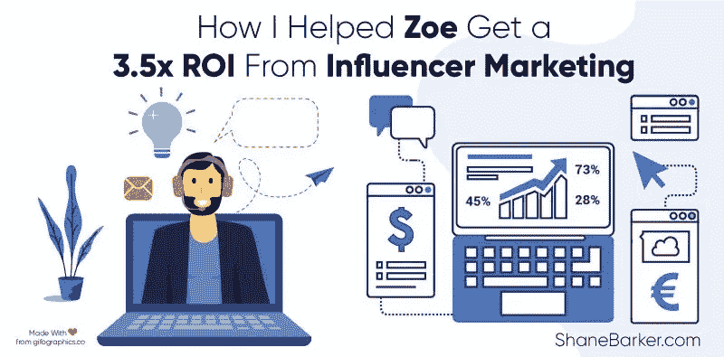

# 我如何帮助 Zoe 从影响者营销中获得 3.5 倍的投资回报率—案例研究

> 原文：<https://medium.com/swlh/how-i-helped-zoe-get-a-3-5x-roi-from-influencer-marketing-case-study-b637115290c1>

影响者营销是最通用的营销形式之一。它可以帮助实现各种目标——最大限度地扩大覆盖面，[提高转化率](https://shanebarker.com/blog/best-ai-chatbot/)，改善品牌形象，接触特定受众等。这也是最具成本效益的营销策略之一，尤其是与传统广告和付费促销相比。

这可能是为什么如此多的营销人员正在远离传统营销，投资于影响者营销。有许多品牌在实施了[影响者营销活动](https://shanebarker.com/blog/influencer-marketing-tools-boost-campaign/)后，看到了可量化的显著业务增长的成功故事。

精选的相关内容:

*   [2018 年让你惊喜的 85 个影响者营销统计](https://shanebarker.com/blog/influencer-marketing-statistics/)
*   [你现在需要知道的社交影响力营销的 9 大好处](https://shanebarker.com/blog/biggest-benefits-social-influencer-marketing/)

这是一个健康和健身影响者和健身教练佐伊罗德里格斯的成功故事。阅读此案例研究，了解她如何利用我们的[影响者营销咨询服务](https://shanebarker.com/services/influencer-consulting/)来推动销售转化和发展她的品牌。

# 目标

Zoe Rodriguez 是一位健康和健身博主，也是 ZBody Fitness Inc. 的首席执行官，她来找我帮忙她的影响者营销计划。关键目标是提高公司的销售额，并最大限度地提高影响者营销活动的投资回报率。

她希望我们为她的品牌设计和执行一个有影响力的营销活动，并推动她的产品销售。她还想增加她的品牌在网上的存在，接触更多的人，并建立一个更大的追随者基础。

精选的相关内容:

*   [如何在 2018 年从您的影响者营销预算中获得最大投资回报](https://shanebarker.com/blog/get-maximum-roi-influencer-marketing-budget-2018/)

# 挑战

# 难以与有影响力的人合作

当时的一些其他挑战是，影响者营销处于萌芽阶段，没有像我们现在这样多的影响者选择工具。因此，找到合适的影响者进行合作是另一个挑战。

此外，让有影响力的人与 Zoe 一起工作本身就是一项任务，尤其是有影响力的人通常拥有的“天后心态”。一些更受欢迎的影响者甚至没有回复电子邮件或信息。有些人断然拒绝合作。

那时候，影响者营销并不像现在这样成熟和主流。如今，有影响力的人数量众多，他们积极寻找可以合作的品牌。但是在那个时候，没有那么多有影响力的人。那些受欢迎的人很难合作。

因此，找到并接触合适的影响者是我们面临的另一个巨大挑战。

# 低销售转换率

虽然佐伊的网站吸引了相当多的访问者，但她很难将这些访问者转化为顾客。许多网站访问者离开她的网站时，没有购买任何东西，也没有接触更多的网站内容。因此，推动销售和让游客参与她的品牌是一个问题。

# 解决方法

# 优化了网站以获得更好的转化率

我开始改造 Zoe 的网站，使其更吸引人，并为销售转化进行优化。我增加了行动号召，比如免费下载电子书，订阅 Zoe 的时事通讯等等。让观众更多地关注品牌和佐伊的产品。

我还努力改进她的其他产品和服务，包括她的健身电子书、客户服务体验和捆绑项目。我还为她的公司设计了一个新标志。

精选的相关内容:

*   [7 个有影响力的营销工具来推动您的营销活动](https://shanebarker.com/blog/influencer-marketing-tools-boost-campaign/)

# 联系有影响力的人来宣传佐伊

我联系了几个健康和健身[有影响力的人进行合作](https://shanebarker.com/blog/effective-types-influencer-collaborations/)，让他们在帖子中提到佐伊。重点是针对女性健身爱好者推广她的健身计划和电子书。

我关注了几个 Instagram 有影响力的人，他们与 Zoe 的品牌相关，可以接触到她的目标客户群。这些影响者参与的成本基于按职位付费的定价模式。

影响者内容策略的重点是展示使用 Zoe 程序后的身体变化。大部分影响者的内容都是试用过她的程序的人的前后照片。

精选的相关内容:

*   [你的品牌应该关注的 5 个最重要的影响者营销目标](https://shanebarker.com/blog/influencer-marketing-goals-brand-focus/)

# 开展了电子邮件点滴活动

作为此次电子邮件活动的一部分，我向 Zoe 的订户名单发送了一系列电子邮件，旨在推动销售转化。其中包括几种类型的电子邮件，从定期通讯到旨在推动电子书销售的促销电子邮件。

这背后的想法是向已经对 Zoe 的品牌和产品感兴趣的人推销更多的产品和服务。这些邮件还有几条旨在推动转化的行动号召。

# 修改了她的内容策略，将她提升为健康和健身的影响者

我创建了一个强大的影响者营销活动，其内容策略专注于健康、健身和生活方式细分市场。我创建了几个贴有前后图片的帖子来展示她的转变和她的锻炼技巧的有效性。

以佐伊的个人转型之旅为例，我激发了一系列健身爱好者参与佐伊的品牌，并分享他们的故事。这一战略的目标是那些想要经历类似身体变化的女性，因为她们是佐伊产品的主要目标人群。

佐伊作为健身教练和影响者的服务也针对健身和生活方式公司。该活动的主题是宣传她的项目以及它们改变一个人身体的能力。

# 提供捆绑包

我们提供了几种捆绑产品和服务来追加销售产品和增加收入。我们进行了几次这样的促销和打折活动。

精选的相关内容:

*   [关于脸书影响者营销你需要知道的一切](https://shanebarker.com/blog/facebook-influencer-marketing/)

# 结果

在一年的时间里，我不仅帮助佐伊实现了她的竞选目标，还让她获得了高额投资回报。

以下是我在 Zoe 的影响者营销活动中取得的一些重要成果:

*   凭借 30 万美元的初始投资，在我们的影响者营销活动的帮助下，Zoe 能够在**实现 160 万美元的销售增长**。
*   在我们的影响者营销计划上，我让她获得了**5 倍的投资回报率**。
*   我们还成功地推动了她品牌产品的转化。活动结束时，一些产品的销量有所增加。
*   我们提供捆绑包，并专注于追加销售她的产品和服务，以增加收入。
*   增加了她的社交媒体帖子的粉丝数量和参与度。
*   目前，佐伊的 Instagram 个人资料有 42.7 万名粉丝，她的品牌页面(zbodyfitnessinc)有 18.4 万名粉丝。
*   与有影响力的人建立了长期关系，这种关系在活动结束后还会持续很久。
*   在这个活动结束时，佐伊的转变之旅激励了其他几位女性在使用佐伊的程序后发表了她们的个人经历。这导致在我们合作的影响者之外产生了几个品牌倡导者。
*   这次活动的结果是，佐伊凭借强大而独特的个人品牌，成为了她所在领域的重要影响者。

总的来说，Zoe 的影响者营销活动取得了巨大的成功，我们实现了远高于预期的投资回报率。

精选的相关内容:

*   [如何利用影响者营销来加强你的客户关系](https://shanebarker.com/blog/use-influencer-marketing-strengthen-customer-relationships/)
*   [说明 B2B 影响者营销力量的 10 个例子](https://shanebarker.com/blog/b2b-influencer-marketing/)

# 结论

影响者营销，如果做得好，是一种提高品牌影响力和推动销售转化的经济有效的方式。所需要的只是一个集中的内容和促销策略，以及一个执行良好的影响者活动。

使用上面详述的解决方案，你也可以从你的影响者营销计划中获得类似的[投资回报。](https://shanebarker.com/blog/get-maximum-roi-influencer-marketing-budget-2018/)

如果你想最大限度地提高影响者营销活动的投资回报率，请随时咨询我。如有任何问题或分享您自己的成功故事，请在下面评论。

***原载于***[***Shanebarker.com***](https://shanebarker.com/blog/influencer-marketing-case-study/)***。***

**关于作者**

[谢恩·巴克](https://shanebarker.com)是[内容解决方案](https://contentsolutions.io/)和 [Gifographics](http://gifographics.co/) 的创始人兼首席执行官。你可以在[推特](https://twitter.com/shane_barker)、[脸书](https://www.facebook.com/ShaneBarkerConsultant/)、 [LinkedIn](https://www.linkedin.com/in/shanebarker/) 、 [Instagram](https://www.instagram.com/shanebarker/) 上和他联系。

## 这篇文章发表在 [The Startup](https://medium.com/swlh) 上，这是 Medium 最大的创业刊物，拥有+401，714 名读者。

## 在这里订阅接收[我们的头条新闻](http://growthsupply.com/the-startup-newsletter/)。

