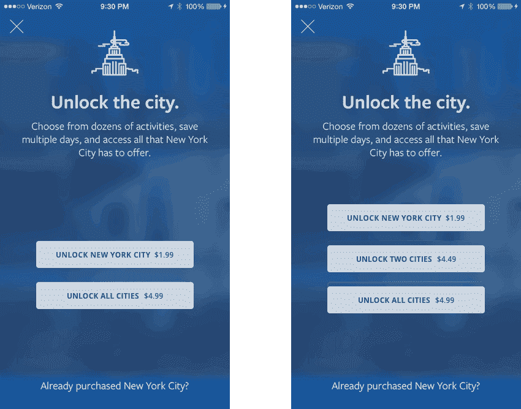

# 我如何将《孤独星球》的应用内购买收入提高 30%(内部案例分析)

> 原文：<https://medium.com/swlh/how-i-increased-lonely-planet-s-in-app-purchase-revenue-by-30-case-study-inside-35213dd0f29a>

> **明白:**人类很少用绝对的术语做购买决定。大多数情况下，我们依靠选项之间的比较来做出购买决定。

*前奏:这是一个展示应用经济行为研究中简单经验的实验。在实验过程中没有真正的货币交换，样本量为 n = 50。*

想象你走进百思买。你想买一台新电视，但你并不真正了解当前的产品格局。然后销售代理会给你三个选项(或者你自己确定):

*   36 英寸三星售价 690 美元
*   42 英寸三星售价 850 美元
*   50 英寸东芝售价 1480 美元

*你会选择哪一个？*

大多数人很可能会自然选择售价 850 美元的 42 英寸三星手机。

第三种选择很快就消失了。我们真的不知道 50 英寸的型号是否值 1480 美元。相比较而言，贵了很多。

我们也不知道 36 英寸是否值 690 美元。但是下意识地接受这个价格锚，我们确实知道 42 英寸相对于 36 英寸看起来是个不错的选择。

人们在购物时会比较和权衡各种选择。我们很少用绝对的术语来选择事物。我们没有一个内部传感器来告诉我们东西实际上值多少钱，而是我们计算出东西与类似选项相比值多少钱。

回想一下你最近一次艰难的购买。

我们关注一件东西相对于另一件东西的相对价格优势，并据此估算价值。我们不知道六缸车的价值，但我们可以假设它比四缸车更贵。

**更重要的是，我们更喜欢在*相似和容易比较的选项*之间进行比较，同时我们避免比较那些不容易比较的东西。**

# 案例研究:将《孤独星球》的应用内购买收入提高 30%

有了对相对性如何影响我们购买决定的总体理解，我想知道这是否也适用于应用内购买决定。为了找到答案，我进行了一项小型研究。

为了测试我的假设，我选择了孤独星球的“让我的一天快乐”应用程序。这是一个应用程序，允许你计划你的旅行到应用程序中六个可用城市中的任何一个。规划旅行的第一天是免费的，之后，你必须购买才能解锁更多内容和更多天数。

这项研究由两组 50 人组成。两组人都被提示做出购买决定。对照组有两个选项(A 和 B)。第二组提供了三个选项(A、 *-B* 和 B)。

*-B* 代表明显不如选项 B 的哑选项(就像上面的 36 寸三星电视)。

*   对照组:一个城市 1.99 美元，所有城市 4.99 美元
*   **第二组**:一个城市 1.99 美元，*两个城市 4.50 美元*，所有城市 4.99 美元

我的假设是:控制组将很难做出决定，因为他们不容易比较选项。人们规避风险的天性将回归保守决策，选择一个城市。

第二组应该会发现去所有城市更容易，因为两个城市和所有城市的价格都差不多，所以这是显而易见的。这是一个更容易的决定，因为如果你把花 4.99 美元买下所有城市和花 4.50 美元买下两个城市相比较，你会发现这是一个很棒的决定。

# 案例研究:结果

我在[可用性中心](https://usabilityhub.com/)上对总共 100 人进行了点击测试。结果是令人放心和非常清楚的。

虽然控制组大部分时间选择了便宜的 1.99 美元选项，但第二组更经常地购买更贵的 4.99 美元选项 2.29 倍。

下面的热图显示了我为这两个测试场景创建的两个模型，以及测试团队是如何响应的:

(n = 50 for both groups — clicks out of target are adjusted.)

第二组有 43.75%的时间购买了最贵的 4.99 美元期权，而控制组只有 19.1%的时间购买。

将此细分为 10，000 次应用内购买的总收入，收入数字如下所示:

**对照组**:25 ' 630.00 美元
**第二组**:33 ' 025.00 美元

底线显示收入增加了 30%或 7，395.00 美元。

# 外卖:选择建筑和反思

人类大脑更喜欢在相似的和容易比较的选项之间做出决定。它试图避免难以比较的选项。这是强大的。它允许你以一种人们容易消化和反应的方式来精心设计选择。

如果你想让你的顾客做出某个选择，那么介绍一个相似的、容易比较的、但价值较低的选项会促使(或操纵)人们购买想要的选项。

操纵总是会带来道德问题。在这个问题上，我真的可以和 Nir Eyal 的观点产生共鸣。在他的书《上钩:如何打造形成习惯的产品》中，他用了整整一章的篇幅来讨论操纵这个话题。他说操纵是可以的，只要:

> 只要一个产品在物质上改善了人们的生活，创造者使用他们自己创造的产品，就可以把人们推向这个方向。如果不是这样，那就不是。

此外，我决定分享这个职位的目的是自省。我们每天都接触到这种思考和操纵的方式。想想杂货店、房地产、杂志订阅等。—了解它会帮助你预防它。

丹·艾瑞里的书[可预测的非理性](http://www.amazon.com/Predictably-Irrational-Revised-Expanded-Edition/dp/0061353248)是这个实验灵感和知识的主要来源。如果你想了解更多关于行为经济学的知识，一定要读一读。还有，[他的这篇](http://danariely.com/the-books/excerpted-from-chapter-1-%E2%80%93-the-truth-about-relativity-2/)很棒。

> *如果你认为这对其他人也有用，请点击下面的“*推荐*按钮。*

[***报名参加我的简讯***](http://www.thierrymeier.com/mailinglist.html) *不定期为产品设计征文。*

*发表于* **创业、旅游癖和生活黑客**

-