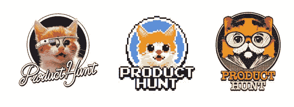

# 我是如何在 Product Hunt 找到工作的

> 原文：<https://medium.com/swlh/how-i-landed-a-job-at-product-hunt-blameericwillis-1f267180ba73>

我想写的是一个非技术型的 wantrepreneur(我)是如何在 Product Hunt 公司获得一个社区经理的职位的。

从 Jeff 的帖子“[为什么我离开了我的‘梦想工作](/@jsneedles/why-i-left-my-dream-job-358a6e71814b)”中获得灵感(在他写完这篇文章后，我告诉他我希望很快能写我自己的——几个月后，我来了，告诉你！)

> 不同的事情适合不同的人，这就是我的工作

在大学里，我用普通话学习国际商务，包括在一所中国大学学习 5 个月，然后为通用电气资本工作——我爱中国，但不爱通用电气。

我搬到伦敦，为一家手机应用初创公司工作，担任他们唯一的销售人员。这个应用程序允许你从酒吧点一杯饮料，而不用排队。我在那里呆了两个月，总共零销售。伦敦没有酒吧在乎或想要这款应用。毫无疑问，它已经消失了。

我一到那里就计划着我的退出，并设法在一家社交媒体机构 TBG 数码公司找到了一份工作，我喜欢它。这是一家很酷的年轻公司，充满了优秀的人才。它适合我。差不多一年后，我们被社交科技巨头 Sprinklr 收购。相当多的人要走了。我有所怀疑。

我一直想参与创业游戏，但在伦敦，我被债务缠身，从来没有时间，也没有做我想做的事情。所以，在一月份我递交了我的通知，并计划搬回我的父母那里…太好了。这不是我想做的，但这是必须要做的，说实话，我很幸运有这个机会。

这时我已经:

*   几乎每天都使用产品搜索来查看产品、投票和分享
*   见过[#创业懈怠团](http://hashtagstartup.co/)，最开始加入
*   开始为频道做贡献，和人们分享想法
*   作为一名非技术人员，我需要帮助来建立我的想法，所以继续尽我所能为社区做贡献
*   与两个家伙联系，开始做一个项目…其中一个家伙也邀请我评论 PH:)

2015 年 2 月…现在住在家里，在一家律师事务所做社交媒体主管。我知道我需要花很多业余时间在创业社区，并参与其中。

所以我:

*   我收到了加入 [MakerHunt](https://www.makerhunt.co/) 的邀请——这是一个为产品搜索社区中受驱动的产品制造商提供的聊天工具——(严格来说，我还不是一个分类的制造商，但多亏了 Eric Willis，我从一开始就加入了)
*   在那里贡献了很多！Eric 希望每天都和创客们一起运行 AMAs，所以我主动提出[用一种更容易阅读的格式把它们写在介质上](/@MakerHunt)-大约有 50 个，所以是的，我每天都这样做了将近 2 个月，但是向创客们学习是非常有价值的，社区也受益了，所以我非常乐意这样做
*   我告诉这两个家伙我不能再在这个项目上工作了，他们想在 PH 上发布，我支持它，但退出了(项目不再有效)
*   继续为 MakerHunt 做贡献，和很多人联系，其中一个是 Bram
*   看到他在[的初创公司](http://startupstash.com/)，我有了一个想法，想做一个营销资源和工具的网站——不迷人，但很有用
*   在 MakerHunt 上被问及是否有人可以帮助建立一个网站……[Mubashar 又名 Mubs](https://twitter.com/mubashariqbal) (顶级制造商和创业者)好心地表示愿意帮忙
*   与 Mubs 一起建立并策划了[营销团队](http://marketingstack.io)，包括来自 Daniel(之前项目中的一个人)的一些设计意见——与此同时，Eric Willis 向 Erik Torenberg 推荐我帮助管理产品搜索全球社区(我也一直在帮助产品搜索图书俱乐部并为此撰写 AMAs 我成为了这个 slack 小组中最活跃的成员，并尽我所能帮助每个人！没有隐藏的议程，这就是我喜欢做的！
*   买了自己的公寓并搬进去

*   [在我 25 岁生日的时候，在我之前联系过的所有人的帮助下，推出了营销栈](/@bentossell/product-hunt-launch-on-my-birthday-3d8a8da6ba96)(再次感谢！)
*   砸了当天的第一把交椅，超过了[至今 1500+票](http://www.producthunt.com/tech/marketing-stack)
*   我与产品搜寻团队的 Erik Torenberg 交谈过，他问我是否对产品搜寻团队的社区职位感兴趣…嗯，该死的耶！
*   我给产品搜索的创始人 Ryan 发了邮件，安排了一次通话(显然，这包括了很多表情符号)。我们接到了电话，我非常兴奋，但不得不等待回音(此时 v 很焦虑)

*   我在 Twitter 上收到一个通知“ [@rrhoover](https://twitter.com/rrhoover) 跟踪了你”，我想“哦，妈的，这是他打算在什么时候发消息，不是吗？!"果然是，他又想聊天了…
*   致电 2——他给了我这份工作:)
*   已经为产品搜索工作了几个星期了
*   万岁。

# 如果您在任何 PH 发布/问题/建议等方面需要帮助，请联系 Twitter。

# [@bentossell](https://twitter.com/bentossell)

# 特别感谢:

埃里克·威利斯让我在 MakerHunt 和他一起工作。我们现在都在一起写《创造者之路》——很快就要发行了！

埃里克·托伦伯格让我帮助 PH 读书会和全球 PH。还推荐我担任这个职位；)

布拉姆，他的支持，同时建立营销栈，并帮助我得到它推出。

感谢你的持续帮助和建设网站！

Daniel 提供设计意见和持续支持。

MakerHunt 社区！我接触过很多很棒的人，这里仅举几个例子，乔纳斯、乔希、凯特、弗雷德、马克、哈利、尼古拉斯、奥利维尔、罗斯、琪琪、维奥莱塔、迪伦、苏扬和威廉·哈里斯<3

And of course a massive thank you to Ryan Hoover and the Product Hunt team :) loving every day of it so far!

*发表在* **的《创业》、《漫游癖》和《生活黑客》**

-