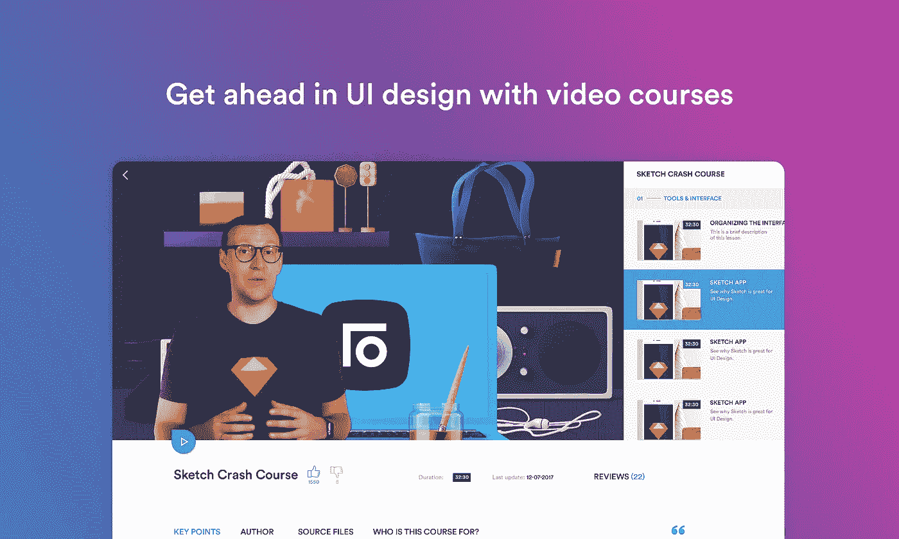

# 我如何启动一个 UI/UX 创业公司，并在头两个月赚了 9.000 美元？

> 原文：<https://medium.com/swlh/how-i-launched-a-ui-ux-startup-which-earned-9-000-in-first-two-months-2a3fa1eae8f>

在写我的最新项目时，learnux.io 已经发布了两个多月了。**在这段时间里，来自 145 个国家的 20，000 名用户访问了该网页，产生了近 70，000 次点击。已经有超过 220 人订阅了，这一次带来了 9000 美元的收入。**最近 30 天的收入呈现如下:

我猜你一定想知道 [learnux.io](https://learnux.io/) 是什么。这是一个为用户界面/UX 设计师提供视频课程和学习工具的网站。我想和你分享一些可能有助于创造你自己的类似产品的技巧。我希望 learnux.io 的故事对你来说是宝贵的一课。我试着描述它，使它包含一系列我在创业时得到的提示和结论。

# 产品理念

这个项目的工作大约在启动前六个月就开始了，当时我把它当作一个“附带项目”。这个想法很自然地产生了——它结合了我的谋生之道，也就是实际的设计工作和视频课程，我通过在波兰维持 [eduweb.pl](https://eduweb.pl/) 已经做了很多年了。**创造新产品的最佳方式之一是找到解决问题的方法。**产品可以是 [SAAS](https://pl.wikipedia.org/wiki/Software_as_a_Service) 解决方案。从另一个角度处理问题，你可以传授如何解决问题的知识。我从定义问题开始，并决定这是学习新的解决方案和愿意与最新的 UI/UX 新奇事物保持联系的需要。为了跟上不断变化的趋势，设计师必须投入大量时间进行研究和实验。有一个有效的、最新的知识来源会很好。时间就是金钱，这让我们得出一个结论，也许有人会愿意为使用捷径获得这些知识而付费。

> 通过剖析这个问题，你可以从中获得很多信息:

*   **产品解决了谁的问题** (UI/UX 设计师)，
*   **怎么能说呢**(这是一种投资，会有成效的)，
*   **是付费的，它应该具备什么特征**(最具体最专业)。

这样制定的初步前提伴随着我开始工作。当然，我知道我可能会错过它，然而，重新调整课程并没有错。简单来说，你只需要在某些事情上下注。

## 动作:

1.  定期写下你遇到的问题。也许找到这些问题的解决方案可以成为下一个产品的灵感。我用的是 Trello 板，但你也可以用你最喜欢的笔记本。通常，记下问题后直接点烟并不是一个好主意。让这个问题在你的笔记中出现几次，并注意它的初步验证。重要的是[把想法分成小步骤](/swlh/why-setting-big-goals-can-make-you-miserable-d31ca37844cc)，这样它们就不会让你不知所措。此外，不要强迫想法出现，[先试着理解你的方法](/swlh/how-dropping-out-of-school-for-surfing-led-to-the-discovery-of-the-11-instincts-of-the-worlds-23008ec5dda6)。在你把它们写下来之后。让他们躺一会儿。如果你不知道从哪里开始，尝试获得一些灵感，如[这个](/swlh/building-a-product-to-solve-my-own-problem-why-im-building-wantt-d9e9d5a9a8a4)。

# 想法验证

有许多在线商业的例子是基于其创造者的无知而创建和发展起来的。他们承认，如果他们对这个话题和竞争做了深入的研究，他们可能永远不会开始一个给定的项目。毕竟，他们之所以成功，是因为他们相信他们的解决方案具有独特的市场价值，但最重要的是，他们以自己喜欢的方式设计了它。然而，我已经创造了许多在线产品，其中一件事完全不能打动我，那就是风险和过度乐观。这就是为什么我试图对这个想法进行观察验证，并分析品牌趋势以诊断可能的风险。这个阶段将主要基于对问题的回答:*“我不是唯一有类似想法的人吗？”*。我没有做过典型的 [SWOT](https://pl.wikipedia.org/wiki/Analiza_SWOT) 分析，但是我花了大量的时间阅读其他 UI 设计师的意见、软件的方向分析以及阅读[媒体](/)上关于趋势的文章。

## 动作:

1.  看看脸书群，论坛， [reddit](https://www.reddit.com/) ， [Slack](https://slack.com/) 频道之类的。评估其他人是否有和你相似的问题。
2.  使用诸如 [Google Trends](https://trends.google.com/) 这样的工具来发现你的产品领域的趋势。
3.  如果你没有一个具体的想法，那就去看看诸如 [The Next Web](https://thenextweb.com/) 、 [Tech Crunch](https://techcrunch.com/) 、 [The Verge](https://www.theverge.com/) 这样的网站。

# 创建优质内容

正如我之前提到的，我不太相信运气。我认为和你做同样事情但做得更好的人，只是工作更努力/更久而已。我不确定这是否是你想听到的，你可能不同意我的观点，因为你列举了那些在不需要太多工作的产品上赚了很多钱的人。然而，当你仔细观察细节时，你会发现事情远不止如此。是的…你也可以中彩票。很有可能你比我聪明，你会有意识地选择不同的策略。**我不特别，我很努力。**这就是为什么我也不相信经验法则，即 90%的创业公司都会失败(但是[他们犯的错误](/swlh/why-90-of-startups-fail-and-what-to-do-about-it-b0af17b65059)值得知道)。有可能事情不应该是这样的——在许多采访中，科技创业公司的创始人都提到他们很懒。也就是说，他们想让自己的生活更轻松，所以他们寻找除了工作以外的解决方案来帮助他们实现目标。是*“创造性懒惰”。如果我是某人的榜样，那么有一个好消息，如果你不懒惰，你仍有机会成功。*

我敢说，在一个项目中投入大量工作是其成功的保证，而它是否壮观是良好的时机和验证的结果。在 [learnux](https://learnux.io/) 中，我将 ca。1000 个工作小时，而大约 70%用于创造一个完美的产品，剩下的大约 30%用于推广、网络和你稍后会学到的东西。或许可以选择其他方式，或者甚至可以颠倒比例，得到更好的结果。**然而，我觉得这件事是我的强项，而不是营销，这就是为什么我把赌注压在什么是安全上。**在我创作内容之前，我彻底检查了竞争对手的资源，并根据彼得·泰尔的书[《零对一》】,就如何做已经创作好的内容提出了这个想法。这篇文章可能也会给你带来启发。我是 bootsrapping 的忠实信徒，尤其是在你项目的早期阶段，但我倾向于把自己当成自己的投资者，并把这条规则记在心里。](https://www.amazon.com/Zero-One-Notes-Startups-Future/dp/0804139296)

我决定[创建一个智能房屋 UI 应用的完整项目](https://www.behance.net/gallery/52333765/Smart-Home-App-learnuxio-Course-Project)，它将加入整个材料，以创建逻辑关联、具体、节奏良好、引人入胜、5k 质量和大量实用技巧的课程。然后我就这么做了。这是我一生中做过的最困难的事情之一。虽然围绕这个项目的所有元素对我来说都很有趣，但它既不容易也不令人愉快。我听说如果你做你喜欢的事，那你一生中一天也不会工作。这是骗人的。

## 动作:

1.  准备一份清单，列出可以比竞争产品做得更好的事情。如果这些是受欢迎的产品，专注于专业化。
2.  找到使用竞争产品的人。询问你试图改进的东西是否会让他们选择你的产品。开始记录这类人的名单。我用了一个谷歌文档电子表格。
3.  准备一份能创造你的产品的步骤清单。为每个阶段设定一个具体的截止日期。保持一致。该计划取决于产品。我注意到没有什么比解剖它和划掉次要目标更好的了。
4.  创造你的 [MVP](http://www.biznesowerewolucje.com/mvp-minimum-viable-product-praktycznie/) 。简单地开始，但也要结束。我知道这是微不足道的，但我见过许多成功人士[只是行动，而不是过度思考它](/@krisgage/fuck-your-planning-2bff06019a5)取得了巨大的成果。[这篇文章](/the-mission/3-things-that-are-holding-you-back-from-the-life-youve-always-wanted-33a231ab9814)也会让你了解我的意思。

# 关于竞争的几句话

我之前提到过，成功的关键是由一个伟大的产品+好的时机+验证组成。不是竞争！给定产品中竞争的存在是验证的一个积极因素。可以证明问题存在，有人准备为其解决方案买单的论断。当创造一个市场上还没有的产品时，结果可能是人们还没有准备好为它付费。然而，在进入竞争最激烈的市场时，你可以肯定这是有利可图的。

因此，你需要做的只是交付一个比竞争对手更好的产品。“更好”可以通过更窄的专业化来保证。让我们以 [Slack](https://slack.com/) 为例，它仅仅是另一个沟通者，彻底改变了世界上成千上万个团队的工作。通过跟踪不同的初创公司，我意识到拥有稍微好一点的产品并不一定是成功的保证。例如，如果有人想出一个更好的 Twitter 版本，你会遇到很多障碍，比如用户的既有习惯，以及他们已经投入大量时间扩大联系网络、关注者和声誉的事实。

这意味着，如果你想在一个竞争激烈的市场上创造一个明显更好的产品，首先，它必须是真正更好的，其次，它必须考虑到用户方便的过渡途径。总的来说——不要担心竞争。尽管外表如此，在每家竞争公司的背后，都有比你想象中更亲近的人，他们每天都在为类似的问题而奋斗。保持警惕(例如使用[类似的网站](https://www.similarweb.com/)和 [Alexa](https://www.alexa.com/) )，不要忽视来自市场的迹象，而是做你所做的事情并保持一致。

## 动作:

1.  准备一个能很好描述你的产品的关键词列表。你可以使用你的 [AdWords](https://adwords.google.com/home/) 账号或者[关键词策划](https://adwords.google.com/intl/pl_pl/home/tools/keyword-planner/)。学习如何在谷歌中[使用高级短语。](https://bynd.com/news-ideas/google-advanced-search-comprehensive-list-google-search-operators/)
2.  谷歌一下这些词——写下那些地位很高的公司，并研究他们的产品。
3.  在[提及](https://mention.com/en/)或[品牌 24](https://brand24.com/) 设立账户。监控你认为重要的短语，以及提供类似竞争产品的公司名称。

# 早期阶段—登录页面

当我对这个产品有了一个明确的愿景时，我开始想出一个名字，买了一个域名(便宜。io 域名可在[namecheap.com](https://www.namecheap.com/)获得，同时在美国托管，我建立了一个非常简单的登陆页面，上面有关于将放在网页上的信息。所有这些步骤花了我不超过几个小时，包括内容创建和简单的搜索引擎优化(使用适当的网页标题)。在这一阶段，我已经使用了[分析](https://analytics.google.com/)并在[谷歌网站管理员工具](https://www.google.com/webmasters/tools)设置了一个帐户，以检查页面将如何被索引。我没有太注意这个阶段，但它确实做得很好。其次，我设置了首映日期，并推出了一个简单的计数器，有可能注册通知。这个列表给了我 76 个电子邮件地址，把我宣布首映的文章的流量重定向到了柜台。

## 动作:

1.  在目标国家购买域名并托管服务器。
2.  建立一个简单的针对 SEO 的登陆页面，并为你的产品设定一个发布日期。

# 建筑延伸

你可以说我是从最底层开始的。我从来没有用英语创作过任何内容，我在国外没有个人品牌，也没有电子邮件列表，甚至没有会对我的产品感兴趣并愿意推荐它的朋友。我的工作是从建立影响力和寻找进入商界的途径开始的。我是从在[媒介](/@learnux.io)发表文章开始的。我试图为他们提供独特的品质，我甚至为他们中的一些人准备了电影，放在我的 [YouTube](https://www.youtube.com/learnux) 频道上。通过这种方式，我同时通过两个网站建立了影响力，尽管我的内容在 Medium 中主要是基于文本的内容。

最好的文章是那些时机恰到好处的文章——关于一个品牌的新奇事物，一个在特定时间被许多人提起的话题。**通过这种方式，对于一篇最好的文章，我能够在第一天获得 3000 次点击，并在几个月后的今天获得超过 15000 次点击。**

写每篇文章花了我不超过两天的时间，并产生了几千个点击量。当你用英语写作时，语法上的海明威应用程序非常有用。将这类内容转化为流量并不容易——你可以插入 [Upscri.be](https://upscri.be/) 让人们订阅你的列表。我很快就放弃了这个解决方案，因为它只带来了一些线索。

我把赌注押在了建立知名度和关注我个人资料的人的基础上。这一次，我收集了 600 多个。我在[脸书](https://www.facebook.com)上链接以这种方式创作的关于特定群体的文章和电影，比如[一起素描](https://www.facebook.com/groups/sketchtogether/)，这帮助我获得认可并触及我的文章。建立列表的另一种方法是创建免费资源，可以通过提供电子邮件下载。通过将它链接到几个脸书群组上，我试图找到正确的时间，并获得了 500 个额外的地址。

以这种方式通过倾尽 ca。我花了 100 个小时创作额外的内容，获得了相当大的影响力——名单上大约有 600 个地址，媒体上有相同数量的关注者，YouTube 上有 3000 多名订阅者，近 10 万次观看(我创作了四部有价值的电影)。这意味着，通过投入相对较少的资源，我能够接触到每一个新发布的内容，一个超过 4200 人的非随机群体，他们采取了特定的行动来接收通知。

## 动作:

1.  当人们搜索时，通过发布材料对品牌新奇做出反应。
2.  花些时间准备少量但很有价值的内容。
3.  使渠道多样化，并在网站上发布内容，让潜在对你的产品感兴趣的人访问这些网站。

# 通过社交媒体传播

在整个准备过程中，我不断更新我的推特，甚至每天发布八条推特，这让我获得了 ca。300 名粉丝。很难评估 Twitter 对 [learnux.io](https://learnux.io/) 的成功的真正影响，但我可以肯定的是——**是 Twitter 让我接触到了我在课程中讨论的软件的生产商、有新奇事物的品牌网站以及一些有影响力的人**。在 Twitter 上联系一个人通常需要评论一两条推文，并转发两三条下一条。接下来，给那个人发一条私信或者在你的推文中提到他们是值得的。在此期间，我还活跃在其他社交媒体网站[——脸书](https://www.facebook.com/)、 [Quora](https://www.quora.com/) 、Reddit 和[产品搜索](https://www.producthunt.com/)。

在这些服务中，你可以成功地促进你的创业。然而，首先你必须通过写有价值的评论和帮助他人评估和开发他们的产品或通过链接到有价值的资源来赢得声誉。对脸书的各个部门群体也可以这样做。

如果让我简单评估一下渠道:

**脸书** —没有营销预算很难建立影响力，而使用额外的资金需要大量的时间来准备广告。我没怎么关注这个频道。

**Twitter** —获得行业联系的最佳场所，需要熟悉细节，但会产生高利润的结果。

Reddit——相对较低的效率，可能与 UX 相关的子网站太小众了，所以我决定放弃它。

**产品搜索**——非常有价值的初创社会的响应和帮助，也是首映期间的高流量。

因为我想专注于课程的制作，并且我避免了令人分心的通知，所以我使用了 Kasia 的帮助，她不断地给我发送链接，指向我可以提供实质性帮助的主题。我通常每天花大约半个小时做这件事。**为了让我们的行动成功，我们在谷歌文档上保存了一份电子表格，记录了所有的回复/建议。我试着列出我回复的人的地址。在首映式上，我们请他们帮忙评价我们的项目——它成功了！**

## 动作:

1.  如果你还没有，建立一个[推特](https://twitter.com/)账户。开始关注所有行业影响者。不时转发他们的内容并进行评论。用大量的标签发布有趣的事情，慢慢建立影响力。
2.  在 [Quora](https://www.quora.com/) 、 [Product Hunt](https://www.producthunt.com/) 和 [Reddit](https://reddit.com/) 上建立账户，加入诸如 [r/startups](https://www.reddit.com/r/startups/) 或[r/entrepreneur](https://www.reddit.com/r/Entrepreneur/)以及与你所在行业相关的环境。尽可能经常地发帖，但是要确保你发的帖子是独一无二的有价值的。
3.  加入脸书、Slack 和其他网站上的社区，在那里你可以找到你的潜在客户。

# 联系人影响者

大约在发布前一个月，我开始寻找可以帮助我推广这个项目的人。你可以使用 Buzzsumo 等工具进行搜索，或者在社交媒体和 YouTube 上自己搜索。最好准备一份谷歌电子表格，列出你通过这种方式收集到的所有潜在客户。

最终，我试图通过电子邮件进行所有的交流，将所有的东西都存储在一个地方。电子邮件地址可以相当容易地找到，你可以使用工具如[猎人](https://hunter.io/)，以及[这篇文章](https://blog.salesflare.com/the-growth-hackers-playbook-to-finding-anyone-s-email-735fe13259b5)。你也可以从脸书的群组中提取电子邮件，比如使用 [Grouply](https://grouply.io/) 。老实说，我并不太关注这类成长技巧，我认为它们不值得花费时间，从伦理上讲，也不是我的首选。

集中与合作伙伴和影响者的沟通渠道帮助我使用 Gmail 的 CRM Streak 成功管理他们，我可以为影响者、软件生产商或行业网站创建单独的渠道。示例性管道如下所示:

我试图用不寻常的方式接触有影响力的人，他们可以帮助我推广这个项目。我录了几十条简短的个性化视频信息，放在了电子邮件中。我真的很想压缩视频，这样它就可以放在 Gmail 附件中。**几乎一半的人回复了这样一条信息。**

虽然我尽了最大的努力为发布做准备，但我认为在这个阶段我犯了一些错误。似乎我更关心的是培养对即将到来的产品的兴趣，而不是我之前完成的验证。因此，我投入了大量资源来采取行动，这些行动如果晚些实施会带来更好的结果。**事实证明，推广现有产品比承诺该产品要容易得多。**同样是那些没有回复我的信息的人，后来回复了我在总理之后发送的关于该项目的链接。当项目上线时，我有更多的乐趣和动力去推广它。如果我能再做一次，我一定会在项目启动前花更少的时间寻找支持。

## 动作:

1.  创建一个有影响力的人和最受欢迎的行业公司的列表，它们可以帮助你推广项目。也可以使用 [Revfluence](https://www.revfluence.com/) 等付费工具。我没有自己用过，所以无法评估它们的效果。
2.  为联系人管理准备 CRM。随着时间的推移，这个列表会越来越长。使用支持工具，例如， [Mailtrack](https://mailtrack.io/) 帮助你追踪一个人是否读过你的信息。这里有一篇[很酷的文章](/swlh/how-to-build-a-startup-empire-without-selling-your-freedom-604143b21a61)和一个其他有用工具的列表。
3.  除非你有比我更好的主意，否则不要在首映式前太专注于制造轰动。

# 发射前阶段

我在首映前 2-3 周开始制造悬念。我在 Medium 上给[写了一个帖子，在里面我解释了我是谁，我的创业公司解决了什么问题。我还发出了行动号召，要求填写一份简单的问卷，这帮助我获得了另外 32 个联系人。我定期在社交媒体上发布项目启动倒计时。我更新了之前与有影响力的人建立的一些联系。接下来，我把重点放在激活那些在邮件列表上注册的人。在发布前，我总共给他们发了四条信息。统计数据如下(倒数第二列是打开率，最后一列是点击率)。](/@learnux.io/who-is-the-man-on-a-unicorn-and-why-is-he-happy-faf5dcdeb4f2)

除了第二封邮件中包含的图片可能会将其放在 Gmail 的不同标签中，**其余邮件的打开率都很高，达到 40%以上，这只能证明我成功收集到了高质量的电子邮件地址。消息包含以下内容(按发送顺序):**

1.  关于计划发布+ CTA 的信息—填写调查问卷
2.  我的故事+ CTA —填写调查问卷
3.  我之前在 YT 和 Medium 上发布的三个免费教程+发布提醒+CTA——让您的朋友了解发布信息(点击发布)
4.  独特的，免费的教程只为订户+启动提醒+信息推广订户的第一周

发布当天的邮件与在产品搜索中添加产品有关，看起来是这样的:

第二天，我又发了一封电子邮件，三天后又发了一封，告知 start-20%促销的到期时间。这意味着在两周内(发布前后)**我每隔一天就发一条消息。从简讯辞职的人数— 0。**从列表到注册用户的转化——将近 20%。我认为这证明了投资于质量而不是数量是多么好，并且不要害怕频繁地发送电子邮件。小列表也可以很好地转换。

1.  在首映式之前/期间准备好沟通模板，以便随时发送。
2.  分享你的故事——告诉你的用户你是谁，你正在解决什么问题，并证明你相信它。

# 发动

我不认为我创造了等待我的产品的氛围。当柜台停下来时，网页上只有几个人，可能我是最兴奋的一个。现在回想起来，我认为不值得为发布会本身而大放异彩。正如我之前提到的，推出前的推广并没有很好的回报，过度炒作的一个副作用可以导致开始时的高点击率，但也可能导致一段时间后兴趣突然下降。最好是系统地建立观众测量，看着酒吧逐渐成长，而不是一开始就有一个很大的高峰，后来又有很大的营业额。另一方面，这是第一个产品的特异性。当我们已经有了一些历史和附属客户时，等待的效果会更容易实现。如果这是我们的第一个产品，最好将资源重新分配到更好的开发中，而不是想出第一个策略。

更重要的是接下来的事情。最好创建一些描述(短、中、长)、[新闻包](https://www.dropbox.com/s/z8rsvtsilfdvl44/learn-ux-press-release.pdf?dl=0)、不同场景的图片，或者事先在社交媒体上准备和计划帖子，例如使用[缓冲](https://buffer.com/)。我试图将这些材料发送给尽可能多的编辑部、有影响力的人或行业网站。最好准备好你自己的清单，[以这个清单为基础](https://submit.co/)，增加你产品领域的行业网站。**顺便说一句—** [**这份由**](https://github.com/LisaDziuba/Marketing-for-Engineers)[**Lisa Dziuba**](https://medium.com/u/9f7968241d53?source=post_page-----2a3fa1eae8f--------------------------------)**策划的榜单** **相当惊人，部分原因是我很高兴在发布前没有找到它，因为我可能花了太多时间阅读。**

## 行动

1.  准备启动所需的资源。不同类型的描述、屏幕、新闻包。
2.  列一个清单，列出你要通知的关于你的产品首映式的网站和人。

# 发射后阶段

learnux.io 的上市后策略主要基于一个原则:系统性。每个月，我都会给订阅者发送邮件，并更新新内容。我意识到巨大的影响可以导致少量的系统工作，例如在建立链接的策略中。想象一下，你每天花 15 分钟在不同的网站上帮助他人，比如 Quora。通过每天写一两篇文章，你一年可以建立 300-600 个链接！

我也在社交媒体上保持活跃，并逐渐考虑将一定数量的收入用于付费广告。我通过听取客户的意见，并使用[对讲机](https://www.intercom.com/)自动收集反馈和对未来材料的建议，与客户进行了大量交谈。我还配置了简单的分析功能，可以测量关键指标，如注册和订阅的数量和来源。我升级网站上的各种功能。例如，通过观看由 [HotJar](https://www.hotjar.com/) 收集的一些录音，我意识到许多人使用汉堡菜单，所以我添加了更多半透明的部分结构和登录选项。我还注意到，没有多少人推荐使用[推荐系统](http://learnux.io/referrals/)的 learnux.io，我打算重新做一次，在开始时不提供即时的满足感(免费月),而是在用户开始使用该服务并对其感到满意后才激活用户。基本上，这是显而易见的——只有当你确信一个网站的质量时，你才准备推荐它。直到我分析了转诊统计数据，并开始思考转诊人数如此之少的原因，这在当时并不那么明显。我还试图每月至少为 Medium/YouTube 创建一个帖子，并与行业公司和有影响力的人保持联系。

# 0 美元——花在营销上的钱

我对有偿推广的看法归结为一点——不要做。我测试的渠道似乎都没有效果。在[脸书](https://www.facebook.com/)上制作广告花费大量时间，而且结果不成比例。 [AdWords](https://adwords.google.com/home/) 和 [LinkedIn](https://www.linkedin.com/) 一开始就非常昂贵，而且收回成本的可能性很小。我很快意识到，为了了解在特定情况下什么是有效的，我必须在广告上花很多钱。我决定不在这上面浪费时间。将来也许我会利用脸书上的[引导广告的潜力，然而，根据我的经验，我知道只有当我们的登录页面与表单的内容严格关联时，以这种方式收集联系人才是廉价的。我也没有从佣金中获得有价值的回报，比如通过合作伙伴发送折扣代码。在我看来，达成交易的时间，降低价格的必要性，通常降低 40-50%(这样折扣不仅是给订户的，也是给合作伙伴的佣金)，与收益不成比例。更不用说真正有价值的合作伙伴不会这样和创业公司合作。](https://www.facebook.com/business/help/1462876307360828)

怎么办？尝试内容营销，创造有价值的内容——文章或免费赠品，而不是付费广告。与其购买广告，不如在博客上写文章，并建立链接。与其参与合作项目，不如花些时间与你的客户交谈，你会发现这会产生额外的价值。与其组织新闻发布会和邀请合作伙伴共进晚餐，不如免费分享你的产品，然后询问产品是否有用，并要求评论。

顺便说一下，另一个建议:永远不要要求超过一个反馈，尤其是从有影响的人那里。你会发现，当他们注意到你产品的价值时，他们会主动推荐你的产品。这是我收到的消息之一:

# 非常规思维

作为这篇文章的结尾，我想激励你采取非传统的行动。除了上面描述的方法，我试图实现一些额外的基础来帮助我收集流量，并增加项目的吸引力。保持开放和好奇很重要，[激励自己学习](/the-mission/the-5-hour-rule-if-youre-not-spending-5-hours-per-week-learning-you-re-being-irresponsible-791c3f18f5e6)。请记住，每天提高自己 1%的[会让你在一年后提高 37 倍](/startup-grind/reasons-why-most-startups-fail-early-2e3a4b8b095c)。

其中一个想法是以一种新颖有趣的方式来准备网站，这样它就能被记住。我打赌这是一个纯粹作者的解决方案，我与伟大的人合作——Pio trek wierkowski 帮助我创建了 UI，Piotrek Palarz 在 eduweb.pl 担任前端开发人员。作为 learnux.io 的客户，他们非常重视视觉方面，所以 ux 课程网站显然不能有一个糟糕的 UX。事实上，我们创建了一个好的网站，这让我可以带着它参加像 awwwards.com(T8)或 thefwa.com(T11)这样的网站的竞赛。访问这些网站的人是我所说的 learnux.io 的潜在客户，所以整个策略是有效的。而且…我赢得了一些奖励！

这一策略的效果超出了我的预期，Awwwards 的页面点击量接近 7000 次，是第二大有效的流量来源！

这只是我决定实施的许多非标准策略之一。另一个例子是，在一开始，作为网站的一部分，所有的课程都是开放的，换句话说，每个人都可以观看随机的课程。这个策略允许我链接到特定的课程(甚至是电影中特定的一秒钟)，点击之后你就可以开始观看了。一段时间后，网站上的人工智能会评估你是否准备好付费订阅，这时它会阻止你访问下一节课。对于一部分用户来说，他们可能不用购买订阅就能看到他们想要的东西。这样可以进行大范围的推广，比如在 Quora 上，我可以放置材料的链接。虽然我正在努力传递一个清晰的信息，即内容是付费的，这是重要和公平的。

另一种党派方法是用一个参数重定向到网页，这个参数根据接收者来调整它。例如，如果我在连接到 Sketch 的讨论组上推广我的产品，我可以提供一个特殊的链接。c=8 将页面上的图像替换为与 Sketch 相关的图像，这样，它们将为特定的接收者描述服务。哎哟！希望他们没有在听；)

# 就是这样！

我希望你喜欢这篇文章。**我试图抓住要点，并留下一些可能有助于你创业的行动触发点。**如果你准备好行动，并寻找更多循序渐进的方法，你也可以查看[的这个资源](https://www.sideprojectchecklist.com/marketing-checklist/)，或者[这个电子书](https://www.failory.com/side-project)。如果你觉得有些事情需要澄清，或者你可以分享一些关于这个话题的想法，请留下评论！

祝你的项目好运🤞

—格雷格

## 这篇文章发表在 [The Startup](https://medium.com/swlh) 上，这是 Medium 最大的创业刊物，有 319，283+人关注。

## 在这里订阅接收[我们的头条新闻](http://growthsupply.com/the-startup-newsletter/)。

