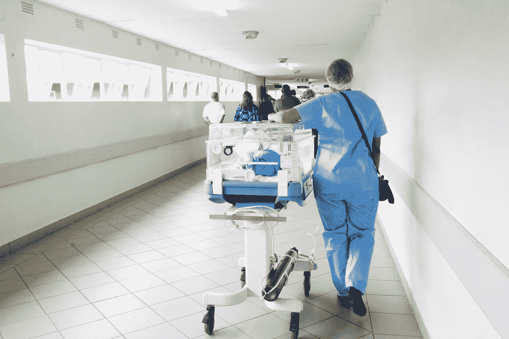
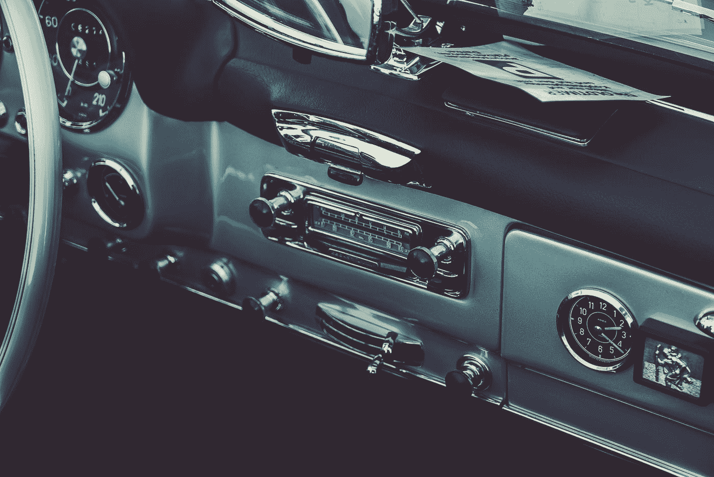
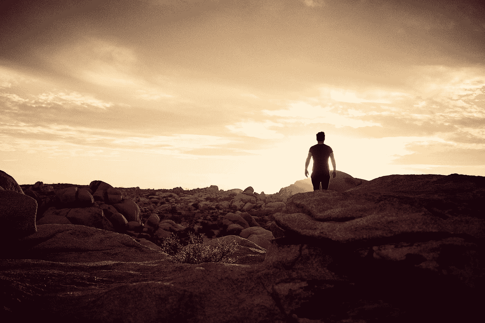

# 我如何知道不按自己的方式生活的代价

> 原文：<https://medium.com/swlh/how-i-learned-the-cost-of-not-living-on-your-own-terms-e2e7465d1076>

Photo by [Atharva Tulsi](https://unsplash.com/@atharva_tulsi?utm_source=medium&utm_medium=referral)

“宣布某事完成冻结了它的发展。”—沃尔特·伊萨克森

2013 年夏天，我开车行驶在南非东伦敦郊外的一条狭窄的乡村公路上。好像在道路左侧驾驶手动挡还不够大胆，导致我即兴冒险的事件证明同样具有挑战性。

> 在一个叫钦斯塔村的小镇完成了 5 周的志愿者工作后，一天早上，我感到腹股沟附近一阵剧痛。我在床上躺了将近一个星期，半信半疑地认为我再也不能一瘸一拐地走路了。

在几乎吸入了一瓶抗生素并在床上躺了一周之后，我决定是时候去伦敦东部的大医院看看了。

“你有一个囊肿，”我的医生告诉我。“而你有两个选择。第一，你可以让它自行爆裂，这样会极其痛苦。或者，你可以让我今晚给你做手术。”

*连医生都是推销员，*我想。

不用说，为了避免第一种选择，我自掏腰包支付了近 3000 美元。

> 如果可能的话，我强烈建议将你的下一次紧急手术安排在你的健康保险认可的地区。

手术后几天，我有点摔伤，但精神很好。原来所有的大惊小怪都是因为溃疡。

尽管如此，我通常泰然自若的父母的耐心受到了考验。谁能责怪他们呢？在手术前，我给他们的最后一封信非常令人难过:

*嗨爸爸，*

希望一切都好。做紧急手术。稍后再聊。

*爱情，*

*尼克*

## 这并不顺利。

但事实证明，最让他们担心的并不是我的措辞，而是我花了 4 天时间才确认自己确实还活着。

不管怎样，我得到了教训。

Photo by [Hush Naidoo](https://unsplash.com/photos/ZCO_5Y29s8k?utm_source=unsplash&utm_medium=referral&utm_content=creditCopyText)

你可能会认为我在地球另一端一间单调乏味的病房里的经历给了我一两个教训。至少在面对逆境时保持镇定的重要性，如何预料意外，或者与家人沟通的注意事项。

> 它做到了所有这些，甚至更多。

但这是一个广播节目，从根本上改变了我看待世界的方式。直到今天，我还把这一刻称为我个人的“登山宝训”

开车几分钟后，我决定打开收音机。一切顺利，我感到如释重负，并对未来的旅程感到兴奋。电影配乐似乎很合适。

> 但是当我像开保险箱一样小心翼翼地转动了几分钟后，我只听到静电声。

正当我要关掉收音机时，我听到扬声器里传出一个跳跃的声音。这是南非传教士在布道中的独特节奏。

> “拿我的房子。开我的车。你甚至可以拿走我所有的钱，”他说。“但是请不要占用我的时间！不要浪费我的时间，因为那是我无法替代的。”

几秒钟后，车站神秘地消失在夜色中，就像一个幽灵。

那一刻改变了我的一生。

“Cropped view of a vintage car's radio.”

*“我不是你想的那个人；我不是我认为的那个人；我就是我认为你认为的我”——托马斯·库利*

当我回到纽约时，我开始用不同的眼光看待一切。也就是我的时间。

> 我决定我需要用不同的方式度过它。

正是这个决定邀请我回答我生命中最紧迫的问题。

> 我现在的日子就是优化尽可能多的好选择。如果一个项目不能提供价值或者不能给个人带来回报，我会质疑它的效用。

我也试图加深，有时纠正有意义的关系，同时摆脱有害的关系。

> 在这个过程中，我善待自己的死亡，并培养了与死亡的健康关系。

欣赏我最终的死亡解放了我。

认识到我没有世界上所有的时间，澄清了什么和谁值得我拥有的一点时间。它也阐明了我一直在纠结的一些琐碎而愚蠢的担忧。

*“你能从自己的头脑中退一步，从而理解所有的事情吗？拥有而不占有，行动而不期望，领导而不试图控制:这是至高无上的美德。”—老子*

或许最令人兴奋的部分是盘点我的价值观。这意味着实际上质疑他们是否是我自己的。

为什么我想要我想要的东西？

*为什么它如此重要？*

这与我是谁或者我认为自己是谁是一致的吗？

问这些问题通常很困难。有时我会更深地陷入黑暗的空虚之中，不确定自己以及我希望在这个世界上扮演的角色。

> 其他时候，我太害怕面对我的欲望，因为我害怕它们是建立在对认可的需要上，而不是一些内在的目的。

但是通过挑战我的假设，我意识到有时候你必须面对自己丑陋的事实。通过这样做，你可以开始纠正你的缺点。

这是将你不完美的自我提升到不完美自我的一个稍微改进的版本的第一步。

> 没有做到这一点，就是没有向自己展示最真实的自己。如果你做不到这一点，你就不能为世界做这件事。

诀窍是不要让自己摆脱这些问题。这是我能确保自己不在自动驾驶仪上生活的唯一方法。

> 我需要更有目的地生活。

Photo by [Darius Bashar](https://unsplash.com/@dariusbashar?utm_source=medium&utm_medium=referral)

超脱不是你不应该拥有任何东西，而是任何东西都不应该拥有你—摘自印度教经文《博伽梵歌》

我试着停止想办法摆脱怀疑，让自己变得更加敏锐。当我这样做的时候，我意识到阻碍我的不是缺乏机会，而是没有认识到我已经拥有的东西。

> 我的生活中充满了非凡的人，他们做着非凡的事情，我可以从中学到很多。

那些带着沉重的键盘跋涉 4 个区在午夜演出的朋友们，或者那些整天在法律办公室工作，下班后还能抽出时间在舞台上表演的朋友们，才是我生命中真正的超级明星。

> 他们告诉我，成功就是在你喜欢做的事情上变得伟大。

因此，我把这种洞察力铭记于心，并试图在我生活中所有我觉得值得拓展的领域上加倍下注。因此，我做了更多重要的事情:

*我读书多。*

我去了更多的地方。

*我自愿多。*

*我创造了更多。*

*我给的更多。*

我爱得更多。

*我活多了。*

> 在《活着更多》中，我也照亮了自己的无知。我渐渐懂得了对启蒙的追求，更高层次的存在是一个终生的过程；这场运动只有通过拥有按照自己的方式生活的勇气才能变得丰富多彩。

热爱生活也意味着理解生活的多面性；它的残酷，痛苦，苦难，欢乐，可能，神秘。

> 我学会了像爱我生命中重要的人一样去爱生活；因为，而不是尽管，他们的不足。

最后，那 30 秒的布道促使我尽量减少面对一个没有活过的人生的可能性。

我明白了没有什么比做自己更有趣、更勇敢的了。

> 在一个竞争和评判日益激烈的世界里，坚持你想要的生活不仅是新奇的，而且是革命性的。

活下去。

**如果你喜欢这篇文章，** [**注册**](https://www.nickmaccarone.com/inspire) **为我的双月时事通讯，除了我关于生产力和灵感的最新文章，还有我最喜欢的书、电影和旅行推荐。**

另外，我很乐意分享我的免费创意日计划——一个关于培养良好日常习惯的简单的两页模板。

## 这个故事发表在 [The Startup](https://medium.com/swlh) 上，这是 Medium 最大的创业刊物，拥有 333，253+人关注。

## 在这里订阅接收[我们的头条新闻](http://growthsupply.com/the-startup-newsletter/)。

