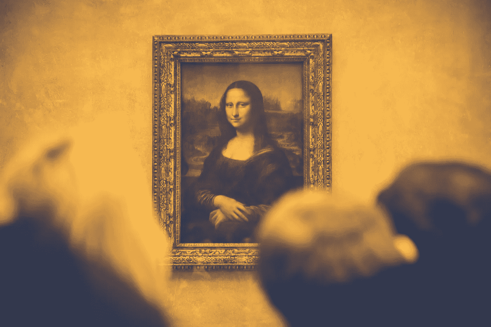

# 我是如何学会保持好奇心的

> 原文：<https://medium.com/swlh/how-i-learned-to-stay-curious-ec07254c342>

## “每个孩子都是艺术家。问题是我们长大后如何保持艺术家的身份。”——巴勃罗·毕加索

我很容易对各种各样的话题感到兴奋。过去，我倾向于克制自己不去追踪这些奇怪的冒险。我会把自己推离新的兴趣，认为我需要专注于另一件事。无论是商业还是营销，我都会制造压力，让我不能在这上面花时间——尽管这显然是有趣的事情。它必须直接适用于我在那个时期做的任何事情。

## *我们的学校是这样教我的。*

我并不总是这样。从小到大，我对一切都很好奇。我想了解化学、电子、摄影和艺术。这些学科之间没有联系——我仍然想进入。

在婴儿潮时期出生的父母和无知的小学老师的帮助下，我会对寻找自己感兴趣的东西感到气馁。相反，我要遵循指导方针。大概是这样的:

——*你首先要学会这个定律或者那个等式，才能把这些晶体管焊接在一起。你可以明年再做。*

—但是我已经在家里玩烙铁了！

嗯，你不应该这样！

换句话说，他们告诉我:——**你不能！**

> 但是他们怎么知道我能做什么或不能做什么？

你认为 Oculus Rift 的创造者 Palmer Luckey 认为他不应该玩旧的 VR 耳机吗？你认为他在拆解他的第一台任天堂之前学过半导体物理吗？

你认为凯西·奈斯塔特在制作这个视频之前需要学习光圈和快门速度吗？

他们没有。

因为他们一点也不在乎别人说什么。

他们刚刚去了的*。很难。*

## 你只能回头看才能把点点滴滴联系起来

他无处不在的好奇心与创造力息息相关。伊丽莎白·吉尔伯特在她的 TED 演讲中做了一件了不起的事情，那就是创造力来自哪里。她提出了一个观点，那就是没有办法解释它。相反，她告诉如何滋养它，最重要的是，接受它。

当我受到启发时，我会得出从未预料到的结论。有时我会说“真他妈好！”瞬间。当我进入心流，埋头工作时，突然间，我获得了如此多我以前不知道的新见解。这些是需要连接的点。

> 还是那句话，你不能向前看，把点点滴滴串联起来；你只能回头看才能把它们联系起来。所以你必须相信这些点在你的未来会以某种方式连接起来。你必须相信某些东西——你的勇气、命运、生活、因果报应等等。这种方法从未让我失望，它让我的生活变得完全不同。
> 
> —史蒂夫·乔布斯。

你只能把过去的点连接起来。当你好奇的时候，你就去尝试，失败，再失败。学习变得毫不费力，因为它是由真正的兴趣激发的。认知能力扩大了，你在实践中学习。事实证明，这是最好的一种学习。

> 知识的唯一来源是经验。
> 
> ——阿尔伯特·爱因斯坦

这个对我来说比其他任何东西都管用。时不时地，我会找到新的激情，我会把自己埋进这个主题。通常，我会跳到下一件事情上，这样我就不会在大多数事情上前进。但是我最近发现，这些有趣的学习留下了一个教训:

任何人都可以**学到任何东西**。

任何人都可以**成为任何人**。

与众不同的是引导我们度过难关的激情和动力。好奇的探索之后的勤奋。

没有好奇心和真正的兴趣，就没有激情。

如果你在寻找激情，试着允许自己只是好奇。让我们继续寻找，保持好奇。

*感谢阅读！*

*请稍候👏如果你对此感兴趣，点击关注。它会帮助我坚持下去。你真棒！*

## 这个故事发表在 [The Startup](https://medium.com/swlh) 上，这是 Medium 最大的企业家出版物，拥有 296，127+人。

## 在此订阅接收[我们的头条新闻](http://growthsupply.com/the-startup-newsletter/)。

