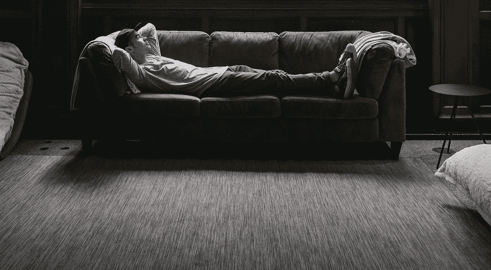

# 我是如何学会停止担忧并热爱压力的

> 原文：<https://medium.com/swlh/how-i-learned-to-stop-worrying-and-love-the-stress-5dba250bf9c3>

Originally published on [**JOTFORM.COM**](http://jotform.com)

我不能走在市中心而不经过墙上的一个被改造成瑜伽馆的洞。

每次我访问我手机上的应用程序商店，然而另一个新的冥想应用程序正在争夺一个特色位置。

放眼望去，世界似乎在告诉你减压有多重要。