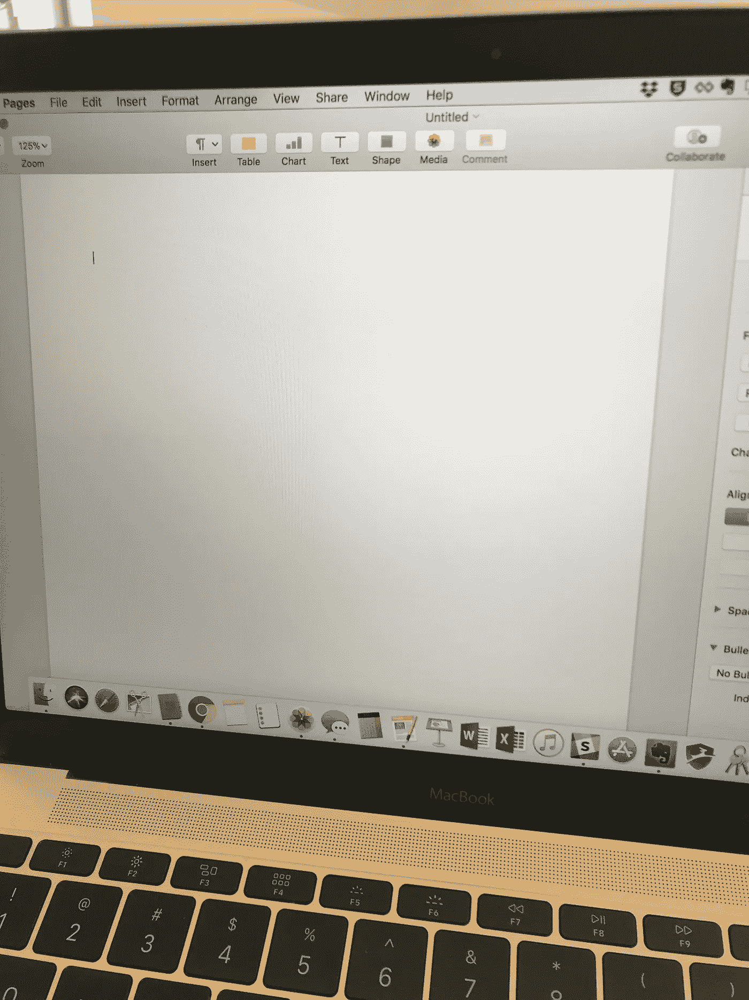

# 我是如何失去做深度工作的能力的。

> 原文：<https://medium.com/swlh/how-i-lost-my-ability-to-do-deep-work-f99cac8f0fb4>

> "深度工作是指专注于一项认知要求很高的任务而不分心的能力."— [加州新港](http://calnewport.com/books/deep-work/)

我只有几个创业遗憾，失去做深度工作的能力是其中之一。

这是完全可以避免的，如果我更清楚地意识到它正在发生，并在我注意到它时采取行动。但我没有，所以现在我正致力于重建我的深层工作“肌肉”。

当我们刚成立 ion 的时候，还没有员工，我做了很多短时间的、[肤浅的工作](https://neuentity.com/deep-vs-shallow-work-a-commentary/)，比如打陌生电话、回复电子邮件、安排可交付成果、写评估和简单记账。我还做了大量的[深度工作](https://www.npr.org/2017/07/25/539092670/you-2-0-the-value-of-deep-work-in-an-age-of-distraction)，比如撰写数百万美元的提案&合同、制作演示文稿以及协调大规模的数月项目计划。

我对这两种工作都同样得心应手——从一堆琐碎的任务和快速的环境切换中跳来跳去，一直到“脱离网格”,埋头做一两天实质性的工作。

随着我们公司开始成长，这种情况继续下去。我在计划，我在写作，我在阅读 60 页的文件……但是现在有了很多肤浅的工作，也有了很多在会议中进进出出的活动。我比以往任何时候都更频繁地切换上下文。

回想起来，我看到自己有能力(或缺乏能力)在一个跟踪公司发展的拱门中做深入的工作。随着我们的成长，我不再做深度工作，而是监督那些做深度工作的人。我个人越来越没有迫切的理由去做深入的工作，因为我太专注于内部了。我不再致力于那些完全由我来执行或者需要我埋头苦干的可交付成果。事实上，恰恰相反，我总是抬起头，审视我们的员工、潜在客户和客户。

我做的事情很重要，不要误解我。它只是不需要我去钻研和思考一些棘手的事情。这并不需要我进入心流状态。

我现在明白了，我们来到了成长的转折点，我不再做任何深度的工作。

很难承认这一点。

我不怪公司，也不怪成长。我责怪我自己和我所做的选择，让我陷入这种分心，肾上腺素刺激的生活。一个公司需要它的领导做深入的工作，所以这肯定是我的一个缺点。我让浅薄、紧急的工作占据了我所有的注意力，并哄骗自己认为那是我的工作。

浅薄的工作更容易，不是吗？我的意思是，我们的蜥蜴大脑为分散注意力的东西而兴奋，我们的注意力持续时间迅速缩短，比金鱼还短。这种事发生在我身上，而我却听之任之。我被会议和灭火弄得焦头烂额。我不再创造任何东西。我每天都和我的人在一起，这是我觉得我需要做的。不幸的是，我牺牲了自己从事真正长时间、更艰苦工作的能力。

失去深度工作能力的症状有哪些？你已经知道了，因为我们很多人都在努力解决这个问题。对我来说，很明显。我花 10 分钟做一件事，然后跳到下一件事。或者我分心了。

查看电子邮件、在空闲时间突然出现进行快速聊天、查看社交媒体和浏览头条新闻是我们数字时代的糖果。

当我需要坐下来思考一个新的或棘手的问题时，我会打 10 分钟的面条，然后查看我的手机。当我有一篇文章的灵感时，我会坐下来敲击键盘几分钟，让思路流动起来。一旦我在文章中遇到一个棘手的问题，我发现自己无法深入研究并解决它，所以我就转移话题，去做别的事情。我很少(如果有的话)进入心流状态(T3)。

在我的内心深处，我知道这正在发生，我不喜欢它，但我也不太担心它。我真的不认为这有什么关系。

事实证明这很重要。有两个原因。第一，因为我开始怀念深度工作以及随之而来的成果。但更重要的是，当我确实需要做深度工作时，我陷入了泥淖。

我第一次意识到我的深层工作能力已经休眠，是在我们收购的尽职调查程序开始的时候。

有数百个项目要收集和准备勤奋，我有一吨他们分配给我。我直接跳了进去。简单的事情。只花了 5 到 10 分钟。我也很兴奋能解决棘手的问题。这与拖延无关。这是关于每次我坐下来准备一个更加勤奋的项目时碰壁。不是我不想做这件事。而是我的大脑感觉像水泥一样。就像球坐在陡峭的山顶上，但无论我怎么推它，它都不会越过悬崖并开始滚下。

我知道在过去的几年里我没有做深入的工作，但是我没有意识到结果会是失去做这件事的能力。

我不想在职业或个人生活中从一个分心的事物跳到另一个。我想要回我的深层工作肌肉，我决心这样做。

在过去的几个月里，我一直在认真地做这件事。有四件关键的事情帮助我开始慢慢恢复做深度工作的能力:

1.  我把一些肤浅的工作当作深刻的工作。只是为了练习。例如，我可以做一些轻微的社交媒体分类和全天参与。相反，我每天安排一个小时，并强迫自己在这段时间内保持专注。尽管这不是很深入的工作，我也不需要低着头去做，但我发现这样做有两个好处。首先，我花的时间更有意义，收获的果实也更多。我了解更多，参与更多，并想出更好的方法来为我自己、我的品牌和我的公司使用社交媒体。给肤浅的工作更多时间的自然结果是它得到更多真正的关注，这使它更有价值。第二，它迫使我一次花更多的时间专注于一个计划。改变*我的工作方式有助于我恢复做实际深度工作的能力。*
2.  **我的时间盒。很多。具有讽刺意味的是，我喜欢时间拳击，以确保我不会在某件事情上花费太多时间。比如，当我需要整理我的衣柜，我喜欢做的事情时，我会把自己的时间限制在 20 分钟，这样我就不会陷入一整天的狂欢中。或者在工作中，当我有一个关于许多主题的小组讨论的大型会议时，我会设置时间框，这样我们就不会陷入各种各样的困境。时间拳击可以很好地确保时间不会从你身边溜走。但现在我知道，它也可以让你更长时间地保持专注。如果我需要处理一个棘手的话题，我只需设置 15 分钟的计时器，然后开始钻研。无论发生什么事情，我都不会查看电子邮件、看手机或进行闲聊。我只要集中精神 15 分钟。在深度工作时间内，我不会让自己的注意力转移到明显的分心事物上。在某个时候，我开始解冻，开始有点心流状态。所以，我做 15 分钟的深度工作(让我们面对现实吧，15 分钟的任何事情都不是深度工作，但是记住我已经崩溃了，还在慢慢地走)。过一会儿我会重新开始，把计时器设定为 20 分钟。我只是不断延长计时器，直到我达到 30、45、60 分钟或更长时间。这并不容易，我在这方面并不完美。有时候我甚至做不到。但是这个计时策略绝对帮助我保持专注的时间越来越长，我现在能够放松自己进入心流状态和深度工作，没有那么多焦虑。当我到达一个艰难的认知点时，我不会崩溃并跳到头条或 instagram 上。我只是埋头苦干，继续前进。肌肉越来越强壮。**
3.  **我利用我的日历。**一个非常简单的想法，很多人都在用。我在安排我的深度工作时间，让自己内疚地去做。我从来不是一个安排任务的人，可能是因为经营我的公司日程安排得满满的，每天都有连续的会议(会议文化是另一篇文章的主题！).我只是觉得没什么用。但是我一直在尝试——安排计划时间、写作时间、客户交付时间等等，这对我很有帮助。当日历上写着“放下一切，在接下来的两个小时里做 X”时，我发现自己越来越顺从了。
4.  **我看实体书。这是一个意想不到的帮助。我喜欢阅读。我喜欢书。身体上的。但我很快适应了电子书，很多年没有买过实体书。因为我是一个如饥似渴的读者，我喜欢 iBooks 和 Kindle 的便携性，只要有休息时间就阅读。**

但是，我开始意识到我很少坐下来阅读一本电子书，一读就是一个小时、两个小时或三个小时。我的思绪太乱了。我的阅读变成了零食，而不是一顿饭。这不像我。

当我最近拿起一本实体书时，我带着同样糟糕的数字“零食”行为。我会读一两页，然后把书放下。我责怪这本书。但事实是，我喜欢这本书，我一天要拿起它很多次。失去做深度工作的能力已经转移到阅读上，这是我真正喜欢做的事情，而且可能会迷失其中。

所以，我决定强迫自己去阅读。读啊读啊。别把书放下。一开始并不容易。我头疼。我焦虑不安。我饿了。我渴了。我太暴躁了。然后，突然我就不是了。我开始喜欢它。我不再去想已经过去了多少时间。我做得越多，就越有助于我深入的工作。我相信改变我的阅读习惯提高了我专注于写作、研究、计划和解决问题的能力。

我确实在进步，我个人发誓不再失去这种能力。我认为公司领导人必须做更深入的工作——他们如何设定愿景、路线图、长期目标和计划。这是他们思考企业面临的棘手问题的方式。

深度工作为公司的引擎创造气体，并激发员工、媒体、投资团体、客户和潜在客户的参与。这就是难题解决的方式，也是创新思想生根发芽的方式。深度工作为公司编织了一个丰富的日常依赖的织物——它创造了构成其他材料的材料。这很重要。所以我正在有意识地选择去培养它。

*此外，整个“我们的注意力持续时间现在比金鱼还短”的说法已经被揭穿了。很多次。但感觉这是真的，不是吗？

这是我最初发表在这里的一篇文章的编辑版本。

## 这篇文章发表在[《创业](https://medium.com/swlh)》上，这是 Medium 最大的创业刊物，有 293，189+人关注。

## 在这里订阅接收[我们的头条新闻](http://growthsupply.com/the-startup-newsletter/)。

