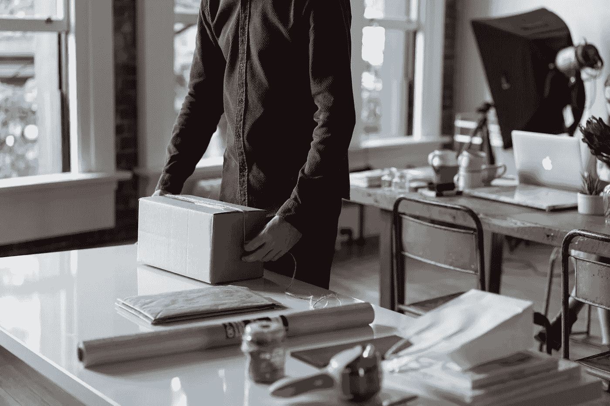
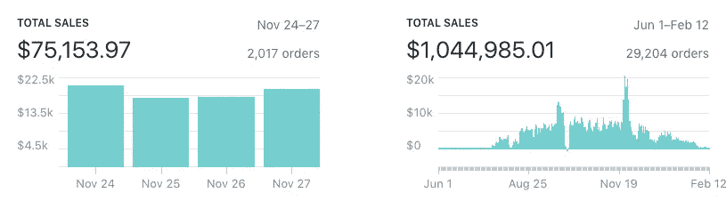

# 我是如何赚了 100 万美元却在 9 个月内输掉的

> 原文：<https://medium.com/swlh/how-i-made-1-million-and-lost-it-in-9-months-2a5126f3b19c>

Photo by [Bench Accounting](https://unsplash.com/photos/MGaFENpDCsw?utm_source=unsplash&utm_medium=referral&utm_content=creditCopyText) on [Unsplash](https://unsplash.com/search/photos/ecommerce?utm_source=unsplash&utm_medium=referral&utm_content=creditCopyText)

# **这怎么差点没发生。**

这一切都始于 2017 年 2 月。我注意到我的朋友在 Snapchat 上发布了他正在创办的一项新业务(是一家直运公司)。我回复了他的一个 Snapchat 故事，说“这家伙看起来很酷。”他回答说，“这太神奇了，我需要展示我在做什么。”我们一起吃午饭，他把一切都告诉了我。我喜欢它！这些年来，我创办了几家公司，比如约会应用、iPad 租赁公司等。我在找新的副业。我去工作，创建了自己的 Shopify 商店，从全球速卖通进口所有我认为很酷的产品。这是一个面向男人的网站，我卖的都是木制的东西，比如太阳镜、领带和手表。我做了一些广告，以为我会赚很多钱。不幸的是，我在三周内只卖出了三条木领带。我一直在研究，想知道我做错了什么。我的好友一直在 Snapchat 上发帖，展示他所取得的所有成功。我把手伸向我的朋友，告诉他我正在做的事情和我取得的小小成功。然后，他告诉我，他想满足我，让我看看幕后。此时，我告诉了我的一个同事我正在做的事情，他也想加入。我安排了我们三个人的会面。我的朋友概述了具体细节，如如何设置您的 Shopify 商店进行转换，如何找到产品，以及如何通过脸书运行广告。我和我的同事疯狂地创建了一个新网站并测试新产品。我们找到了赢家！*我不能透露我卖的是什么(你以后会知道为什么)。该网站在 2-3 周内逐渐增长到每天 300 美元。有一天，我在听播客“我是如何建立这个的”，盖伊在采访塞缪尔·亚当斯的创始人吉姆·科赫，吉姆说了一些让我印象深刻的话。他说*，“真正危险但不可怕的是留下来继续做我不再喜欢的工作。这不是我的激情。我继续这样做了 30 多年，在我职业生涯结束的时候，我说:‘哦，我的天哪。我浪费了我的生命，‘那很危险。’*我不喜欢我正在做的事情，我想全职为自己做点什么。所以，我辞职了。我没有从生意中拿出任何钱，因为它收支平衡，而且我认为我有足够的积蓄。快到五月底的时候，我以为我的钱要用完了。我太紧张了，胃也不舒服，所以做出了如此轻率的辞职决定。

Screenshot of bank statement at the end of March

四月，我去鲍威尔湖钓鱼。开车去的前一天晚上，我压力非常大，知道我不应该去钓鱼，因为我没有钱。在我开车下来的路上，我不停地想，我还有最后一次努力来完成这项工作。所以，我在一个卡车停靠站停下来，打开我的手机热点，拿出我的电脑，制作了一堆新的脸书广告。在湖上的短暂时间里，我能够摆脱对金钱的担忧，享受钓鱼的乐趣。第二天，我们回到羚羊点码头，我的思维开始加速，我开始为钱和网站感到压力。当我越来越靠近海岸时，我终于得到了服务，我的手机开始疯狂地嗡嗡作响，发出嚓嚓的声音(销售滚滚而来)。那个星期六，我赚了 1000 多美元，我对自己说，该是玩游戏的时候了！

# 该死的痛，但我现在自由了。

我的电子商务网站继续增长，并带来了资金。我做得很好，人们开始注意到了。我的朋友 JB 想和我一起创办一个网站(他和我在几年前创办了约会应用 Tether)。我想当然，为什么不经营两个网站，赚双倍的钱。我们花了大约一个月的时间才找到一款获奖产品。网站比我第一个炸得还快(此时我知道自己在做什么)。我们最终开始在这个新网站上每天赚大约 6000 到 8000 美元。我的第一个网站做得不好，我想退出，因为我觉得我的商业伙伴付出的努力很少。我不知道该如何告诉他。我记得有一天我和他坐下来，表达了我所有的沮丧，在我们谈话后，他开始努力工作。我以为我会改变主意，不再想退出，但大约一周后，他又开始几乎什么都不做了。他只是专注于其他商业理念。沮丧之余，我想出了卖掉我那一半生意的主意。我向他提出了这个想法，我们开始谈判条件。与此同时，我决定建立一个竞争网站，这样我就不会损失任何收入(我知道这是见不得人的)。他发现了这个网站，很不高兴。他偷偷把我从所有的东西里拿走，然后付了我们说好的 1.5 万美元(这个价格被低估了)。我无法访问任何与我们网站相关的账户，他写信给我说，他发现了我在做什么。我没有从这笔交易中赚到钱，但我觉得肩上的重担卸了下来(我自由了)。我知道我只能责怪我自己，我对他没有怨恨或恶意(我对事情的发展感到抱歉)。我学到了宝贵的经验，明白了健康的伙伴关系有多重要，交流有多重要。此外，诚信很重要，你不想为了快速获利而失去它。*这就是为什么我不想在第一段告诉你我们卖的是什么#nomoredrama。

# **辉煌的日子。**

所有的戏剧性事件和压力都抛在脑后，我去工作了(实际上一天工作了 16 个小时)。我们在压榨它，每天赚 1 万到 1 万 2 千美元！一天，我们收到了一封来自当地一家精品店的停止通知函。因为我们用了他们的照片。我们所有的照片都是从全球速卖通的供应商那里得到的，我们太天真了，我们不知道我们侵犯了版权。我们停止了所有这些产品的广告，继续前进。我们发现了一些新产品，并开始再次粉碎它。在黑色星期五周末，我们赚了$75k 多一点。我高兴极了。我们雇了我姐姐来处理订单，还雇了一名助理来做我们所有的客户服务。这个网站基本上是自动运行的。从 12 月到 1 月，我们一直保持着成功。在 8 到 9 个月内，我们的总收入超过了 100 万美元。我们以为没有什么能阻止我们。

Screenshots of my sales from Black Friday weekend and total revenue

# **结束的开始。**

记得那封停止信吗？是的，他们回来了，他们想要血。我记得这一天就像是昨天一样，我正走出我的房子，一位女士从她的卡车里走出来。她走近我，问我是不是唐尼·哈丁，我说是的。她递给我一叠文件，说你被送达。我们一点也不知道我们仍然有一个带有他们图像的重定向广告(是的，我们真笨)。我以前从未被起诉过，我不知道会发生什么。我们四处打电话，直到一位律师接电话，愿意和我们谈谈。我们希望我们所要做的就是回应并讲述我们的故事，一切都会好起来。但事实并非如此。他们的律师很固执，不愿意和我们合作。我们很快发现自己陷入了一场诉讼之中，看起来唯一的结果就是破产。我们现在正接近诉讼的尾声，希望有一个解决方案。它造成了太多的压力和焦虑，我们最终关闭了网站。我们没有给予它所需要的关注，它损失了很多钱。这是一次充满挑战、课程、努力、戏剧和快乐的有趣旅程！

# **我现在在做什么。**

我已经把我的时间和注意力转移到一个新的创业公司，我命名为[凌晨 3 点反弹](http://www.3amrebound.com)，这是一种治疗可怕宿醉的饮料。我仍在做电子商务，但我像躲避瘟疫一样避开全球速卖通。我想创造一个独特的产品，解决一个真正的问题。一个我可以从零开始打造的品牌。我不想与国际供应商打交道，也不想忍受令人难以忍受的运输时间。我讨厌顾客因为他们收到的产品质量差或他们的物品在邮寄过程中丢失而生气(后来发现供应商从未寄出)。出于这些原因，我已经选择远离全球速卖通的直运。我走在人迹罕至的路上。在这里，我必须创造自己的配方，寻找制造商，培育市场，发起众筹活动等等。我很高兴走上这条道路，并期待着未来的挑战。

在这里看看我的新开始:【www.3amrebound.com】

**我希望得到你的反馈。**

**跟随我在这里记录我的新旅程: [**脸书**](https://www.facebook.com/discoverdonny)[**insta gram**](https://www.instagram.com/discoverdonny/)**

****

## **这个故事发表在 [The Startup](https://medium.com/swlh) 上，这是 Medium 最大的创业刊物，拥有 331，853+人关注。**

## **在这里订阅接收[我们的头条新闻](http://growthsupply.com/the-startup-newsletter/)。**

****