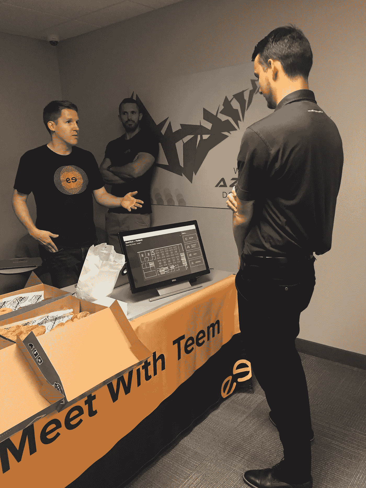
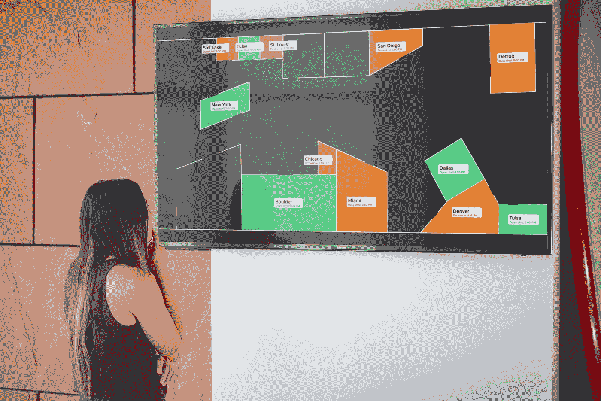

# 我如何把一个想法变成一个产品

> 原文：<https://medium.com/swlh/how-i-productize-an-idea-a7dafee247ac>

## 10 个步骤，告诉你如何将一个想法分解成实质内容，建立它，并将其投入市场。

创业产品经理的角色是制定产品战略，研究和定义产品，并协调产品从开始到上市的战术执行。下面是我将一个想法推向市场的过程。

每一步都有很多变化。我不会深入讨论这个问题，相反，我将向您概述我的过程，以帮助那些经验较少的人更好地理解日常事务。

# 我该怎么做

在 Teem，我们制造产品，让员工在办公室工作更轻松。在下面的例子中，当我说*【空间】*时，我指的是办公室内的空间——比如会议室。

## **(1 日)理解并分解思路:**

> 找到并使用正确的空间应该是没有摩擦的。

他的想法来自于我们早期的一次产品会议。这个想法是针对我们为员工提供的工作场所工具领域的。你会有完全不同的想法，但可以用类似的方式分解它们，以了解要运送什么。让我们把这个想法分解成一些具体的东西。

> **寻找:**员工/用户必须找到一个空间。他们现在是怎么做的？将此工作流程应用于相邻的建议。我们用什么方法来寻找其他东西？找到一个会议室与在机场找到你的登机口或者在你会见朋友的酒吧找到你的登机口有什么相似之处？
> 
> **使用:**用户寻找空间有明确的目的。人们使用空间的方式不同，不同的空间有不同的用途。有哪些模式？我们能把这些模式分成底层结构或心智模型来理解我们的用户是如何思考的吗？
> 
> **右空格:**这个和上面那个差不多(用)。然而，它表明，至少在某些情况下，可能存在“错误的”空格。
> 
> **应该:**应该！=必须。“应该”意味着过程/经验中某种程度的可接受的缺陷。
> 
> **无摩擦**:今天是什么体验？是什么导致了摩擦？有什么摩擦可以消除？

## (2)从高层次回顾用户的当前体验。

如今，大多数员工通过三种方式找到会议室。首先，他们从椅子上环顾四周，看看哪些房间是开着的。第二，他们在 Outlook 中比较房间时间表，以查看哪些没有安排。问题是——日历大约有 65%的准确性。最后，他们在办公室里走来走去，直到找到一个开着的房间，经常偷窥房间，看看它们是否开着。

## (3)将当前用户体验与想法融合。

从那次经历中可以消除哪些摩擦？让我们把重点放在移动用户上，他们在办公室里走来走去寻找房间。为了消除漫无目的的搜索，用户需要知道适合他们需求的可用房间。然后他们可以直接走到**右边的**空间，**使用**它，而没有检查其他空间的**摩擦**。

> 目标**:用户知道正确的空间，知道它是否可用，并且知道如何到达那里——尽可能的快速和轻松。**

现在，您已经有了一个想法，并为单个产品或功能创建了一个产品愿景。要在第 2 步和第 3 步取得成功，你需要非常了解你的用户。如果你没有——开始面试他们。

## (第四)构思和协作

构思很有趣，因为你可以想出各种各样的想法，然后反复思考。我建议看看邻近的行业，找到你可以应用到你的微观世界的模式和相似之处。确保在这些会议中包含多种学科，这样你就可以从不同的角度受益。关于如何做到这一点，有大量的参考资料，所以我就不赘述了。一旦你想出了解决方案，困难的部分就开始了。

## (5)定义产品，集结队伍

从这里开始是黄铜钉——本质——杂草；如果不小心的话，这也是许多项目经理不知所措和分心的地方。

从产品需求和设计开始。产品需求概述了你要解决的问题和用户故事。它应该包括功能行为、边缘案例的澄清，以及您的工程团队需要的任何其他需求。*您的详细程度取决于您的工程团队——做他们成功所需的事情。*

然后促进工程讨论，让他们对产品的影响感到兴奋。你必须了解工程团队是如何考虑解决这个问题的。工程的创造力将影响你的产品和设计决策。

**关于召集团队**:不管他们是想要简历上的东西，还是为自己做了有价值的事情而感到欣慰——人们都想从事有意义的产品。将他们团结在他们所能产生的影响周围。

## (6)测试和销售

接下来，原型化，测试，迭代，直到你有了用户觉得直观有价值的东西。测试和迭代不仅改进了你的产品，还在你的团队中建立了可信度。 [*摩根·威廉姆斯*](https://medium.com/u/3187009faa6a?source=post_page-----a7dafee247ac--------------------------------) 是我的 UX 合伙人，他在这方面极具天赋，这对我帮助很大。他如此优秀的原因是他对自己所观察到的和假设的有自知之明。他也练习了很多来提高他的技术。投入你的时间来学习如何做好这件事。

在测试的同时，你需要推销这个产品的想法、策略和影响。这种交流应该包括对你的组织重要的项目。一些人非常依赖定量分析，而另一些人则期待一份关于它将如何影响公司使命的报告。弄清楚你的公司需要什么，并提供给他们。

## (7)分解工作

坐下来与工程人员一起研究单个项目的里程碑。里程碑分解成开发者将构建的单个标签/故事。在一家初创公司，你可能需要与一名工程主管合作，因为你没有项目经理。

## (8)协调跨团队执行

协调跨团队执行有很多因素，但最重要的因素是你清晰有效地沟通的能力。实际上，意味着其他人理解你。如果他们没有，那是你作为产品经理的错，而不是他们的。你拥有这个产品、沟通和时间表。

> 协调跨团队执行有很多因素，但最重要的因素是你清晰有效地沟通的能力。

## (9 号)测试版

一旦你有了一个可用的产品，你通常需要对它进行 beta 测试。我仍在学习如何运行高效和有效的测试程序。到目前为止，我运行的最好的测试程序与测试人员进行了一致和频繁的交流，有良好的数据来了解使用情况，以及我们可以应用到产品中的明确定义的学习。

## (10 日)—组织并执行上市计划

上市很牛逼。我已经有机会这样做了很多次，每次我都根据我一路上学到的东西做了一些轻微的改变。**关键是沟通，知道什么能引起你的市场的共鸣。希望你有营销和销售资源来帮助你。这些讨论应该从第 5 步开始。**

## 最后——追踪并让自己负起责任

你做了正确的决定吗？诚实，最好是——用数据展示关于产品性能的客观报告。很多创业公司没有可靠的使用数据。在这种情况下，请拨打销售和支持电话。找出谁在使用它，以及他们的体验如何。从这些对话中获取数据并报告。

# 进化的交流

在整个过程中，你需要与公司就你的产品进行沟通(你所做的决定，它的状态，等等)。).每个创业公司都不一样，每个团队都不一样。了解每个团队如何沟通，并根据他们的需求改进您的沟通方式。创业公司变化也很快，所以要学会快速进化。

# 那么…我们建造了什么？

我们构建了一个界面，显示一个办公室的地图或列表，房间和其他空间用绿色或红色表示，表示实时可用性。公司将它挂在办公室的电视上，用户只需走过它就能知道正确的空间，知道它是否可用，并知道如何到达那里。

我们称之为飞行板。

early prototype of Flightboard

这份工作是我所知道的唯一一份既需要远见又需要策略的工作。其他团队依靠您来了解他们的愿景和当前面临的挑战。作为一名初创公司的项目经理，我已经失败了很多次，必须快速发展才能跟上。我学到的是，最终，产品管理通过为其他团队服务来领导一个组织。

> -达尔

**感谢阅读！如果你觉得我的漫谈很有帮助，那就继续说吧👏这样别人就能找到了。**

## 这篇文章发表在[《创业](https://medium.com/swlh)》上，这是 Medium 最大的创业刊物，拥有+383，380 读者。

## 订阅接收[我们的头条新闻](http://growthsupply.com/the-startup-newsletter/)。

