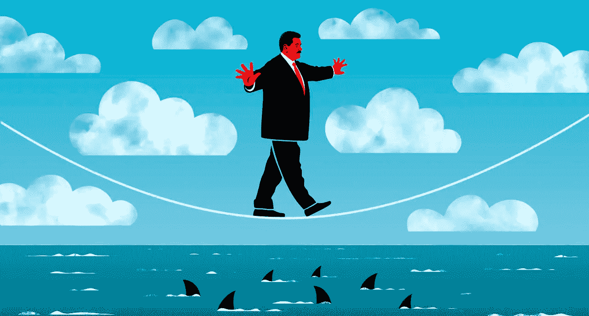
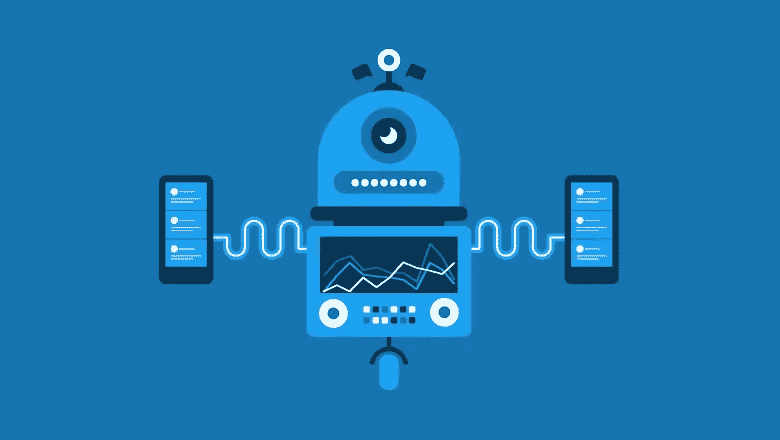

# 我是如何在 LinkedIn 上获得数百万次点击的

> 原文：<https://medium.com/swlh/how-i-racked-up-millions-of-views-on-linkedin-9426d59f251>

Image Credit: [Twenty20.com](https://www.twenty20.com/)

2014 年，我开始在 LinkedIn 上写帖子。他们都糟透了。其中大部分都是对他人内容的再分享。

那时我对商业的想法是天真、愚蠢和自我驱动的。这正是我在 LinkedIn 上所做的一切的问题所在。

都是关于我的，因为那是每个人都在宣扬的。我在听别人说话，而不是听自己的直觉。

我在 2016 年改变了这一切。

这让我在 LinkedIn 上获得了数百万的浏览量。

## 我是这样做的，一步一步来:

# 第一步:试着帮助一个人。

我也想在第一天帮助数百万人。这是不可能的。不要再看那些总是告诉你“有巨大影响”或“胸怀大志”的图片了这完全是社交媒体和入门的废话。

相反，写这篇文章的时候，心里要想着一个人。你能回答的一个问题是什么？谁会从这个答案中获益最多？

我也是这么问自己的。

当我在工作中指导一名毕业生时，我会以 LinkedIn 帖子的形式为他们写解决方案。

当社交媒体负责人问我对数字营销的看法时，我会以 LinkedIn 帖子的形式写下答案。

> “我开始时只想一次帮助一个人”

最终发生的是，这些答案不仅仅适用于我写信给的那个人。这就是你如何克服做第一个帖子或试图帮助一个人的心理障碍。

# 第二步:拍摄不是你最好的视频。

要原始、真实、真实。

这就是为什么我在拍摄视频时，用的是普通的光线，或者眼睛周围有黑眼圈，或者穿着睡衣，或者没有梳头。这就是我最原始的样子。**所有完美的灯光、排练过的剧本和没有失误都意味着一件事:**

“你看起来不真实。”

我的这个建议可能惹恼了世界上所有的 YouTube 名人。

所有写得完美的帖子、拍摄得精彩的视频和令人惊叹的照片都在让我们看到一些不像现实的东西。最终，我们对完美变得麻木，并放弃了真正重要的东西:

你如何能帮助我们所有人？

好吧，我再说一遍。只是想确定你没有忘记我的观点。

# 第三步:分享对你没有任何好处的帖子。

有人需要工作吗？帮助他们。有人需要为他们的生意筹集资金？帮助他们。

**分享那些帮助他人并且是你所相信的观点的帖子。**在 LinkedIn 上帮助他人是你最终接近自己目标的方式。你帮助的那些人会成为你的拥护者。

当有人试图欺负你时，这些你帮助过的人会在你没有要求他们的情况下介入。

如果你的账户被黑了，你帮助过的人会告诉你。

如果你失去了所爱的人，或者在职业生涯中经历了一场灾难，这些人会是第一个伸出援手的人。

> “最终，你在 LinkedIn 上变得更强大是通过帮助别人变得更强大，并做一些对你没有好处的事情”

# 第四步:职业自杀。

你可能不相信我说的话。为什么会有人叫你这么做？很简单:**现代商业世界中的职业自杀是关于脆弱和表露你的情绪。**

Image Credit: [The Economist](https://www.economist.com/the-americas/2018/08/09/a-failed-drone-attack-shows-that-nicolas-maduro-is-vulnerable)

这是关于分享你在演讲前被吓得魂不附体的时刻。

这是关于分享你是如何在那些有可能雇佣你甚至在你想去的公司工作的人面前被拒绝的。

而是彻底反思你曾经做过的所有事情，做一些完全不同的事情。

> 这是关于不要试图复制别人的成功，从而让你喜欢别人。

# 第五步:忽略 LinkedIn 算法在做什么。

不要试图玩弄算法。

你并不比人工智能或 LinkedIn 这样的机器聪明。不要试图那样做。忘记病毒视频；忘记了短帖的最新动向；忘了用迷因搞笑吧。

> Linkedin feed 的唯一诀窍就是做你自己，同时帮助一些人。

追逐算法只会导致不作为，抄袭，不是自己，无聊和所有你不想要的垃圾。

Image Credit: [Sprout Social](https://sproutsocial.com/insights/twitter-algorithm/)

# 第六步:不要在社交媒体上重复分享你的帖子。

这会分散你的注意力。这让你关注了太多的平台。你只有一个人，也许你的职业生涯已经够忙的了。

**选择一个社交媒体平台，并在那里发帖。**

重新分享被高估了。在一个平台上发布的内容在另一个平台上通常没有意义。你不需要在脸书、Instagram、Snapchat、Twitter 等网站上取悦社交媒体之神。你只需要一个帮助别人的平台。

# 第七步:忘掉个人品牌。

我从未见过有人被某人的个人品牌所激励。

不要用那个短语。看在上帝的份上，停下来！

没有人会上 LinkedIn(或任何其他平台)去听你的个人品牌和你如何让自己看起来不错。毫无意义 x 1000。

放弃创建个人品牌。
抛开你的自我。
不要担心虚荣的衡量标准。

帮助别人。对人好。支持你相信的事业。帮助别人，帮助别人，然后帮助更多的人。

> “找出人们正在处理的问题，然后以故事的形式分享你的解决方案”

从等式中去掉你的自我。

# 第八步:忽略影响你发布内容的分析和数据。

这些是干扰。谁在乎你有多少份额或浏览量。我再说一遍:重要的是你是否帮助了一个人？

去吧。重复一遍。再做一次。这就是百万视图等式。浏览量反映了你帮助了多少人。

分析不能告诉你如何帮助别人——只有你能利用你的大脑和直觉做到这一点。分析中有太多的随机因素会让你偏离真相。

也许你贴的正是时候。也许某个拥有无数粉丝的人喜欢你的帖子。
也许你的帖子被某个出版物再次分享。

分析说什么真的不重要；重要的是你是否帮助了别人而不是你自己。

# 第九步:不要发布你和很酷的人在一起的照片。

去哪里吃饭，去参加什么活动，都不重要。*你是如何帮助别人的？你能教我什么？*

自拍只讲述了一个人的自我和随之而来的自我的故事。大多数人对此不感兴趣。

# 第十步:不要有导师或教练。

上 Linkedin 挠痒痒。忘了有策略或者听平台上做得好的人的话吧。

你搞清楚自己就搞清楚 Linkedin 了。

1.你是谁？
2。你要变成谁？
3。你如何帮助别人？
4。你克服了什么？
5。你学到了什么？
6。你知道什么别人不知道的事？
7。是什么激励了你？

这就是你需要回答的问题，在 LinkedIn 上追随他人，希望自己能追逐他人的成功是毫无意义的。

# 第十一步:放弃追逐趋势。

趋势不会持久。

趋势分散了你帮助他人的注意力。

试图像其他人一样追逐潮流是我在平台上迷失的原因。我开始尝试成为别人是因为潮流说要做 x。

Image Credit: [iStock](https://www.economist.com/the-americas/2018/08/09/a-failed-drone-attack-shows-that-nicolas-maduro-is-vulnerable)

> 真实的我很古怪，有点疯狂，有时很愚蠢，直言不讳，是内向和外向的混合体。事实证明，对人们来说，这比引领潮流、说我认为人们想听的话更有趣。已经有足够多的人这样做了。

趋势是荒谬的。做一些持久的东西。

# 第 12 步:用一句话作为你能提供帮助的标题。

*不是“成长专家”
不是“战略顾问”
不是“获奖”*

用 LinkedIn 给你的一句话来描述你的标题，谈论你如何帮助别人。把它和你痴迷的东西联系起来。通过企业家精神和个人发展激励世界。

这就是我帮助别人的方式，也是我喜欢的，就像我 2005 年死去的小狗一样。你喜欢什么，你能提供什么帮助？

永远记住这不是关于你的。

# 行动呼吁

如果你想提高你的工作效率，学习一些有价值的生活窍门，那就订阅我的私人邮件列表吧。你还将获得我的免费电子书，它将帮助你成为改变游戏规则的在线影响者。

[**点击这里马上订阅！**](http://timdenning.net/free-ebook)

## 这篇文章发表在 [The Startup](https://medium.com/swlh) 上，这是 Medium 最大的创业刊物，拥有+383，380 名读者。

## 订阅接收[我们的头条](http://growthsupply.com/the-startup-newsletter/)。

