# 我如何通过 AngelList 在两周内从 61 个投资者那里筹集了 40 万美元

> 原文：<https://medium.com/swlh/how-i-raised-400-000-in-two-weeks-from-61-investors-through-angellist-525c65869ecf>

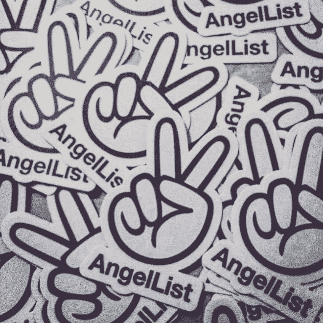

## 从通过 AngelList 筹集资金的起起落落中吸取的教训。

# **简史:**

很长一段时间以来，我一直试图让我的一个创业公司出现在 AngelList 上。2011 年，我第一次尝试了之前的一家公司，第一次被拒绝了:

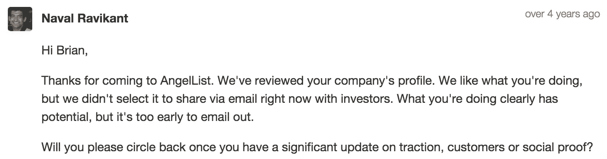

“too early” is a common theme throughout this blog post.

我确实绕了回来，但是我们的指标从来没有重要到足以被报道的程度。

那时，我和 AngelList 的总部住在同一个公寓大楼里。从他们的办公室可以直接看到一小块土地，只有从我住的单元才能到达。

每天当我带我的狗出去做日常工作时，我可以看到 AngelList 团队在努力工作，我每天都被提醒，我的公司不够好，不能在 AngelList 上被看到…即使他们每天都看到我。

# 极乐辛迪加——追求

自从 5 年前我第一次尝试成为主角以来，AngelList 模式已经发生了巨大的变化。如今，筹集资金的最佳方式是通过 T2 的一个辛迪加。

今年 5 月，当[布利斯](https://founderbliss.com/)第一次开始努力[筹集种子资金](/@brianyork/time-for-a-seed-round-dbf7820c2b1f#.43x7tqpit)时，我希望 AngelList 成为整体筹资战略的一部分，但我知道我们*太早了*无法找到一个投资者来领导我们的辛迪加，我们只创造了 1000 美元的收入，没有投资者(我们是自筹资金的)，但我想开始播下种子。

我立刻想到 SaaS 财团是一个很好的目标。我一直在积极跟踪他们在 AngelList 上的投资活动，我知道这个辛迪加在资助早期经常性收入创业公司方面很活跃。

经过进一步研究，我确定了[凯尔·约克](https://www.linkedin.com/in/kyork20)，他是 SaaS 财团的创始人之一，也是总部位于 SaaS 的互联网表演公司 [Dyn](http://dyn.com/) 的首席战略官。

对我来说最突出的是他在 AngelList 和 LinkedIn 上收到和给出的推荐信。结合他的推特信息(我做了彻底的尽职调查)，我觉得我已经认识他了，尽管我们从未交谈过。更不用说，他有一个如此神奇的姓氏…我们注定要一起工作！

我梳理了一下通讯录，发现了一段温馨的介绍:

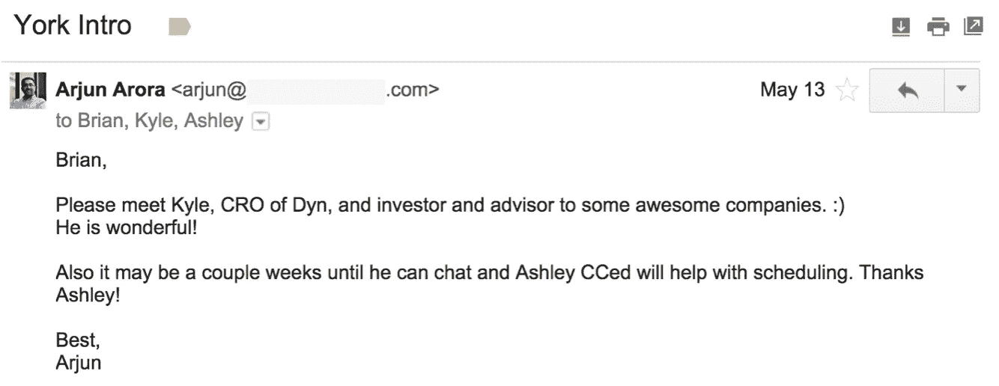

Thanks for the intro, Arjun, but am I wonderful too??

上述电子邮件通信是由凯尔的行政助理阿什利处理的，而不是凯尔本人。我们已经安排了一次电话介绍，但是凯尔改了三次时间…通过阿什利！

我们终于在 6 月 9 日接到了电话。这是一个简短而甜蜜的 18 分钟电话。凯尔表现出一点点兴趣，但告诉我们，对 SaaS 财团来说，我们还为时过早，并建议我在布利斯达到每月 8k 美元的经常性收入时再与他联系(MRR)。

不是一个很好的开始，但至少我有了一些方向。

## 毅力

许多企业家在这里会感到气馁，但我确保了凯尔对我的关注。在接下来的几个月里，我让凯尔了解相关的业务更新，并通过 Twitter 与他进行交流。当我们在 10 月份(5 个月后)达到 8k MRR 时，他开始对极乐世界表现出兴趣。

这一次，凯尔更深入地了解了业务，并对我们正在做的事情感到兴奋。凭借 8k 美元的 MRR 和强劲的月环比收入增长，Kyle 向 SaaS 财团展示了 Bliss，但最终他们认为 Bliss 对他们来说仍然为时过早。

我们决定通过 AngelList 筹集资金，并直接与凯尔合作，我们找到了一个解决方案——让凯尔亲自领导极乐辛迪加！不用说，凯尔接手这件事让我们很兴奋。他是我们一开始就想要的合作伙伴，5 个多月的耐心和承诺得到了回报。我们的主要投资者在 AngelList 上筹集资金！

# 从零开始

通过辛迪加进行第一笔交易的一个潜在缺点是，它可能还不够成熟，不足以吸引大量投资者参与交易。随之而来的是更多的基层努力来提高意识。

凯尔在 10 月 12 日开始了他的辛迪加，我们开始努力争取支持。在接下来的几周里，我联系了我的联系人，请他们加入凯尔的辛迪加。

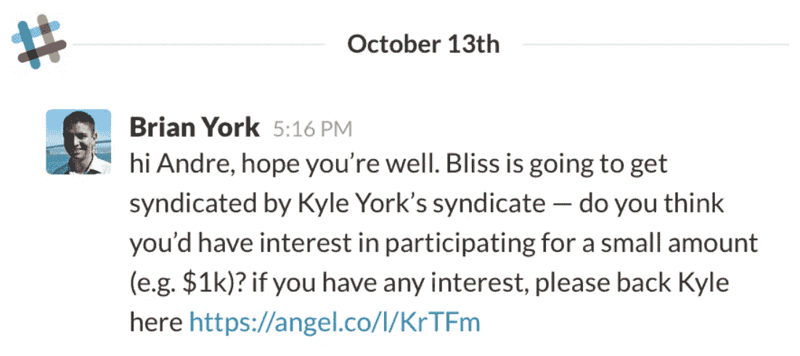

I sent messages to my contacts through Slack, email, LinkedIn and more.

对我来说，这是一次不成功的竞选活动，但我学到了一些重要的经验，这些经验应该对那些发现自己处于类似情况的人有所帮助。

因为 AngelList 还没有批准 Bliss 的交易，没有直接的联系让投资者对 Bliss 表现出兴趣或开始投资。我把不认识凯尔的联系人直接发给了他的辛迪加，辛迪加没有提到我的公司。最重要的是，大多数人并不太熟悉 AngelList 辛迪加是如何运作的，这只会让事情变得更加复杂。

***经验教训:等到交易被批准后再活！***

事后看来，作为一家即将被联合收购的公司的创始人，在交易生效之前，你能做的事情并不多；尽管你很想引起别人的兴趣。避免与你的联系人发生摩擦非常重要，所以最好等到交易得到 AngelList 的批准，并且有直接的联系让投资者投资你的公司。

另一方面，对我来说，有一件事做得很好，那就是直接与投资者交谈，让他们知道 Bliss 将很快在 AngelList 上上线。这让我能够衡量他们的兴趣，并回答任何问题，为辛迪加上线做准备。

# 审批过程

获得 AngelList 批准的极乐辛迪加也不是一个简单的过程。Kyle 花了几周时间与 AngelList 团队沟通，解释这个机会，带领他们了解我们的业务，并向他们展示他的新辛迪加有足够的支持，可以确保 Bliss 的成功筹资。

幸运的是，凯尔比我更成功地为他的辛迪加赢得了兴趣和支持。虽然我只有两个投资者注册，但 Kyle 从支持者那里将辛迪加发展到了 30 多万美元。

就 Kyle 和我协作简化管理流程而言，我们利用 Google Docs 为 Bliss 高效地创建了“交易概览”。这份概述发给所有支持凯尔财团的投资者，向他们解释投资机会——所以这是一项重要的任务和抵押品。

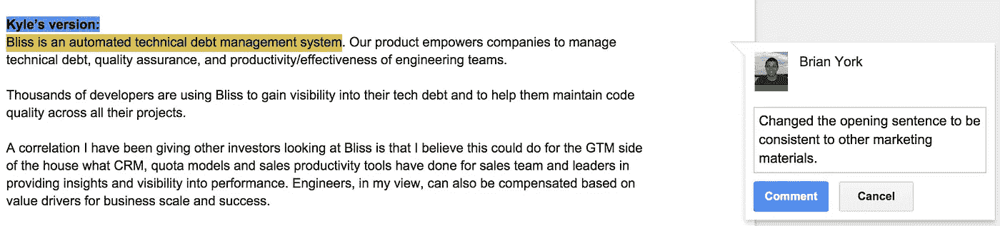

I use Google Docs for everything.

使用这种方法，我们能够在两天内完成报告。我强烈建议利用谷歌文档。

凭借超过 30 万美元的支持和我们的交易概述集，终于在 11 月 9 日，Kyle 的“极乐辛迪加”获得批准！

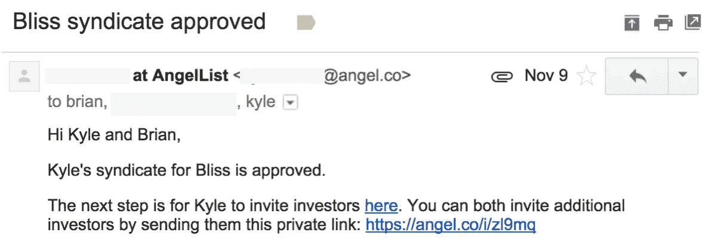

yay!

# 辛迪加发布——24 小时冲刺

11 月 10 日星期二，我们启动了凯尔财团投资极乐世界。

太平洋时间上午 9 点(凯尔建议这个时间，因为他觉得这是美国所有时区的最佳时间)，凯尔向大约 400 名在 AngelList 上支持或关注他的投资者发了一封电子邮件。令我们惊讶的是，我们在 5 分钟内从 8 位投资者那里筹集了超过 10 万美元！

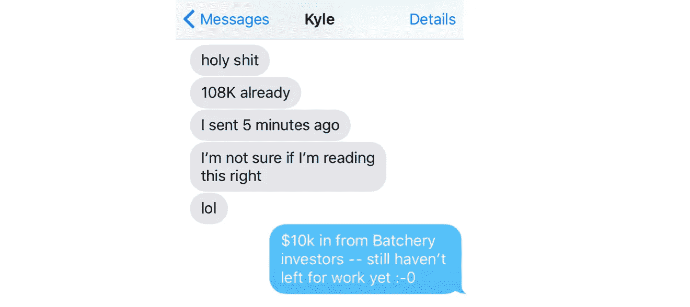

We communicated over text and phone calls all day.

我的直接策略是联系与我关系密切的投资者，包括来自[Batchery](http://batchery.io/)的投资者，他们已经通过 Bliss 的加速器项目投资了 Bliss，并且是我们团队的总部所在地。

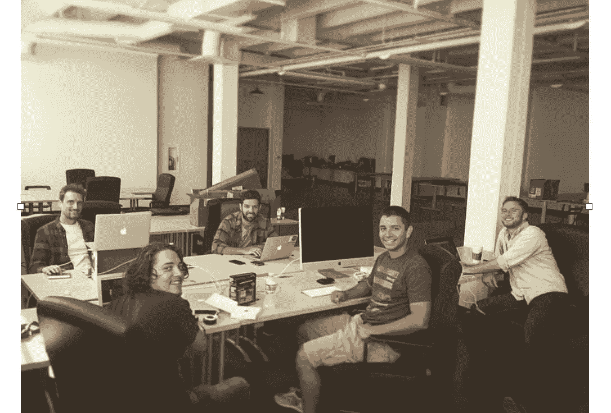

The Bliss team at The Batchery!

午餐时，我的几个联系人加入进来投资，我们筹集的资金总额增加到了**129，000 美元**。

火上浇油的是，我们有幸成为 AngelList 上的特色投资。我通过社交媒体、电子邮件和短信强调曝光率。

The first Tweet I posted for the day.

你不能计划出现在 AngelList 上。这纯粹是运气。这可能有助于我们在接近感恩节时推出辛迪加。一般来说，在假期筹集资金是很有挑战性的，所以可能是因为其他辛迪加为了避免交易缓慢而放慢了对新交易的投资。

我在电脑前一直呆到凌晨 2 点，确保迅速回复投资者发来的任何电子邮件，并联系下载了我们的推介资料的个人进行审查。

**提示*** *允许从您的 AngelList 个人资料中下载您的推介资料。这对于创造投资者线索非常重要。下面是我们在辛迪加*[【https://docsend.com/view/xgmz8hp](https://docsend.com/view/xgmz8hp)期间使用的卡牌

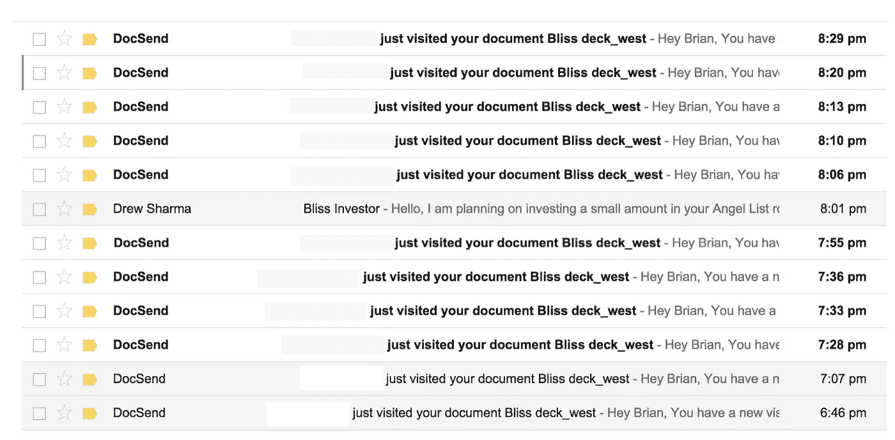

Screenshot from my inbox on day 1 of the syndicate.

在第一天，我们有 43 位投资者查看了我们的推介资料，我给他们都发了一封私人邮件。我拿到了由 [DocSend](https://docsend.com) 提供的他们的信息(姓名和电子邮件),并在 Twitter 和 LinkedIn 上找到了更多关于他们的信息。平均来说，每封*开头的*邮件要花大约 5 分钟来写，这是我为了增加个人风格而做的研究。在辛迪加的第一个晚上，我总共花了大约 3.5 个小时。

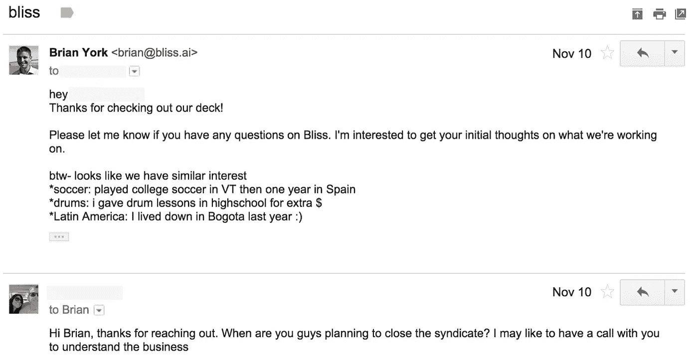

It takes time, but personalization wins!

# 第二天——混乱继续

我周三醒来发现辛迪加已经透支了 20 万美元！另外 15 名投资者投资了超过 5 万美元。

少数投资者完全是随机的，但其他人是我前一天晚上的电子邮件策略(来自 DocSend)的直接结果。个性化邮件收到了回报！

因为我们发起这个财团才 24 小时，我们觉得需求仍然很大，所以我们把财团的拨款增加到 25 万美元。

我又一次花了一天的大部分时间在电子邮件上——回答潜在投资者的一次性问题，并联系下载了我们资料的人。

更疯狂的是，一些辛迪加投资者出人意料地开始在推特上发布他们对 Bliss 的投资。

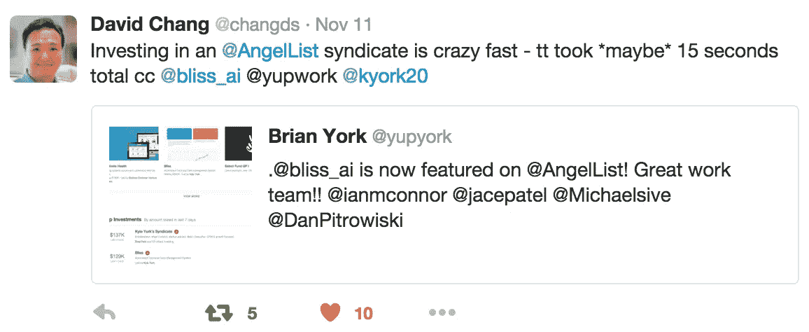

Thanks David, but my Twitter handle is @yupyork! Too much ‘work’ on your mind? :)

这启发我联系其他 Bliss 投资者，鼓励他们也提高对这笔交易的认识。

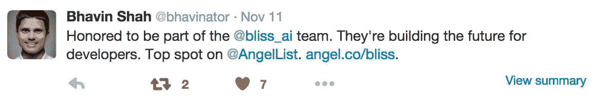

Bhavin was one of our first investors in Bliss a few months ago when cash was close to $0!

第二天结束时，我们从 29 位投资者那里筹集了 22.3 万美元。

# 第 3 天到第 6 天——大减速

鉴于过去 48 小时的势头，达到 25 万美元比我们增加金额时预期的要困难得多。

一小笔一小笔地流入……这里一千美元，那里一千美元。

我意识到我需要更进一步。我把周末的时间集中在投资者对话上，用 Skype 与来自新加坡、伦敦、迪拜的感兴趣的投资者通话。

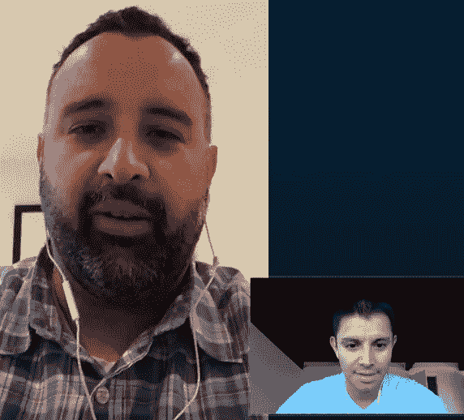

I always prefer to do video chats over voice calls — you get to know the person better.

前面有整整一周的销售会议(我妻子怀孕 40 周了！)我必须在周末让事情发生。

到周日(第 6 天)，我们从 42 位投资者那里获得了 25 万美元。

距离我们计划关闭该财团还有一周时间，我们的联系人仍有口头兴趣，我们请求 AngelList 最后一次将财团拨款增加到 30 万美元。

# 过去的一周——跌宕起伏

在这一点上，一个星期后，重要的内向投资者的兴趣结束了，但因为幸福仍然是 AngelList 主页上的特色，我们每天都产生一些新的投资者线索。

我没有采取随意的、喷雾祈祷式的推广策略，而是关注投资者的现有兴趣。我开始联系那些支持凯尔财团的投资者，但他们还没有决定是否投资极乐世界。

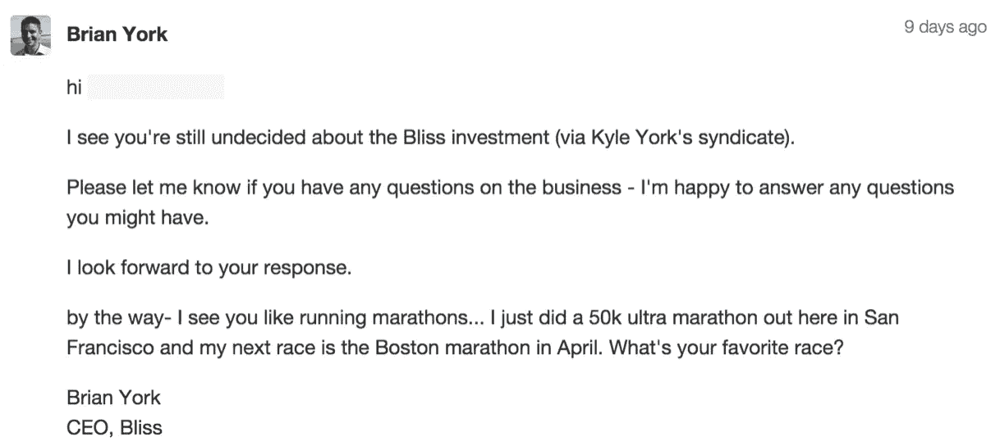

I just can’t do generic emails… I have to get in a personal touch!

我还联系了所有在 AngelList 上关注[我们个人资料页面](https://angel.co/bliss)的投资者。

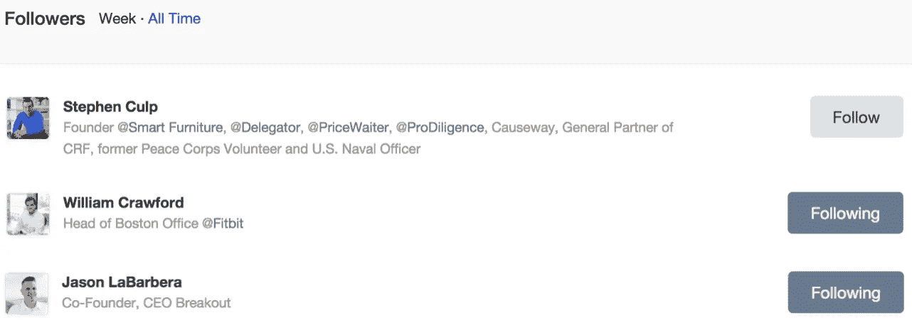

Screenshot of investors that have followed Bliss on AngelList.

这两种策略都带来了更多的投资者。

最终，对该财团来说，这最后一周是缓慢的，只有少数投资者参与了较小的金额。93%的投资来自第一周(那一周真是疯狂)。

虽然辛迪加本身在很大程度上放慢了速度，但它仍然在其他方面对我们的种子期产生了重大影响。在辛迪加成立之前，我投过几个天使投资人，他们还没有决定是否直接投资我们的种子期，最终决定投资！该财团帮助这些投资者获得了“是”。

**提示*** *它有助于在辛迪加收盘时结束你的一轮融资。这不仅会影响你一直在谈的直接投资者，还会帮助你管理你的时间和精力来筹集资金。*

## **在 AngelList 上两周筹款的最终结果:**

***>****26.8 万美元通过* [*凯尔·约克的辛迪加*](https://angel.co/kyork20/syndicate) *从 57 位投资者处募集。* ***>****140，000 美元来自我们种子轮的 4 个直接投资人。*

# 最后的想法和要点

虽然在短时间内筹集这笔钱对大多数人来说似乎很容易，但请记住，我花了 5 年时间在 AngelList 上亮相，并花了 5 个多月时间说服 Kyle 通过他的辛迪加投资 Bliss。

对于大多数创始人(包括我)来说，在 AngelList 上筹集资金不是一件容易的事情。就像一般的筹款一样，你需要一个好的故事、团队和吸引力，才有机会成功筹款。你还需要毅力和一点运气。

就像我说的，我为多家创业公司在 AngelList 上做了 5 年的特写。我追踪我们的辛迪加线索有半年了！一旦我们让凯尔感兴趣，我们仍然需要说服他亲自领导辛迪加(记住——SaaS 辛迪加拒绝了我们——“太早了”*)。*

*一旦我们开始，运气在我们的筹款成功中起了很大的作用。我们很幸运地在我们的辛迪加直播的整个两周时间里出现在 AngelList 上，这使我们的交易得到了很多关注，并引起了大量投资者的兴趣，否则我们很可能不会收到这些关注。*

***成功筹集 AngelList 辛迪加资金的秘诀**:*

1.  **选择了一个伟大的辛迪加领导*。凯尔简直棒极了。在 Bliss 辛迪加启动之前，他花了大量时间让投资者对交易感到兴奋，在交易过程中坚持不懈地努力，并彻底了解我们的业务(5 个多月的尽职调查！).*
2.  **在沟通上反应灵敏，考虑周到*。我特别注意快速回复所有的来信(当天)，并对所有信件进行个性化处理(通过研究每个人)。这得到了回报——毫不夸张地说！*
3.  *尽可能完整地填写你的 AngelList 个人资料。从今年 3 月我们推出 Bliss 的第一天起，我就一直在更新我们的个人资料，包括我们公司的完整细节、我们产品的多个截屏、新员工、收入等。当我们的辛迪加获得 AngelList 的批准时，这节省了我很多时间，因为我们所有的公司信息都是最新的。*
4.  *尽快关闭辛迪加。大部分的动力会发生在最初的几天，所以用简短的方式结束它，然后回去工作！极乐辛迪加开放了两周，感觉太长了，如果我再做一次，我的目标是一周。*
5.  *为许多“不”做好准备我的大部分私人联系人都说不，而事实是，你们中的大部分人也会这么认为。不要气馁。战胜逆境。坚持！*