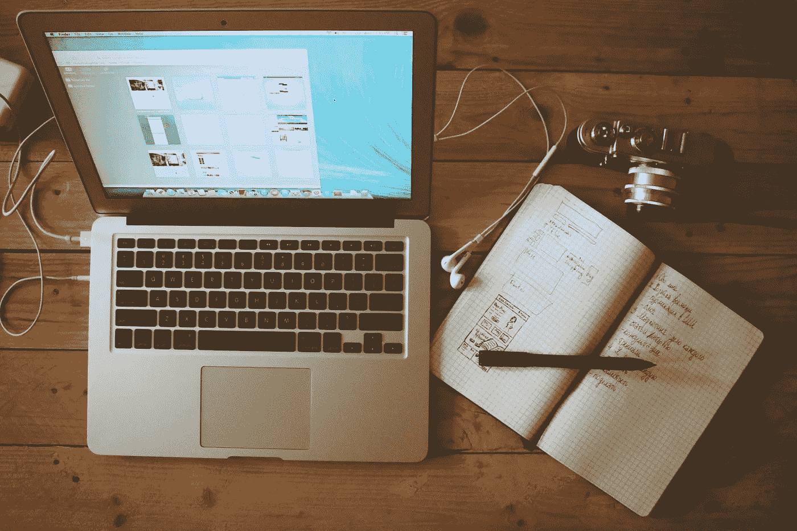

# 我如何更聪明地阅读并将知识转化为智慧

> 原文：<https://medium.com/swlh/how-i-read-self-improvement-articles-without-wasting-my-time-772aac8bf0a6>

世界上有三种人:

1.  那些阅读自助并采取行动让生活或自己变得更好的人。
2.  那些从一篇文章跳到另一篇文章却没有改变自己生活的人。
3.  那些不在乎自我提升的人。他们没有点击 clickbait 自助标题的冲动。即使他们…