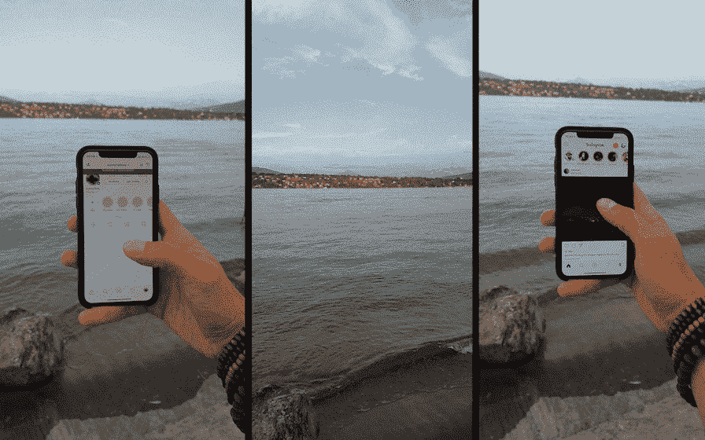
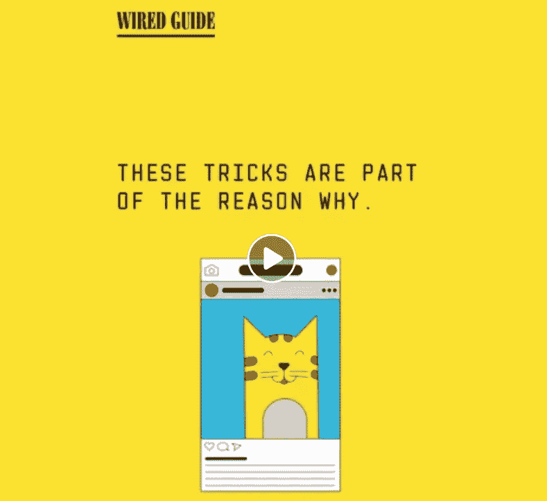
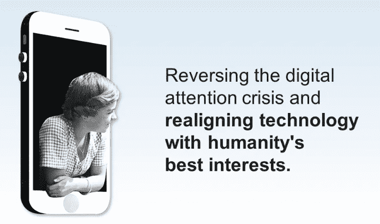
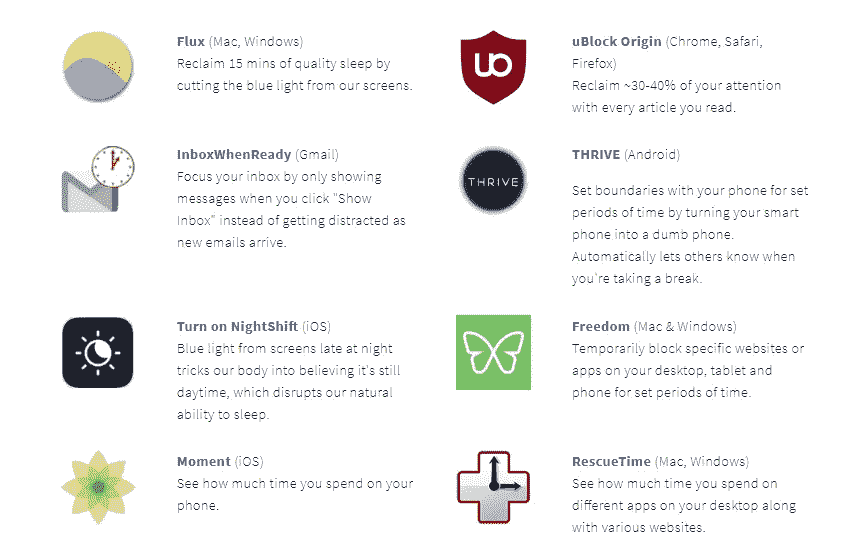

# 我是如何在不突然戒烟的情况下减少社交媒体成瘾的

> 原文：<https://medium.com/swlh/how-i-reduced-my-social-media-addiction-without-going-cold-turkey-1abcfaf7dfa4>

使用社交媒体而不被骗去浪费大量时间是非常困难的。

在我的笔记本电脑和手机上工作了一整天后，我想要的只是避免更多的屏幕时间，只是放松和享受日内瓦湖的景色。

但是当我看到帆船从欧洲最高的山前经过时，我就是无法抗拒。

抱着快速分享一张图片然后返回视图的意图，我打开了 Instagram。

但是打开 Instagram 远比关闭它容易。

那天剩下的时间里，我一直在查看自己的岗位。甚至当我不用电话的时候，我也一直用指尖触摸它。

根据调查公司 Dscout 的一项研究，重度用户平均每天触摸手机超过 5400 次。

如果你还没有，当你读到这里的时候，你可能会有一种强烈的冲动去检查你的手机。

有很多人建议彻底戒烟，干脆退出社交媒体。

但是在一个数据和算法正在改变世界的时代，我不认为辞职是解决办法——特别是如果你在社交媒体工作或者需要用它来支持一项业务。

具有讽刺意味的是，像互联网上的其他东西一样，建议你退出社交媒体的文章实际上是在社交媒体上阅读和分享的。

我的观点是:使用但不要滥用或被社交媒体滥用。

以下是我在不戒烟的情况下减少烟瘾的三个步骤。

# **1。意识**

直到我看了 TED [关于这个话题的演讲](https://www.youtube.com/watch?time_continue=1&v=C74amJRp730)，并开始研究社交网络到底有多让人上瘾，我才意识到这个问题。《连线》 [Wired](https://www.facebook.com/wired/videos/10155688857318721/) 的以下指南很好地总结了社交网络让你沉迷于其应用的方法。

[时间花得值](http://humanetech.com/)，由前谷歌员工[特里斯坦·哈里斯](https://en.wikipedia.org/wiki/Tristan_Harris)创办的非营利组织。它旨在提高对使消费技术上瘾的有意机制的认识。

意识到这个问题促使我愿意改变打电话的习惯。

# **2。培养新的社交媒体习惯**

在这个阶段，我学会了这些新的技巧和习惯，来帮助我减少在社交媒体上的时间:

1.关闭所有社交媒体通知。

尽管你的社交媒体通知可能感觉很紧急，但它们可能并不紧急。然而，你可能会选择在消息应用程序上保留通知，只在真实的人想要你注意时通知你——例如 Whatsapp。

2.对社交媒体上的回复和发布实行每日截止时间。

我发现非常有用的一个想法是社交媒体的每日截止时间。我会跟踪记录，这样我就可以每天看到我实际上花了多少时间在社交媒体上(浏览我的订阅)和创作(发帖、回复、回应)。

一旦你开始记下分数，你就可以决定你实际上想花多少时间在消费内容和创造内容上。

3.现在捕捉内容，稍后发布。

没关系-如果你的朋友明天才能看到它，他们会活下来。当我开始给自己设定每日截稿时间，并停止实时发帖时，我设法减少了社交媒体的使用。

我还观察到——给自己更多时间编辑它们——我的帖子质量更好了。我现在每天从晚上 8:00 到 9:00 花一个小时做以下事情:

*   编辑我的照片/视频
*   发布或安排帖子
*   回应意见和 DMs
*   浏览我的订阅源，喜欢、分享和评论其他人的内容

# **3。维护**

一旦你改变了一些习惯，学会了减少社交媒体使用的新技巧，你就需要继续努力防止旧病复发。这需要积极监控你的社交媒体使用，并对触发因素和诱惑保持警惕。

这些应用程序可能会帮助您跟踪您的手机使用情况，并在设定的时间段内阻止某些应用程序:

对技术的沉迷是苹果和 Instagram 等品牌已经开始解决的问题。苹果宣布了 iOS12 中的几个新的[功能](https://www.apple.com/newsroom/2018/06/ios-12-introduces-new-features-to-reduce-interruptions-and-manage-screen-time/)，以帮助对抗手机成瘾，Instagram 目前正在测试[工具](https://techcrunch.com/2018/05/15/instagram-usage-insights/)，以帮助跟踪时间和应用的使用情况。

所有这些工具和应用程序都很有用，但它们也需要你自己的主动性和纪律性来重新获得控制权。

尤瓦尔·诺亚·哈拉里(Yuval Noah Harari)在他的新书《德乌斯人》(Homo Japan)中解释了控制哪些东西该注意、哪些东西该忽略的重要性:“在 21 世纪，审查制度通过向人们灌输不相关的信息来发挥作用。[……]在古代，拥有权力意味着能够获取数据。如今，拥有权力意味着知道该忽略什么。”

控制你的社交媒体或者被它控制，编程或者被编程。

分享这篇文章有助于提高对社交媒体成瘾的认识，也许还能帮助一些人减少他们在社交媒体上浪费的时间。

## 这篇文章发表在《初创企业》杂志上，这是 Medium 最大的创业刊物，有 344，974 人关注。

## 订阅接收[我们的头条新闻](http://growthsupply.com/the-startup-newsletter/)。

