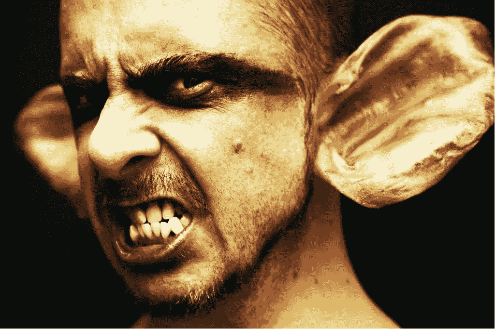
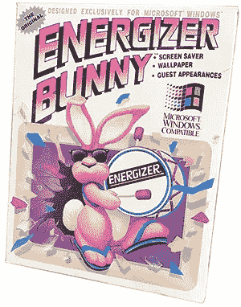
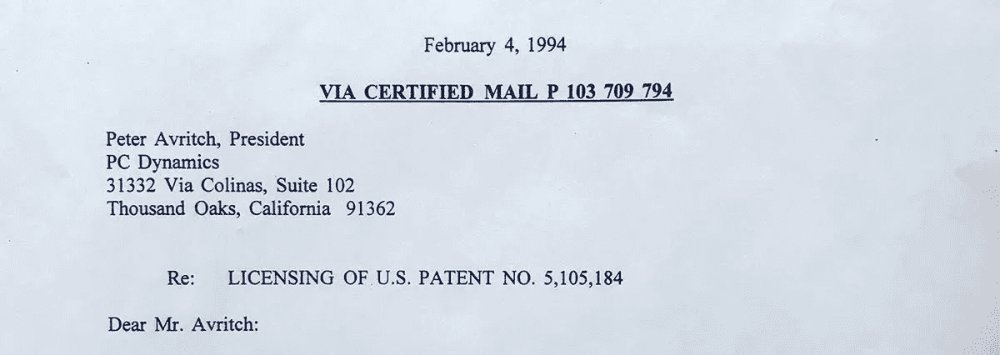
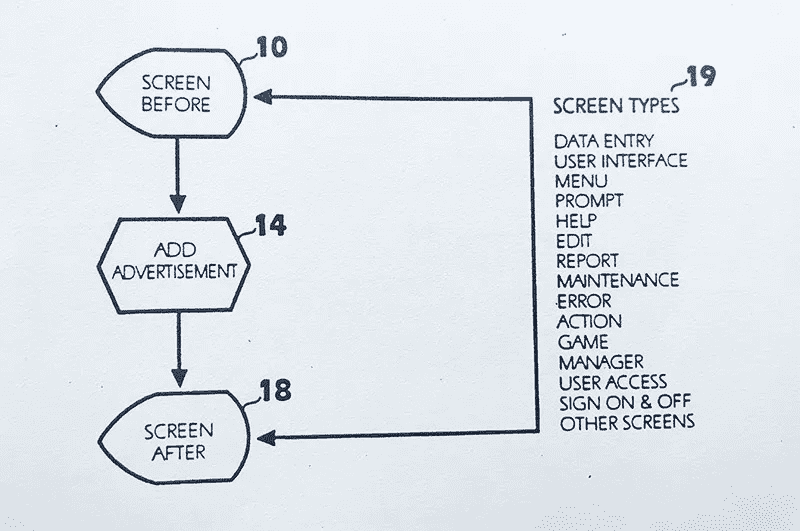
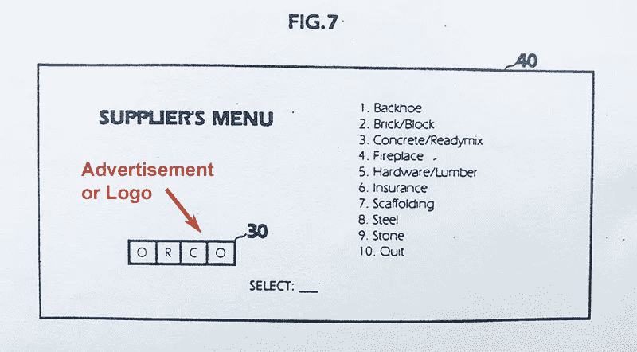
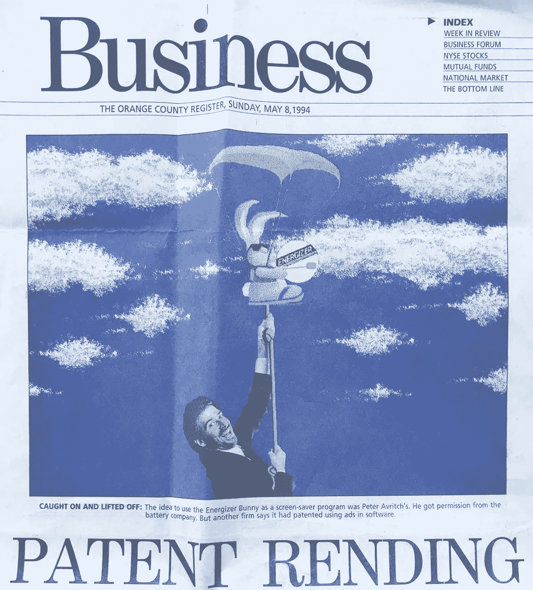
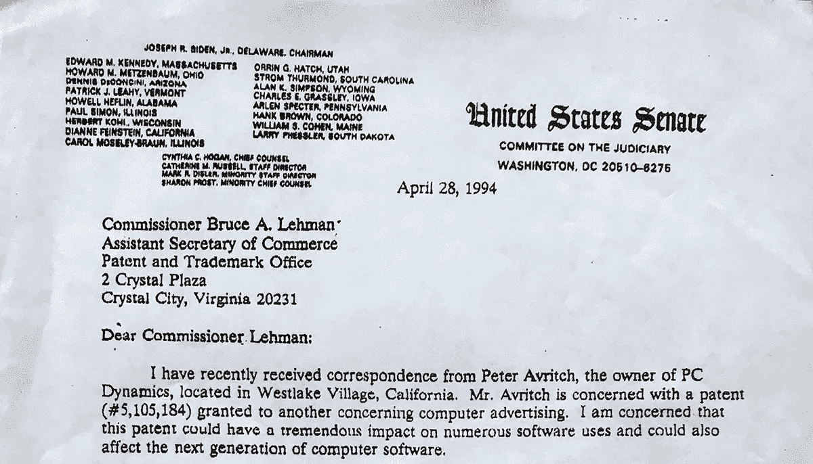
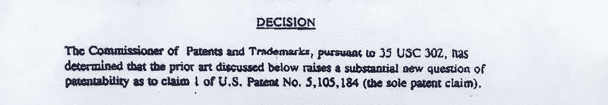

# 我是如何从十亿美元中骗走一个专利骗子的

> 原文：<https://medium.com/swlh/how-i-screwed-a-patent-troll-out-of-a-billion-dollars-2849cb3e248a>

## 对抗软件商标税

对于贪婪的混蛋来说，专利巨魔是异常狡猾的灵魂。没良心。没有道德。不用道歉。

你曾经被巨魔——马克——交过朋友吗？

它总是以同样的方式开始。你收到一封祝贺你成功的漂亮的信。我收到的是这样开始的:

> 亲爱的阿夫里奇先生:
> 
> 我赞扬你公司的成功，特别是你的屏幕保护程序，它显示了精力充沛的兔子。你为开发潜在的巨大的计算机和广告市场所做的努力值得关注。

我一点也不知道，这封看似无辜的信只是一场难以置信的噩梦的开始，这场噩梦引发了全国的愤怒，几乎让我破产。

这是一个真实的故事，每当一个标志出现在电脑屏幕上时，一个资金雄厚的巨魔试图利用一项荒谬的专利来获得报酬**。他们先来找我，我用一个他们从没想到的惊人之举让他们闭嘴。**

那是 1994 年 2 月，我正在为几个月前我出版的[屏保](/datadriveninvestor/how-the-energizer-bunny-saved-my-company-4d277fca3279)的巨大成功而欣喜若狂，它高居排行榜榜首。

我很幸运能够获得永备电池公司著名吉祥物 **Energizer Bunny** 的许可，并且我创建了一个非常吸引人的 Windows 屏幕保护程序，在全国各地的零售店都很畅销。

这是一款售价不到 15 美元的有趣产品，并得到了很多正面报道。怎么可能不是呢？这只兔子很可爱。

# 友好的提议

我收到的[信](http://www.peteravritch.com/downloads/patent/EdwardTreskaLetter.pdf)是一位来自 Knobbe，Martens，Olson & Bears 的律师；一家著名的西海岸公司。其中包括大约两年前授予一家名为**软件广告公司**的公司的一项奇怪的[专利](https://patentimages.storage.googleapis.com/ed/d8/f2/387782f38818da/US5105184.pdf)的副本。

> *专利第 5105184 号*
> 
> 用计算机软件显示和集成商业广告的方法

click to view letter

这是一封短信。它只是简单地说明他们的客户将会"*愿意根据 5，105，184 号专利授予你制作和销售带有集成广告的计算机程序的许可。*

他们只想要一个公平的价格，如果我能看一下随信附上的材料并在方便的时候回复他们，他们将不胜感激。

我想他们只是想卖给我这个专利。我快速看了一眼第一页，立刻断定这完全是一个笑话——绝对是垃圾。

不用了，谢谢！

通常，我会把这样的东西扔进垃圾桶，不再去想它。

由于我的屏幕保护程序的流行，我一直收到像这样的随机许可请求。大多数情况下，它们来自过时漫画的所有者，希望我能根据他们过时的角色制作新的屏幕保护程序，并向他们支付版税——就像我对兔子做的那样。

## 谢谢，但是不用了

我决定，既然这位名叫**爱德华·特雷斯卡**的好律师好心地用几句赞美的话来打击我的自尊心，我至少应该礼貌地给他回个电话，拒绝他的提议。

> 毕竟，这是一个非常愚蠢的专利。

也许那天我心情很好。或者也许我只是为这个底层的家伙感到难过，他甚至没有重要到让自己的名字出现在公司信笺抬头的位置。

爱德华很惊讶我不想要驾照。我很惊讶他竟然很惊讶。毕竟，这是一个非常愚蠢的专利。我不会成为从他手里夺走它的傻瓜。

但是接下来才是真正的惊喜。爱德华告诉我，如果我不许可这个狗屁专利，他会起诉我侵权，像捏虫子一样捏死我的小公司。

他说得很清楚，他们有数百名律师和无限的预算。他几乎可以保证一个昂贵而漫长的诉讼，这无疑会毁了我。

## 这是真的

这件事变得很严重，很快。这家伙打算强迫我许可他那可笑的专利。更糟的是，法律站在他一边。

一旦专利被授予，它就被法院认为是有效的。像我这样的被告有法律责任来证明美国专利局犯了一个错误——这需要很大的努力。

如果我拒绝爱德华的提议，他的工作就是杀了我。他是一名训练有素的刺客，手持黄色的法律书和一个很棒的法学学位。

相比之下，我只是一个凡人开发者；一个拥有满满一仓库可爱兔子软件的小企业主。

如果我不合作，为了确保我最终的死亡，爱德华说他将很快给我所有的经销商写信。他想通过让他们注意到如果他们继续销售我的产品，他们会很容易发现自己陷入专利侵权的困境，从而吓退我。

他知道一旦他切断我的收入，我别无选择，只能签署他的疯狂许可协议。他能做到这一点是因为专利实施的规则对他有利。这完全合法。

> 是的，我像个傻瓜一样走进去。

我完全不知道，像我从爱德华那里收到的那封措辞友好的信，是多么令人讨厌的专利骗子溜进了你的生活。

爱德华是个巨魔——一个一流的机会主义混蛋巨魔。

我挂了电话，重读了爱德华的信，然后仔细阅读了专利的每一个字。我错过了什么？他为什么如此自信？

是什么让这家伙认为他掌握了所有的牌？还是说他只是在威胁我？

嗯，我会第一个承认**——这是工作！**

当我更仔细地查看所有文件时，我最终注意到求职信末尾的一行奇怪的文字:

> 抄送:路易·j·诺贝

为什么这个荒谬的勒索剧会被抄袭？他是管理合伙人。一家拥有数百名律师的公司的头头。

当然，路易不需要像这样被蒙在鼓里。他不可能经常收到数百名律师的所有信件的副本。那太疯狂了。

我的人，爱德华，信头上几乎没有他的名字。一个无名小卒。据我所知，路易斯根本不认识那个人。

我不确定为什么，但有东西告诉我无关痛痒的 cc 不知何故很重要。这让我更加担心。

> 我又错过了什么？

# 这个专利是真的吗？

我又看了一遍专利。再一次。有些事不对劲。我对此非常肯定。

我所能想到的就是 ***这怎么会是专利呢？***

[点击此处阅读完整的专利 PDF。](https://patentimages.storage.googleapis.com/ed/d8/f2/387782f38818da/US5105184.pdf)

下面是正文中伴随着不足的单个权利要求的主要图表。是的，这实际上是专利的精髓。

Flowchart for Patent 5,105,184

如果这张图对你没有意义，不要难过。你只是**觉得**没意义，因为看起来太简单了。

为了清晰起见，这里有一张**专利在实际使用中的截图**。

This Logo Infringes Patent 5,105,185

拿任何一个电脑屏幕，是的，**字面意思是任何一个屏幕**，加上你的公司名称或标志(例子中是 ORCO)，然后嘣——付钱，你就侵犯了这项专利。

请看第一张图中被覆盖的屏幕类型列表(19)。你有没有注意到最后一项是其他屏幕；好像列表的其余部分还不够全面？

> 这不是一个疯狂的专利吗？

你明白这个专利看起来有多深远吗？

你生气了吗？你应该害怕。

我在 Knobbe et al .的新对手声称，当 Energizer Bunny 在我的软件中昂首阔步地走过屏幕时，它侵犯了专利权。结案了。兔子出现在软件的什么地方并不重要，其他屏幕几乎覆盖了所有可能的情况。

这个专利一定是扯淡吧？

但是记住，法律是站在他们一边的。他们没有法律要求证明专利有价值。这在专利被授予之前就已经由专利局决定了。不管是不是胡扯，这个专利是真的。

其他屏保呢？Windows 不是自带了一个会飞的 Windows logo 屏保吗？IBM 也是，在 OS/2 中。

他是在寻找像微软和 IBM 这样的大鱼吗？

但是，为什么爱德华如此自鸣得意？不只是普通的沾沾自喜，我指的是额外的沾沾自喜；有态度的那种。

微软或 IBM 的许可当然很好，但还不足以保证在游戏的早期就给像我这样的大家伙 cc。

我一直回到我最初的问题。他知道什么我不知道的？我的鼻子告诉我，这绝对不仅仅是某个微不足道的律师试图从一个屏幕保护程序中榨取几美元。如果这是一次性的，那就不值得他浪费时间了。

我全神贯注于解开这个谜，不解开我是不会睡觉的。这个混蛋不可能把目标放在我的背上，或者利用我作为某个未知游戏的棋子而逃脱惩罚。

最终，我锁定了深埋在专利描述中的这句有趣的话:

> 这种新的用途对所有软件制造商来说都很简单，但却足以改变软件行业的面貌。

“改变软件行业的面貌”——嗯，对于这样一个狗屁专利来说，这是一个相当大胆的声明。他们真的相信这个吗？

也许这只是吹牛。

但如果不是呢？

然后我突然想到。OMG！这是我想的东西吗？

这是一项真正的、完全可执行的美国专利吗？它涵盖了未来 17 年*(通常可执行的专利有效期)内*任何商标*在*任何屏幕*上出现的每一次？*

简单的回答— **差不多，是的！**

# 十亿美元的专利

现在我知道为什么那个大家伙，路易斯·j·克诺贝先生，会被复制到信件上了。这太不可思议了。不，比巨大更大。

说真的，**这项专利可能价值数十亿**。

这个国家的每家企业迟早都会成为侵权者。该行业正处于一个转折点，屏幕和任何与像素有关的东西最终都变得可以负担得起。数字标识将很快无处不在。

再次查看专利附带的示例屏幕截图。仅仅在**任何屏幕**上显示您的公司名称或标志可能会使您成为侵权者。这并不明显局限于电脑屏幕。它涵盖了所有的数字技术。

在接下来的 20 年里，这些秃鹫可以合法地攻击这个国家的每一家企业，并迫使它们支付适度的许可费，只因为它们使用了自己的标识。费用必须足够低，这样人们才愿意付钱，而不是和美国专利局打一场战争。

这是骗子从无价值的专利中榨取金钱的常用策略。他们从脆弱的小企业开始，他们知道这些小企业永远不会有资金来挑战他们的价值。这开创了先例，一旦更大的鱼积累了足够的动力，就去追逐它们。

请注意，我们不再只是谈论可爱的小兔子屏幕保护程序。这是巨大的。他们的做法背后有某种策略，不管出于什么原因，我是第一个多米诺骨牌。

我的大脑在加速运转。我着火了。这个谜题在我脑海中迅速浮现。

还有，为什么是我？

是什么让我成了他们决定首先追捕的倒霉蛋？

当然，他们有某种策略。

也许如果我同意许可我的屏幕保护程序的专利，这将开创一个先例，使它更容易去追求微软。

> 我最近的成功会成为我的败笔吗？

我只是某个游戏中的棋子吗？

我只知道这绝不仅仅是关于屏保和可爱的兔子。

# 该请律师了

有一件事变得非常清楚。我需要一个律师。一个好的。与巨魔齐名的人。

我也知道我的攻击计划需要的不仅仅是一个好律师——我需要其他软件发行商加入战斗。

寻找足够勇敢或者足够高大的人来吸引巨魔的火力很快被证明是不可能的。甚至没有人会回我的电话，即使我真的打通了某人的电话，他们也很快结束了电话，你会认为这是一个错误的号码。

**我得了麻风病。**

而且，我还是没有律师。

我甚至主动发传真给我能想到的每一个可能成为未来目标的有钱人，并附上专利文本。

尽管如此，诺塔。

我后来发现，仅仅是与我交谈，了解到专利的存在，就足以让人们处于法律危险之中；这就是无线电静默的原因。

由于法律对专利持有者有利，一旦你通过任何途径了解了一项专利，如果你继续销售后来被认为侵犯专利的产品，**你将面临三倍的损害赔偿。**

记住，这是 1994 年。互联网是一个相对较新的事物，在谷歌成立前的四年，它仍然是另一个**。我不能像你今天这样在网上查资料。**

我所有的研究都需要用老方法。我有电话簿，我收藏的开发者杂志和公共图书馆。

还在找律师，在 Dobb 博士的期刊上找到了**莫里森&福斯特** (MoFo)的广告；这是一本面向核心开发人员的流行杂志。据说他们专门研究知识产权法，在世界各地都有办事处——显然比巨魔大，太棒了！

我很快发现自己在和一个名叫**的聪明律师聊天。我很快就喜欢上了詹姆斯，但很快发现我永远也买不起他。打专利战将花费超过**25 万美元**；如果我们上法庭的话，这个数字会翻十倍。**

我对詹姆斯有好感。他是我的人。我只想知道如何付钱给他。

# 拯救兔子

思考了几天后，我突然意识到我完全错了。我不能在他们的地盘上，在法庭上和这些混蛋斗争，但是我可以在我的地盘上和他们斗争。

是的。那只可爱的兔子值得媒体关注。什么卑鄙的混蛋起诉劲量兔？这才叫故事呢！

哪家企业的 t 恤或咖啡杯上没有他们的名字？没有人想被告知他们能做什么，不能做什么。我就知道读者会完全认同这个故事，并产生共鸣。

> 我只需要用正确的方式来表达。

我有一个很厉害的公关人员，史蒂夫·莱昂，他经营着一家名为 Technopolis Communications 的公司。史蒂夫连续几年处理我所有的公共关系工作。我爱史蒂夫。他做了出色的工作，他有一个伟大的名片夹。

我打电话给史蒂夫，问他是否能让这个故事在媒体上播出。我不记得他的原话了，但大概是“咄，**劲量兔进监狱。**我可以接受。”

但是史蒂夫和我都知道我们仍然需要詹姆斯来使它工作。记者们会想和一个真正的律师交谈——那种我请不起的律师。

我给詹姆斯回了电话，提出了一个巧妙的建议。我会资助一个媒体活动来拯救兔子，而你和媒体交流——免费的。还有我的法律工作。这对你们公司来说是一个很好的宣传。

詹姆斯反驳道，要求支付 10，000 美元的律师费，以支付他对专利的初步审查以及与巨魔的任何通信；但他会免费和媒体交流。

史蒂夫和詹姆斯现在被锁定和加载；就等着我扣动扳机。

我还要打一个电话给爱德华

是时候开始和巨魔爱德华硬碰硬了。我打电话给他提供了一个选择。他要么现在就放弃整件该死的事，要么我就打电话给媒体。

我很难不告诉爱德华，我有一台公关机器和一名来自 MoFo 的顶级律师随时待命，但让这一惊喜稍后到来是很重要的。

他只是嘲笑我，好像我是被困在陷阱里无路可逃的可怜的小动物。在他眼里，我就像死了一样——而且还没有律师。

我记得那让我很生气；他认为他可以解雇我，因为他有法律学位，而我没有。*“去你的。48 小时内我会在《纽约时报》上发表一篇报道。”*然后我就挂了。

几天之内我们都会知道我是不是在胡说八道。是时候扣动扳机释放北海巨妖了。

## 游戏开始了，巨魔

詹姆斯。开始了。把文件传真给我。你的支票已经寄出去了。

史蒂夫。开始了。先给时报打电话；我们需要一个能在 48 小时内播出的故事。没时间解释了，请让它发生吧。

现在，史蒂夫是好的，但不是 48 小时好——那几乎是不可能的，对吗？但是我想让这些巨魔知道他们惹错了人，我刚刚控制了故事。

史蒂夫一定施展了某种神奇的魔法。我们的[原始新闻稿](http://www.peteravritch.com/downloads/patent/PressRelease1.pdf)于 4 月 4 日星期一上线；同一天，我给爱德华下了最后通牒。当我看到周五[纽约时报](http://www.peteravritch.com/downloads/patent/NewYorkTimes.pdf)上的一篇文章，接着是周一早上[华尔街日报](http://www.peteravritch.com/downloads/patent/WallStreetJournal.pdf)上的另一篇文章，然后是[洛杉矶时报](http://www.peteravritch.com/downloads/patent/LosAngelesTimes.pdf)上的另一篇文章时，我真该死。

伙计，我真希望我能看到爱德华看到这一切真的发生时脸上的表情。

猜猜是谁代表巨魔接听了记者的电话——路易斯·j·克诺贝先生本人；原始求职信上神秘抄送的那个人。

事情就从那里开始了。一个接一个的故事出现在全国各大刊物上。

我们的计划成功了。

**“路易·克诺比想把兔子关进监狱。”记者打电话来的时候我也是这么跟他们说的。朗朗上口，引起共鸣。**

这个故事很有吸引力，因为它在几个方面都是相关的。大家都懂屏保。每个人都觉得他们有权把自己的商标印在任何他们想要的东西上，从 t 恤到电脑。最后，关于把著名的精力充沛的兔子送进监狱的故事太棒了，不能错过。

忘了爱德华吧，我现在把所有的怒火都集中在了巨魔路易斯身上，他正中我下怀。他只是不停地与媒体交谈，为这个可笑的专利辩护，让自己出丑。

媒体以我从未预料到的方式抓住这个故事不放。这是关于兔子，然后是商标，然后甚至是我是否有权利在媒体上提起诉讼，或者专利局是否应该被允许参与进来。太棒了。

嘿，爱德华，现在谁是负责人？不是你！

> 就像兔子一样——它一直走，一直走。

媒体太棒了。没过多久，几个大的贸易组织向专利局施压；更不用说办公室直接接到记者的电话了。

USPTO 显然对我的策略感到恼火，而且，我可以想象，对于需要公开为他们在这个狗屁专利背后的推理辩护感到有点尴尬。

与此同时，詹姆斯和爱德华正忙于就此案交换信件。这是对立律师之间的传统舞蹈，耗费了大量的纸张，但并没有得到多少真正的结果。

> 巨魔们立场坚定。

爱德华纹丝不动。即使面对所有的负面报道，他还是坚持自己的立场；就像他们在**巨魔学校**教他做的那样。

爱德华似乎也想尽办法做一个混蛋，增加我的法律费用。他甚至不愿向我的律师詹姆斯解释他主张的实际侵权行为。

他说，他要告诉我们我的产品如何侵犯了专利的唯一方法是，我们同意开始正式的发现——这一过程将花费数万美元。

# 劲量兔去华盛顿

是时候拿出大枪了。

这并不是说我在保留我的大枪，我只是在等待他们的到来。具体来说，一批三英尺高的**蓬松劲量兔**——就像你可以在嘉年华上赢得的大填充动物一样。

我用一份专利和一张可爱的纸条将这些毛茸茸的大兔子装箱，纸条上写着**“请把我从巨魔手中救出来。”他们去找我的加州参议员、众议员以及我能想到的任何人。**

我甚至给**白宫**送了一个。

很明显，那时候，在国会山到处送巨型填充兔并没有引起联邦调查局的拜访。我想如果我今天这么做，我会被抓去问话。

遗憾的是，我的加州代表没有一个回复我。也许他们只是不喜欢兔子。

> 我还有兔子，所以我继续前进。

我的下一个目标是来自亚利桑那州的参议员丹尼斯·德康奇尼。他是专利、版权和商标小组委员会的主席。美国专利局直接向他负责监督。

**Booyah！这只三英尺长的毛绒绒的兔子回到了孙子们的家，第二天我就接到了一个援助者的电话。**

根据援助，我的工作是说服参议员，这个专利不仅仅是让可爱的小兔子免受牢狱之灾。它必须是宏伟的；全国性的东西。

如果我能做到这一点，参议员就会给美国专利局的专员布鲁斯·雷曼寄去一封信。

小菜一碟。我准备得很充分。

我想在涉足抽象的未来事物之前，我应该从一个可靠的具体例子开始。

我问参议员的助手“你从美国邮局的售货亭买过邮票吗？你走上去的时候有没有注意到触摸屏上的老鹰标志？那是一个屏幕保护程序——而且直接侵犯了专利。”

> 得分！

如果你想知道我是如何凭空捏造出那篇邮政琐事的，那是因为五年前，我作为合同软件开发人员为优利系统公司工作过一段时间，为邮局建造信息亭。奇怪的巧合，但却是真的！

我现在得到了援助的全部关注，而我才刚刚开始。

还记得专利中奇怪的一段话吗:

***【强大到足以改变软件行业的面貌】***

我在 1994 年设想的一些未来的例子如何，它们将会实现这个声明:

*   当你看电视时，电视网会把他们的标志放在屏幕的角落里。随着电视数字化，这些标志会侵犯专利。
*   去看球赛时抬头看记分牌吗？看到比分旁边的球队标志了吗？如果记分牌是由电脑操作的，那就侵犯了专利。
*   想想下一代智能家电，比如微波炉或者冰箱。它们都有微型屏幕或触摸显示屏；不可避免地，标识。
*   汽车呢？下一代汽车肯定会有数字仪表盘；当然，还有 logos。

“停下来。我听够了。”助手感谢了我，并说如果他们还有问题，他会和我联系的。

几天后，4 月 28 日，参议员德孔奇尼给专利局专员布鲁斯·雷曼发了一封措辞强硬的[监督函](https://www.peteravritch.com/downloads/patent/DeConciniLetter.pdf)。

> 我担心这项专利会对许多软件的使用产生巨大影响，也会影响下一代计算机软件。

click to view letter

然后，德孔奇尼列举了一些我帮他列举的例子，并要求专员回复他。

> 我担心这项特殊专利的公共政策后果。我希望尽快得到书面答复。

想想看，距离我第一次发布新闻稿还不到 30 天。

抱歉，爱德华—

这对你这边不利。

# 甜蜜的胜利

5 月 6 日，专员 Bruce Lehman 发表了一份公开声明，宣布他们发现了 T2 的现有技术，这将最终使 T4 的专利无效。

click to view document

参见我们的[新闻稿](http://www.peteravritch.com/downloads/patent/PressRelease2.pdf)。

还需要几个月的时间，文书工作才能正式通过 PTO 的官僚程序——但这已经结束了。我们赢了。

我们让兔子免受牢狱之灾。

巨魔爱德华就这样消失了——再也没有消息了。

> 巨魔没有良心。

巨魔没有良心，所以，当然，爱德华从来没有费心打电话或道歉，完全扼杀了我的销售，几乎让我破产。

但至少结束了，我也没死。

我记得当时感觉这是一场苦乐参半的胜利。我勇敢地面对巨魔，完成了一件没人认为可能的事。我为此感到自豪，尽管这是有代价的。

奇怪的是，我甚至从未考虑过收买巨魔的简单方法。这项专利会给很多人带来很多年的痛苦。它必须死，巨魔们犯了一个重大的战略错误，他们挑起了与我和可爱的粉红色兔子的战斗。

显然，巨魔从一开始就有某种大的游戏计划，关于如何收集他们十亿美元的专利。但为什么是我？是什么让我成为他们总体规划中的第一张多米诺骨牌？媒体宣传让他们措手不及吗？我想我永远不会知道了。

# 结案了

我的律师詹姆斯结束了这个案子，退还了我大部分的预聘费。他甚至从所有的媒体中挑选了几个新客户，并把他的照片放在了《记录者》的头版，这是一份很受欢迎的湾区法律报纸，刊登了一篇关于我们吵架的巨大封面报道。

还记得史蒂夫吗，我在科技城的那个坏蛋公关？他因“拯救兔子”活动获得了国家公共关系奖。多酷啊。他活该。

但是故事并没有就此结束。

我使用媒体而不是法庭的策略在法律界引起了不小的争议；尤其是我还设法找到了一条直接去见专员的路。

专员之前只亲自干预过一次软件专利。那个案子涉及**康普顿的新媒体**；另一个必须取消的真正糟糕的专利。社区只是不喜欢专员插手案件。他们相信传统的过程，并设想了一个危险的转变，如果像我这样的人可以操纵它的过程。

突然间，[的文章](http://www.peteravritch.com/downloads/patent/TheRecorder.pdf)出现在法律期刊上，讨论我的方法的道德性。我认为这有点虚伪，因为似乎没有人关心那些利用法律系统强迫像我这样的小公司签署虚假许可协议或面临毁灭的巨魔的道德。

文章:

*   [录音机](http://www.peteravritch.com/downloads/patent/TheRecorder.pdf)
*   [旧金山日报](http://www.peteravritch.com/downloads/patent/DailyJournal.pdf)

最后，如果你想知道 Eveready 在哪里，他们无处可寻。我独自一人。他们正在与自己的几项专利进行诉讼，不想得罪专利局。他们告诉我不要把他们扯进来。

**所以，是的，我彻底骗走了那些混蛋巨魔的十亿美元发薪日，让一代 logos 免于支付他们的过桥税。Booyah！**

既然你已经读了这篇文章，我希望每次你看电视、开车、去看球赛或使用带触摸屏的新奇微波炉时，你都会记得这个关于我们如何打败巨魔并让精力充沛的兔子免受牢狱之灾的非凡故事。

## 感谢阅读。如果你喜欢这篇文章，请随意点击那个按钮👏帮助其他人找到它。

## 这篇文章发表在 [The Startup](https://medium.com/swlh) 上，这是 Medium 最大的创业刊物，拥有+385，976 名读者。

## 在此订阅接收[我们的头条新闻](http://growthsupply.com/the-startup-newsletter/)。

