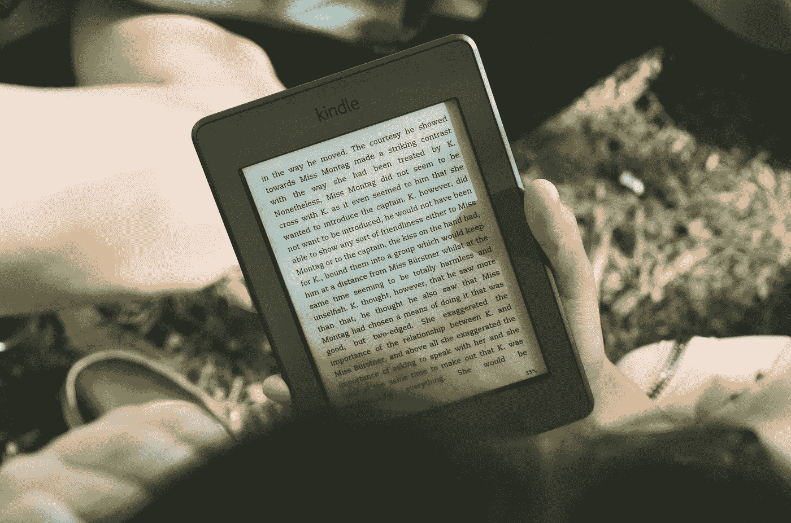

# 我是如何卖出近 3 万本电子书的

> 原文：<https://medium.com/swlh/how-i-sold-almost-30-000-ebooks-6ee40bba7c0f>

营销技巧背后的制胜策略

Photo by [James Tarbotton](https://unsplash.com/photos/gm18kqu9TxQ?utm_source=unsplash&utm_medium=referral&utm_content=creditCopyText) on [Unsplash](https://unsplash.com/search/photos/ebooks?utm_source=unsplash&utm_medium=referral&utm_content=creditCopyText)

我的第一本电子书卖出了 12 本。

但是第二个呢？

那本书已经卖出了 8000 多本——而且年复一年，月复一月地卖出了好几本。

那么有什么区别呢？我是说，我还是那个时候的我，对吧？或许更聪明一点。但本质上，是的…