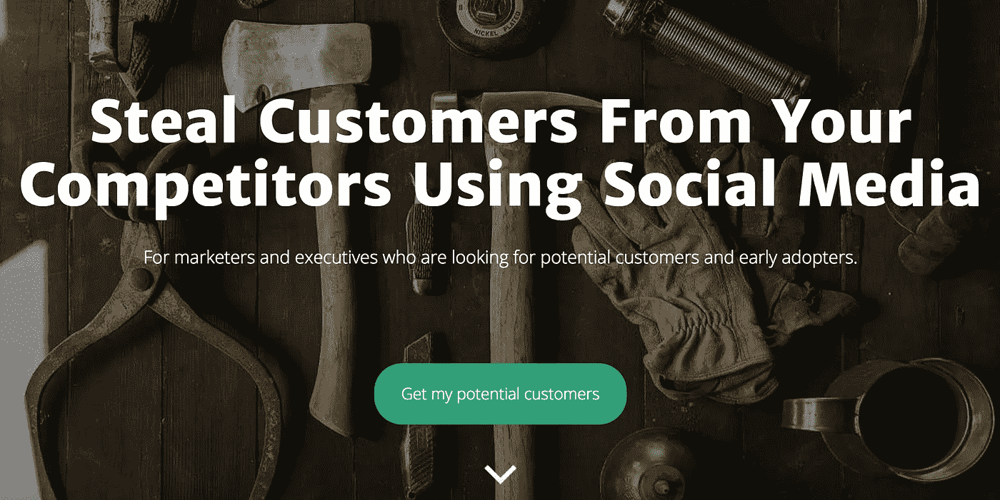
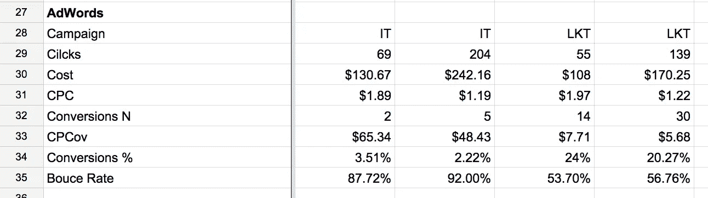
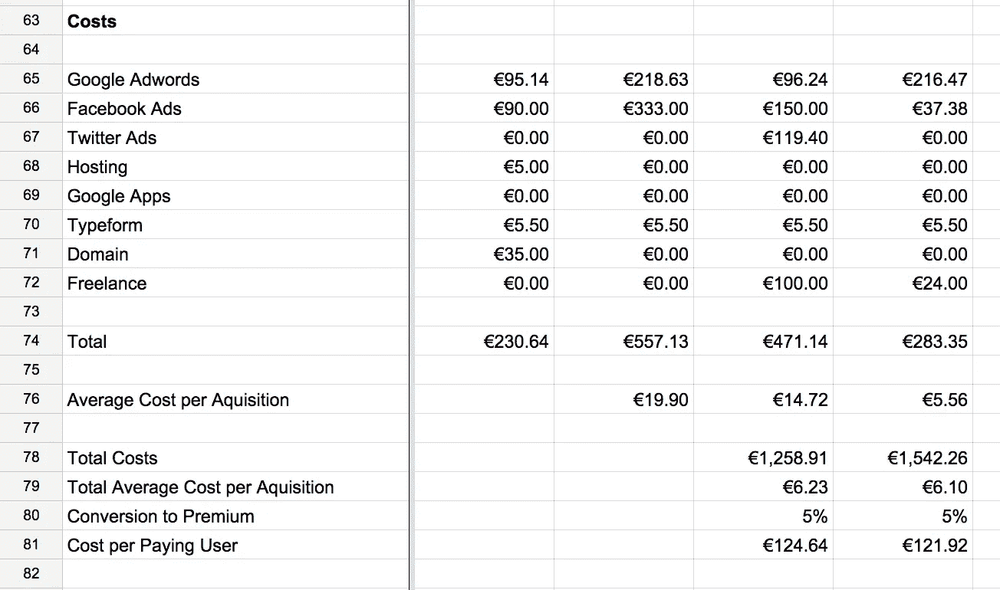

# 我如何花了一个月和 1500 美元来验证这个想法

> 原文：<https://medium.com/swlh/how-i-spent-a-month-and-1-500-to-validate-the-idea-b1954bda6387>

在我之前的[创业](https://likeastore.com)之后，我承诺自己只做人们想要的东西。

避免构建没人想要的产品的风险的唯一方法是投入时间和金钱来验证问题/解决方案。

# 问题/解决方案匹配

我们都听说过很多把*产品/市场契合度*作为任何创业公司的终极目标。基于精益创业方法的智慧，许多创业公司正在接近*产品/市场契合度*。他们**构建、测量和学习**，试图尽早发布并开始收集数据。

MVP 方法是错误的，因为它将*构建*作为第一步，阻止你思考问题，而是将你的注意力集中在解决方案上。

早期创业应该完全专注于一个问题，关注有这个问题的人以及这个问题有多痛苦。

无论如何，在继续前进之前，创始人必须证明问题是存在的，并且值得解决。

# 问题和价值主张

我要解决的问题是**获客**。更准确地说，是基于竞争对手的社交渠道的销售线索生成。

价值主张非常简单。你了解你的竞争对手和他们的社交渠道。有可能发现这些渠道的参与观众，建立他们的社交档案，并将这些档案转化为线索。

我已经将这一价值主张转化为 MDP(最低需求产品)。

# 最低期望产品

MDP 的目标是**在你拥有客户之前，确定对产品的兴趣**和对产品存在的需求，并启动客户开发。

在我的例子中，MDP 是一个[登陆页面](http://socialsearch.io)，有一个我们可以从竞争对手的 Twitter 账户中生成的报告的例子和一个供早期访问的注册表单。

Landing page

就是这样。

有了 MDP 的定义和准备，我开始了牵引和客户开发之旅。

# 牵引发展

那本改变了我对创业的看法的书说，

> 几乎每个失败的创业公司都有产品。失败的创业公司没有的是足够的客户。

我对此很认真。从第 0 天起，我就开始开发客户获取渠道，并估算可能的 CAC。

我的核心渠道是:

*   搜索引擎营销(谷歌广告词)
*   社交广告(脸书和推特)
*   一对

在这四周里，我测试了每个频道。

## 搜索引擎营销

我已经建立了我的活动，定义了关键词，设置了广告，预算并开始等待。你知道吗，什么都没发生。除了我的口袋变薄了一点。

结果很糟糕。

在两周内，我花了 375 美元，产生了 273 次点击，每次点击费 3.08 美元，只有 7 次转化，这意味着我为每次转化支付了 53.26 美元。

如此高的 CAC 与我的商业模式相去甚远，所以我得出结论，SEM 目前是一个错误的渠道，我需要重新关注。

但根本原因，不是 SEM 和 Adwords。其实是我。

我已经聘请了一名谷歌 Adwords 顾问来开展一项额外的活动，并将结果与我已经存档的内容进行比较。

这一次，结果完全不同。那家伙设法做了一些不同的事情，令人惊讶的不同。

在两周内，他的活动花费了 278 美元，产生了 194 次点击，每次点击费为 1.60 美元，44 次转换，每次转换的价格为 6.69 美元。

测试一个频道几乎要花 650 美元，对于一个什么都不卖的公司来说，这似乎是一个很高的价格。但事实并非如此。

现在我知道来自 SEM 渠道的 CAC 可能在 6-10 美元的范围内，这使它与我计划的 LTV 保持一致，只是 a 给继续下去开了绿灯。

IT (Initial Campaign), LKT (Campaign after optimization).

## 脸书和推特

社交广告似乎是一个非常强大的渠道。是的，但是你必须知道如何正确使用它**。**

**我最大的错误是，我为不同目标的不同受众创建了太多活动，却没有很好地理解如何衡量转化率。不要重复这个。**

**我获得了数百次点击，但转化率很低，非常糟糕**。****

**总的来说，我在脸书和推特上花了 730 美元，这给了我 20 次注册，意味着 36.5 美元一次转换。**

**这是一个明显的失败，但类似于谷歌广告，我只是担心我用错了工具，并为此付出了代价。到目前为止，我把这个频道放在一边，考虑在未来对它进行优化。**

## **一对**

**在最初推出后，两家相当受欢迎的俄罗斯资源撰写了关于 [SocialSearch](http://socialsearch.io) 的小综述文章，这带来了相当高的流量和良好的转化率。**

**我的想法是对这个频道多投资一点，这样可以带来更多的注册。**

**这似乎比我想象的要难。我雇了一个文案来制作公司[新闻稿](http://socialsearch.io/press/)，我用 [PressFarm](http://press.farm) 来接近记者。**

**一点效果都没有。发出了大约 30 封信，我只收到一封*“谢谢，但是通过”*就这样。**

**好事情，它只花费我 50 美元去尝试。**

****

**Summary of Costs for Month**

# **客户开发**

**即使流量不是很大，我仍然设法平均每天有十个注册。是时候将投入的资金转化为数据了。**

**我使用了 [Ask 公式](http://www.askformula.com/)来创建一个调查，我提议用它来交换一个月的免费服务使用。令人惊讶的是，它真的很有效。**

**到今天为止，我已经完成了 253 个注册和 70 个调查。每完成一项调查，我都会发送一封跟进信，以便更好地了解问题。**

**我总是对创业的这一部分感到压力，与人们交谈。我仍然通过电子邮件，而不是电话或 Skype 电话来做这件事。这可能是**效率较低**但仍然有效。**

**到目前为止，我了解到人们确实有我试图解决的问题，他们已经准备好尝试，迫不及待地想看到数据。**

**我倾向于不破坏我提出的确切解决方案，更多地倾听问题以及我到底能做些什么来解决问题。**

# **产品开发**

**我**还没有**成为 MVP。为什么？**

**我还不确定谁是我的**客户，市场是什么**。理想情况下，我必须找到一个特定的利基市场，并在那里尝试。迄今为止，我的注册来自非常不同的领域，从零售业到游艇业。**

**我觉得走的路是[礼宾 MVP](http://scalemybusiness.com/the-ultimate-guide-to-minimum-viable-products/) 。做一个真正简单的，半自动的服务，为 5-10 个不同领域的客户服务，并从中学习。**

**学习比建设更重要。但是需要建立一些东西来让学习发生。这是我接下来要做的。**

**如果你喜欢那篇文章，请考虑向**推荐**它。我对建议和谈话持开放态度，请随时联系 [alex@socialsearch.io](mailto:alex@socialsearch.io)**

****

**发表于*[**【SWLH】**](https://medium.com/swlh)**(***创业、流浪、生活黑客)****

******************