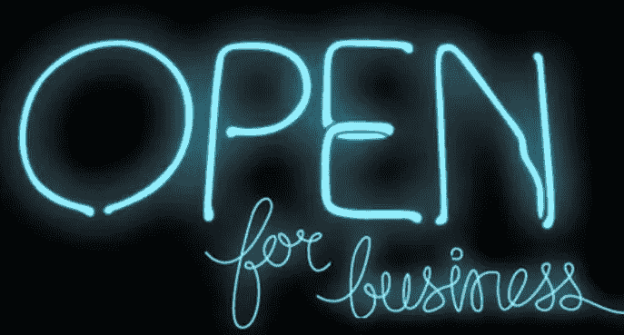

# 我是如何开始创业并战胜了 5 年的拖延。

> 原文：<https://medium.com/swlh/how-i-started-a-business-and-defeated-5-years-of-procrastination-when-it-came-to-doing-so-894a45346e8f>

我终于创业了！很多人问我什么时候会重新开始，在过去的五年里，我一直在拖延。有一大堆数据表明，许多人(包括我在内)都想自己创业，我就不一一列举了。

在我们每个人离开这个世界之前，我们都有很大的机会尝试自己创业至少一次。

我和许多想要成为企业家的人交谈过，他们有一个想法或热情，他们想把自己变成一家企业，但他们从来没有采取行动。距离我上一次创业已经过去五年了。我知道这种想要创业的感觉是什么样的，因为它已经困扰我很久了。

我的脑海中一直闪现着这样的想法:“蒂姆，你热爱你的激情。去创业吧，靠创业谋生！”

我已经忽略这个明亮的火花太久了。我已经找了借口。我已经拖延了。我告诉自己我不够好。

最后，几个月前，我对自己说*“去他的！我要开始创业了。”*

如果你曾经有过类似的想法，那么我希望你在这篇文章结束时采取行动，一劳永逸。我将告诉你我用来战胜五年拖延症的确切步骤和技巧，并最终开始我的教练和社交媒体咨询业务。

## 以下是我开始创业时所做的:

# 如果一开始你不得不接受免费教育，那就做点亏本的事。

我带来的第一个客户亏损了。咨询结束时，我发现我的收费不够。这是完美的，因为我基本上买了我的第一个客户，同时获得了免费教育。**我的第一个客户教给我的经验是我整个生意的基础。**

我没有过多考虑创业的想法，而是决定通过实际创建一个企业来尝试，并试图找到一种商业模式。事实是，创业不需要知道任何东西。只要你能为你要做的事情收费，你就会从经验中学习剩下的东西。

# 如果你一点想法都没有，那就问问自己“我能在哪些方面指导别人？”

不是每个人都有自己想要追求的商业想法。有些人就是知道自己要创业。这对我来说是一样的。我知道我想要一个企业，但我不知道它会做什么。然后我去参加了一个活动，演讲者说我们所有人都可以在某些事情上指导某人。

所以我问了自己同样的问题，得到的答案是社交媒体和生活。这是我可以指导每个人的两件事。这也是我热衷的两件事。对你来说，创业的种子也是从这个问题开始的。

虽然你可能不会成为一名教练，但知道你能教人们什么会让你知道你对什么有热情，并且有动力免费做什么。

# 浮动的想法收费一个人，一个产品或服务。

一旦我知道我想把我的生意集中在什么上，我开始的方式就是和人们交流这个想法。其中一个人想成为我的客户，但他们希望我为他们写很长的博客文章。虽然代笔是我考虑在不久的将来加入的一项服务，但就一个我不感兴趣的话题写长篇博客不是我愿意做的事情，我拒绝了。

当我不断地向世界展示这个行业是什么的时候(那时还不存在)，有几个人对我正在做的事情表示了兴趣。其中一个在不知不觉中成了我的第一个客户。告诉人们你正在考虑做什么是你获得最初几个客户的方法。

> “表现得好像这家企业已经存在，你可以马上提供你的产品或服务。这是我最终采取行动并再次创业的一个关键理念。”

# 你的第一个客户给了你信心。

赢得第一个客户给了我追求事业的信心。获得客户是支持自己、激励自己避免拖延、继续创业的最佳方式。

> “当你有一个依赖你的客户时，你更难失败”

# 忘记名片和网站。

我遇到很多正在成长的企业家，他们花数小时创建网站、设计标识，甚至打印名片(也许他们没有听说过 LinkedIn)。这些活动都不会让你的事业起步，也不会给你所需要的动力。

拥有推销自己的技能，并开始对某些东西收费，任何东西，是你创业的方式。当一个企业有钱时，它才是一个企业。

# 假装你已经做了很多年了。

我从来没有做过咨询。我没有读任何商业学位。我不是天才。

我看了几本书，看了几个我现在雇主用的咨询师。然后我就表现得好像我做了很多年的咨询一样。在某种程度上，我有。博客有点像咨询。

事实上，几乎在任何工作中，你都会向某人咨询一些事情。所以，如果我们愿意，我们都可以做咨询。

表现得好像你的企业已经存在了很多年，这样你就能给你的早期客户信心，让他们试用你，看看你的企业是否能满足他们的需求。

# 在信封背面写一份粗略的计划。

好吧，不要真的用信封，因为那会让你变成恐龙。在你不太智能的笔记本上记下你的粗略计划。

**关于社交媒体，我的商业计划实际上是我可以教给企业的九件事。**

这九件事成了我给企业做咨询时要遵循的计划。写了十五分钟。我建议有一个粗略的计划，这样你就知道你要去哪里，生意会是什么样子。请不要想太多这个计划，否则你将永远无法开始！

# 问问你自己，“最坏会发生什么？”

这个问题将帮助你减轻萦绕在你脑海中、阻碍你创业的风险。几个月前，当我在创业时问这个问题时，我意识到最糟糕的情况是我让一些客户失望了。

通过问这个问题，你发现尝试一项业务不会有危及生命的后果。

# 问问你自己，“如果这非常容易，会是什么样子？”

一个新的商业想法的诱惑是让它变得复杂和过度思考。许多想要成为企业家的人都这么做，这是一场灾难。问自己“如果这很容易，会是什么样子？”帮助你记住你想做的事情。

默认情况下让事情变得简单会让开始变得可行。如果某件事真的很简单，那就很难不试一试。对于我的新业务，简单是这样的:

–没有网站
–一项服务
–一名客户
–使用我现有的 Zoom 等服务来开展业务
–每周只做一小时的兼职

有了这些界限，我就不可能不坚持到底。我知道如果我不每周花一个小时做我的新生意，那我就永远不会认真去做，甚至根本不会去做。

让我的生意变得简单是第一个考验，看看我是否还能再做一次经营自己的生意。我把让事情变得简单作为对任何新想法的测试。自己试试。

# 将你的业务加入到你与每个人的对话中。

我一直在社交媒体和电子邮件上收到消息，询问我过得怎么样，正在做什么。在我创业初期的每一次谈话中，我都会加上一句话:“我已经开始创业了。”

我没说是什么。人们自然会问，我会礼貌地回答他们。通过使用这种方法，你不是在销售，而是在有可能成为顾客的真实人群中测试你的想法。其中一些对话最终让他们成为了客户。

# 开始的时候，总是把它当作侧推。

我们拖延商业想法的原因是我们对自己将要做的事情充满恐惧。这种恐惧很大程度上来自一种误解，即你需要辞去工作或主要收入来源才能开始。你不知道。

放弃你的主要收入来源是你能做的最糟糕的事情。你甚至不知道你的生意会不会成功，或者你会不会喜欢它。另外，90%的企业在前五年都会失败。这就是为什么我承诺每周只花一个小时让自己再次接受企业家测试。

作为副业创业让你找到自己的位置，了解你的生意会变成什么样。在早期，你的生意会改变很多次，所以你不想把你一生的积蓄都押在这上面，直到你的方法变得可靠。

再一次，通过一开始就让我的生意变得次要，我消除了恐惧，给了自己探索的空间，并允许自己失败。我向任何想创业的人推荐这种方法。

这样更容易，意味着你成功的几率更高。最糟糕的情况是，你最终找到了一份兼职工作，这给了你第二份收入。那也是个不错的结果。

所以为什么不能创业，不要再拖了？

*原贴于*[*【Addicted2Success.com】*](https://addicted2success.com/startups/how-i-started-a-business-and-defeated-5-years-of-procrastination-when-it-came-to-doing-so/)

# 行动呼吁

如果你想提高你的工作效率，学习一些有价值的生活窍门，那就订阅我的私人邮件列表吧。你还将获得我的免费电子书，它将帮助你成为改变游戏规则的在线影响者。

[**点击这里立即订阅！**](http://timdenning.net/free-ebook)

## 这篇文章发表在 [The Startup](https://medium.com/swlh) 上，这是 Medium 最大的创业刊物，拥有 295，232+人关注。

## 在此订阅接收[我们的头条新闻](http://growthsupply.com/the-startup-newsletter/)。

