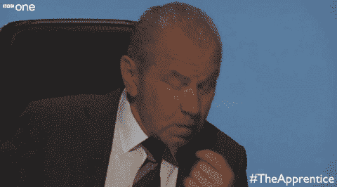

# 我是如何开始看《学徒》的，我从中学到了什么

> 原文：<https://medium.com/swlh/how-i-started-to-watch-the-apprentice-and-what-i-learnt-out-of-it-47e0db95dc7d>

我是法国人，所以在看《学徒》之前，我所知道的真正的电视节目就是老大哥的那种节目。

然后有一天，我和火箭互联网的两个前同事一起吃饭，其中一个告诉我:“我要走了，我要看《学徒》的新一集”。

我决定自己看《学徒》，从第一季开始。两组人，一组全是男性，另一组全是女性，接受一些与商业有关的挑战，希望被聘为英国著名成功商业巨头、千万富翁艾伦·休格爵士的私人助理。

这些挑战包括:在必须选择要购买的花卉类型和最有效的销售渠道(街头摊位、上门推销等)之后，尽可能多地销售花卉；设计出一个原型，卖给一家著名的玩具公司；甚至在著名的奢侈品百货公司哈罗德百货公司(Harrods)经营一个摊位。

我看着所有这些挑战，觉得很有趣，并对候选人将采取何种方法来处理这些挑战很感兴趣。他们大多是竞争激烈的高层管理人员，对赢得最终奖项有着强烈的欲望。

我从这个节目中学到的是:

*   在任何项目中，管理都是关键。项目经理领导着团队——如果方向不正确，团队就无法取得胜利
*   **但比糟糕的经理更糟糕的是，有一个队友出于沮丧，试图破坏项目和经理给他的指示。始终有勇气大声说出你的想法，这样你就可以试图改变你的经理的看法，不要在没有咨询或与任何人结盟的情况下，独自采取你认为对团队有益的行动。保持透明，与你的团队进行清晰而有建设性的沟通，会让你赢。**
*   **玩得开心。这句话我们永远也说不完:当你在做一件事情时感到有趣，你就会更投入，更努力，工作做得更好。认真对待每件事，但享受你正在做的事情，你会做得最好！作为管理者:快乐的员工是最有效率的:)**
*   **永不停止销售。向团队、投资者、任何可能感兴趣的人推销你的产品，成为未来的客户、合作伙伴、推广者。《学徒》中的许多挑战都与销售有关，因为对于任何类型的企业来说，销售都是一项非常重要的技能和心态**
*   把你的自我放在一边。当你在一个团队中，你需要在竞争中成为最好的，你不能用我喜欢他和我不喜欢她来思考。每个人都是队友，不要把重点放在弱点上，而是放在每个人在项目中可以发挥的优势上。每个人都有可以利用的东西，这取决于经理找出它是什么，并分配正确的责任。
*   总是试图从在你的领域有经验的人那里获得建议。对于任何企业家来说，建立联系和网络都是从“速赢”中获益的好方法，尤其是当你不得不应对有限的财政资源时。你应该毫不犹豫地询问你的同事对你第一次做的事情的看法，他们在过去已经做过很多次了。不管这些“顾问”的资历有多高！例如，当我从学校毕业后几个月被要求去打开 space ways Paris(Rocket Internet storage-by-The-box venture)时，我不确定我的方法，并决定向该家族(法国顶级创业孵化器)的创始人 Oussama Amar 发送脸书消息，他在法国和全球的创业社区非常有名。他直截了当地回答，并邀请我在他最喜欢的巴黎餐厅吃午餐，一起讨论这个问题:)

所以生活中有很多比看《飞黄腾达》更好的事情要做，但是无论你做什么，试着从中学习——这些是我在看了这个著名的电视节目后得到的。

## 这篇文章发表在[《创业](https://medium.com/swlh)》上，这是 Medium 最大的创业刊物，有 278，108+人关注。

## 订阅接收[我们的头条新闻](http://growthsupply.com/the-startup-newsletter/)。

