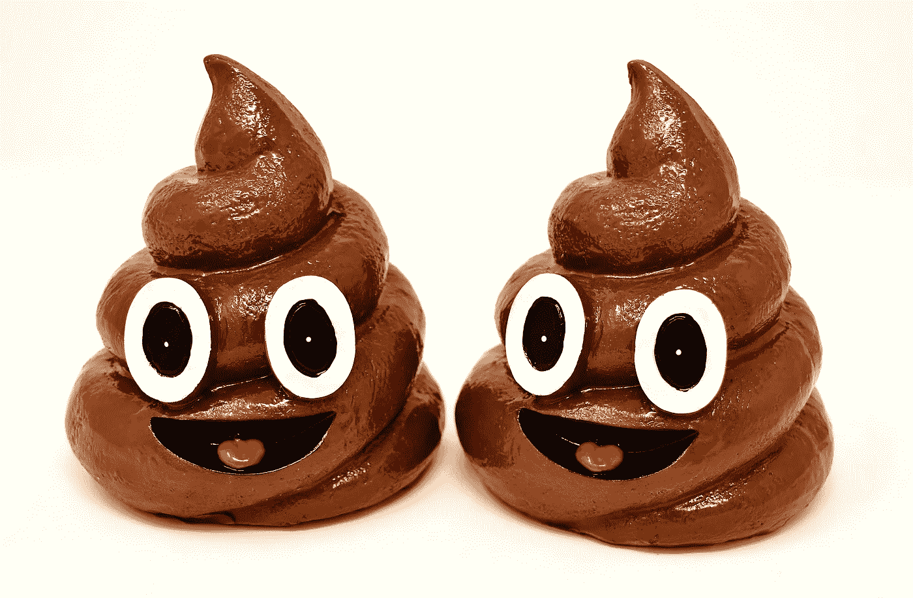

# 我是如何窃取一个想法，给一个额外的狗屎，激励一个创业团队的

> 原文：<https://medium.com/swlh/how-i-stole-an-idea-and-motivated-a-team-af6981cc48fe>

## 我称之为“三 S 团队”，你也可以使用它。

Photo: Pixabay — [Alexas_Fotos-686414](https://pixabay.com/en/users/Alexas_Fotos-686414/)

六年前，我从一家我从未听说过的名为 [StartMate](https://medium.com/u/bb733ffbbbdd?source=post_page-----af6981cc48fe--------------------------------) 的公司的博客上读到一篇文章，从中窃取了一个想法(我刚刚在 Medium 上发现了他)，对其进行了一点调整，并将其添加到我的锦囊妙计中。

从那以后，我经常把它作为激励新团队的基本框架——特别是在快速发展的公司里，那里可能存在大量的不确定性，而在 T2，简单往往是快速发展的关键。

女士们先生们，这再简单不过了。(顺便说一句，我在网上再也找不到这个帖子了，所以大声对 Startmate 的人说……如果你记得是谁写的，请告诉我！)

所以，如果你像托尼·罗宾斯一样，相信“复杂性是执行的敌人”，那么这将会引起共鸣——就像我一样。

> “复杂性是执行的敌人”

Photo by [Annie Spratt](https://unsplash.com/@anniespratt?utm_source=medium&utm_medium=referral) on [Unsplash](https://unsplash.com?utm_source=medium&utm_medium=referral)

Startmate 本质上是一个澳大利亚的创业孵化项目，我在 2012 年随机登陆的帖子解释了他们在接受团队时需要什么。让我开始阅读的第一件事是这篇文章的标题:

# 两个狗屎团队

多么典型的澳大利亚人！(我可以这么说，因为我就是其中之一😜).Startmate 明确表示，他们在接受的团队中寻找两个关键要素:

> *“那些能把事情做好的人和那些对客户和他们的问题漠不关心的人。”*

事实上，一个孵化项目具有观察和与许多有伟大想法的新团队合作的所有优势，可以将团队成功归结为与狗屎相关的两个简单点，这引起了我的兴趣。

如果你在过去有过于复杂的倾向，这种简单可能会引起你的共鸣——就像我一样。在我年轻的时候，开发非常复杂的战略、框架和执行模型让我觉得有点受鼓舞，而且很重要。其实不是的。参考前面托尼·罗宾斯的话。

是的，管理和激励一个团队需要的不仅仅是一堆屎，当然。但是从简单的框架开始构建和迭代通常是从**开始** *的最好方式。*

所以我就是这么做的。我想了一会儿，在我的想法周围嗖嗖地转，应用和匹配我包里的其他图案和“技巧”。

然后我做了第一次迭代:

# 添加另一个狗屎

有一个机会接近了，我觉得我可以应用 two-shits 团队框架，但有些地方出了问题。

在我之前建立、激励和管理团队的所有经验中，还有一个基本要素，我觉得没有被两个狗屎模型抓住。

那就是**激情**。

然后，在一个纯粹的澳大利亚英语语言的辉煌时刻，我立即知道如何适应 Startmate Two Shits 团队模式。

我把激情转化成了第三个狗屎:

**了解你的大便。**

我的框架是完整的:给狗屎。了解你的狗屎。把事情做完。

我称之为:

# 三 S 团队

让我来分解每个狗屎元素，以便更好地理解为什么每个元素都很重要。

**给个屁**:这是关于换位思考，主要是为了客户。真正站在他们的立场上，看看他们遇到的问题以及如何解决。真诚地倾听顾客的心声，虚心学习。与此相反的是速赢型思维或高级机会激励— *这是一个 1B 美元市场，我们认为我们可以抓住 1%,因为现在很热*不是某个在乎的人说的话。

《哈佛商业评论》实际上在 2016 年发布了一份“[最具同理心的公司](https://hbr.org/2016/12/the-most-and-least-empathetic-companies-2016)”名单，其中有一些有趣的数据点，得出了同理心与“增长、生产率和每名员工的收入”相关的结论。因此，显而易见的是，从一开始就给予关注是很重要的，尤其是对一家初创公司而言。

**懂你的屎**:这是我加上的激情，归结为一坨屎。了解你的狗屎是关心你做什么，你的专业知识和你的功能输出。同样，它也是关于关心你不知道但致力于学习的东西，以提高你的产出。如果，作为一个团队，你知道你的狗屎，你争取和交付高质量的结果。没有它，你就会自满，如果团队自满，他们很难在一开始就超越。

我们都经历过和一个我们觉得不了解自己的人打交道，不是吗？最近，我去找了一家旅行社寻求一些建议(现在还有人这么做，对吧？)我从他们那里得到的只是闪闪发光的小册子和我已经知道的非常普通的飞行建议。我不会回去的。因为，至少对我来说，他们真的不知道他们的狗屎。

**搞定狗屎**:实际上，多年前我在笔记中剪下了原始帖子的一部分，它捕捉到了 Startmate 对这个帖子的定义，所以在这里，因为我喜欢它:

> “把事情做好是智慧、足智多谋和不屈不挠的结合。”

在一个新团队中，尤其是在一家初创公司，你需要具备这些特质的人。那些可以穿越障碍的人，他们不需要无限的资源，他们只需要有限的指导和监督就可以做到。你需要我称之为[开箱子的人](/@claytonhm/poke-the-box-and-make-your-organization-come-alive-f71dcce5ef58)。

Photo by [SpaceX](https://unsplash.com/@spacex?utm_source=medium&utm_medium=referral) on [Unsplash](https://unsplash.com?utm_source=medium&utm_medium=referral)

# 与您的团队一起推出 3s 模型

面对现实吧，这不是火箭科学。最有用的实现是作为一个新团队的基础框架。这是一个有趣的，容易理解和人们背后。

在团队会议上第一次介绍这一点时，将它写在白板上。这引起了人们的注意:

> 狗屎
> 狗屎
> 狗屎

然后谈论三 S 团队模型，讨论每个元素并填写每一行的剩余上下文以展示，因此您最终会在白板上看到这个大而醒目的内容:

> 给屎
> 知道你的屎
> 把屎搞定

一旦引入，这就成了团队的口头禅——把它挂在黑板上或每次会议的幻灯片上，作为对你作为一个团队最重要的元素的持续提醒。你将形成自己的定义，确切地说明每个元素对你的团队意味着什么——给出强化这些元素与反对它们的行为的真实例子是最好的方法。

这种模式与人们紧密相连，可以成为经理们在领导团队时继续参考的东西——真正庆祝每一个 shits 的奉献和实践……字面上称自己为“三 S 团队”,或者，如果你更大胆一点，“三 shits 团队”。

如果你在一家大公司，这通常会给其他团队制造一点神秘感和阴谋🤔

# 进化到不仅仅是大便

不可避免的是，随着你的团队的成熟，你可能会脱离三 S 团队的咒语。这很好——它可能已经达到了让你走到这一步的目的……并且可能仍然会作为团队中个人的动力而存在。

我是帕特里克·兰西奥尼的组织健康模型的忠实粉丝……在某种程度上，3s 团队是构建团队行动手册的一个非常简单的先驱，Lencioni 建议在团队中推动清晰度。在他的剧本模型中有六个元素，但是每一个都可以很容易地从三个狗屎中的一个推断出来。从一个地方移到另一个地方并不困难。

你应该把它作为在成熟的团队中激励和推动清晰的下一个模型。再说一遍，这是一个简单的框架，你可以从中构建和迭代。

通过建立一个对客户真正感同身受的团队，对如何开展工作有真正的热情，并充满无情的盒子扑克，你会发现自己领导着一个高度激励、专注和忠诚的团队。

**都是因为多给了一坨屎。**

*注意:我和 Startmate 没有任何关系。*

## 这篇文章发表在 [The Startup](https://medium.com/swlh) 上，这是 Medium 最大的创业刊物，有+390，426 人关注。

## 在这里订阅接收[我们的头条新闻](http://growthsupply.com/the-startup-newsletter/)。

