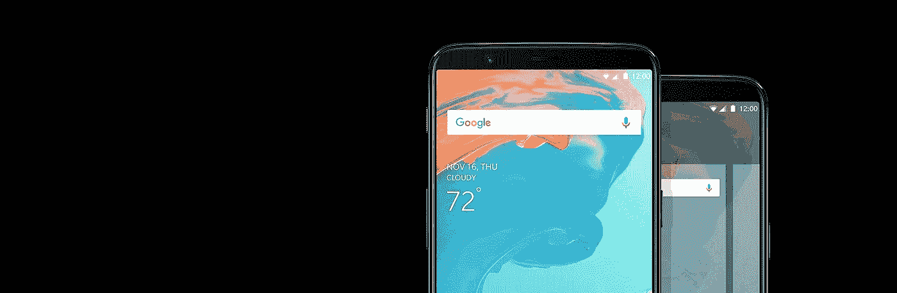

# 我是如何从 iOS 转到 Android 的，我很喜欢它

> 原文：<https://medium.com/swlh/how-i-switched-from-ios-to-android-and-im-enjoying-it-e28448d1baee>

## 这个故事是我的文章[苹果如何用新软件](/swlh/how-apple-is-crippling-its-old-devices-with-new-software-d5093e54355)削弱旧设备的后续。

最近我对苹果非常失望，所以我决定从 iOS 转到 Android。我是多年的 iPhone 用户，从 iPhone 3G 开始。我一直喜欢苹果作为产品制造商的形象…