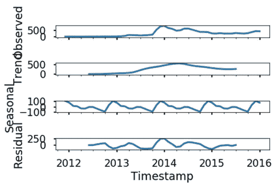

# 我是如何用 ML 预测比特币价格的

> 原文：<https://medium.com/swlh/how-i-used-ml-to-predict-bitcoin-prices-82af7c655092>

*无耻插件:我们是一个* [*机器学习数据标注平台*](https://dataturks.com) *让你超级轻松的* [*构建 ML 数据集*](https://dataturks.com) *。只需上传数据，邀请您的团队，快速构建数据集。*

我们使用了时间序列模型 ARIMA，并训练了神经网络模型 RNN，用于根据以前的值和趋势预测未来的比特币价格。使用在大约 70 个数据点上训练的 ARIMA 模型，达到了 75-80%的平均准确度，使用 RNN 模型达到了几乎 95%的准确度。这个项目主要是因为比特币是运行时间最长、最知名的加密货币，据说前景广阔。通过这个项目，我想看到的是，我是否可以快速训练一个深度学习模型，或者使用标准的时间序列模型来预测比特币价格及其未来趋势。

# 为什么是比特币？

比特币更容易获得，有更多的交易所，更多的商家，更多的软件和更多的硬件来支持它。比特币在这方面有两大优势——稳定性和创业精神。它拥有最多的企业家，他们用大量的智慧、奉献和创造力来创建公司，让它变得更加有用。随着比特币的发展，随着新的用途被发现，我们可以预计比特币将以意想不到的方式增长。比特币拥有者可以预期，随着时间的推移，它的实用性只会增加，因此创造了巨大的投资机会，并获得巨额利润。

但是什么时候投资和投资多少是有疑问的，因此我们建立了这个模型来帮助预测最佳投资时间。

就像大多数货币一样，比特币的价格每天都在变化。唯一的区别是，比特币的价格变化幅度比当地货币大得多。

# ML 模型

建立的模型可以预测以标准 Unix 格式给出的任何日期的比特币价格。这些预测可以作为比特币交易策略的基础。那些在股价高时买入股票的人损失了大部分资金。这就是为什么不要投资超出你承受能力的钱是很重要的。像股票市场分析一样，这也可以被投资者用来判断投资的最佳时机，以获得最佳结果。尽管有多种其他因素可以影响比特币的价值，如供求关系、其他加密货币和许多其他因素，但这可以用作基本模型，其余因素可以手动研究，因为这些因素中的大多数是不可预测的。它可以用来获得一个公平的价格和哪里可以投资的想法。比特币仍然年轻，许多消息来源称它将继续存在。因此，这可能是一个好主意，投资于同样的。

我们在《蟒蛇 3》中使用了朱庇特笔记本。三号。ipynb 文件可以下载并运行以查看结果。

# 资料组

在我们建立模型之前，我们需要获得一些数据。使用的数据集是过去几年每分钟的比特币价格。在这段时间内，噪音可能会淹没信号，所以我们将选择每日价格。数据集名称-bitstampUSD _ 1-min _ data _ 2012–01–01 _ to _ 2017–01–08 . csv，CSV 文件，用于 2012 年 1 月至 2018 年 1 月期间的选定比特币交易所，约有 3，161，057 个实例，每分钟更新 OHLC(开盘、盘高、盘低、收盘)、BTC 交易量和指定货币以及加权比特币价格。

要做出这些预测，首先要让人们熟悉一种机器学习技术，ARMA、ARIMA、递归神经网络(RNN)以预测和时间序列分析为我们的主要目标。对于 RNN 模型，在系统中安装 Keras 库是必要的。

ARIMA 模型是一类用于分析和预测时间序列数据的统计模型。

它明确地迎合了时间序列数据中的一套标准结构，因此提供了一种简单而强大的方法来进行熟练的时间序列预测。

与回归预测建模不同，时间序列还增加了输入变量之间序列相关性的复杂性。

一种被设计用来处理序列依赖性的强大类型的神经网络被称为 RNN。长期短期记忆网络或 LSTM 网络是一种用于深度学习的递归神经网络，因为可以成功训练非常大的架构。长短期记忆网络，或 LSTM 网络，是通过时间反向传播来训练的，它克服了梯度消失的问题。

因此，它可以用于创建大型递归网络，进而可以用于解决机器学习中的困难序列问题，并实现最先进的结果。

**代号:** [Github](https://github.com/DataTurks-Engg/ML-to-predict-Bitcoin-Prices)

如有任何进一步的需求，请将您的详细信息发送到 devika.mishra@dataturks.com，我将为您提供所需的资源。

数据中的时间戳被转换为标准的 UNIX 时间戳，对于 ARIMA，数据通过取平均值按月分组，而对于 RNN，数据再次通过取每天的平均值按天分组。

# 结果:

**ARIMA :**

**RNN:**

当对一组或大约 100 个日期进行预测时，接近实际值的预测数如表中所示。该表可以理解为 ARIMA 模型做出的大约 66 个预测接近实际值的 90-100%。

据观察，ARMA 模型未能给出良好的预测，而基于月度数据训练的 ARIMA 模型具有相当准确的预测。

由于数据量巨大，神经网络模型似乎也表现得很好，并给出了很好的预测。但据观察，如果数据集的大小很小，RNN 模型就不能很好地训练，并给出一组糟糕的预测。

我希望听到任何建议或疑问。请在 devika.mishra@dataturks.com 给我写信。

无耻插件:我们是一个数据注释平台，让你建立 ML 数据集超级容易。只需上传数据，邀请您的团队，快速构建数据集。[来看看我们吧。](https://dataturks.com/index.php?s=blg)

## [数据标注变得简单](https://dataturks.com/index.php?s=blg)

## 这个故事发表在 [The Startup](https://medium.com/swlh) 上，这是 Medium 最大的创业刊物，拥有 331，853+人关注。

## 在这里订阅接收[我们的头条新闻](http://growthsupply.com/the-startup-newsletter/)。

