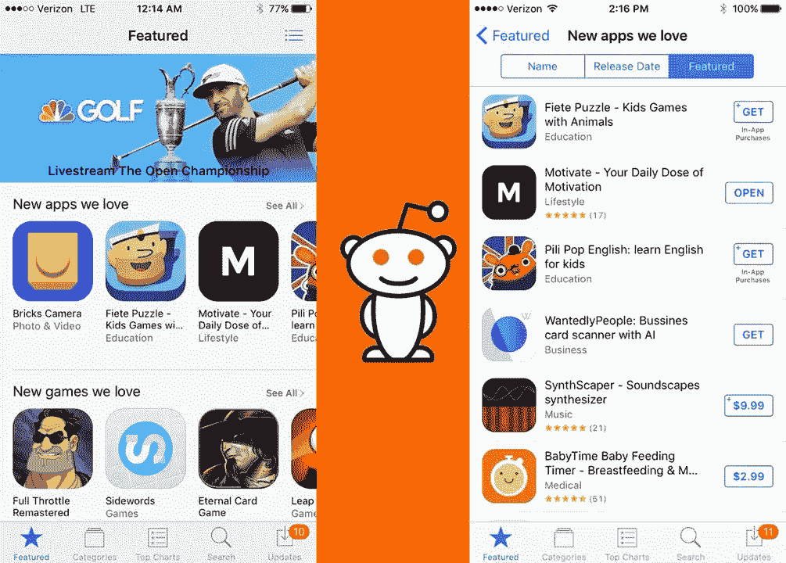
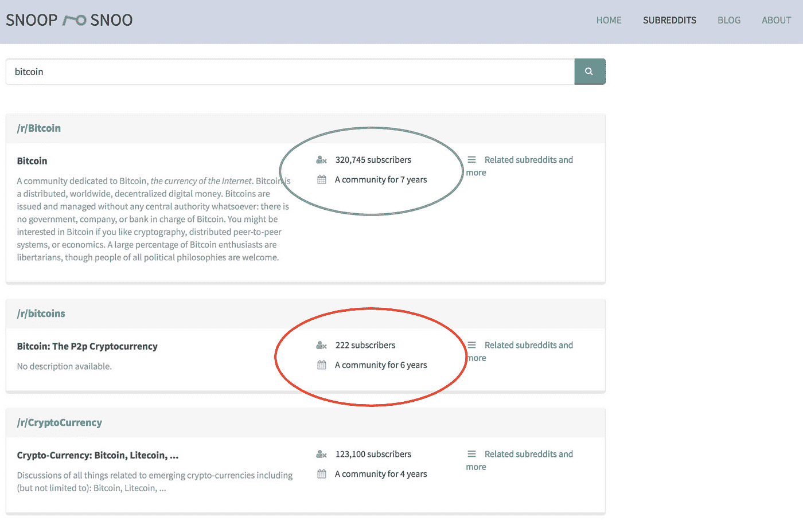
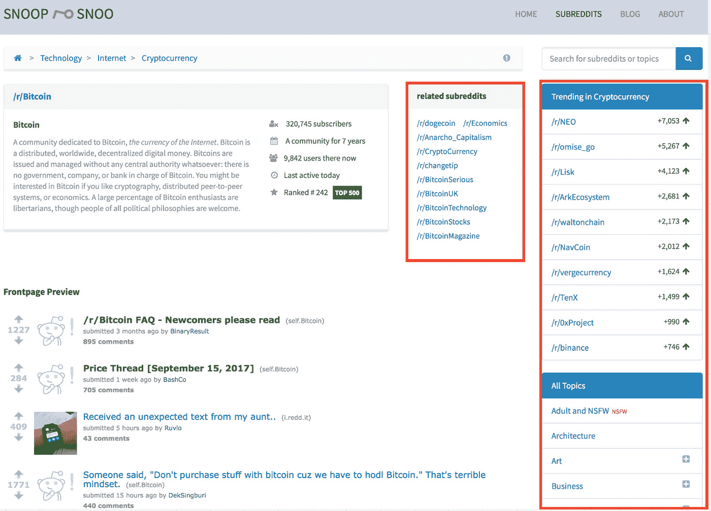
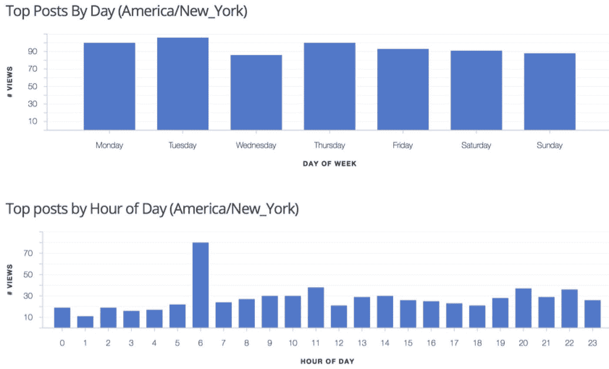

# 我是如何使用 Reddit 让 Motivate App 登上苹果首页的&超过 25 万次下载

> 原文：<https://medium.com/swlh/how-i-used-reddit-to-get-motivate-app-to-the-front-page-of-apple-over-250k-downloads-83b28ae82b39>

在如今内容饱和的环境下，推出一款新产品，突破噪音，比以往任何时候都难。年轻的初创企业热情无限，但资本非常有限，更是如此。Reddit 拥有超过 10 亿的月访问量，仍然是营销人员最未充分利用的平台之一。下面是我用来让一个名为 [Motivate](http://getmotivateapp.com/) 的应用程序(一个个人发展视频监管应用程序)登上 Reddit 首页并让该应用程序出现在苹果 iOS 商店首页的 Reddit 策略。

# Reddit 社区

Redditors 实时发现、分享、投票和辩论。它被称为“互联网的首页”，是唯一一个基于精英原则运作的大众社交媒体平台。在 Reddit 上，一个想法获得的印象和它给社区带来的价值一样多。如果你的帖子是相关的、有用的，并且引起了情感上的回应，那么它会得到更多的投票和观点。这与任何其他基于追随者的平台截然不同，在其他平台上，你必须投入大量时间来获得追随者，然后你的帖子才能获得更多参与。

# 重新编辑你的成功之路

***第一步:子编辑发现***

对于市场营销来说，超级目标就是一切，对于像 Reddit 这样的平台来说尤其如此。因此，第一步是确定你的受众所在的前 10-15 个子区域。为了有效地做到这一点，我推荐使用 [**Snoopsnoo。**](https://snoopsnoo.com/)

不要在谷歌或 Reddit 中输入随机查询，而是在 Snoopsnoo 中输入一个关键词，你会看到一个相关子主题的完整列表。一旦你输入你的主题名称，你将被带到一个与你的查询相匹配的相关子主题列表。要注意两件事:

a)订阅人数:你的帖子在最初几个小时内获得的参与度是决定你的帖子能走多远的最关键因素。因此，你需要确保你选择的子编辑在某个给定的时间有足够的在线人数，可以看到你的帖子，并有可能投票支持它。出于这个原因，选择一个拥有 40k 及以下订户的子 Reddit 可能不是最佳选择。但是，这是经验法则，不是绝对真理，我个人也发现过例外。

b)社区存在的时间:这不是成败的因素，但一个群体越成熟，它的用户参与度就越高，你的机会就越大。注意 r/比特币(用绿色圈起来的)和 r/比特币(用红色圈起来的)的区别。尽管 r/Bitcoins 已经存在了 6 年，只有 222 名订户，但任何人看到你帖子的机会都很小。

点击子编辑后，密切关注相关的子编辑和趋势类别。这是你找到所有潜在相关子条目的方法。一旦你有了 10-15 个子主题的清单，你就必须想好要说什么，怎么说。

# 2)社交倾听和内容规划:找到一种方式

Redditors 因其对营销人员的厌恶和对一英里之外的谎言的嗅觉而臭名昭著。我甚至曾经让一个 Reddir 去查看我在旧帖子上的全部评论历史，来召唤我去做营销。如果你认为你可以发布一些几乎不加掩饰的点击诱饵，假装不是一篇营销文章，你会很快被撕裂，被投票遗忘，或者干脆被 subReddit 的版主删除。

内容规划是这个过程中最乏味，但也是最重要的部分。为了在任何一个细分领域取得成功，你必须融入并代表这个群体的声音，暂时成为你试图推销的任何一个群体的一部分。要做好这一点:

1.转到一个子编辑，按“有史以来最热门的帖子”过滤

2.阅读前 3-5 页的每一篇文章。一点都不性感。虽然速度不快，但在这个练习结束时，你应该能很好地理解什么类型的事情会得到支持，以及特定的社区会对什么做出积极的回应。虽然所有的子帖子都有不同程度的不同，但你会发现所有的热门帖子最终都落入了几个类别。也看看评论，看看大家的反应。

# 3.时机:确定发布的最佳时间

时机就是一切。虽然你可能已经在其他社交平台上听说过，但对 Reddit 来说尤其如此。虽然有些子编辑在一周内有相当均匀的用户分布，但看到类似下面这样的分布并不罕见。

这是为了休息/健身。正如你所看到的，虽然大多数日子没有太大的变化，但有一个非常明显的异常点，即早上 6-7 点的时间段，在所有其他时间中非常突出。为了让你的帖子在这里有最高的被看到和被投票的机会，你必须很早就开始你的一天。要获得这种类型的数据，你也可以使用一个名为[**laterforredit**](https://dashboard.laterforreddit.com/analysis/)的免费工具，它可以提供发布最佳时间的即时数据。只需输入一个子编辑的名字就可以得到结果。

# 4.密集的社区参与

恭喜你！你搜索了巨大的 Reddit 宇宙，找到了 subReddits，写出了美丽而发人深省的内容，而且时机恰到好处。剩下要做的就是点击提交按钮，坐下来，等待发射。对吗？

如果你足够幸运地看到你的帖子上升，你应该清空你接下来 3-12 小时的日程。至少，在这段时间内，你应该每 30-45 分钟使用一次你的设备。如果你看一下 Reddit 的首页，你通常会看到前 5 名中有 10k 以上投票的帖子。然而，在排名前 7-20 位的帖子中，只有几百或几千张赞成票是很常见的。仔细看，你可能会注意到，虽然这样的帖子可能没有那么多支持票，但它们有很多评论。

随着帖子的出现，人们会开始评论它，当他们评论时，你应该回应他们。如果你的帖子真正提供了价值，人们会有问题，积极的反馈，你甚至可能会有一些钓鱼者。这太棒了。回答所有人(尤其是巨魔，但要尊重)。你越鼓励讨论，你的职位就会越来越高。我第一次登上 Reddit 的首页时，我的帖子只有不到 900 次投票，却有超过 13000 条评论。

# 这需要多长时间？

当我尝试这样做的时候，我把内容放了 30 天。虽然我很幸运地在 4 天内成功了，在计划、研究和写文章之间，这个方法花了大约一个月。从那以后，我一直设法在一个给定的 subReddit 上登顶，我的帖子每次都有 30k 到 150k 的浏览量。

警告:虽然这对于 Motivate 或一些基于加密货币的客户非常有效，但当我尝试将这种方法用于其他产品时，我遇到了困难。在开始这一旅程之前，做步骤 1 中概述的研究以回答以下问题是很重要的

> Reddit 有多在乎你的小众？

虽然像个人发展、比特币、新闻、流行文化和健身这样的话题是巨大的，但如果你没有订户数量可观的子网站，如[r/割草机](https://www.reddit.com/r/lawnmowers/)，那么 Reddit 很可能不是你的合适平台。

虽然像个人发展、比特币、新闻、流行文化和健身这样的话题是巨大的，但如果你没有订户数量可观的子网站，如【there 剪草机，那么 Reddit 很可能不是你的合适平台。

# 最后的想法:游戏系统

有人吹嘘自己去了 Fiver 或类似的网站，并购买了虚假的 upvotes。完全披露:我已经玩了这个策略来测试它，在花了 11.54 美元后，我可以诚实地说这是浪费钱。那些像病毒一样传播的帖子是自愿的。理论上，你可以找到一个好的 blackhat 供应商来绕过 Reddit 的算法，在每篇帖子中注入几百美元。然而，这样做相当于拥有一个拥有百万粉丝的 Instagram 页面，但每张照片只有 10 个赞。很容易发现一个虚假的投票帖子，如果你的帖子很糟糕，你不会给自己带来任何好处，也不会转化为对你产品的参与。省下你的钱，记住。Reddit 的 3 个原则是:

> 价值，价值，价值。

**如果你对如何将 Reddit 变成你的品牌的潜在客户产生机器有任何疑问或想了解更多，请给我发消息。**

## 这篇文章发表在 [The Startup](https://medium.com/swlh) 上，这是 Medium 最大的创业刊物，有+ 380，756 人关注。

## 订阅接收[我们的头条新闻](http://growthsupply.com/the-startup-newsletter/)。

