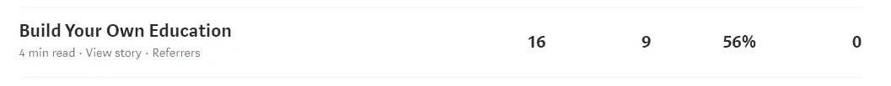
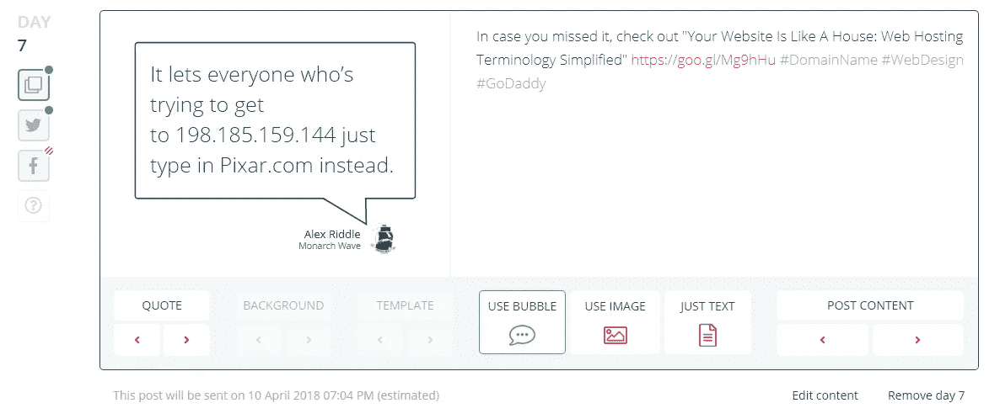
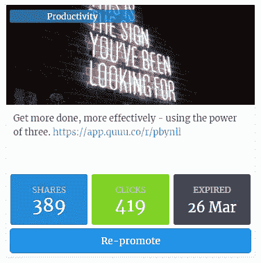
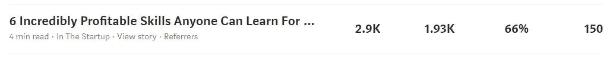

# 我如何在 72 天内在 Medium 上从 0 增长到 10，000+月浏览量

> 原文：<https://medium.com/swlh/how-i-went-from-0-to-10-000-monthly-views-on-medium-in-72-days-2943991e742f>

## 我也成为了 3 个领域的顶级作家(商业，创业，企业家精神)

我于 2018 年 1 月 2 日开始在介质上写作。新年决心晚了一天，但我写了两篇文章来弥补。我的第一篇帖子有 16 次浏览。第二条帖子当月有 34 次浏览。肯定不太好。

尽管如此，我还是坚持写作，写了很多没人读的东西。我不断尝试不同的领域，试图看看我可以轻松地写些什么，在哪里我可以找到一些牵引力。

到三月底，我平均每天有 500+的浏览量，并且是 3 个不同类别的顶级作家。我是这样做的。

## #1.找到你的定位/类别/标签

如果你还不知道，这可能需要一段时间。我花了大约一个月的时间才真正缩小了我想写的内容。而在一些平台上，你必须非常具体，一个单词的标签就可以了。

我的通常如下:

*   商业
*   创业公司
*   营销
*   广告
*   企业家精神

注意到它们是如何搭配在一起的吗？我可以写一篇触及所有这些领域的文章，而且经常这样做？我还确保用这些(或者，如果需要的话，其他相关标签)来标记我的帖子，并且**总是**使用所有 5 个标签。

注意:不是所有的标签都有顶级作者。找到能做到的。他们通常得到更多的流量。营销和广告不适合我，但它们与我的工作非常相关，所以我仍然使用它们。

## #2.坚持写作

坚持写作可能是你在媒体上成功的最重要的因素。虽然有些人一周发一篇文章就能做得很好，但是如果你想快速成长，就每天都发一些吧。你会迅速提高你的写作水平，并把它变成一种日常习惯。

2018 Best Self Calendar

我的办公室里挂着 [2018 年最佳自我日历](https://bestself.co/products/2018-wall-calendar)，直到我写完一篇文章，我才会检查一天。在我的日历中间空出一天的丑陋让我没有跳过。

## #3.促进

一旦你点击了发布，你的战斗还没有结束。事实上，这才刚刚开始。

推广你发布的内容大概是 80%的工作。我同时使用 Missinglettr、Crowdfire 和 QuuuPromote 来传播信息。

[Missinglettr](https://missinglettr.com) 剖析你的帖子，制作令人惊叹的图形，并为你提供很酷的引用，让你轻松分享。它为你的每一篇博客帖子创造了一年的社交价值。

It made this whole post (including image quote) automatically!

Crowdfire 没有做得那么好，但它确实能在你的帖子发布后的前 30 天内，让你的帖子在你的 feed 上出现 5 次。你可以跳过这个。

A Quuu Promote promotion

我最后使用的工具是 [Quuu Promote](https://www.quuupromote.co) 。我付费在这里添加我的帖子，它们被推荐给使用类似 Buffer 的工具来寻找精选内容的人。

我将我的名字添加到正在发布的内容中，因此当有人分享我的帖子时，我会被自动标记。然后，我喜欢那个帖子，和那个人互动。这也有助于发展我的 Twitter，所以这是一个双赢的局面。

我也把我的文章发布到相关的 Slack 频道，这些频道被指定用于自我推广，通常我能从那里得到一些分享和十几个观点。如果你在合适的领域，这绝对是值得一试的。

## #4.出版物

出版物是你的内容流量的最大驱动因素。为他们写作，与他们接触，爱他们的每一点。

以下是我最近为初创公司[(我最喜欢为之写作的刊物)写的一篇文章。](https://medium.com/swlh)

出版物经常在他们自己的社交媒体追随者上分享你的帖子，比任何单一的个人资料都有更多的受众。

一旦你在个人资料上写了一些你认为能反映你工作的东西，就去像 [Smedian](https://www.smedian.com/) 这样的网站上申请加入相关出版物。不是每个出版物都列出来了，但是有相当多的出版物列出来了。

或者，找到你想为之撰稿的出版物的“关于”页面(他们个人资料页面的底部)，看看他们是否有关于如何投稿的部分。你也可以搜索“提交”或“贡献”等关键词，看看是否有什么内容。

如果这一切都失败了，那就用一篇样本文章向其中一位编辑发一条推文。问问也无妨。

总而言之，找到你的定位，每天写下它(使用你的标签！)，推给某个刊物，推广的屁滚尿流。这就是事情的全部。

## 这个故事发表在 [The Startup](https://medium.com/swlh) 上，这是 Medium 最大的创业刊物，有 312，822+人关注。

## 订阅接收[我们的头条新闻](http://growthsupply.com/the-startup-newsletter/)。

