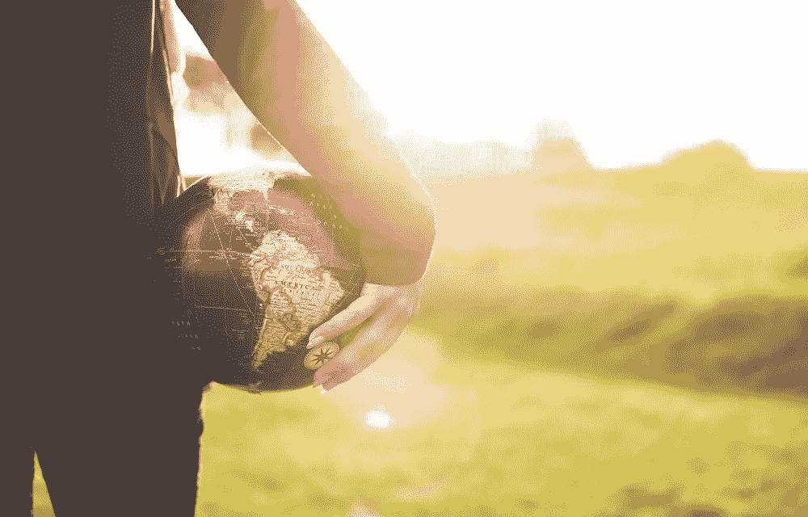
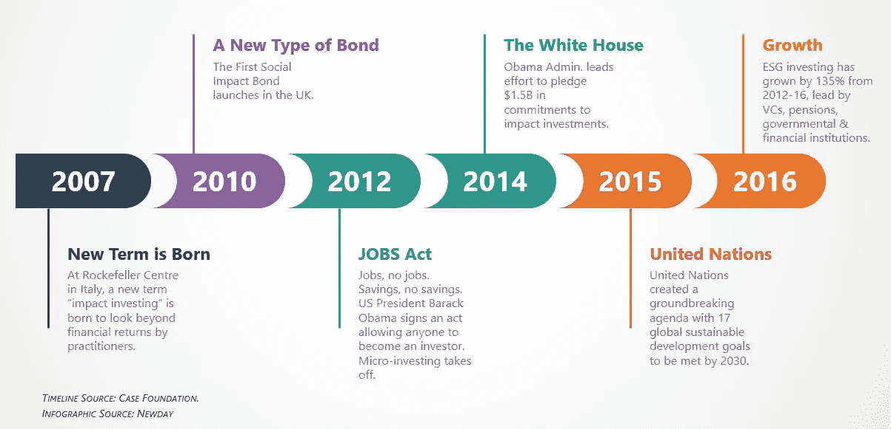
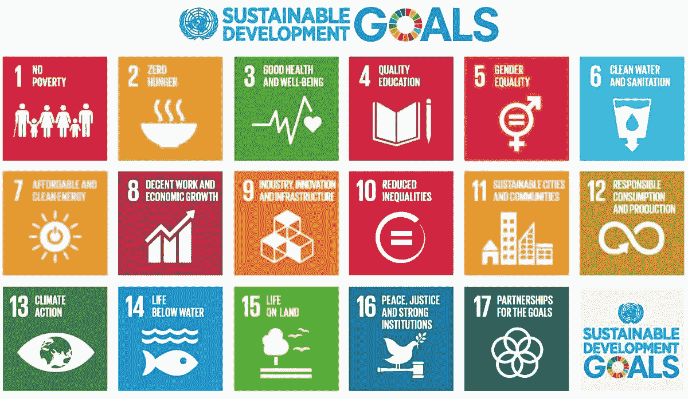
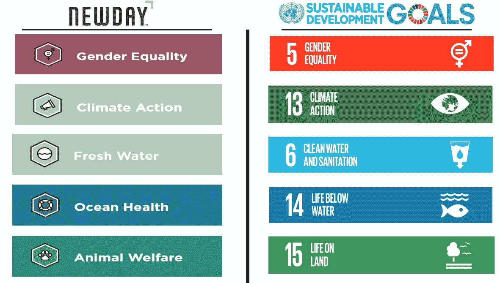

# 影响力投资和联合国如何合作

> 原文：<https://medium.com/swlh/how-impact-investing-and-the-united-nations-work-together-ea058ea14cbf>

Photo by [Ben White](https://unsplash.com/photos/gEKMstKfZ6w?utm_source=unsplash&utm_medium=referral&utm_content=creditCopyText) on [Unsplash](https://unsplash.com/search/photos/sustainability?utm_source=unsplash&utm_medium=referral&utm_content=creditCopyText)

投资继续发展。有了更新的投资产品，就有了更新的政府法规，有了更新的法规，就有了更新的财务规划技术。

一种更新的投资方法已经被放在当今投资管理行业的前沿——影响力投资。这个术语最初可以追溯到 2007 年在意大利洛克菲勒中心，从业者聚集在一起定义一种新的投资方法，这种方法将产生不仅仅是财务回报。

从那时起，国际组织、政府实体和金融机构已经将注意力转移到股票和债券等一般投资可以用来改善世界的概念上。

最初，通过“投资”或捐赠来改善世界，只是被称为慈善事业。然而，在过去的十年里，社会影响的概念变得不仅仅是慈善事业，慈善事业只是全球 1%人口的*专属*。

关于社会影响和可持续性的想法越来越多，人们的注意力转移到了普通大众的*包容性上。*

# 影响力投资是如何发展的

以下是自 2007 年那次重要聚会以来，影响力投资如何发展和演变的一些值得注意的事件。

在意大利的那次会议之后，新的投资工具被引入，随之，非政府组织和政府机构开始认真关注政策决策，以引导影响力投资的增长。

任何新方法要想在全球范围内取得成功，都必须有两个驱动因素:

1.  人口变化。
2.  政策倡议。

可持续投资实现了这两个因素，千禧一代推动了这一转变。

怎么会？

每一代人都有自己的事业。对于千禧一代来说，将他们的价值观与他们的工作和整体职业生涯结合起来是一种重要的感觉，也是驱动他们的一种感觉。随着这一代人的成长，他们确保自己的职业生涯与让世界变得更美好有着更紧密的联系。

因此，这影响了他们对个人理财的态度。

# 1.人口变化

这种转变始于世界经济论坛在 2013 年进行的一项引人注目的调查，在该调查中，来自 18 个不同国家的 5000 名千禧一代指出，任何企业的总体首要任务都应该是“改善社会”

不仅人口结构发生了变化，影响了对社会责任投资的需求，而且一个非常重要的方面也发生了变化——**代际态度。**

从长期趋势来看，这一代人最关心的问题是，他们的收入、储蓄和总体个人财务状况可能会被用于解决世界饥饿和气候行动等社会问题。

# 2.政策倡议

强劲的需求带来强劲的供应，这两者结合起来形成积极的趋势，所有这些都使更新的政策举措的条件成熟了。

总的来说，投资是留给极少数人的，他们必须承诺一定的投资余额。时任美国总统巴拉克·奥巴马于 2012 年通过的《就业(或启动我们的创业公司)法案》放松了证券监管，这实质上为没有最低投资承诺的投资打开了闸门。

在全球范围内，影响力投资获得了一个主要的执行者——联合国。

# 2030 年议程

2015 年 9 月，[联合国通过了全球在 2030 年](https://www.un.org/sustainabledevelopment/sustainable-development-goals/)前实现的 17 项可持续发展目标。为了实现 17 个总体目标，必须实现 136 个单项目标。

Source: United Nations

除了让 193 个国家同意同一议程的重要意义之外，各种实体之间相互协作的努力和协调现在得到了加强。包括非营利组织、政府、企业和非政府组织在内的实体。

影响力投资现在有了指导方针。

# 这是新的一天

这种投资方式将在下一个十年继续发展，并得到新一代投资者和支持者的支持，包括联合国和世界经济论坛。

[**new day Impact investment**](https://newdayimpact.com/)专注于具有潜在影响投资的整体可持续投资组合，而不是专注于包含在一般投资组合中的单一影响投资。

以下是 Newday 的投资组合如何与[联合国可持续发展议程](https://www.un.org/sustainabledevelopment/development-agenda/)保持一致:

*   [性别平等](https://newdayimpact.com/gender-equality-investment-portfolio/) → [联合国目标 5](https://www.un.org/sustainabledevelopment/gender-equality/)
*   [气候行动](https://newdayimpact.com/climate-action-investment-portfolio/) → [联合国目标 13](https://www.un.org/sustainabledevelopment/climate-change-2/)
*   [淡水](https://newdayimpact.com/clean-water-investment-portfolio/) → [联合国目标 6](https://www.un.org/sustainabledevelopment/water-and-sanitation/)
*   [海洋健康](https://newdayimpact.com/ocean-health-investment-portfolio/) → [联合国目标 14](https://www.un.org/sustainabledevelopment/oceans/)
*   [动物福利](https://newdayimpact.com/animal-welfare-investment-portfolio/) → [联合国目标 15](https://www.un.org/sustainabledevelopment/biodiversity/)

Newday 的[全球影响力组合](https://newdayimpact.com/global-impact-investment-portfolio/)还包括同时致力于解决一个或多个由[联合国 2030 议程](https://www.un.org/sustainabledevelopment/development-agenda/)定义的社会和环境挑战的不同组织。

只要最低投资 5 美元，任何人都可以开始投资和创建对自己最重要的投资组合。

*原载于***。**

**

## *这篇文章发表在 [The Startup](https://medium.com/swlh) 上，这是 Medium 最大的创业刊物，拥有+403，714 名读者。*

## *在这里订阅接收[我们的头条新闻](http://growthsupply.com/the-startup-newsletter/)。*

**