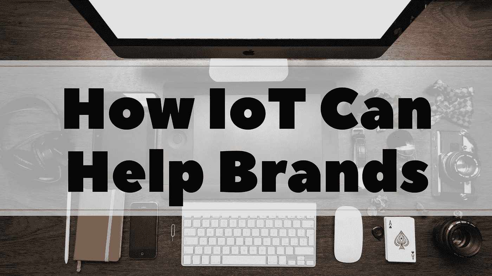

# 物联网如何帮助品牌取胜

> 原文：<https://medium.com/swlh/how-internet-of-things-iot-can-help-brands-win-e446cbd30202>

# 前方的路&你适合在哪里

围绕物联网(IoT)的大多数对话都是宣传和现实的混合体。大肆宣传数十亿设备通信的潜力，为更有利可图和更有生产力的未来铺平道路，以及缓慢和可疑的进展的现实。物联网技术的采用可以为您的公司提供前所未有的机会来提高生产力、降低运营成本和进入以前无法进入的新市场。然而，如果你让物联网数据在云端积灰，这是不太可能发生的。

有些人怀有反乌托邦式的恐惧，担心有一天物联网革命将为黑客接管我们的电子钥匙系统铺平道路，将我们锁在家门外，而当我们在高速公路上以 150 英里/小时的速度不受控制地行驶时，汽车黑客会控制我们的车辆。事实上，这与其说是一场革命，不如说是一场进化。物联网仅仅是互联网的利用和发展，允许日常物品通过网络连接来发送和接收数据。互联网一直是混乱的，但物联网增加了潜在的浩劫。如果您正在设计工业物联网应用，您将面临巨大的挑战，因为大多数工业设备都被设计为通过隔离来保护。让这些系统安全地与外部网络对话是一件棘手的事情。

问题是，我们谈论物联网时仍然主要是从技术角度出发(我们应该如何连接这些产品？)而不是从业务角度(连接这些产品我们会获得什么价值？).在未来的日子里，我们将继续看到传感器、软件和技术的进步，让我们的设备能够相互通话。品牌一直在寻找物联网可以为他们的服务增加价值的方法，但他们仍然没有考虑物联网将如何改变他们与客户互动的方式。这对你的品牌的影响是巨大的。您可以通过成为早期采用者、采取行动并尽快实施该技术来利用这一点。下面介绍了几种利用物联网展示品牌的方法。

# 1.“我的互联网”

当您在考虑将物联网体验融入何处时，请将这一技术趋势视为“我的互联网”。使用你能收集的所有数字数据财富，并基于从那里获得的情报，努力在顾客与你的品牌之旅的每个阶段提供个性化的体验。如今，消费者需要一种独立感，并将被重视个性的品牌所吸引。

# 2.将这一切与客户关系联系起来

物联网技术非常强大，因为它们让我们能够利用和个性化我们与客户的关系，这在以前是不可能的。例如，亚马逊拥有一个平价互联设备生态系统。这是一个持续增长的生态系统。虽然最初的 Echo 是一个一体化的解决方案，但亚马逊 Tap 和 Echo Dot 都建立在它的多功能性和便携性上，允许用户在旅途中携带 Alexa 或连接自己的蓝牙扬声器。你让你的消费者在他们的生活中种植你的服务或产品越顺利，你的生态系统就越成长。

*Tie it all to the customer relationship*

# 3.数据值

数据的商业价值是前所未有的。物联网趋势开创了数据和信息流的新时代，不断从人和设备中散发出来。充分利用你现在拥有的数据，利用每一个未来的机会来更深入地了解你的移动和物联网用户，你很快就会发现，每当你对他们了解得多一点，你就会在这个日益变得数字化的世界中获得独特的竞争优势。

另一方面，如果你是第一次尝试物联网的公司之一，你将面临组织和分析大部分运营数据的困难。你看，大多数企业收集数据的初衷是好的，但这些数据往往缺乏记录和组织。事实上，从不同的来源和地点获取或汇集数据进行分析已经证明是困难的。一些组织可以清晰地组织他们的数据，但是他们通常不确定如何从数据中获得真正的商业价值，因为他们缺乏专业知识和易于使用的工具。此外，隐私问题往往是收集和分析数据的一个障碍，主要是当收集的物联网数据可能被视为个人身份和敏感信息时，这些信息将受到不同地区不同法规的管辖。

我们仍然没有真正意识到物联网数据的真正力量。物联网将产生数量惊人的外部和内部数据，经过筛选后，这些数据将为你带来你甚至没有意识到应该问的问题的答案。作为一名物联网采纳者，在考虑物联网时要学会超越连接，并体会物联网数据的真正力量。连接本身可能会变得司空见惯，但企业的投资回报和消费者的附加值将成为该行业的驱动力，就像过去所有的技术趋势一样。数据必须仍然是您物联网战略的支柱。

# 4.为采取行动打下基础

如果你想跳跃并利用你的创新机会，你需要内部技术和开发技能。这意味着你必须将移动和云技术基础设施结合起来，完全数字化，通过连接人、物、流程和数据来建立新的商业模式，以跟上技术创新的步伐。此外，考虑打造开箱即用的合作伙伴关系，优先考虑尖端 IT，并设计灵活的基础架构，可以根据您的下一个机会进行扩展和调整。

# 5.在您现有的产品和服务中轻松使用物联网

移动是物联网的基础，也是科技初创公司能够整合物联网并快速发展的原因。如果你想成为下一个优步，请关注移动和物联网趋势的快速发展，并随时准备在创新机会到来时采取行动。物联网催生了新一轮创业浪潮。在大多数情况下，物联网设备由移动应用程序控制，该应用程序必须下载到消费者的智能手机上。智能手机正慢慢变成数字体验的万能遥控器。得益于手机，优步由手机应用驱动的联网汽车像野火一样蔓延到全球。Fitbit 放眼未来，看到了传感器和无线技术带来的变革健身行业的机会。除了直接销售产品，寻求将消费者与服务联系起来的公司也越来越多。优步、Airbnb 和 Trunk Club 让千禧一代过着轻资产的生活。这些公司建立的联系有助于建立一种社区意识，同时消费者觉得他们得到了他们需要的服务。这些以移动和物联网为中心的创业公司正在利用他们的敏捷性超越家喻户晓的品牌公司。幸运的是，对你我来说，任何组织都可以利用物联网和移动来发展自己的品牌。你不需要成为一个创业者来颠覆你的行业。你只需要表现得像一个。

# 6.像创业公司一样行动

要像一家初创公司那样行事，你必须开始积极寻找机会，在最新技术发展和你的业务交叉的地方进行创新。难的是，你要做的不仅仅是看。你必须行动起来。初创公司在起步阶段只关注一件事，那就是增长。这种单一的关注鼓励他们去冒险。对于您的组织来说，这可能不是自然而然的事情。你的企业可能比创业公司损失更多。规避风险是有道理的，但不要让它蒙蔽了你的双眼，让你看不到最重大的风险，随着更小、更大胆的品牌取代你的位置，它变得与你的消费者无关。

*原载于* [*CognitiveClouds 博客*](https://www.cognitiveclouds.com/insights/how-internet-of-things-iot-can-help-brands-win/) *: Top* [*物联网应用开发公司*](https://www.cognitiveclouds.com/custom-software-development-services/internet-of-things-iot-application-development-company)

## 这个故事发表在 [The Startup](https://medium.com/swlh) 上，这是 Medium 最大的企业家出版物，拥有 294，522+人。

## 在此订阅接收[我们的头条新闻](http://growthsupply.com/the-startup-newsletter/)。

