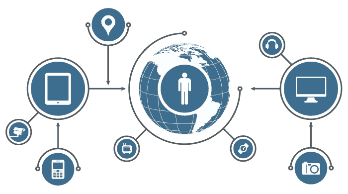

# 物联网、区块链和人工智能如何联手改善智能家居体验

> 原文：<https://medium.com/swlh/how-iot-blockchain-and-ai-can-join-forces-to-improve-the-smart-home-experience-7cdbdab75214>

image source: kisspng.com

千禧一代正在成为美国历史上最大的一代，与婴儿潮一代、[千禧一代和 x 世代不同，他们受科技驱动，重视体验而非所有权。](https://startupstash.com/videos/the-xennials-and-why-they-matter/)

简而言之，这一代人更喜欢虚拟工作和周游世界，而不是找一份白天的工作，攒钱付房子的首付和办理抵押贷款。根据 FlexJobs 的[调查，大多数千禧一代更喜欢弹性工作，他们工作的主要动机是为了省钱去旅行。](https://www.flexjobs.com/employer-blog/flexjobs-survey-millennials-interested-travel-work-flexibility/)

因此，毫不奇怪，这一代人带来了共享经济和区块链，让跨境交易变得更便宜、更安全。在房地产领域，千禧一代给了我们 Airbnb 这样的平台，允许人们出租家中的多余空间。

但是，在技术世界里，这个行业还有很多需要学习和探索的地方。那些希望进入千禧一代提供的巨大市场的人应该研究他们的需求和偏好，并设计出与之匹配的产品。最有可能颠覆这个行业的关键技术包括物联网、人工智能和区块链。

## **千禧一代热爱智能家居**

在物联网爆炸式增长的背后，是喜欢使用智能手机控制一切的一代人，从他们家的门锁到他们厕所的冲水。

对物联网技术的这种倾向，难怪这一代人更喜欢智能家居。根据 Wakefield Research 的一项[研究，如果拥有智能技术，千禧一代愿意为房屋或出租物业支付更多。事实上，该研究表明，这一代人愿意为使用智能技术的房屋多支付 20%的费用。据](https://www.curbed.com/2016/12/5/13838540/millennials-rent-smart-home-tech-features)[房地产日报](https://www.realestatedaily.com/news-items/top-3-smart-home-tech-features-to-attract-millennials/)报道，吸引千禧一代的关键智能家居技术特征包括智能安全、联网恒温器和自动照明。

## **人工智能和机器学习如何帮助改善家居环境**

物联网设备收集大量数据，这些数据可以被收集和利用来改善用户体验。收集到的数据可以经过强大的算法处理，从而得出企业和政府可以采取行动的见解。

此外，通过机器学习，智能家居设备可以从收集的数据中学习。这意味着，随着智能房主的品味和偏好不断变化，他们家中的智能电器可以相应地适应这些变化。机器学习技术使智能家居能够在不需要用户手动输入的情况下自行决策。

想象一个装有传感器的家，这些传感器可以确定你的情绪并相应地调整环境。例如，当疲倦和困倦时，客厅里的音响会自动播放舒缓的音乐，冰箱会推荐适合心情的食物或饮料。

同样，床可以告诉你累了，并调节温度让你睡得舒服。当你在一个房间里时，灯光可以探测到，并根据你正在进行的活动来调节灯光。

现在想象一下，所有这些设备都可以告诉你何时对他们的选择不满意，并可以处理数百万个变量，以高精度预测你的口味和偏好。

通过机器学习，智能家居可以不断改进自己，以便能够密切识别定义个人的细微特征，并提供高度定制的服务。

## **当前的危险和弊端**

如果另一个怀有恶意的人访问您的智能家居设备并对其进行篡改，该怎么办？在最坏的情况下，这些人会进入你的家。或者，他们会窃取您的个人隐私数据，并将其用于自己的目的，这可能会更加有害。

根据本古里安大学研究人员的一项[研究](https://aabgu.org/off-shelf-smart-devices-found-easy-hack/)，当今市场上的大多数智能家居设备都极易受到黑客攻击。该研究表明，黑客可以远程访问大量这些设备，并通过恢复其默认设置来篡改其安全系统。

再说一次，大多数聪明的房主都不会费心为他们的系统设置密码，这样第三方就更容易访问它们。这就是区块链技术的用武之地。

## **区块链作为解决方案**

当在区块链上运行时，智能家居设备变得不可改变，因此不会受到网络攻击。这意味着黑客无法访问你的家或你的物联网设备收集的数据。此外，借助区块链驱动的智能家居系统，您可以安全地让其他人访问特定区域和设备，而无需授权他们访问所有内容。

智能家居技术利用区块链实现这一目的的一个很好的例子是康卡斯特。他们的区块链技术利用基于权限的账本，使房主能够通过移动应用程序远程授予访问权限。移动应用程序还使他们能够通过点击一个按钮来撤销这些权限。

以区块链为动力的智能家居技术还可以让房主雇用家政工人完成特定任务，并通过智能合同支付工资，这可以确保在执行合同之前满足承包商和承包人之间的指定条件。

随着物联网、人工智能和区块链技术的不断发展，毫无疑问，更先进的智能家居解决方案将会出现。最好的项目将是那些能够提供结合三种技术的解决方案，以获得最安全和最佳体验的项目。

## 这个故事发表在[的创业](https://medium.com/swlh)上，这是 Medium 最大的创业刊物，有 337，320 多人关注。

## 订阅接收[我们的头条新闻](http://growthsupply.com/the-startup-newsletter/)。

