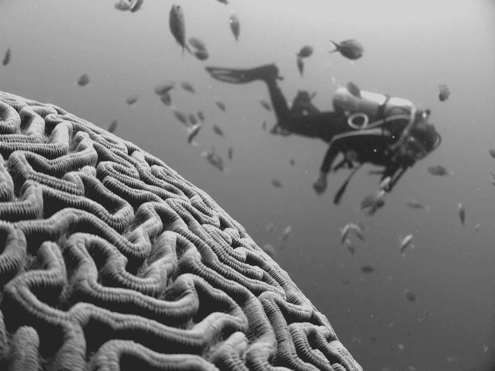
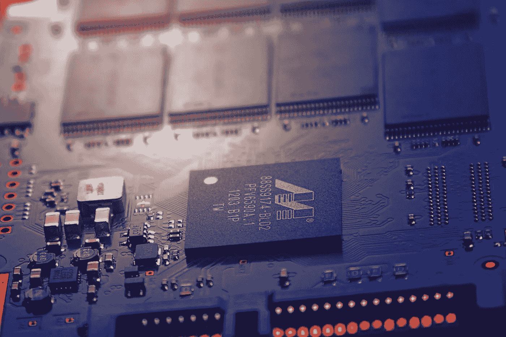

# IOT 目前是如何改变心理健康的？

> 原文：<https://medium.com/swlh/how-iot-is-currently-changing-mental-health-360974579f5>

*   由 Dhruv Apte，[法鲁克阿里汗](https://medium.com/u/3ed4f198804b?source=post_page-----360974579f5--------------------------------)，[拉马钱德兰。拉维尚卡尔](https://medium.com/u/ef5c0b29bf10?source=post_page-----360974579f5--------------------------------)，和[苏坎特库拉纳](https://medium.com/u/6d41261644a8?source=post_page-----360974579f5--------------------------------) *

(* skgroup.iiserk@gmail.com 的通信应发送给谁)

Photo by [Vlad Tchompalov](https://unsplash.com/photos/ZEpxoNzKfcc?utm_source=unsplash&utm_medium=referral&utm_content=creditCopyText) on [Unsplash](https://unsplash.com/?utm_source=unsplash&utm_medium=referral&utm_content=creditCopyText)

你好，你好！我们将讨论 IoT，即物联网及其在心理健康方面的应用。在我们一头扎进现在的世界之前，让我们后退一步。事实上，不是一步而是几步，回到过去 20 年，来了解物联网的发展。二十年前，没有人会想到物联网和精神健康会有交集。

**IOT 简史**

我们喜欢《回到未来》系列。说真的，你一定要看！如果你有，那么你可能已经注意到很多事情正在变成现实。飞行无人机，指纹扫描仪，可穿戴技术。对于一部 1985 年的电影来说，这真的很酷，不是吗？除了天才的罗伯特·泽米基斯，谁能想到这一切都是真的呢？

你知道物联网的起源非常卑微吗？卡内基梅隆大学的简单可乐机连接到计算机，报告其库存并告诉装载的饮料是否是冷的。

1989 年，在 Interop 会议上，作为与 INTEROP 总裁丹·林奇打赌的一部分，约翰·罗姆基创造了一个可以通过互联网“打开”和“关闭”的烤面包机。作为一项比赛，也许或者也许是好奇心的影响，剑桥大学的昆廷·斯塔福德-弗雷泽和保罗·贾德茨基创造了一个特洛伊房间咖啡壶，它可以监控壶的水平，并在一分钟内在服务器上显示三次。

回到更学术的话题，著名计算机科学家马克·魏泽是第一个预测物联网的人。你会相信这个身患癌症的家伙在他的办公室外面建造了一个喷泉，其流量和高度模仿了股票市场的交易量和价格趋势吗？毫不奇怪，马克是第一个给先驱 IOT 写作品的人。

另一位杰出的科学家，麻省理工学院电气和计算机科学系教授 Steven Mann 在 1994 年创造了一种称为 WearCam 的数字眼镜，可以在计算机上显示人眼看到的东西，使人眼有效地发挥电子相机和电视显示器的功能；1995 年，他继续他的酷发明，使用可以投射任何 3d 表面的远距指示器。

当时在研究论文和期刊中有将东西与计算机连接的想法。90 年代初，随着加州大学伯克利分校交通研究所管理的加州道路系统，智能交通系统的想法开始涌现。同样，Sun Microsystems 的联合创始人 Bill Joy 在 1999 年达沃斯世界经济论坛上提出了设备到设备通信的框架。

一个有趣的事实是，我们都在谈论物联网以及它在 90 年代是什么，而这个名称本身是由麻省理工学院 Auto-ID 中心的执行主任 Kevin Ashton 在 1999 年创造的。

Photo by [Johannes Plenio](https://unsplash.com/photos/FZpCcPss9to?utm_source=unsplash&utm_medium=referral&utm_content=creditCopyText) on [Unsplash](https://unsplash.com/?utm_source=unsplash&utm_medium=referral&utm_content=creditCopyText)

**心理健康研究比 IOT 更早**

心理健康研究和解决心理健康问题的历史比 IOT 还要悠久。例如，左旋多巴在被证明有助于被诊断患有帕金森氏病的人之后，已经引起了范式的转变。帕金森氏症现在可能因为其著名的患者拳王穆罕默德·阿里而为人所知，但它是很久以前就为人所知的疾病。如果你没有听说过，这是一种中枢神经系统的退行性疾病，通常是由于中脑部分细胞死亡而发生的。这恰好是第二常见的神经退化性疾病，也是库拉纳实验室的少数激情之一。

 [## 完全比较显示(CCD)评价积雪草和睡茄的乙醇提取物…

### 帕金森病仍然是最常见的衰弱性神经退行性疾病之一。怀着…的希望

journals.plos.org](http://journals.plos.org/plosone/article?id=10.1371/journal.pone.0177254)  [## 帕金森病模型的评价

### 帕金森病是最常见的神经退行性疾病之一。动物模型贡献了很大一部分…

www.frontiersin.org](https://www.frontiersin.org/articles/10.3389/fnins.2015.00503/full) 

另一个革命性的药物是苯巴比妥，自 1912 年以来一直用于治疗癫痫，随后是苯妥英，自 1938 年以来。不仅仅是精神健康在医学上有所发展，甚至在大基因组时代之前，遗传学也有所发展。1983 年，一个由美国和委内瑞拉研究人员组成的联合小组找到了亨廷顿舞蹈症致病基因的大概位置。现在，定位与精神健康问题相关的突变是一项容易得多的任务。

从 20 世纪 90 年代开始，神经科学、心理学和遗传学取得了巨大的进步。认知行为疗法的发展，即解决当前问题的个人应对策略的发展，已经产生了许多积极的结果，也产生了许多伪装者，他们提供认知行为疗法，但对其承诺和严重的局限性没有应有的理解。最初，这种疗法用于治疗抑郁症，但也对精神分裂症和精神病有一定的帮助。1997 年，美国食品药品监督管理局将深度脑刺激合法化，这是一种在大脑中植入电极以治疗帕金森氏症的神经外科手术。它后来被批准用于肌张力障碍和强迫症。

并非所有的进展都是在寻找新药、植入电极或寻找致病基因方面。1997 年，Drexel 大学的 Robert Palisano 提出了粗大运动功能分类系统，这是一种基于自我启动运动对脑瘫患者的运动功能进行分类的分类系统。该系统有五个级别，从 1 级到 5 级不等，1 级意味着患者可以在协调能力下降的情况下进行日常活动，5 级意味着患者在运动功能的所有领域都受到损害。该系统很快成为北美、欧洲和东南亚脑瘫患者活动能力评估分析的标准，可以解释治愈的治疗方法。

# IOT 对精神健康有什么帮助？

许多推动 IOT 的技术也在推动神经科学。不仅如此，IOT 还直接帮助了神经科学。IOT 最大的承诺之一将是个性化医疗，拥有大量的患者记录，以及在医生治疗未来问题时使用人工智能。我们认为 IOT 有一天会解决医疗保健费用飞涨的问题。这不是一篇关于 IOT 未来的文章，所以我们不会在这里详述，但我们很快也会写下来。如果你对心理健康的一个特定方面感兴趣，康复以及我们认为未来会有什么不同，你可以在这里听听我(库拉纳博士)的演讲。

谈到 IOT 目前正在做的事情，让我们解释一下它是如何运作的。物联网是将物理设备、建筑、传感器连接起来，获取数据并远程控制；为物理世界与基于计算机的系统的直接整合创造更多机会，以提高效率、准确性和经济效益。

**控制设备，例如用于深度脑刺激的电极**

我们提到了深度脑刺激(DBS)，这是一种将电极植入大脑的手术。手术有它自己的副作用。这些症状包括定向障碍、恶心、头晕、睡眠相关问题以及严重的并发症，包括脑出血、人格改变和复视。复视患者开始以双重视角看世界。所以，病人们有时认为他们可能在手术后喝醉了！随着这些电极的远程控制，部分可能是由于广义上被称为 IOT 的技术的发展，人们可以使副作用不那么严重。物联网还可以解决另一个问题:有时植入物会发生钙化，这个问题可以通过传感器监测和控制，传感器会随着时间的推移而消失。伊利诺伊大学厄巴纳-香槟分校的研究人员正在研究这种类型的植入物。传感器和刺激器也会失灵。2011 年，神经外科医生 P . K Doshi 博士发表了一篇论文，分析了 1999 年至 2009 年发生的约 153 例 DBS。结果并不令人惊讶:24 例在一年的随访中出现并发症，另外 3 例被诊断为刺激功能障碍。在某种程度上，DBS 的进步是由于电子和计算机科学的进步，但 IOT 的其他方面也有帮助。

**软件**

受益于互联网相关技术的不仅仅是电极植入物。**Fast forward**是一款提高儿童认知技能的教育软件，经常被用作一种治疗方法，以认知行为疗法快速取代传统疗法，减少认知障碍。

**对病人的远程监护**

**TeleStroke 是神经科学和物联网领域的先驱，尽管其成本目前令人望而却步。**

那么，当我们谈论中风时，我们会想到什么？简单来说，当大脑没有获得足够的含氧血液时，脑细胞就会死亡。氧合血的缺乏可能是由动脉阻塞或血管破裂引起的。一般症状包括头痛、一侧失明、无法移动和眩晕。在最近的世卫组织调查中，2015 年中风导致 620 万人死亡。美国疾病控制中心(CDC)已经将由卡罗莱纳州、田纳西州、弗吉尼亚州和美国西南部的七个州组成的区域认定为“中风带”。这些州的中风死亡率接近 140-160/100，000，相比之下，非“中风带”州为 89/100，000。中风通过 CT 或 MRI 扫描来诊断，然后使用心电图或血管造影来检测血凝块。霍尔特监护仪用于检测异常心律。IOT 帮助预防和诊断中风。

让我们简单地看看除了远距卒中以外的卒中的进展。2001 年，加州大学洛杉矶分校的研究人员设计了一种治疗缺血性中风的医疗设备，缺血性中风是指由血凝块引起的动脉阻塞引起的中风。称为“MERCI Retriever ”,是脑缺血机械栓子清除的简称。寻回犬有一根长长的金属线，末端有一圈螺旋状的线圈。一个膨胀的导管将被拖进受影响的动脉，通过导管给寻回犬喂食，线圈将被拉直以适应。然后，线圈会重新形成，包裹住血块并将其拉出。这种方法在 2004 年被 FDA 批准。另一种用于治疗中风的方法是使用组织纤溶酶原激活剂或 tPA。但是这种激活剂药物只有在中风后的前三个小时才有效。病人接受治疗越快，康复的机会就越大。

波士顿马萨诸塞州总医院的远程中风专家通过互联网链接，使用远程会议和图像共享来检查远程医院的患者。根据 Lee Schwann 博士的说法，使用远程扫描检查病人就像在同一个房间里一样！远程治疗由三个部分组成:脑成像、远程检查和同步需求门户。医生很容易从他的计算机上下载远程发送的 CT 扫描图像。接下来，她确定病人是否有资格接受溶栓治疗。

技术组件包括 ISDN 电话线、IP 技术和数据压缩技术。已经开发了许多远程医疗和电信系统来帮助患者及时获得远程治疗:这些系统包括 BF 技术、InTouch 和 PolyCom。在美国亚利桑那州和加利福尼亚州进行的远程治疗试验表明，通过远程治疗做出的医疗决策比简单的电话咨询更准确、更恰当。后来，在 2009 年，美国心脏协会制定了关于使用视频会议系统的建议，并表示它同样可以与床边诊断相媲美。

现在你可能会想，为什么远程治疗没有在我当地的诊所实施呢？好吧，伙计们，每年的远程中风费用大约是 46，000 美元。另一个可行但昂贵的技术是 REACH 系统，它的价格在 70，000 到 90，000 美元之间！

远程办公的第二个问题是需要政府的许可和授权。如果跨省或国际治疗对该过程构成行政障碍，则必须获得多个许可证。

第三个问题是财务报销。到目前为止，没有一个国家规定了远程医疗的财务报销。但是，尽管有这些障碍，麻省总医院的神经学家 Feras Akbik 博士认为，远程中风的前景是光明的。

我们认为，即使 Telestroke 在经济上表现不佳，它也将为其他几项类似技术铺平道路，这些技术将成为未来医疗实践中不可或缺的一部分。即将到来的技术的一个例子是 Babylon，一个获得 2500 万美元投资的应用程序。 **Babylon** 允许用户与当地诊所可能找不到的医生、外科医生和治疗师交谈。

**IOT 和癫痫**。

癫痫的特征是由大脑部分过度和异常的神经细胞活动引起的癫痫发作。治疗包括药物如苯妥英、卡马西平和丙戊酸钠。癫痫手术也是一种选择。一些患者还被开出高脂肪、低碳水化合物的饮食，甚至基于操作的生物反馈。所有这些治疗方法都有助于控制癫痫。

myCareCentric Epilepsy 是由 Graphnet Health 和 Shearwater Systems 与肯特大学联合发起的一项计划。该倡议得到了英国创新组织的支持，这是一个由政府运作的为创新产品提供资金的计划。该产品包括一款微软腕带，用于向临床医生反馈数据。该数据包括由生物读数产生的信息以及由患者输入的信息。例如，患者输入他或她感到头晕的数据。该小组输入信息，并立即使用标准数据点来分析情况，并向临床医生报告。该项目还包括一个首次计时器:它将来自波段的信息与患者的临床记录相结合。该系统从使用它的病人那里得到了压倒性的积极反应。患者们说，这有助于他们变得独立，并帮助他们更好地控制他们的癫痫发作。

另一个和上面一样的发明是**拥抱**，这是一个由麻省理工学院媒体实验室教授 Rosalind Picard 领导的初创公司 Empatica 创建的乐队。Picard 教授于 1998 年成为 IEEE 可穿戴信息系统技术委员会的创始成员。Embrace 从加速度计获取运动数据，并将其与皮肤电导读数结合起来。皮肤电导的巨大峰值预示着即将到来的癫痫发作，病人现在对此已经有了更好的准备。在生物学上，该带具有穿过皮肤的小电极，并测量汗腺的刺激。当算法检测到癫痫发作时，它会立即振动并提醒他或她的智能手机上的联系人列表。癫痫基金会主席沃伦·拉默特认为，拥抱可以更好地了解不同药物如何影响不同患者，并有助于更好地进行广泛的临床研究。同样，加州大学旧金山分校(University of California，San Francisco)的神经学教授兼癫痫中心主任丹尼尔·洛温斯坦(Daniel Lowenstein)表示，拥抱可能会成为患者的“天赐之物”，当他们知道自己的压力水平正在上升时，就可以避免癫痫发作。

在印度，一个类似的概念正在形成。T-Jay 由 Rajlakshmi Borthakur 构建，并由英特尔印度公司和科技部提供支持。T-Jay 是一种从身体传输信号的手套，有三个组成部分:感应温度，根据参考值检查身体电流和用于检测癫痫发作的加速度计。T-Jay 感知 11 种类型的信号，并将它们与预设的阈值进行比较，从而给出癫痫发作的指示。

还有几种技术有助于预测癫痫发作。随着研究的继续，我们将有越来越多更好的设备来应对癫痫发作。我们自己的小组正在开发更好的癫痫发作预测算法，我们知道疾病事件预测的未来是光明的。

**自我监控**

自我监控使患者能够自己控制自己的活动，并有助于防止医院和诊所经常发生的混乱。专门从事人体感应的 Innova 设计解决方案公司的首席执行官利昂·马什说，在 IOT 的帮助下，这些问题在威胁生命之前就会显现出来。

**脑成像**

2013 年，由柯里·巴格曼、洛克菲勒大学和斯坦福大学的威廉·纽森领导的 15 名科学家组成的顾问小组发布了一份题为“神经科学的未来”的报告。这份报告是奥巴马总统大脑倡议下发布的首批报告之一。国家健康研究所主任弗朗西斯·柯林斯提到，重点将放在回路上，以及回路如何让大脑发送和接收脉冲。来自洛桑 EPFL 的研究人员已经虚拟地构建了一小片老鼠的大脑，尽管我们认为大脑图谱还有很大的改进空间。无论脑成像的方向是什么，它肯定会从正在开发的 IOT 技术中获益匪浅。

**脑机接口**

想象一下，一个颈部以下瘫痪的女人使用假肢，甚至在飞行刺激中表现出色。这是可能的。五角大楼国防高级研究计划局(DARPA)生物技术办公室主任杰弗里·凌(Geoffrey Ling)最近描述了如何将微电极阵列系统植入患者大脑，从而轻松控制手臂的运动，以至于她最近能够在飞行刺激器中驾驶 F-35。

但是我们已经讨论了 IOT 在神经科学方面的优势。当 IOT 在神经科学领域进行革命时，它会带来哪些不利因素呢？

**流行病学**

我们自己的小组正试图开创精神健康统计数据的动态监测，并将其与意识进行比较。我们通过社交媒体聊天、新闻报道、电视报道等形式来衡量认知度。我们希望这样的管道将彻底改变政府处理精神健康或一般健康的方式。

**IOT 在神经科学方面的问题**

当认知测试和成像预测早期症状时，患者会感到困惑和焦虑。托马斯·因塞尔说，研究人员必须权衡给病人贴标签的风险，尤其是过早给儿童贴标签。在国际神经伦理学协会最近的一次会议上，Geoffrey Ling 提出了一个问题，即使患者被检测出有轻微的认知变化，医生也无法治愈即将到来的阿尔茨海默氏症，告诉患者这一点是否道德？

另一个被反复提出的问题是 IOT 设备存储的患者数据的安全性。组织需要适应这场 IOT 革命，并防止 2013 年蒙大拿州公共卫生与公众服务部等政府机构和 2015 年 Anthem Inc .等私营机构发生的泄密事件。人们担心他们的数据会被黑客用于身份盗窃或勒索，并经常反对这种存储。在医疗领域，随着 Health Net、Nemours Foundations 和 Anthem Inc .报告数百万受试者的医疗数据泄露，人们对当前 IOT 的安全性产生了高度怀疑。医疗信息技术解决方案的主要供应商 Cerner 的副总裁 John Glaser 博士最近在《医院和网络》(通常被称为《H&N 杂志》)上发表了一篇文章，他表示担心物联网可能收集的大量数据可能会使医疗设备达到更令人不安的目的，如干扰功能。他认为黑客可以做更大规模的事情。

Photo by [Jacob Postuma](https://unsplash.com/photos/trn0EWV8jDE?utm_source=unsplash&utm_medium=referral&utm_content=creditCopyText) on [Unsplash](https://unsplash.com/?utm_source=unsplash&utm_medium=referral&utm_content=creditCopyText)

**总结**

越来越多的精神疾病可以被 IOT 治愈或者至少检测出来。越来越多的生命可以被挽救，那些受影响的人可以独立生活。正如 Geoffrey Ling 所说，IOT 和神经科学的未来是光明的。凭着聪明的思维，我们认为它会聪明到足以掩盖它的缺点！

— — — — — — — — —

**Dhruv Apte** 是库拉纳博士实验室的实习生。

**Farooq Ali Khan** 是 NIPER 的研究生，广泛参与药物输送、药物研发和公共卫生政策。曾任 2017 年世界卫生大会常务副主席。他是库拉纳博士团队的研究员。

Ravishankar Ramachandran 博士是国际知名的结核病结构生物学家和药物研发科学家。他还领导了多项学术界和产业界的合作。他正在与 Khurana 博士就科学意识、区块链应用、人工智能、IOT 和医疗保健领域的数据科学进行合作。

 [## CDRI |家

### 发达的

www.cdri.res.in](http://www.cdri.res.in/1557.aspx?id=1557) 

Sukant Khurana 博士经营着一个学术研究实验室和几家科技公司。他也是著名的艺术家、作家和演说家。你可以在 www.brainnart.com 的[或 www.dataisnotjustdata.com](http://www.brainnart.com)的[了解更多关于苏坎特的信息，如果你希望从事生物医学研究、神经科学、可持续发展、人工智能或数据科学项目的公益事业，你可以在 skgroup.iiserk@gmail.com 联系他，或者通过 linkedin](http://www.dataisnotjustdata.com) [的 https://www.linkedin.com/in/sukant-khurana-755a2343/](https://www.linkedin.com/in/sukant-khurana-755a2343/)联系他。

这里有两个关于 Sukant 的小纪录片和一个关于他的公民科学努力的 TEDx 视频。

 [## Sukant khu Rana(@ Sukant _ khu Rana)|推特

### Sukant Khurana 的最新推文(@Sukant_Khurana)。创始人:https://t.co/WINhSDEuW0 和 3 家生物技术创业公司…

twitter.com](https://twitter.com/Sukant_Khurana) 

## 这篇文章发表在 [The Startup](https://medium.com/swlh) 上，这是 Medium 最大的创业刊物，拥有 281，454+读者。

## 在这里订阅接收[我们的头条新闻](http://growthsupply.com/the-startup-newsletter/)。

