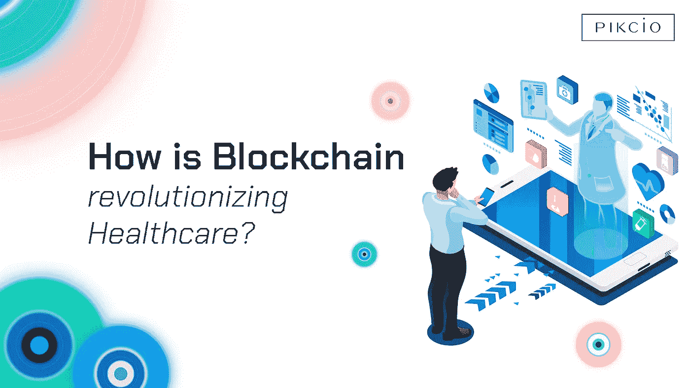

# 区块链如何变革医疗保健？

> 原文：<https://medium.com/swlh/how-is-blockchain-revolutionizing-healthcare-d971d351528f>

The Startup. Medium’s largest publication for makers.

在过去的两年里，区块链科技的发展不仅吸引了科技行业的兴趣，也吸引了普通大众的兴趣。但是区块链首先是什么呢？区块链是一种分布式账本，用于存储交易记录。区块链允许在不可变的 P2P 网络上共享数据和交易，该网络经过加密以增强透明度、安全性和隐私性。

区块链在很大程度上与加密货币和金融交易相关联，然而，区块链不仅仅是加密货币和金融交易。包括制造业、医疗保健和娱乐业在内的一些行业正在逐步采用区块链，以利用其去中心化和增强安全性以及隐私的优势。

在医疗保健领域，区块链因其增强安全性、隐私性、互操作性的潜力以及将患者置于生态系统中心的能力而受到广泛赞誉。然而，很少有人了解这种独特的技术可能给医学领域带来的潜力和可能的应用。区块链为实验、投资和测试提供了无数机会。下面我们来看看区块链的一些优势，以及如何将其应用于医疗保健领域。

# 区块链的优势

**增加数据完整性和出处:**区块链交易不可变。区块链交易一旦进行，就不能删除或更改。交易被安全地记录在网络上，并可以在网络上共享。这有助于证明数据的完整性，任何用户都可以验证数据的时间戳，而无需第三方或改变它。一旦在区块链网络上进行交易，其原始作者被指明，并且该交易在区块链的整个生命期内保持原子性。

**安全性:**在交易被记录在区块链网络上之前，它必须首先被其他区块链用户验证。在验证之后，交易被密码加密并链接到先前的交易。此外，数据存储在设备网络中，因此几乎不可能被黑客攻击。总体而言，区块链为系统和数据提供了无与伦比的安全性。

透明性:区块链网络中的所有参与者共享相同的文档，因此在现有版本被更改之前，每个人都必须同意。要改变区块链网络上的单笔交易，就需要对整个网络进行彻底检查，因此网络上的数据在很大程度上是准确、一致和透明的。由于区块链的分散性，所有参与者只要拥有私钥，就可以访问所提供的任何交易。这使得跨多个平台共享信息变得更加容易。

# 区块链在医疗保健领域的应用

**健康记录:**可以在医疗行业部署区块链，为患者管理创建可用的、高度完整的记录。多年来，医疗保健从业者一直面临着集成健康记录的挑战，以便患者可以在一家医院接受治疗，并移动到不同的位置，但仍然可以访问相同的信息。事实上，到今天为止，对于日常用户来说，访问、管理和共享您的医疗数据是一件困难的事情。区块链允许健康提供商创建一个平台，可以整合来自多个中心的数据，并允许跟踪患者信息。

**基于区块链的集成健康记录系统**将患者置于系统的中心，因为他们拥有自己数据的私钥。因此，患者能够控制谁可以访问或使用他们的数据。区块链应用还将有助于记录和活动的协调，并有助于遏制欺诈。

这可能会导致以下应用:

*   在世界任何地方访问和管理您的健康记录；
*   安全地与您选择的任何医疗保健专业人员分享这些信息；
*   记录你的医疗背景(过敏、慢性病、疫苗……)；
*   在您无法访问您的数据时(例如在紧急情况下)，允许您访问您的数据；
*   检查您最近的医疗处方；
*   多得多…

**数据安全:**说到安全，您知道吗，在黑市上，您的医疗数据比您的信用卡号更值钱？根据 Protenus Breach Barometer 报告，【2015 年至 2016 年间，1.4 亿份患者记录被黑客攻击。

> 区块链有可能保护您的私人信息安全，同时仍然能够将其连接到任何地方。

以下是几个可能的例子:

*   医疗设备和服务提供商之间的认证和私有消息传递
*   医疗记录所有权的证明
*   防伪技术的真实性证明

**药品可追溯性:**HRFO 的统计数据表明，在发展中国家销售的药品中，超过 15%是假药。报告进一步表明，制药公司每年因伪造而损失约 2000 亿美元。区块链凭借其真实性证明功能和逐点跟踪的可能性，可以遏制这种趋势，确保一旦生产出药物，它就是真的，因此用户可以在购买前验证药物的真实性。

**确保临床试验的安全:**由于涉及多个机构，协调临床试验和研发活动变得更加困难。由于不诚实和盗窃知识产权，这变得更加困难。区块链可以通过允许用户认证任何文档并确保存在证明来改变这一点。因此，研究人员可以共享统计数据、测试结果和质量报告，而不必担心知识产权被盗。

此外，访问庞大的匿名患者数据库是许多人希望在医学研究中实现的梦想。时至今日，由于各种不同的、互不关联的服务，不可能查看所有可能对新的治疗方案或简单的流行病学研究有用的记录。

# 经济管理

全世界的医疗保健欺诈已经造成了数百万美元的损失。基于区块链的系统虽然不会使这一数字达到零，但可以帮助最小化这一数字，远远超过许多人的想象。提醒一下，区块链是一个不可改变的、透明的和高度安全的登记册。

此外，医疗保健系统的总成本将大大降低并得到高度优化。

区块链可以允许研究机构进行审计，以获取相关的医疗信息，如果患者同意，这些信息将匿名传回给他们。

# 结论

除此之外，区块链还提供了多种优势，如果加以利用，将极大地改善医疗保健行业。虽然区块链尚未在任何司法管辖区被普遍采用，但它在医疗保健领域的应用在未来只会越来越广泛，我们 Pikcio 希望成为其中的一员。

> 请访问[我们的博客，了解更多与医疗保健和区块链相关的内容！](https://news.pikciochain.com/healthcare/home)
> 
> 不要犹豫，连接并[在 LinkedIn 上添加我！](https://www.linkedin.com/in/korileon/)

## 这篇文章发表在 [The Startup](https://medium.com/swlh) 上，这是 Medium 最大的创业刊物，有+ 381，088 人关注。

## 在这里订阅接收[我们的头条新闻](http://growthsupply.com/the-startup-newsletter/)。

