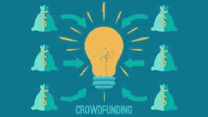

# 技术是如何改变我们所知的金融方式的？

> 原文：<https://medium.com/swlh/how-is-technology-changing-finance-the-way-we-know-it-412b18ec33fe>

JP 摩根(JP Morgan)的杰米戴蒙(Jamie Dimon)曾对他的华尔街同事说过一句著名的话:“硅谷要来吃我们的午餐了”。在大型全球银行走廊中，对(初创公司)颠覆的焦虑是显而易见的。

不同的银行对此做出了不同的反应——一些银行推出了孵化器计划，一些银行入股新兴金融科技公司，还有一些银行无视这一趋势，认为这是“另一种时尚”，很快就会消失。

现实是怎样的？10 年后，金融服务业(更确切地说是银行)会是什么样子？在本文中，我将介绍金融科技领域的主要参与者以及他们试图解决的问题:

**1。点对点(P2P)贷款:**银行的主要功能之一是一种中介行为。客户有一些额外的储蓄。她把它放在银行里妥善保管，以备不时之需。还有一个客户需要贷款买房。

银行充当两者之间的中介，管理交易风险。

P2P 借贷平台试图通过直接连接双方来消除这一功能。这些平台不仅提供简单的个人贷款，还提供更复杂的抵押贷款和商业贷款。

它们旨在降低中介成本，并为个人借贷双方提供价格优势。它变得如此有利可图，以至于现在有机构基金在 P2P 平台上投资。

这些平台大致涵盖三种类型的贷款:

*   *无担保 P2P 贷款:如*[*Lending Club*](http://lendingclub.com/)*(最近 IPO 超过 2b)，*[*SoFi*](https://www.sofi.com/)*(学生贷款)等公司。正在促成 P2P 无担保贷款。*
*   *担保 P2P 贷款:像*[*just us*](http://www.justus.net/)*这样的公司正在拓展抵押担保 P2P 贷款的界限。*[*Autofi*](http://www.autofi.com/)*专注于汽车贷款。*
*   *商业 P2P 贷款:像* [*RealCrowd、*](https://www.realcrowd.com/) [*房地产巨头*](https://www.realtymogul.com/) *这样的公司为大型商业地产提供贷款。* [*能贷*](https://www.ablelending.com/) *侧重于对中小企业的贷款。*

**2。**众筹:另一批金融科技公司将公司与个人/机构投资者直接联系起来，以筹集资金。

筹集资金的公司大多是初创公司和中小企业，大众投资于股权交换。但话说回来，在某些情况下，估值超过 10 亿美元的公司也在这些平台上融资。

这些平台的增长速度惊人，引起了公众的兴趣。

过去只限于极少数超级富豪或机构资金持有的(私人)公司股权，现在大众都可以获得。

一些公司计划在未来 2/3 年内每年投资超过 10 亿美元。[*AngelList*](https://angel.co/)*是其中最受欢迎的，但很少有其他平台像[*Funders Club*](https://fundersclub.com/)*[*We Funder*](https://wefunder.com/)*[*CircleUp*](https://circleup.com/)*等..****

*****3。信用评级:**在这个阶段，显而易见的问题是，这些创业公司是如何管理风险和接近信用评分的？两种方法:***

*   ****基于社交图的模型:像[凭证](http://www.magnifymoney.com/blog/personal-loans/vouch-personal-loan828343728)这样的公司正在使用社交图来决定个人的信用价值。他们正在建立一个信用评级模型，使用个人网络、互动模式和社交网络中为借款人担保的人数来决定信用评分。****
*   ***基于大数据的模型:*像 [Tala](http://www.tala.co) 这样的公司正在建立基于借款人行为产生的数据分析的信用模型。他们将允许借款人下载一个应用程序，该应用程序将跟踪用户的行为，并围绕该行为建立一个信用模型。让我打开更多的行李…例如，一个经常和家人通电话的人应该在社区中有更强的联系，信用风险更小。Tala 正在利用这些数据和其他社会数据来评估贷款给个人的风险。**

****4。财富管理:**这些金融科技公司正在开发复杂的资产管理模型，不再需要资产经理和分析师。**

**他们正在使用人工智能(AI)和行为数据的结合。**

**历史投资组合表现数据、个人的风险偏好以及所有其他相关的经济和市场数据都被输入该系统，人工智能根据这些信息重新分配资金。**

**随着机器不断学习和改进，这些人工智能很可能很快就会显示出比“人类”资产经理更好的投资组合管理技能。**

**通过降低费用和准入门槛(最低余额要求)，这些金融科技公司还在大众财富管理服务的民主化方面发挥着重要作用。**

**他们的大部分客户群是千禧一代，但他们也在慢慢渗透到更成熟的客户群。**

**[*wealth front*](https://www.wealthfront.com/)*在这一领域走在前列，肉豆蔻和 RiskSave 等公司紧随其后。***

*****5。数字(单一产品)银行:**一些金融科技公司已经获得了银行牌照，并推出了单一产品服务，比如与通用卡相关的活期账户。***

***一些人把重点放在比传统银行利率更高的储蓄账户上。这***

******

***其主要吸引力在于低费用、友好的用户体验(UX)以及减少传统银行的官僚作风。***

***这个空间里有几个像 [*原子库*](http://www.atombank.co.uk/)*[*蒙多*](https://monzo.com/)*[*恩尼*](https://www.earny.co/) 等..*****

**这些银行彻底改写了数字化银行的流程和结构，因此在这一领域轻而易举地击败了提供数字化服务的传统银行。**

****6。支付:**银行的重要职能之一就是在各方之间进行资金转移。一项估计表明，银行每年仅通过以下方式赚取约 40 亿美元的费用**

****

**转移资金。一些金融科技公司正在这个领域积极工作。知名人士有*，在国际支付领域工作，mpesa/bkash 主要在国内支付领域工作。***

***像 [*Stripe*](https://stripe.com/) 这样的公司正在为商户支付提供服务，而 [*Shopwave*](http://getshopwave.com/) 用基于 iPad 的硬件取代了商户终端，集成了小型商店的完整会计/库存管理。***

**支付是长期客户关系的一个关键交叉点，随着金融科技在这一领域的积极发展，银行需要提高警惕。**

****7。比特币(替代货币):**这是金融科技在边缘运作并从根本上推动边界的地方。**

**比特币是最受欢迎的数字货币。这是由中本聪(没人知道实际名称)在一个叫做区块链的平台上开发的。**

**区块链是一个分布式账本系统，没有一个特定的所有者。**

**需要使用强大的处理能力来“挖掘”比特币，并且可以挖掘(生成)的比特币的数量是有限的。**

**也就是说，没有政府可以通过增发比特币来控制比特币价格。这提供了一种防止通货膨胀的保护措施。像 [*凯西*](https://www.goabra.com/) 这样的公司正在使用比特币彻底颠覆跨境资金转账服务。**

**例如，在凯西，一个在迪拜工作的孟加拉人会去找一个代理，把阿联酋迪拉姆交给代理，让他转到达卡。点击一下，代理人就会把等值的比特币转给达卡的柜台代理人。**

**这发生在几秒钟内。达卡的代理人会将比特币兑换成孟加拉塔卡，并将钱交给汇款人的亲属，绕过银行渠道和费用。**

**其他一些数字货币也与比特币同步浮动——以太坊是其中第二受欢迎的货币。**

**比特币很快得到适应，像 [*OpenBazaar*](https://openbazaar.org/) (像亚马逊)这样的平台使用比特币进行交易。鉴于其安全港的地位，比特币在某些方面被认为是下一个黄金。**

****8。区块链:**区块链是比特币的底层技术。尽管围绕比特币的可行性一直存在争议，但区块链正在迅速成为主流。区块链有很多用途——从版权保护，到使用**

****

**从土地注册到充当银行的票据交换所。**

**最近，一些全球主要银行(如渣打银行)加入了一个财团，与*合作实施区块链技术。***

***一些技术专家认为区块链的影响类似于互联网，并认为像互联网一样，区块链将在未来几年从根本上改变我们的生活。***

*****9。比较网站:**这些网站旨在通过比较不同银行产品的费用、条款和条件，为客户带来透明度。***

***银行的费用和收费一直是许多客户投诉的一个臭名昭著的来源，这些网站旨在充当两者之间的桥梁，并在这个过程中产生推荐。 [*CompareAsia*](http://www.compareasiagroup.com/) 是这一领域的大玩家，也是像 [*Smart Kompare*](https://www.smartkompare.com/) 这样的国内玩家。***

****10。保险:**关于金融和技术的讨论不会**

****

**不要掩盖保险业是如何被破坏的。**

**我们这里没有足够的空间来涵盖保险，但简而言之，有许多创新模式，从*(抵押贷款保险) [*Metromile*](https://www.metromile.com/) (汽车保险) [*Oscar*](https://www.hioscar.com/) (健康保险)，所有这些都针对不同的保险垂直行业，利用更好的用户数据、分析创新和客户体验。***

**众所周知，技术的短期影响被高估了，而长期影响被低估了。银行和金融界存在一个高风险，即没有正确把握技术变革的重大长期影响。**

**金融科技公司中会有很多失败。但少数优秀的、能够应对监管挑战的银行，将吃掉银行收入的很大一部分，并让许多银行变得过时**

***博客最先出现* [*这里*](http://ff-bd.org/fintech-the-coming-tsunami/)**

## **还有一件事:**

**如果你觉得其他人应该读这篇文章，请点击💚按钮，发推文，分享帖子。另外，请关注我，了解我未来在 Medium 上的帖子。**

**你可能也想订阅我的[时事通讯](http://www.myasiavc.com)，在那里我写了关于技术趋势和如何改善我们生活的文章。**