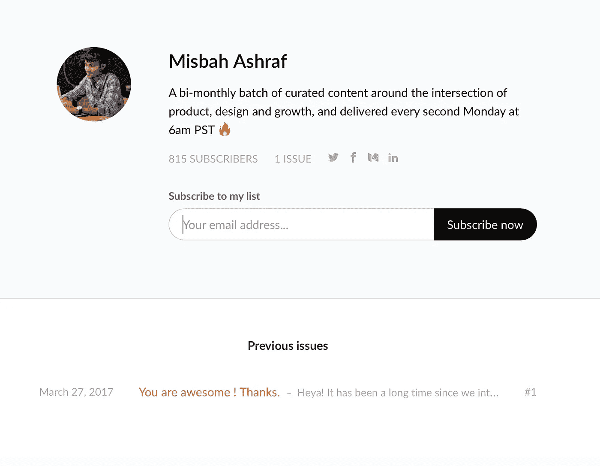
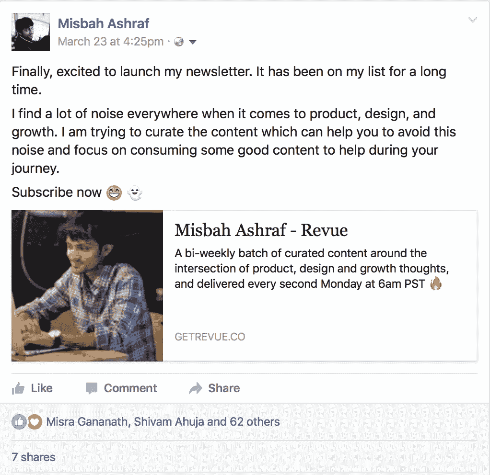
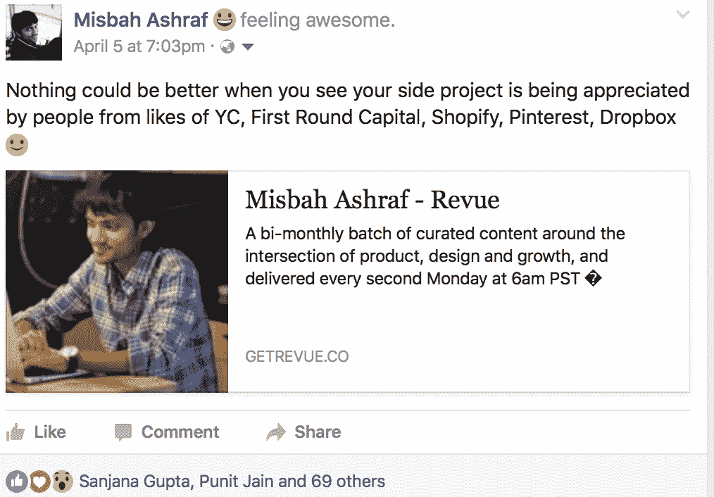
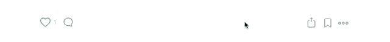

# 我是如何在 8 小时内将我的电子邮件简讯从 0 增长到 800 的？

> 原文：<https://medium.com/swlh/how-ive-grown-my-email-newsletter-from-0-800-in-8-hours-of-launch-d32953dbcfe5>

Credits: [@ticurazvannarcis](https://unsplash.com/@ticurazvannarcis)

在过去的几周里，我妈妈经历了严重的背痛，看到她这样，我希望我能为她做更多。每一个低潮时刻都促使我回到忙碌的状态——所以我决定做一个副业。

我个人发现，当谈到围绕产品、设计和增长的好内容时，有很多杂音。我每天消费大量好的内容，发现人们对获取更多有质量的内容感兴趣，这些内容可以帮助他们掌握一些有价值的知识。所以，我决定与身边的人分享最好的内容。但是，每个人都告诉我时事通讯已经过时了。但是，我对 [**和**](https://thehustle.co) 的商业运作方式非常感兴趣。于是，我决定推出一个简讯，看看能不能在不发第一期简讯的情况下获得一些早期订户。并且，我对我得到的结果感到惊讶。

# 八个小时。800 名订户。发送的简讯为零

我总是从我的导师兼合伙人那里听到 Amit Agarwa 说

> 增长不是魔术。这是关于尽可能以最好的方式做小事。

我也做了同样的事情。

## 以下是我从这个副业项目中学到的一些东西:

# 1.为你的时事通讯选择合适的工具

第一步是寻找合适的工具来收集电子邮件地址，然后发送时事通讯，而无需有效地编写一行代码。我注意到其中一位朋友 [**蒂芙尼**](https://twitter.com/TZhongg) 一直在使用 [**Revue**](https://www.getrevue.co/profile/misbahashraf) ，她对产品的反应帮助我形成了一个观点。我决定接受它。

[Revue](https://www.getrevue.co/profile/misbahashraf)

如果你想在你的网络中发送时事通讯，这是一个非常好的工具。他们有非常干净的用户界面来收集电子邮件和发送时事通讯。我的用例数量相当大，因此他们的高级服务非常适合我。

从经验来看，我知道没有人真正根据设计或用户界面来评估时事通讯。它应该是一种可读的格式，包含足够的人们认为对他们和他们的同龄人有用的信息。

# 2.你的封闭网络将永远是第一个向你买东西的人。

在过去的五年里，通过推出多种产品，我明白了你的封闭的朋友网络总是第一个愿意尝试你的产品的人。

Announcement about Newsletter Launch

因此，我在我的社交网络上分享了简讯的发布，并开始观察人们是否有兴趣阅读我策划的内容。

我做的第二件事是与几个人分享我的第一批 100 名订户来自我的同事或老朋友。

# 3.侵入你的第一批用户的网络可以让你的发展突飞猛进

这是我在推出 [**Toymail**](/@misbahspeaks/introducing-toymail-cloud-6a6514e5092) 时学到的小东西。如果你的第一批用户对你的产品感到兴奋，你应该想办法进入他们的网络。你有更多的机会不花一分钱就能从他们的网络中获取用户。

我做了同样的事情。我已经开始从订阅者名单中找出在他们的网络中有影响力的人。因为，我知道如果这些人谈论我的时事通讯，就会有来自他们网络的订户。我已经开始要求每个这样的人与他们网络中的三个人分享，他们可能会从这份简讯中受益。我还想跟踪投资回报率。任何没有衡量投资回报率的推荐活动都是不可扩展的。

所以，我让他们分享他们推荐的人的名字，这样我就能确保他们收到我的邮件。

这个小技巧对我来说就像魔法一样，帮助我的数字快速增长。

# 4.创造 FOMO 总是有效的。

害怕错过某些东西促使用户尝试产品。这是 Snapchat 和脸书已经很好解决的问题。从这两个故事中，我开始在社交媒体上分享我得到的回应。这激发了读者的好奇心，并促使他们订阅即将推出的时事通讯。

Creating FOMO

另一个小技巧是我用来找到真正在等简讯的人。我推迟了时事通讯。而且，结果并不在意料之中。在我的 800 封电子邮件中，有 10%的人提醒我邮件延迟了。

而且，我终于回到了我的忙碌模式，而黑客进入的东西。我没有做过任何像魔术一样的事。我所做的都是尽可能以最好的方式做一些非常小的事情。现在你知道结果了。

如果要说**产品，设计和成长**。请随时联系我。

*附:感谢您阅读至此！如果你从中发现了价值，如果你推荐这篇文章(点击❤按钮)让其他人看到，我会非常感激！。*

