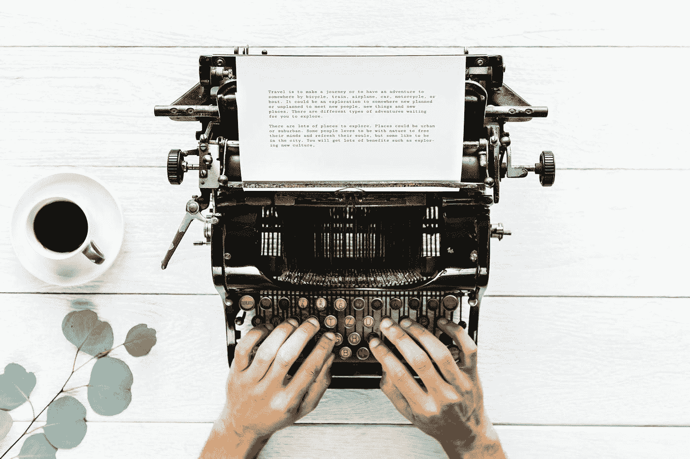

# 杰夫·贝索斯如何禁止 PowerPoint 以及从中可以学到什么

> 原文：<https://medium.com/swlh/how-jeff-bezos-banned-powerpoint-and-what-to-learn-from-it-5dc7e2096dab>

今年是我写博客的第八个年头。我喜欢写作。写作帮助我抓住要点。我的意思是，真正切中要点，而不仅仅是幻灯片上的要点。用这样一种方式来表达思想，使它们吸引读者，并把信息传达给读者，这是一件非常困难的工作。这需要自律和专注——每篇文章，每周一次。更令人惊讶的是，杰夫·贝索斯完全禁止了 PowerPoint，而是坚持六页的叙述，然后在沉默中研究(原文如此！)每个人在会议开始时。如果杰夫·贝索斯和他的团队在亚马逊非常成功的快速发展的商业领域以这种方式利用他们的时间，这可以被视为对我们所有人的一种激励，告诉我们更多更好的故事，而不是无情地列举无穷无尽的要点。

早在人们开始使用文字(约公元前 2000 年至 3000 年)和印刷体文字(最后是 PowerPoint……)来传递信息之前，他们就相互讲述故事。据信，人们在公元前 35，000 年左右已经充分发展了他们的语言技能。拉斯科史诗般的洞穴壁画表明，那时人们已经在互相讲述故事了。世界上所有的宗教都充满了故事和寓言。即使在今天，一个好的故事也像其他事物一样吸引着人们，使电影成为大片，书籍成为畅销书，并使演员、导演和作家闻名世界。事实上，像杰夫·贝索斯一样，将这种古老的魅力用于结构良好的会议故事也是显而易见的。

> *我们在亚马逊不做 PowerPoint(或任何其他面向幻灯片的)演示。相反，我们会写六页的记叙文。我们在一个类似“自习室”的地方，在每次会议开始时默读一篇文章。*
> 
> [T5【杰夫·贝索斯】T6](https://www.sec.gov/Archives/edgar/data/1018724/000119312518121161/d456916dex991.htm)

当然也有非常好的幻灯片演示。甚至还有演讲者在没有任何幻灯片的情况下讲述引人入胜的故事。但这不是重点。这些例外证实了 PowerPoint 导致浅薄的不幸规律。对于发送者和接收者都是如此。PowerPoint 是交际快餐:充其量有用，通常不是很有营养，长期来看是有害的。

> 叙事想象——故事——是思维的基本工具。理性能力取决于此。它是我们展望未来或预测、计划和解释的主要手段。
> 
> *马克·特纳*

任何写过较长文字的人都知道，与几个孤立的要点相比，这有多难。不是每个人都有这方面的天赋和实践。即使在亚马逊，备忘录的质量也相差很大，正如杰夫·贝索斯自己在他的最后一封年度信中承认的。尽管如此，我非常理解以多页结构性文本的形式准备会议会导致更高的质量。而会议开始时对备忘录的共同研究，是一种美丽的仪式，是一种正念的减速时刻，给作者和他的事带来了必要的关注。这是杰夫·贝索斯统治的一个非常重要的方面，如果不是最重要的。

*原载于 2018 年 4 月 29 日*[*fuehrung-erfahren . de*](https://fuehrung-erfahren.de/en/2018/04/how-jeff-bezos-got-rid-of-powerpoint-and-what-to-learn-from-it/)*。*

## 这个故事发表在 [The Startup](https://medium.com/swlh) 上，这是 Medium 最大的创业刊物，有 320，131+人关注。

## 在此订阅接收[我们的头条新闻](http://growthsupply.com/the-startup-newsletter/)。

