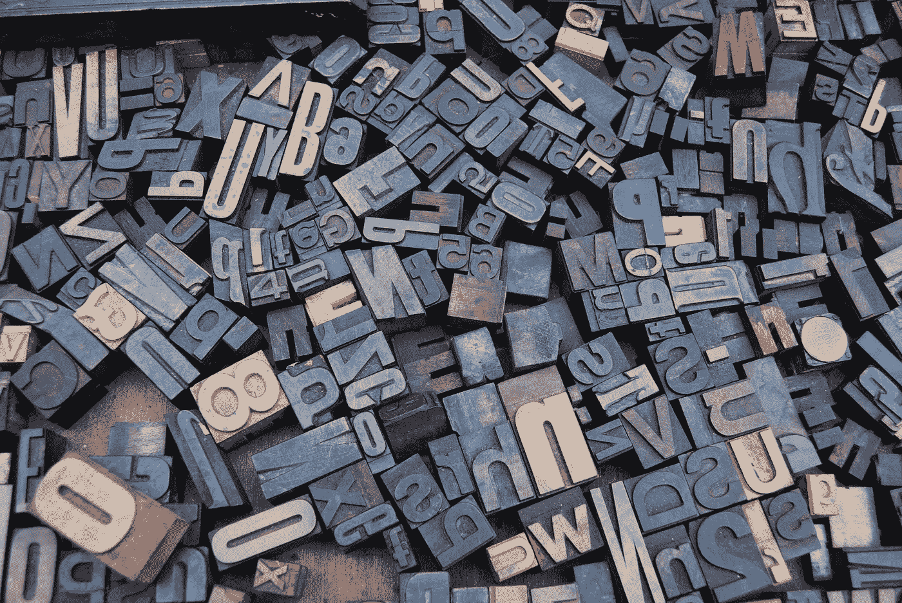

# 语言如何改变你的生活

> 原文：<https://medium.com/swlh/how-language-can-change-your-life-d8d1a5134d6e>

Photo by [Amador Loureiro](https://unsplash.com/photos/BVyNlchWqzs?utm_source=unsplash&utm_medium=referral&utm_content=creditCopyText) on [Unsplash](https://unsplash.com/search/photos/alphabet?utm_source=unsplash&utm_medium=referral&utm_content=creditCopyText)

文字是工具。我们在分享词汇，这样我们就可以交流思想、感受和想法。

名词、副词、形容词、冠词、动词等等创造了一个巨大的电波网络，通过 26 个字母和 9 个数字的简单组合投射出数万亿个想法。

为什么我们允许语言控制我们？

当我写的时候，我注意到我给了你我头脑中的想法。我能唤起无数的情感，从悲伤到快乐。我注意到人们允许语言是一种特定的语气，它总是表明他们的感受。你有没有注意到一个对世界持悲观看法的朋友，并且说了这样的话:

> 我现在做不到。
> 
> 我做不到。

他们允许语言控制他们。当你说我做不到的时候，你是在说你做不到。简单。你也限制了自己，甚至不去尝试，因为你从一开始就告诉自己。

不会更糟。用“不能”,你是在说你现在做不到；用“不会”,你是在说你未来的自己什么也做不了。

你有没有听到有人说:

> 你看起来很棒，但我会给你换衣服

但是这个词完全抹杀了他们对你的赞美，你所能关注的就是你需要换衣服了。我说，太荒谬了！

不能，不会，但是。

通过语言重新构建你的观点是非常重要的。你总是不注意你在说什么，那很累人。你不会对你说的每一个字都吹毛求疵。

让我们以这两个关于同一话题的句子为例。

> 我本来要去嘉年华的，但是生活中的事情阻碍了我。我做不到，也不会考虑这种可能性。我也想，但是，现在事情太困难了。

首先，这个句子暗示他们将要去，它已经进入了他们不去的原因。然后他们声明他们不能也不会，排除他们现在和未来的可能性。最后一句说他们愿意，然后给出一个理由来加强前面的句子。

让我们看看即使没有他们，它也能被重新构建。

> 嘉年华是个好主意，我会去的！我会努力去的，这绝对是可能的。我很想去，这将是对现在发生的事情的一个很好的缓解。

除了“棒极了”和“爱”这两个积极的含义，你可以看到去掉这两个词，用“和”来代替“或者忽略它们是如何创造或者打破这个句子的。他们没有否认自己去的可能性，也没有用借口来阻止自己。

这就是为什么语言是一种工具，必须相应地使用。

当你用语言给自己一个不一样的视角，你就是在改变自己内心的声音。你可以曲解你内心批评家的话，直到它对你毫无作用。你是一个自主的存在，你做出自己的选择，在任何事情发生之前，你不会被你自己的语言所左右而停止前进。

另一个需要注意的词是*为什么*。*为什么*是一个重要的问题，当谈到生命的意义、我自己的行动和目的时，我每天都在问自己为什么。

然而，*为什么*不可操作。*为什么*不会给你的日常生活带来任何真正的改变。不要问*为什么*要问*如何*。当你说*如何*你是在要求示范。你在询问如何做某事，如何前进，如何采取行动。你不是在分析情况，你了解情况。你在前进，用一个不同的词来说，你把自己放在一个有利的位置，在那里你可以做一些事情。

机会悄悄地出现在每个角落，通过询问你如何能在没有意识到它们的情况下把自己楔入这些情况。这就是语言的力量。这表明了你所说的话的重要性。

看看这个单词列表:

> 为什么
> 
> 不可以
> 
> 将不会
> 
> 应该
> 
> 能够
> 
> 但是

我想让你为第二天做些尝试。把这些词从你的日常对话中去掉。用下面的话来代替它们，看看你的生活是如何改变的:

> 怎么
> 
> 能
> 
> 威尔(男子名)
> 
> 和

我的过去很挣扎。我得了暴食症，因为我需要控制，这是我知道的唯一一种控制方式。结果我超重了，陷入了深深的沮丧之中。即使在最抑郁的时候，我也能够用语言告诉自己，除了几百美元和一个行李箱，一无所有地穿越这个国家。朋友和家人告诉我，我*做不到*那样，我*也不会*成功。他们没有告诉我他们对成功的想法是什么，是否与我的想法一致。结果证明他们错了。事实证明，在我穿越加拿大的旅程中，我成功了，我成为了我一直想成为的人。

你也可以，而且可以从语言开始。

改变你的生活，对不对**现在**。

## 这篇文章发表在 [The Startup](https://medium.com/swlh) 上，这是 Medium 最大的创业刊物，拥有 310，796 多名读者。

## 在这里订阅接收[我们的头条新闻](http://growthsupply.com/the-startup-newsletter/)。

