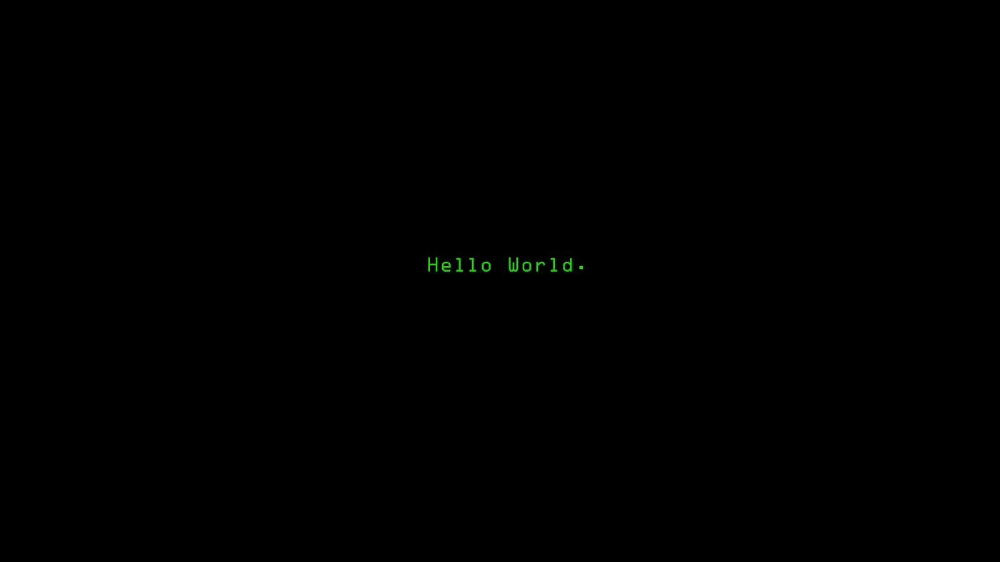

# 代码行如何杀死人类。

> 原文：<https://medium.com/swlh/how-lines-of-code-kill-humans-f6c6ec12e44a>

不，不，不，这与天网或奥创无关。

2014 年 4 月 12 日，华盛顿州，一个没有月亮的夜晚。一名吓坏了的西雅图妇女拨打了 37 次 911，但号码却是空号。有一个陌生人躲在她家外面，他正试图破门而入。过了一会儿，她试图寻求急救服务，但徒劳无功，那个男人设法爬进了窗户。她拿起一把刀，陌生人逃走了。

> 后来发现华盛顿州所有的紧急服务都停止了整整 6 个小时。

911 事件是当时报道的最大的一次中断，追溯到科罗拉多州恩格尔伍德服务器上运行的一段流氓代码。它由一家名为 Intrado 的系统提供商运营，他们负责将电话转接给全国各地的 911 调度员。他们运行了一个软件，这个软件可以记录已经发送了多少个电话。Intrado 的程序员为计数器的极限值设定了一个阈值。他们选择了一个以百万为单位的计数变量。不知何故，他们似乎非常确定华盛顿的黑夜不可能产生超过一百万个求救电话。

4 月 10 日，午夜前不久，*计数器超过了预设的数字，导致了一个简单的算术错误*。此计数器用于为每个新调用生成唯一标识符，因此一旦计数器溢出，新调用将被拒绝。程序员没有预料到这个问题，所以他们没有设计警报来引起对这个问题的注意。没人知道发生了什么。

华盛顿、佛罗里达、加利福尼亚、明尼苏达和卡罗莱纳州的 911 调度中心为近 1100 万美国人服务，努力整理奇怪的报告，这些报告表明呼叫者正在得到死亡或占线信号。最后，当他们意识到鹰木服务器中 Intrado 的代码负责时，已经是早上了。

*解决这个问题只需要修改代码中的一个数字。*

> 形势的严重性后来才为人所知。整整一夜，1100 万美国人易受攻击，面临入室抢劫、谋杀和抢劫。

我们的控制系统有缺陷吗？

是的。为什么？

因为我们的代码有缺陷。

为什么？因为人是有缺陷的。

真正被打破的是，我们编写软件的方式。而不是软件本身。我们输入到 IDE 中的微小的 1 和 0，完全按照要求去做。演变成灾难的软件错误并不是代码的固有缺陷。代码只是按照我们告诉它的方式工作。弄乱他们的语义，他们可以杀人，做对他们，他们可以在非常不幸的一天成为你的救世主。

> 这个世界变得如此紧密相连，相互依赖，已经缩小到超出我们的预期，变成了一个数字茧的地狱。在当今世界，流氓代码行创造了比《权力的游戏》婚礼更红的场景。

想象一下下面的场景。

发生了车祸，安全气囊没有打开。机载软件没有触发部署，因此造成了人员伤亡。那是软件的问题。不是吗？众目睽睽之下？

现在让我们更深入地去发现后知后觉发生了什么。

该软件在前后和后侧传感器输入的帮助下检测碰撞。它被编码为在正面*发出正面碰撞信号而非背面*发出正面碰撞信号的情况下展开安全气囊。

这辆车从后面受到了撞击，由于是加密的，安全气囊没有展开。软件只是在做它被告知要做的事情。不多不少。

## 它只是被告知去做错误的事情。

第二天头版宣称。“软件错误在高速公路上杀死了司机。机器正在接管人类吗？”点击诱饵博主们推出了一些令人恼火的边缘文章，标题是“机器开始接管我们的世界。这是天启”。

# 责备游戏。

整体而言，“这是一行失控的代码”，或者“这是一个错误”，是一个推卸责任的绝佳案例。让我们试着从一个新的角度来研究这个问题。代码从来不会自己产生错误或死锁。一个特性是有意的，一个 bug 也是有意的。或者至少，如果我们要弄清疫情的真相，我们需要这样看待它。

承认困难的事实。我们代码中的错误不是副作用。代码本身不会创造任何东西，因为它没有一个该死的遗传物质被包裹在注定要进化的蛋白质外壳中。*试着用一种新的方式来看待这个 bug，它是由我们不由自主地设计、精心策划和战略性地放置的*。当我们不再把它当作一个副作用时，我们可以开始讨论为什么这个世界充满了编码员，而只有很少的几个好的，并且总是有一个编码员——稀缺。尽管编码帝国发展壮大，失业编码员的数量却在上升，就像巴黎协议中气候变化图表的边缘一样。

**指向天空，指向瓦尔哈拉。**

(题外话:特朗普总统没有签署的同样的气候协议，声称“全球变暖是中国为了压低美国 GDP 而发明的阴谋。LOL)

# 抽象出错了

大多数情况下，程序员坐在他们的椅子上，浏览项目管理系统中分配给他们的任务，消耗咖啡因和芯片，制定复杂的方程(并不总是如此)，编写格式良好、简洁、可扩展和有文档记录的代码，匆忙地将事情从待定列表中删除。据他们所知，他们写的代码可能是任何东西，从音乐播放器的新功能更新到放射治疗机器的安全程序。它们可以是愚蠢游戏中的新奖励等级，也可以是自动驾驶汽车的控制系统。上帝保佑我们，它们可能是核反应堆的安全补丁，紧急服务的更新或联合航空公司飞行系统的空中维护模块。

> 1985 年至 1987 年间，加拿大原子能有限公司生产的一台臭名昭著的放射治疗机器“Therac-25”向 6 名癌症患者直接发射强流电子束辐射。

Therac-25 机器的安全软件中存在一个严重的错误，因此，高电流电子束以大约 100 倍于预期剂量的辐射量击中了患者，并且在一个非常狭窄的区域内，释放了潜在的致命剂量的β辐射。

> 病人感到强烈的电击，这使他们尖叫着跑出房间。几天后，出现了辐射烧伤，病人开始出现急性辐射中毒的症状——内脏器官的系统性关闭和细胞结构的分解。
> 
> 几天后，他们悲惨地死于辐射中毒。

这是由于 Therac-25 机器的程序错误。软件错误源于并发编程错误，这导致了竞态条件，即当操作员在两种模式(直接电子束治疗模式和兆伏 X 射线治疗模式)之间快速切换时，安全软件遇到了竞态场景并进入了僵局，无法决定该做什么，然后表现出被称为 bug 的未记录代码行为。

以前的型号有硬件联锁来防止这种故障，但 Therac-25 已经取消了它们，而是依靠软件检查安全性。过于自信的工程师使用了以前版本机器的代码，这些机器以前在不同的硬件上运行，这个过程被称为货物编码。

> 在这些代码中的某个地方，有一个标志变量，它没有被设置为非零值，而是被设置为增量。偶尔会发生算术溢出，最终标志被设置为零，从而导致软件绕过安全检查 ***。***

编码人员编写和处理代码，就像机器可以向患者体内释放辐射一样。代码从来没有为这个世界做好准备，或者它看起来奇怪地不熟悉它为之而写的世界。有一个令人不安的抽象概念使它对目标环境视而不见，直接导致了 6 个人痛苦的死亡。

## 严格跑题；如果你喜欢我解释技术的方式，你绝对应该在这里注册我的简讯[奇点照片。](https://singularity.substack.com)每周发一次智慧小拍。

不管是什么，代码行都是在没有考虑全局的情况下写入 IDE 或 EMACS 的。“把事情从清单上划掉”、“推向生产”和“发货”的文化无意中断开了代码和目标生态系统。显然，项目管理、系统协作和生产力已经迎来了一个新的编码天堂。现在，世界正在以前所未有的效率推动代码。但是，我们痴迷于将事情分成故事点，我们的框架指导我们尽可能独立地制作这些故事点/问题，以至于我们被告知不要担心隔间里的其他人，如果出现任何问题，将通过测试/QA 解决。这就是问题所在。

整个画面。这就像为一个大建筑雇佣多名建筑师，然后给他们一个仪式般的讲座，告诉他们你对傍晚地平线上的建筑的宏伟愿景，然后让他们坐在小隔间里，强调他们要孤立，告诉他们不要担心大局，让故事点彼此没有依赖性。

## 源和目标之间的日益脱节。

从很多方面来说，这是编程的圣杯。

2007 年 9 月，Jean Bookout 和她最好的朋友开着一辆丰田佳美在高速公路上行驶。突然油门好像卡住了。惊慌之下，她把脚从踏板上拿开，但车并没有减速，这时她才意识到刹车也失去了动力。她在拉紧急刹车前以每小时 50 英里的速度下了匝道。汽车在公路上滑行了 150 英尺，然后撞上了路边的路堤。

> 一个月后，当她在医院醒来时，她得知她的朋友死于车祸。

丰田将故障归咎于踏板粘滞，但该事件是针对丰田汽车意外加速的长达十年的调查中的众多事件之一。但是到了那个时候，越来越多的人猜测，在某个地方，某个软件对此负有责任。公路交通安全管理局邀请美国国家航空航天局的专家对丰田的代码进行了深入审查。10 个月和许多打嗝之后，美国宇航局小组不能确定软件是原因，但也说他们不能证明它不是。

在登记事故的诉讼过程中，原告的专家证人迈克尔·巴尔最终发现了令人信服的联系。他的软件专家团队花了 18 个月的时间研究丰田的代码，从美国国家航空航天局中断的地方重新开始。这个新团队发现了所谓的“意大利面条代码”，这是一种程序员的行话，指的是已经变得乱糟糟的软件。代码积累多年后会变成意大利面条，一个接一个的特性堆积在上面，形成一个无法跟踪或测试的代码迷宫。

> 使用相同的丰田模型，该团队证明了车载计算机系统上的关键任务几乎有**1000 万种**方式*失败，*潜在地导致不受控制的加速。计算机内存中的一个微小变化，比如一个变量从零变成了一，可能会让汽车在高速公路上横冲直撞。

巴尔的证词导致原告败诉，并导致布克奥特和她朋友的家庭获得 300 万美元的损害赔偿。丰田从市场上召回了 900 多万辆汽车。

## 麻省理工学院软件安全专家南希·莱韦森说:“问题是大多数软件工程师不再理解他们试图解决的问题，也不关心这个问题。”。大量的时间花在让代码工作上，而不是思考和预测现实世界的场景。“软件工程师喜欢为编码错误提供各种工具和材料，”她指的是 ide。"软件出现的严重问题与需求有关，而不是编码错误."

举例来说，当你编写一个监控汽车油门的控制系统时，重要的是它在现实世界中的表现。运动规则，关于何时、如何以及油门需要开多大的时间关键知识。但久而久之，这些系统就成了迷宫，几乎没有人能通读明白。“现在汽车中有 1 亿行代码，”莱韦森说。“你无法预料所有这些事情。”莱弗森在一本书中写道:“问题在于，我们正试图建立超出我们智力管理能力的系统。"

> 这是一个断开的地方。程序员和世界之间的一堵巨大的墙。

越来越多的这些不相关的项目产生了越来越多不满的编码员。这是一个类似欧姆定律的比例图。受够了那些互不联系的编码员，世界的命运岌岌可危。

## 为了解决这个问题，我们需要承认断开的问题。'

如果我们谈论的是汽车，就像其他任何东西一样，汽车也被大量电脑化以适应新的功能。当一个控制软件负责我们的油门和刹车时，它可以精确地管理燃油喷射，以帮助你节省汽油，当你在碰撞路径上时，它可以让你减速。当你开始偏离时，同样的软件可以帮助你保持在车道上，或者他们可以更精确地停车，这是你永远不会有的。没有代码就无法构建这些功能。如果你试图这样做，你的车将会是一堆重达 40 吨的机械垃圾，一个由一百万个运动部件组成的不可移动的钟表机构。

> 自从公元前 3500 年在美索不达米亚发明轮子以来，我们已经走过了漫长的道路。但是当我们坐在车里的时候，我们几乎不会注意到这些复杂的事情。代码和机制的和谐使我们能够建造有史以来最复杂的机器。仅仅因为所有的复杂性都隐藏在我们的视线之外，并作为数以百万计的代码包装在微小的硅芯片中，这并不意味着复杂性已经消失了。创建和维护这样的代码库只需要不同的眼光、技能和理解。

# 每个人都抬头看着托尼·斯塔克，在斯塔克大厦实验室的一个黯淡的喜剧黄昏，他如何成为人工智能的天才，并编写代码，将他从我们永远无法预见的黑暗场景中拯救出来。

> 这里有外卖。他了解这个世界。他知道这是怎么回事。他知道坏人总是来自虫洞的另一端，不管他的薪水多少，他都需要拯救世界。如果说程序员能从托尼身上学到什么，那就是他非常了解自己的世界。

## 当代码、编写代码的世界以及创建和管理代码的人之间缺乏联系时，问题就开始爆发了。它们不仅仅是编译错误，它们不会停留在那里。

他们杀人。

嗯，不总是这样，但是他们会，然后他们会成为头条新闻，人们会放下香槟酒杯去读他们。

他们牺牲了其他人的生命。

回到过去，当控制系统是机电式的，比如安全阀和硬件控制单元，制造这些部件的人在某个地方制造所有这些部件，他们的想法是人们会使用这些部件。

## 这就像，“你不把踏板焊成直角，用户就会像狼一样在路上走，不像漫画里那样，他不会只是去铲煎饼。”

用一个传感器代替它们，并把它与运行在硅门上的一些代码捆绑在一起，这并没有给你从你的代码中抽象出真实世界的自由。当某样东西是硬件时，人们可以对它进行详尽的测试。制造商确切地知道传送带何时会断裂，是在 2000 次还是 3000 次跳跃之后。

现在一切都在代码段之上运行，在我们的 sprint 课程中，我们需要尝试重新建立与现实世界失去的联系，而不是将项目分成独立的故事。世界不是那样运转的。

也许现在是我们进行方法论反思的时候了。

## — — — — — — — — — — — — — — — — — — — -

如果你喜欢这篇文章，**你可以鼓掌 50 次**，这样它会到达更多的人，从而将知识传播给其他人，这样我们就可以用有意义的想法和故事轰炸人类，帮助每个人在每次阅读时都有所改变。

## 在这里阅读我在 A.I [上的故事。](https://codeburst.io/god-artificial-intelligence-and-afterlife-5649a95b4d0f)

页（page 的缩写）s:这个故事的灵感来自《大西洋月刊》的文章《即将到来的软件天启》。

## 这篇文章发表在 [The Startup](https://medium.com/swlh) 上，这是 Medium 最大的创业刊物，有 307，871+人关注。

## 订阅接收[我们的头条新闻](http://growthsupply.com/the-startup-newsletter/)。

